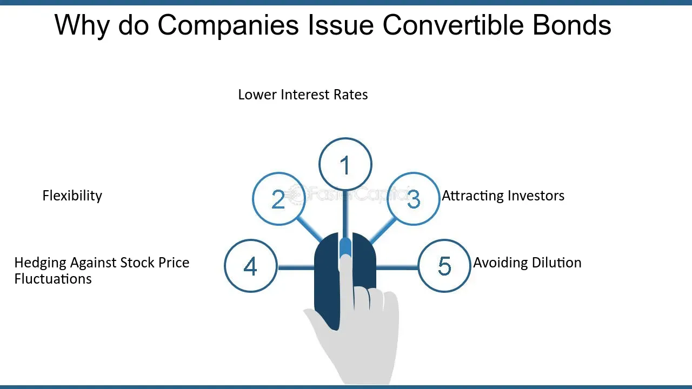

## Table of Contents

## What is a convertible bond?

A convertible bond is a type of bond that can be changed into a specific number of shares of the company's stock. Imagine you lend money to a company by buying their bond. Normally, you would get your money back with some interest after a certain time. But with a convertible bond, you have a special option. Instead of just getting your money back, you can choose to turn your bond into shares of the company's stock.

This can be a good deal for both the company and the investor. For the company, it's a way to borrow money at a lower interest rate because the bond can be converted into stock. For the investor, if the company does well and the stock price goes up, they can convert their bond into stock and possibly make more money than they would have just from the interest on the bond. But if the stock price doesn't go up, the investor can still get their money back with interest, just like a regular bond.

## How does a convertible bond differ from a regular bond?

A convertible bond and a regular bond are both ways for a company to borrow money from investors. With a regular bond, the company promises to pay back the money you lent them, plus some interest, at a specific time in the future. It's like lending money to a friend and they agree to pay you back with a little extra as a thank you. You know exactly what you're going to get and when.

A convertible bond works a bit differently. Besides getting your money back with interest like a regular bond, you have an extra choice. You can decide to turn your bond into shares of the company's stock. This can be great if the company does well and the stock price goes up, because you might make more money than just the interest on the bond. But if the stock price doesn't go up, you can still choose to get your money back with interest, just like with a regular bond. So, a convertible bond gives you more options and potential for higher rewards, but it also comes with more risk if the stock price doesn't increase.

## What are the basic financial benefits for a corporation issuing convertible bonds?

When a corporation issues convertible bonds, it can enjoy lower interest rates compared to regular bonds. This is because investors are willing to accept a lower [interest rate](/wiki/interest-rate-trading-strategies) in exchange for the option to convert the bonds into stock if the company does well. This means the company can borrow money at a cheaper rate, saving on interest expenses.

Another benefit is that issuing convertible bonds can help a company delay dilution of its stock. Instead of issuing new shares right away, the company can issue bonds that might be converted into stock in the future. This gives the company more time to use the money it borrowed to grow and hopefully increase its stock price before any dilution happens. This can be a strategic way to manage the company's finances and growth.

## Can you explain the concept of conversion ratio in convertible bonds?

The conversion ratio in convertible bonds is like a special rule that tells you how many shares of the company's stock you can get if you decide to turn your bond into stock. Imagine you have a bond worth $1,000, and the conversion ratio is 20. This means you can trade your $1,000 bond for 20 shares of the company's stock. The conversion ratio is set when the bond is first issued and stays the same, no matter what happens to the stock price later.

This ratio is important because it helps you figure out if it's a good time to convert your bond into stock. If the stock price goes up a lot, the value of those 20 shares might be worth more than the $1,000 you would get back from the bond. But if the stock price stays low, it might be better to just keep the bond and get your money back with interest. The conversion ratio gives you a clear way to compare the bond's value to the stock's value and make the best choice for your investment.

## What is the impact of issuing convertible bonds on a company's capital structure?

When a company issues convertible bonds, it changes its capital structure by adding a mix of debt and potential equity. At first, the convertible bonds are just like regular debt on the company's balance sheet. This means the company owes money to the bondholders and has to pay interest on it. But because these bonds can be turned into stock, they also have a bit of equity in them. This mix can be good for the company because it lets them borrow money at a lower interest rate than they would with regular bonds.

Over time, if the bondholders decide to convert their bonds into stock, the company's capital structure will change again. The debt on the balance sheet will go down because the bonds are no longer just debt. Instead, the company will have more shares of stock out there, which means more equity. This can dilute the ownership of existing shareholders, but it can also help the company if it needs to raise money without taking on more debt. So, issuing convertible bonds gives the company a flexible way to manage its finances and balance between debt and equity.

## How do convertible bonds affect a company's cost of capital?

When a company issues convertible bonds, it can lower its cost of capital. This is because convertible bonds usually have lower interest rates than regular bonds. Investors are okay with lower interest because they have the chance to turn their bonds into stock if the company does well. This means the company can borrow money cheaper than it would with regular bonds, which helps lower the overall cost of capital.

But there's another side to it. If bondholders decide to convert their bonds into stock, the company's cost of capital might change again. More shares in the market can dilute the value of existing shares, which might make the stock price go down. This could affect the company's cost of equity. So, while convertible bonds can start off by lowering the cost of capital, the long-term effect depends on whether and when the bonds are converted into stock.

## What are the tax implications for a corporation issuing convertible bonds?

When a company issues convertible bonds, the tax implications can be quite favorable at first. The interest payments the company makes on these bonds can often be deducted from the company's taxable income. This means the company can lower its tax bill because it's treating the convertible bonds like regular debt. This tax benefit can make convertible bonds an attractive way for the company to raise money.

However, things can change if the bondholders decide to convert their bonds into stock. When this happens, the company no longer has to pay interest, so it loses the tax deduction it was getting. Also, if the conversion happens at a price lower than the market value of the stock, it might be seen as if the company is giving away something valuable, which could have its own tax consequences. So, while convertible bonds can offer tax benefits initially, the long-term tax impact depends on whether and when the bonds are converted into stock.

## How do convertible bonds influence a company's stock price?

When a company issues convertible bonds, it can affect its stock price in a few ways. At first, the stock price might go up a bit because investors see the company as doing something smart to raise money. They might think the company is planning to grow and do well, which can make the stock more attractive. But there's also a chance the stock price could go down a little because some investors might worry about the future. They might think that if a lot of bondholders convert their bonds into stock later, it could dilute the value of the existing shares.

Later on, if bondholders start converting their bonds into stock, it can have a bigger effect on the stock price. If a lot of people convert their bonds at the same time, it means more shares are out there, which can dilute the value of each share. This might make the stock price go down. But if the company is doing really well and the stock price is going up, the conversion might not hurt the stock price as much. It all depends on how the company is doing and how many people decide to convert their bonds into stock.

## What are the strategic reasons a corporation might choose to issue convertible bonds over other financing options?

A corporation might choose to issue convertible bonds because they can borrow money at a lower interest rate than with regular bonds. Investors are willing to accept less interest because they have the option to turn their bonds into stock if the company does well. This can save the company a lot of money on interest payments. Also, convertible bonds can help the company delay the dilution of its stock. Instead of issuing new shares right away, the company can issue bonds that might turn into stock later. This gives the company more time to use the borrowed money to grow and hopefully increase its stock price before any dilution happens.

Another strategic reason for issuing convertible bonds is the flexibility they offer. If the company's stock price goes up a lot, bondholders might convert their bonds into stock, which can help the company avoid paying back the full amount of the bond. But if the stock price doesn't go up, the company still has to pay back the bond with interest, which is like a safety net. This flexibility can be really useful for managing the company's finances and balancing between debt and equity. Plus, the interest payments on convertible bonds can be tax-deductible, which means the company can lower its tax bill, making it an even more attractive option for raising money.

## How do convertible bonds serve as a tool for managing financial risk?

Convertible bonds help companies manage financial risk by giving them a way to borrow money at a lower interest rate. When a company issues convertible bonds, it promises to pay back the money with some interest, just like with regular bonds. But because investors can turn these bonds into stock if the company does well, they are willing to accept a lower interest rate. This saves the company money on interest payments, which can be a big help if things get tough financially.

Another way convertible bonds help manage risk is by giving the company more time before it has to deal with more shares being out there. If the company's stock price goes up, bondholders might convert their bonds into stock, which means the company doesn't have to pay back the full amount of the bond. But if the stock price stays low, the company can still pay back the bond with interest, which acts like a safety net. This flexibility lets the company balance between debt and equity in a way that can protect it from financial ups and downs.

## What are the potential downsides or risks for a corporation issuing convertible bonds?

When a company issues convertible bonds, one big risk is that it might end up with more shares out there if bondholders decide to turn their bonds into stock. This can make each share worth less, which is called dilution. If too many people convert their bonds at the same time, it could really hurt the stock price and make existing shareholders unhappy. Also, if the stock price doesn't go up enough, bondholders might not want to convert their bonds, and the company will still have to pay back the money with interest, just like with regular bonds.

Another risk is that convertible bonds can make it harder for the company to plan for the future. The company doesn't know for sure if bondholders will convert their bonds or not, so it's tough to predict how much debt or how many shares it will have down the road. This uncertainty can make it trickier to manage the company's finances and make long-term plans. Plus, if the company's financial situation gets worse, the lower interest rates on convertible bonds might not be enough to help, and the company could still struggle to pay back the money it borrowed.

## How do market conditions influence the decision to issue convertible bonds?

Market conditions play a big role in whether a company decides to issue convertible bonds. When the stock market is doing well and investors are feeling confident, companies might choose convertible bonds because they can borrow money at a lower interest rate. Investors are more likely to accept a lower interest rate because they think the company's stock price will go up, and they want the chance to turn their bonds into stock. This can be a smart move for the company because it saves money on interest payments and gives them time to grow before any new shares come into play.

On the flip side, if the market is shaky or the stock market is going down, companies might be more careful about issuing convertible bonds. If the stock price isn't expected to go up, investors might not be as interested in convertible bonds because they won't want to turn their bonds into stock. This could mean the company has to offer a higher interest rate to attract investors, which defeats the purpose of saving money. So, companies need to think about how the market is doing and what investors are expecting before deciding to issue convertible bonds.

## What are Convertible Bonds?

Convertible bonds are financial instruments issued by companies as a means to raise capital while providing certain attributes that cater to both the company’s and investors’ interests. These bonds serve as hybrid securities because they combine elements of both debt and equity. A fundamental characteristic of convertible bonds is that they offer fixed interest payments, similar to traditional bonds, over a specified period. However, what sets them apart is the embedded option to convert the bonds into a predetermined number of equity shares.

The conversion feature is generally viewed as advantageous when the issuing company’s stock performs favorably. In such cases, bondholders are enticed to convert their bonds into equity, thus participating in the company's capital appreciation potential. The bondholder gains from stock price increases without exposure to its full volatility during holding. For example, a bondholder with a convertible bond at a conversion price below the current market value of the company's shares stands to realize a profit upon conversion.

To illustrate the conversion mechanics, consider a convertible bond with a face value of $1,000 and a conversion rate of 50 shares. The conversion price would then be calculated as:

$$
\text{Conversion Price} = \frac{\text{Face Value}}{\text{Conversion Rate}} = \frac{1000}{50} = 20 \text{ per share}
$$

If the current market price of the stock exceeds $20, conversion benefits are realized. The hybrid nature of these convertible bonds offers bondholders the assurance of fixed income with the added advantage of converting to equity, thus reducing downside risk while retaining capital appreciation opportunities.

In periods of market [volatility](/wiki/volatility-trading-strategies), this dual nature provides a cushion against downside movements, as the bond’s fixed income component maintains certain value irrespective of stock fluctuations. Consequently, convertible bonds constitute a strategic investment option that can adapt to varying market behaviors, balancing risk and reward dynamics.

## What are the pros of convertible bonds for corporate finance?

Convertible bonds present several advantages for corporate finance, making them an attractive option for companies seeking to raise capital. One of the primary benefits is that these bonds typically come with lower interest rates compared to traditional bonds. This characteristic is advantageous for issuers because it reduces the cost of debt servicing. With convertible bonds, companies can access needed funds without incurring the higher interest obligations associated with conventional debt instruments.

Moreover, convertible bonds allow companies to postpone equity dilution. When a company issues equity, it increases the number of outstanding shares, which can dilute the value of existing shares. However, with convertible bonds, equity dilution is only a potential future event, contingent upon bondholders opting to convert their bonds into equity. This delay helps preserve existing shareholder value and supports a stronger capital structure in the short term. In financial terms, the equity dilution effect can be expressed as:

$$
\text{Dilution} = \frac{\text{New Shares Issued}}{\text{Existing Shares} + \text{New Shares Issued}}
$$

By delaying dilution, companies maintain control over their capital structure and manage shareholder equity strategically.

Convertible bonds also offer flexibility by combining elements of debt and equity. This hybrid nature allows companies to optimize their financial strategy by balancing leverage while keeping open the option for future equity issuance. In an evolving market, maintaining a flexible capital structure is critical. Convertible bonds enable firms to adapt to diverse financial environments, responding effectively to both growth opportunities and financial challenges.

In conclusion, convertible bonds are a valuable tool for companies aiming to secure financial resources efficiently while managing future equity considerations strategically. By leveraging the characteristics of these bonds, companies can reinforce their financial strategies and position themselves advantageously within their respective industries.

## References & Further Reading

To gain a comprehensive understanding of convertible bonds, their pricing, and associated strategies, it is beneficial to reference various financial literature and studies that explore these hybrid securities in detail.

1. **"Convertible Bond Markets" by Gregor Giddy**: This work provides fundamental insights into the structure and operation of convertible bonds. Giddy explores the dynamics of convertible bond markets, providing a solid foundation for both academic and practical applications.

2. **"Valuation of Convertible Bonds" by John C. Hull**: Hull, a renowned expert in options, futures, and other derivatives, offers valuable approaches to the mathematical valuation of convertible bonds. His work emphasizes the role of economic conditions and market movements in convertible bond pricing.

3. **Academic Journal Papers**: Publications such as the "Journal of Financial Economics" and "The Review of Financial Studies" frequently cover topics related to convertible securities. These articles often present empirical studies and quantitative analyses that can be useful for understanding current academic thinking and trends in convertible bond markets.

4. **"Convertible Arbitrage: Insights and Techniques" by Nick Calamos**: This book offers practical guidance on convertible arbitrage strategies that capitalists might employ. It covers the market mechanics and risks associated with convertible bond trading.

5. **Financial Research Platforms**: Websites like JSTOR or SSRN compile a wide array of research papers that delve into comprehensive analyses of financial strategies involving convertible bonds. Searching these platforms can reveal a wealth of secondary research and datasets for deeper investigation.

6. **Industry Reports by Investment Banks**: Regular updates and special reports by major investment banks such as Goldman Sachs, Morgan Stanley, or JP Morgan can provide current market perspectives and strategic insights regarding convertible bond investments.

7. **Online Courses and Workshops**: Platforms like Coursera and edX offer specialized courses on financial instruments, including convertible bonds, conducted by financial experts and academicians. Participating in these can provide both foundational knowledge and advanced strategies.

8. **Algorithmic Trading References**: For those interested in the algorithmic aspects, "Algorithmic Trading and DMA" by Barry Johnson is a recommended resource providing context on the technological and strategic landscape impacting convertible bond trading.

These resources collectively provide valuable insights into the intricacies of convertible bonds, guiding both theoretical understanding and practical application in financial markets.

