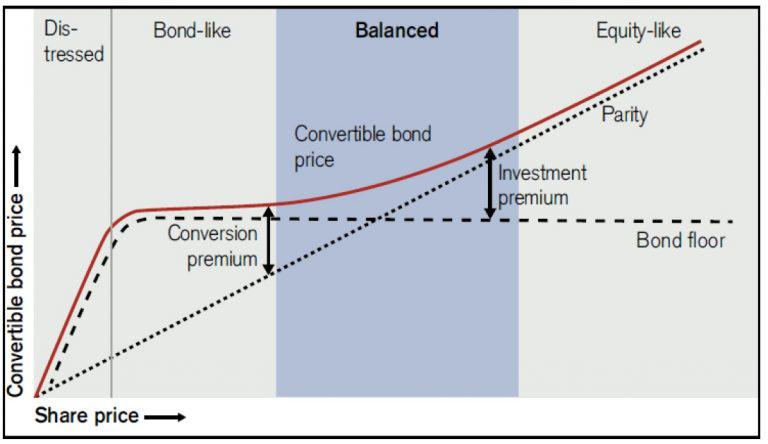

Convertible bonds represent a unique financial instrument that blends the features of both debt and equity, offering benefits and challenges to both issuers and investors. These bonds provide fixed interest payments over a specified period, with the added option for conversion into a set number of equity shares. This conversion option becomes attractive when the issuing company's stock performs well, offering bondholders the opportunity to benefit from potential equity gains. As a result, convertible bonds are appealing to issuers looking to raise capital at a lower cost and investors seeking a combination of fixed income and equity potential.

In corporate finance, convertible bonds serve as a strategic tool for capital acquisition, allowing companies to access funding at more favorable interest rates compared to traditional bonds. They also offer the advantage of delayed equity dilution, preserving shareholder value and maintaining a stronger capital structure in the short term. However, companies must carefully manage the timing and volume of issuance to avoid potential dilution and negative market perceptions.



The rise of algorithmic trading has further influenced the convertible bond market, enhancing efficiency, pricing accuracy, and liquidity. While these technological advancements bring opportunities, they also introduce complexities that require advanced trading strategies and expertise in quantitative finance.

This article examines the multifaceted nature of convertible bonds within corporate finance and explores how algorithmic trading has impacted this financial instrument. By understanding the advantages, challenges, and strategies associated with convertible bonds, both companies and investors can better navigate the evolving financial landscape to optimize capital and investment benefits.

## Table of Contents

## What are Convertible Bonds?

Convertible bonds are financial instruments issued by companies as a means to raise capital while providing certain attributes that cater to both the company’s and investors’ interests. These bonds serve as hybrid securities because they combine elements of both debt and equity. A fundamental characteristic of convertible bonds is that they offer fixed interest payments, similar to traditional bonds, over a specified period. However, what sets them apart is the embedded option to convert the bonds into a predetermined number of equity shares.

The conversion feature is generally viewed as advantageous when the issuing company’s stock performs favorably. In such cases, bondholders are enticed to convert their bonds into equity, thus participating in the company's capital appreciation potential. The bondholder gains from stock price increases without exposure to its full volatility during holding. For example, a bondholder with a convertible bond at a conversion price below the current market value of the company's shares stands to realize a profit upon conversion.

To illustrate the conversion mechanics, consider a convertible bond with a face value of $1,000 and a conversion rate of 50 shares. The conversion price would then be calculated as:

$$
\text{Conversion Price} = \frac{\text{Face Value}}{\text{Conversion Rate}} = \frac{1000}{50} = 20 \text{ per share}
$$

If the current market price of the stock exceeds $20, conversion benefits are realized. The hybrid nature of these convertible bonds offers bondholders the assurance of fixed income with the added advantage of converting to equity, thus reducing downside risk while retaining capital appreciation opportunities.

In periods of market [volatility](/wiki/volatility-trading-strategies), this dual nature provides a cushion against downside movements, as the bond’s fixed income component maintains certain value irrespective of stock fluctuations. Consequently, convertible bonds constitute a strategic investment option that can adapt to varying market behaviors, balancing risk and reward dynamics.

## Pros of Convertible Bonds for Corporate Finance

Convertible bonds present several advantages for corporate finance, making them an attractive option for companies seeking to raise capital. One of the primary benefits is that these bonds typically come with lower interest rates compared to traditional bonds. This characteristic is advantageous for issuers because it reduces the cost of debt servicing. With convertible bonds, companies can access needed funds without incurring the higher interest obligations associated with conventional debt instruments.

Moreover, convertible bonds allow companies to postpone equity dilution. When a company issues equity, it increases the number of outstanding shares, which can dilute the value of existing shares. However, with convertible bonds, equity dilution is only a potential future event, contingent upon bondholders opting to convert their bonds into equity. This delay helps preserve existing shareholder value and supports a stronger capital structure in the short term. In financial terms, the equity dilution effect can be expressed as:

$$
\text{Dilution} = \frac{\text{New Shares Issued}}{\text{Existing Shares} + \text{New Shares Issued}}
$$

By delaying dilution, companies maintain control over their capital structure and manage shareholder equity strategically.

Convertible bonds also offer flexibility by combining elements of debt and equity. This hybrid nature allows companies to optimize their financial strategy by balancing leverage while keeping open the option for future equity issuance. In an evolving market, maintaining a flexible capital structure is critical. Convertible bonds enable firms to adapt to diverse financial environments, responding effectively to both growth opportunities and financial challenges.

In conclusion, convertible bonds are a valuable tool for companies aiming to secure financial resources efficiently while managing future equity considerations strategically. By leveraging the characteristics of these bonds, companies can reinforce their financial strategies and position themselves advantageously within their respective industries.

## Cons of Convertible Bonds for Corporate Finance

Potential dilution is a significant concern when companies issue convertible bonds, as the conversion of bonds into equity increases the number of outstanding shares. This process dilutes the ownership percentage of existing shareholders and can affect the overall market perception of the company. The increase in the number of shares can lead to a reduction in earnings per share (EPS), impacting the valuation metrics used by investors and analysts.

Frequent issuance of convertible bonds can negatively impact how the market perceives a company. If a company consistently resorts to issuing convertible bonds, it might be interpreted as a sign of financial instability or inability to secure financing through more traditional means. This perception can affect the company's stock price negatively, as investors might be wary of the company's financial health and prospects.

To mitigate the risks of dilution and negative market perception, companies must strategically assess the timing of convertible bond issuance. This involves analyzing current market conditions, the company's financial status, and future capital needs. Timing the issuance optimally can help manage the potential dilutive effects on existing shares and maintain a stable capital structure. 

Strategic management of convertible bond issuance includes understanding the conversion ratio and pricing the bonds at an appropriate conversion price. The conversion ratio, which is the number of shares each bond can be converted into, plays a crucial role in determining the extent of dilution when the bonds are converted. Setting a higher conversion price can reduce immediate dilution but might decrease the attractiveness of the bond to investors, requiring companies to strike a balance between these factors.

In summary, while convertible bonds offer companies a means to raise capital, they come with potential downsides such as dilution of current shareholders' equity and potential negative market perception. Careful planning and strategic timing are essential to minimize these cons and achieve a favorable outcome for both the company and its investors.

## Pros of Convertible Bonds for Investors

Convertible bonds present several advantages for investors, combining the benefits of both bonds and equities. They generate a fixed income stream through periodic interest payments, offering predictability and stability. This regular income is advantageous during uncertain market conditions, making convertible bonds an attractive choice for conservative investors. Moreover, these bonds hold the potential for significant capital appreciation. This opportunity lies in the conversion feature, which allows bondholders to convert their bonds into a predetermined number of equity shares when the issuing company’s stock performs well. Thus, investors can benefit from the upside potential associated with equities without forfeiting the security of a bond's fixed yield.

Furthermore, convertible bonds offer downside protection. Unlike equity investments, which can lose substantial value in declining markets, convertible bonds retain their bond component value if the associated stock underperforms. This aspect is crucial as it mitigates potential losses since the bond’s principal repayment remains intact until maturity, assuming the issuer does not default. Hence, they provide a safety net absent in pure equity investments, ensuring capital preservation in volatile market environments.

Additionally, convertible bonds serve as an effective diversification instrument in investment portfolios. They harmonize risk and return attributes, operating as a hybrid security that can perform well across different market conditions. Including convertible bonds in a diversified portfolio can lower overall volatility, as they often display different return drivers than traditional fixed-income or equity investments. This diversification benefits investors by potentially enhancing the portfolio's returns while maintaining a controlled risk exposure. Overall, convertible bonds can contribute significantly to a balanced and resilient investment strategy.

## Cons of Convertible Bonds for Investors

Convertible bonds, while offering several benefits to investors, also come with notable drawbacks that need careful consideration. One of the primary concerns is that the conversion feature becomes less attractive if the underlying stock performs poorly. In such scenarios, investors may find the equity benefits limited, as the anticipated capital appreciation through conversion fails to materialize. Consequently, investors are left with the fixed-income component of the bond, which might not offer enough compensation for the potential risks involved.

Interest rate fluctuations present another significant challenge. Convertible bonds are sensitive to changes in interest rates, which can impact bond prices. When interest rates rise, the value of existing bonds typically decreases, leading to potential capital losses for investors holding these instruments. This sensitivity arises because newer bonds are issued with higher interest rates, making them more attractive compared to older bonds, thus driving down the price of the latter in the market.

Additionally, convertible bonds often face [liquidity](/wiki/liquidity-risk-premium) issues, characterized by wider bid-ask spreads. This increased spread represents higher transaction costs for investors looking to buy or sell these securities. The lack of liquidity can result in difficulty executing trades at desired prices, potentially impacting the overall return on investment. Investors need to consider these liquidity challenges, especially in turbulent market conditions, where finding a counterparty to trade with can become even more difficult. 

Taken together, these factors highlight the potential downsides of investing in convertible bonds, making it essential for investors to thoroughly assess their market conditions and individual financial goals before committing capital to these hybrid securities.

## Impact of Algorithmic Trading on Convertible Bonds

Algorithmic trading significantly enhances the efficiency and transparency of convertible bond markets by automating the trading processes and fostering competitive pricing. These systems utilize complex mathematical models and high-speed data processing to analyze large volumes of information, thereby improving pricing accuracy and liquidity. As a consequence, [algorithmic trading](/wiki/algorithmic-trading) enables more effective market entry and [exit](/wiki/exit-strategy) strategies, allowing traders to capitalize on pricing inefficiencies and execute orders quickly and with minimal market impact.

The automation provided by algorithmic trading eliminates human errors that traditionally occurred in manual trading, leading to more consistent and reliable execution. This shift has made the convertible bond market more accessible to a broader range of investors, given the increased transparency and ease of access to market data. As a result, investors can better monitor and react to market changes, which is crucial in the dynamic landscape of convertible bonds where both equity and debt components influence pricing.

Despite the advantages, algorithmic trading introduces complexity that necessitates advanced trading strategies and substantial quantitative finance expertise. Traders must develop algorithms capable of adapting to market fluctuations and integrating various financial models to predict asset behaviors accurately. The sophistication involved requires a deep understanding of mathematics, [statistics](/wiki/bayesian-statistics), and programming, often through languages such as Python. Building such systems involves optimizing for speed and precision to ensure that trades are executed at optimal prices and times.

The complexity of algorithmic systems can be represented through various models and techniques within quantitative finance. For instance, a simple example is the use of a moving average crossover strategy to make trading decisions:

```python
import numpy as np

# Sample price data
prices = np.array([100, 102, 101, 103, 105, 106, 104])

# Calculate short and long moving averages
short_window = 3
long_window = 5

short_mavg = np.convolve(prices, np.ones(short_window)/short_window, mode='valid')
long_mavg = np.convolve(prices, np.ones(long_window)/long_window, mode='valid')

# Determine buy and sell signals
buy_signals = short_mavg > long_mavg[:len(short_mavg)]
sell_signals = short_mavg < long_mavg[:len(short_mavg)]

# Print signals
print("Buy Signals: ", buy_signals)
print("Sell Signals: ", sell_signals)
```

This code snippet demonstrates a basic algorithmic technique typically enhanced with additional risk management and predictive analytics in professional trading environments. Overall, while algorithmic trading provides substantial advantages in the convertible bond markets, it demands a sophisticated approach to fully harness its potential and mitigate associated risks. As the financial landscape evolves, continuous adaptation and innovation in algorithm development are imperative for maintaining competitive advantage.

## Conclusion

Convertible bonds stand as a prominent tool in both corporate finance and investment portfolios, embodying a hybrid characteristic that bridges the gap between debt and equity. Their dual nature allows for adaptability in a fluctuating financial environment, capitalizing on the benefits of both fixed income and the potential for equity appreciation. Smart utilization of convertible bonds demands a keen understanding of the market dynamics; gaining insights into current trends, investor sentiment, and macroeconomic factors is essential for making informed decisions.

Strategic foresight is fundamental, particularly in anticipating changes in interest rates, stock market movements, and economic conditions that could impact the convertible bond's attractiveness and pricing. The advancement in technology, especially with the rise of algorithmic trading, has further elevated the need for sophisticated analytical tools. Investors and companies alike must equip themselves with technological acumen to harness automated trading systems effectively, which enhance pricing accuracy and liquidity.

The intricate nature of convertible bonds necessitates a prudent and well-calculated approach for both issuers and investors. For companies, leveraging convertible bonds strategically can mean optimizing capital structure while minimizing costs and postponing shareholder dilution. Conversely, investors benefit by potentially stabilizing returns with fixed income while capturing upside equity potential. However, the inherent complexity and risks associated, such as potential dilution or market volatility, require careful navigation.

Thus, understanding the multifaceted characteristics and integrating strategic market insights with technological tools can maximize the benefits of convertible bonds. This approach ensures that their deployment is aligned with both corporate objectives and investment strategies, thereby achieving optimal financial outcomes.

## References & Further Reading

To gain a comprehensive understanding of convertible bonds, their pricing, and associated strategies, it is beneficial to reference various financial literature and studies that explore these hybrid securities in detail.

1. **"Convertible Bond Markets" by Gregor Giddy**: This work provides fundamental insights into the structure and operation of convertible bonds. Giddy explores the dynamics of convertible bond markets, providing a solid foundation for both academic and practical applications.

2. **"Valuation of Convertible Bonds" by John C. Hull**: Hull, a renowned expert in options, futures, and other derivatives, offers valuable approaches to the mathematical valuation of convertible bonds. His work emphasizes the role of economic conditions and market movements in convertible bond pricing.

3. **Academic Journal Papers**: Publications such as the "Journal of Financial Economics" and "The Review of Financial Studies" frequently cover topics related to convertible securities. These articles often present empirical studies and quantitative analyses that can be useful for understanding current academic thinking and trends in convertible bond markets.

4. **"Convertible Arbitrage: Insights and Techniques" by Nick Calamos**: This book offers practical guidance on convertible arbitrage strategies that capitalists might employ. It covers the market mechanics and risks associated with convertible bond trading.

5. **Financial Research Platforms**: Websites like JSTOR or SSRN compile a wide array of research papers that delve into comprehensive analyses of financial strategies involving convertible bonds. Searching these platforms can reveal a wealth of secondary research and datasets for deeper investigation.

6. **Industry Reports by Investment Banks**: Regular updates and special reports by major investment banks such as Goldman Sachs, Morgan Stanley, or JP Morgan can provide current market perspectives and strategic insights regarding convertible bond investments.

7. **Online Courses and Workshops**: Platforms like Coursera and edX offer specialized courses on financial instruments, including convertible bonds, conducted by financial experts and academicians. Participating in these can provide both foundational knowledge and advanced strategies.

8. **Algorithmic Trading References**: For those interested in the algorithmic aspects, "Algorithmic Trading and DMA" by Barry Johnson is a recommended resource providing context on the technological and strategic landscape impacting convertible bond trading.

These resources collectively provide valuable insights into the intricacies of convertible bonds, guiding both theoretical understanding and practical application in financial markets.

