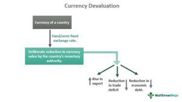

The intricate world of international finance is profoundly influenced by exchange rates, currency devaluation, and economic policy. Exchange rates, which determine the relative value of one currency against another, are crucial in international trade and investment. Currency devaluation, often a deliberate reduction in a country's currency value, can significantly alter these exchange rates. Countries may devalue their currencies to boost exports by making them cheaper on the global market or to reduce trade deficits. However, this strategy can also lead to inflation and deter foreign investment, illustrating the delicate balance of economic policy decisions on currency values.

Over the past few decades, algorithmic trading, or algo trading, has transformed financial markets. This approach uses computer algorithms to execute trades at speeds and efficiencies that far surpass human capabilities. Algo trading strategies frequently take into account various economic indicators, such as interest rates, inflation, and monetary policies. As these economic factors influence exchange rates, they also impact the algorithms used in trading, requiring continuous adaptation and optimization.



The interconnectedness of exchange rates, currency devaluation, and algo trading offers valuable insights into how these elements shape financial markets. These dynamics are essential for understanding global finance, as they have widespread implications for investors and policymakers. By comprehensively analyzing these factors, stakeholders can better navigate the complexities of financial markets, optimizing their strategies and minimizing risks in a rapidly evolving economic landscape. Understanding these relationships is therefore crucial for accurate forecasting and informed decision-making in today's interconnected world.

## Table of Contents

## Understanding Exchange Rates and Currency Devaluation

Exchange rates play a critical role in the global financial ecosystem by determining how much one currency is worth relative to another. These rates affect international trade, investment flows, and economic stability. A significant factor influencing exchange rates is currency devaluation, which occurs when a country deliberately reduces the value of its currency against others.

Governments may devalue their currency for several strategic reasons. One primary motivation is to boost exports. By lowering the domestic currency's value, a country's goods become more competitively priced in international markets, theoretically increasing demand from foreign buyers. This strategy can help reduce trade deficits, where a country imports more than it exports, by making exports more attractive and imports more expensive.

Currency devaluation can also be a tool for alleviating sovereign debt burdens. With a weaker currency, the relative size of foreign-denominated debt increases, making it harder to service. However, the increased export income can, over time, provide the necessary foreign exchange to manage these debts, offering a path to economic relief.

While these motivations underscore strategic advantages, currency devaluation can have unintended negative consequences. Inflation is a common by-product. As the domestic currency loses value, the cost of imported goods rises, contributing to an overall increase in the price levels within the economy. This inflationary pressure can erode purchasing power, dampening the initial benefits gained from increased export competitiveness.

Currency devaluation can also deter foreign investment. As investors anticipate further declines in currency value, the domestic market may become less attractive. International investors often seek stable environments where the value of their investments is protected from volatile exchange rate movements.

Understanding these dynamics is crucial for grasping broader global economic trends. For policymakers, striking a balance between leveraging currency devaluation for competitive advantage and managing its potential downsides is essential. For investors, awareness of how currency values might shift provides insight into market conditions and informs decision-making regarding international ventures. 

The delicate interplay between exchange rates and macroeconomic policies exemplifies the complexities intrinsic to international finance, where decisions transcend beyond borders, affecting industries and economies worldwide.

## Economic Policies and Their Influence on Currency Values

Economic policies, encompassing both fiscal and monetary dimensions, are crucial determinants of a nation's currency value. Governments around the world employ these strategies to manage economic stability and growth, often impacting the currency's strength in the process.

Monetary policy, administered by a country's central bank, involves managing the money supply and interest rates. Expansionary monetary policies are typically implemented to combat economic slowdowns, characterized by lowering interest rates and increasing the money supply. This can lead to currency depreciation, making exports cheaper and potentially boosting economic growth by stimulating demand for domestically produced goods. However, currency depreciation can also increase the cost of imports, contributing to inflationary pressures.

Fiscal policy, defined by government spending and taxation decisions, also influences currency values. For example, an increase in government spending needs to be financed, either through higher taxes or borrowing. If funded by borrowing, the resultant government debt can impact investor perceptions of a country's fiscal health, potentially depreciating the currency if investors anticipate difficulty in repayment.

Geopolitical factors, such as trade tensions or political instability, combined with policy decisions, can lead to competitive devaluation, often referred to as currency wars. During such events, countries attempt to deliberately devalue their currency to gain a trade advantage. This can set off a chain reaction, prompting affected nations to likewise devalue their currencies, impacting global trade balances and investment flows.

For multinational businesses and investors, understanding the ripple effects of these policies on exchange rates is vital. Currency fluctuations can affect the profitability of overseas operations and have significant implications for international investment strategies. Investors may seek to hedge against these risks by engaging in currency derivatives or diversifying their portfolios across various regions.

In summary, the strategic deployment of fiscal and monetary policies can profoundly influence a nation's currency, with cascading effects across the global economic landscape. Effective policy management is essential for maintaining economic stability and ensuring sustainable growth in today's interconnected world.

## Algorithmic Trading in Modern Financial Markets

Algorithmic trading, commonly referred to as algo trading, utilizes computer algorithms to execute trades based on predefined criteria, significantly transforming the landscape of modern financial markets. By automating trading processes, [algorithmic trading](/wiki/algorithmic-trading) allows for rapid execution and reduces the likelihood of human error, thereby enhancing both speed and efficiency.

One of the core advantages of algo trading is its ability to process large volumes of data and make decisions in split seconds, an area where human traders often fall short. This technological edge enables traders to capitalize on minute price changes within highly volatile markets. The algorithms used in such trading strategies often incorporate various economic indicators; among these are exchange rates and policy shifts, which are particularly influential due to their impact on currency valuations and market sentiment.

In the foreign exchange ([forex](/wiki/forex-system)) markets, the role of algorithmic trading has become increasingly critical. Forex markets are inherently dynamic, reflecting real-time financial activities worldwide. By analyzing vast datasets that include economic announcements, geopolitical events, and market trends, algo trading systems are able to predict currency movements with improved accuracy. This capability not only aids in managing risks but also enhances the potential for profit through timely and strategic trade execution.

Consider the Python code snippet below, which outlines a simplistic algorithmic model leveraging moving averages, a popular technique for identifying currency trends:

```python
import pandas as pd
import talib

# Sample DataFrame `data` with forex price data
# Assume 'close' is the closing price column
df = pd.DataFrame(data)

# Calculate moving averages
short_rolling = df['close'].rolling(window=20).mean()
long_rolling = df['close'].rolling(window=100).mean()

# Generate signals
df['signal'] = 0
df['signal'][20:] = np.where(short_rolling[20:] > long_rolling[20:], 1, 0)

# Compute trading positions
df['position'] = df['signal'].diff()
```

In this example, the algorithm calculates short and long-term moving averages of currency closing prices to generate buy or sell signals based on trend analysis. Although simplistic, such strategies can be expanded with additional factors like economic indicators to improve their robustness.

The integration of algorithmic trading continues to reshape forex markets, underscoring its importance in comprehending and navigating currency fluctuations. As financial systems evolve with advancing technologies, algo trading remains a vital tool for traders aiming to optimize their strategies in the face of rapid and complex market conditions.

## The Impact of Exchange Rate Fluctuations on Algorithmic Trading

Exchange rate fluctuations present a dual nature for algorithmic trading, offering both lucrative opportunities and substantial challenges. Algorithmic trading models, fundamentally designed to exploit small price movements, find fertile ground in the dynamic nature of currency markets. Exchange rates can be influenced by several factors—including currency devaluation, macroeconomic indicators, and geopolitical events—requiring algorithmic strategies to be both adaptive and responsive.

Traders deploying algorithmic strategies must therefore incorporate tools to manage the [volatility](/wiki/volatility-trading-strategies) induced by these factors. For instance, economic policies that affect currency values could lead to sudden and sharp exchange rate movements. Algorithms must be equipped to handle such volatility, potentially by using dynamic hedging techniques or volatility-adjusted pricing models. The goal is to optimize profit while minimizing risk exposure, a principle that lies at the heart of successful algo trading.

Modern algo trading strategies have increasingly embraced [machine learning](/wiki/machine-learning) to enhance their decision-making processes. Machine learning algorithms can analyze vast swathes of economic data in real-time, identifying patterns or anomalies that might be linked to currency fluctuations. Python libraries such as TensorFlow or Scikit-learn are often leveraged to build predictive models that adapt to new data, allowing traders to anticipate currency movements and adjust their positions dynamically.

For example, one might use a machine learning model to predict future currency prices based on historical exchange rates, [interest rate](/wiki/interest-rate-trading-strategies) differentials, and other macroeconomic variables. A simple linear regression model can be implemented in Python as follows:

```python
import numpy as np
from sklearn.linear_model import LinearRegression

# Dummy data: historical exchange rates and other factors
X = np.array([
    [1.2, 0.5],  # example feature: interest rate differential and economic indicator
    [1.3, 0.4],
    [1.1, 0.6],
])
y = np.array([1.25, 1.30, 1.18])  # corresponding future exchange rates

# Create and train the model
model = LinearRegression()
model.fit(X, y)

# Predict future exchange rate
predicted_rate = model.predict(np.array([[1.25, 0.45]]))
print("Predicted Exchange Rate:", predicted_rate)
```

This illustrative model captures how exchange rate analysis is crucial to refining competitive algorithmic trading strategies. By integrating such analytical techniques, traders can more effectively navigate the complexities presented by fluctuating currencies. The dynamic relationship between exchange rates and algo trading remains a crucial focus for both profit maximization and risk management.

Thus, the ecosystem of exchange rate analysis and algorithmic trading is continually evolving. As financial technologies advance, the ability to process real-time data efficiently and predict market movements becomes increasingly sophisticated, ensuring that algorithmic trading keeps pace with the complexities of modern financial markets.

## Conclusion

The complex tapestry of exchange rates, currency devaluation, economic policy, and algorithmic trading weaves a multifaceted financial ecosystem that demands careful understanding and navigation. As investors, policymakers, and traders seek to optimize strategies and mitigate risks, grounding their decisions in a comprehensive grasp of these interconnected elements becomes imperative.

Currency devaluation, while potentially offering short-term economic benefits such as stimulating exports and reducing trade deficits, poses long-term challenges that require astute management. The temporary competitiveness gained in international markets can be offset by inflationary pressures and erosion of investor confidence, necessitating a delicate balancing act.

Algorithmic trading stands as a crucial instrument within a trader's toolkit, especially due to its reliance on exchange rate movements. By leveraging data-driven insights, algo trading enables rapid responses to market fluctuations, thereby enhancing trading efficiency and precision. Algorithms, fueled by advancements in technology, are increasingly sophisticated, incorporating real-time economic indicators and machine learning techniques to predict and adapt to currency shifts.

As financial landscapes continue to evolve, the integration of these themes will undeniably influence future economic policies and trading methodologies. The dynamic interplay between these elements not only underscores the complexity of modern finance but also highlights the potential for innovation and growth. Investors, traders, and policymakers who understand and anticipate these evolving trends will be better positioned to navigate the uncertainties and capitalize on the opportunities that the global financial markets present.

## References & Further Reading

[1]: Bergstra, J., Bardenet, R., Bengio, Y., & Kégl, B. (2011). ["Algorithms for Hyper-Parameter Optimization."](https://papers.nips.cc/paper/4443-algorithms-for-hyper-parameter-optimization) Advances in Neural Information Processing Systems 24.

[2]: ["Advances in Financial Machine Learning"](https://www.amazon.com/Advances-Financial-Machine-Learning-Marcos/dp/1119482089) by Marcos Lopez de Prado

[3]: ["Evidence-Based Technical Analysis: Applying the Scientific Method and Statistical Inference to Trading Signals"](https://www.amazon.com/Evidence-Based-Technical-Analysis-Scientific-Statistical/dp/0470008741) by David Aronson

[4]: ["Machine Learning for Algorithmic Trading"](https://books.google.com/books/about/Machine_Learning_for_Algorithmic_Trading.html?id=4f30DwAAQBAJ) by Stefan Jansen

[5]: ["Quantitative Trading: How to Build Your Own Algorithmic Trading Business"](https://books.google.com/books/about/Quantitative_Trading.html?id=j70yEAAAQBAJ) by Ernest P. Chan