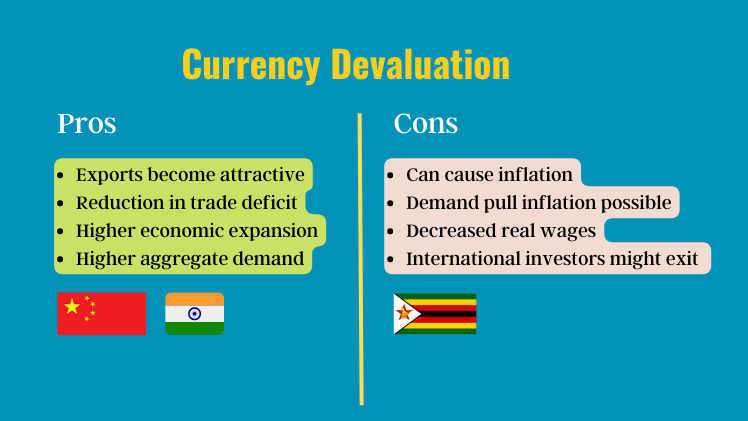

## Table of Contents

## What is currency devaluation?

Currency devaluation is when a country makes its money worth less compared to other countries' money. This usually happens when a government decides to change the official value of its currency. For example, if the government says that one of its dollars is now worth less when trading with other countries, that's devaluation. It's often done to make a country's exports cheaper and more attractive to other countries, which can help increase sales and boost the economy.

However, devaluation can also have downsides. When a country's currency is worth less, it can make imports more expensive. This means that things like food, fuel, and other goods from other countries can cost more for people living in the country with the devalued currency. This can lead to higher prices and inflation, making life more expensive for people. Governments need to carefully consider these effects when deciding to devalue their currency.

## Why do countries devalue their currency?

Countries devalue their currency to make their products cheaper for other countries to buy. When a country's money is worth less, people in other countries can buy more of that country's goods with their own money. This can help the country sell more things to other countries, which can create jobs and grow the economy. For example, if a country makes toys and devalues its currency, the toys become cheaper for people in other countries, so they might buy more toys.

However, devaluing a currency can also cause problems. It can make things from other countries more expensive for people living in the country that devalued its currency. For example, if a country needs to import oil and its currency is devalued, the oil will cost more. This can lead to higher prices for everything, which is called inflation. So, while devaluing a currency can help a country sell more of its own products, it can also make life more expensive for its own people. Governments have to think carefully about these effects before deciding to devalue their currency.

## How does devaluation affect a country's exports?

When a country devalues its currency, it makes its exports cheaper for other countries to buy. This happens because the price of the country's goods in foreign money goes down. For example, if a toy that cost 10 dollars in the country now costs less in euros or yen, people in those countries can buy more toys with the same amount of money. This can lead to more sales of the country's products abroad, which can help the country's businesses grow and create more jobs.

However, devaluation can also have some downsides. If the country relies on importing goods, those goods will become more expensive because the country's money is worth less. This can lead to higher prices at home, which might hurt the economy if people start buying less because things are too expensive. So, while devaluing a currency can boost exports by making them cheaper, it can also cause problems by making imports more costly.

## What are the short-term economic impacts of currency devaluation?

When a country devalues its currency, it can quickly make the country's products cheaper for people in other countries to buy. This can lead to more sales of things like cars, toys, or food from that country. More sales can mean more jobs and more money for businesses in the short term. This can help the economy grow faster because more people are working and spending money.

However, devaluation can also cause problems right away. Things that the country buys from other countries, like oil or electronics, can become more expensive. This can make prices go up at home, which is called inflation. When prices rise, people might not be able to buy as much, which can slow down the economy. So, while devaluation can boost exports and help the economy in the short term, it can also lead to higher prices and make life more expensive for people living in the country.

## Can devaluation help reduce a country's trade deficit?

Devaluation can help reduce a country's trade deficit by making its exports cheaper. When a country's money is worth less, people in other countries can buy more of its products with the same amount of their own money. This can lead to more sales of the country's goods abroad, which can increase the money coming into the country. If the country is selling more things to other countries, it can help balance out the trade deficit, which is when a country buys more from other countries than it sells.

However, devaluation doesn't always fix a trade deficit right away. It can make things that the country buys from other countries more expensive. If the country needs to import a lot of things like oil or food, those things will cost more after devaluation. This can make the trade deficit worse if the country has to spend more money on imports. So, while devaluation can help by making exports cheaper, it can also make imports more costly, which might not reduce the trade deficit as much as hoped.

## What are the risks associated with currency devaluation?

When a country devalues its currency, it can make things from other countries more expensive. This means that if the country needs to buy things like oil or food from other places, those things will cost more. This can lead to higher prices at home, which is called inflation. When prices go up, people might not be able to buy as much, and this can make life harder for them. It can also slow down the economy because people are spending less money.

Another risk is that devaluation might not help the country's trade as much as hoped. While it can make the country's products cheaper for other countries to buy, it doesn't always lead to more sales. If other countries start buying more of the country's products, that's good. But if they don't, the country might end up with a bigger trade deficit because imports are more expensive. So, devaluation can be risky because it might not work as planned and can make things worse instead of better.

## How does currency devaluation impact inflation?

When a country devalues its currency, it makes the money worth less compared to other countries' money. This can make things from other countries more expensive. For example, if a country needs to buy oil from another country, that oil will cost more after devaluation. When things like oil get more expensive, it can lead to higher prices for everything. This is called inflation. So, devaluation can cause prices to go up, which means people might have to pay more for things they need.

However, devaluation can also help a country's own businesses. When the country's money is worth less, its products become cheaper for people in other countries to buy. This can lead to more sales and more money coming into the country. But if the country relies a lot on things from other countries, the higher cost of imports might outweigh the benefits of cheaper exports. So, while devaluation can make a country's products more competitive, it can also lead to higher prices at home, making inflation a big risk.

## What role does the central bank play in currency devaluation?

The central bank plays a big role in currency devaluation. It's the central bank that decides to change the value of the country's money. When they think it's a good idea, they can make the money worth less compared to other countries' money. They do this to help the country sell more things to other countries. When the country's money is worth less, other countries can buy more of the country's products with their own money.

But the central bank has to be careful. Making the money worth less can make things from other countries more expensive. This can lead to higher prices at home, which is called inflation. The central bank has to think about whether the benefits of selling more things will be bigger than the problems caused by higher prices. They have to balance these things to make the best decision for the country's economy.

## How do international markets react to a country's currency devaluation?

When a country devalues its currency, international markets often react quickly. Other countries might start buying more things from the country with the devalued currency because those things are now cheaper. For example, if a country makes cars and devalues its currency, people in other countries can buy those cars for less money. This can lead to more sales and more money coming into the country. Investors might also see the devaluation as a chance to make money by buying the country's products or investing in its businesses.

However, there can be negative reactions too. If a country devalues its currency, it can make people in other countries worried. They might think the country is having money problems or that its economy is not doing well. This can make investors pull their money out of the country because they are afraid of losing it. Also, if the country needs to buy things from other countries, those things will become more expensive. This can lead to higher prices in the country and might make other countries less interested in trading with it. So, while devaluation can boost sales in the short term, it can also cause problems and make international markets nervous.

## What are the long-term economic consequences of frequent currency devaluations?

If a country keeps devaluing its currency a lot, it can hurt the economy in the long run. People in other countries might start to trust the country's money less. They might think the country has big money problems or that its economy is not doing well. This can make investors pull their money out of the country because they are afraid of losing it. When investors leave, it can be hard for the country to get the money it needs to grow its economy. Also, if the country keeps making its money worth less, it can make people at home think the money is not worth saving. They might spend it quickly instead of saving it, which can make the economy unstable.

Another long-term problem is that frequent devaluations can make inflation worse. When a country devalues its currency, things from other countries become more expensive. If this happens a lot, prices keep going up and up. This is called inflation, and it can make life harder for people because they have to pay more for things they need. Over time, this can slow down the economy because people have less money to spend. So, while devaluing a currency might help in the short term, doing it too often can cause big problems and make it hard for the country to grow and be stable in the long run.

## How does currency devaluation affect foreign debt?

When a country devalues its currency, it can make its foreign debt more expensive. Foreign debt is money that the country owes to other countries or to people and businesses in other countries. If the country's money is worth less, it needs more of its own money to pay back the same amount of foreign money. This means the country has to spend more to pay off its debts, which can be hard if it doesn't have enough money.

However, devaluing the currency can also help the country in some ways. If the country makes things that it can sell to other countries, devaluation can make those things cheaper for people in other countries to buy. This can lead to more sales and more money coming into the country. If the country uses this extra money to pay off its foreign debt, it might be able to handle the higher cost of the debt better. But it's a tricky balance, and the country needs to be careful about how it manages its money and its debts.

## What are some historical examples of currency devaluation and their outcomes?

In 1994, Mexico devalued its currency, the peso. This was called the "Tequila Crisis." The government thought it would help the country sell more things to other countries. But it made people in other countries worried about Mexico's money. They started taking their money out of Mexico, and this made the peso worth even less. Prices in Mexico went up a lot, and many people lost their jobs. The country had to get help from other countries and the International Monetary Fund to fix its economy. It took a long time for Mexico to recover, but it did get better eventually.

Another example is China in 1994. China devalued its currency, the yuan, to make its products cheaper for other countries to buy. This helped China sell a lot more things, like toys and clothes, to other countries. It helped China's economy grow a lot. But it also made things from other countries more expensive for people in China. Over time, China managed to keep its economy growing and became a big player in the world's economy. The devaluation helped China in the long run, but it had to be careful about how it managed its money and its trade with other countries.

In 2002, Argentina devalued its currency, the peso, after years of trying to keep it tied to the US dollar. This led to a big economic crisis. Prices in Argentina went up a lot, and many people lost their jobs and their savings. The country had to get help from the International Monetary Fund and other countries to fix its economy. It took a long time for Argentina to recover, and it had to make a lot of changes to its economy. The devaluation caused a lot of problems, but it also helped Argentina start to fix its economy in the long run.

## References & Further Reading

[1]: Bergstra, J., Bardenet, R., Bengio, Y., & Kégl, B. (2011). ["Algorithms for Hyper-Parameter Optimization."](https://papers.nips.cc/paper/4443-algorithms-for-hyper-parameter-optimization) Advances in Neural Information Processing Systems 24.

[2]: ["Advances in Financial Machine Learning"](https://www.amazon.com/Advances-Financial-Machine-Learning-Marcos/dp/1119482089) by Marcos Lopez de Prado

[3]: ["Evidence-Based Technical Analysis: Applying the Scientific Method and Statistical Inference to Trading Signals"](https://www.amazon.com/Evidence-Based-Technical-Analysis-Scientific-Statistical/dp/0470008741) by David Aronson

[4]: ["Machine Learning for Algorithmic Trading"](https://books.google.com/books/about/Machine_Learning_for_Algorithmic_Trading.html?id=4f30DwAAQBAJ) by Stefan Jansen

[5]: ["Quantitative Trading: How to Build Your Own Algorithmic Trading Business"](https://books.google.com/books/about/Quantitative_Trading.html?id=j70yEAAAQBAJ) by Ernest P. Chan