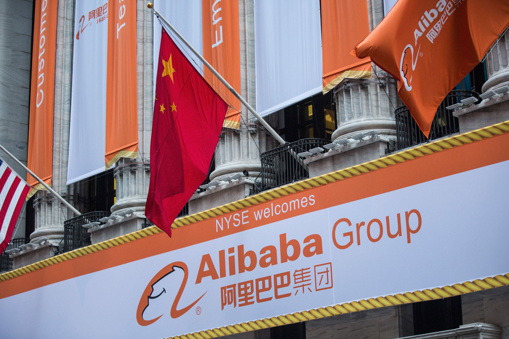

Alibaba Group Holding Limited, commonly known as Alibaba, is a cornerstone in the global e-commerce and technology ecosystem. Founded in 1999 by Jack Ma, Alibaba has expanded beyond its initial marketplace roots to dominate various sectors, including cloud computing, digital media, and logistics. Its significance in the global market is underscored by its expansive reach, facilitating billions of dollars in transactions annually and connecting millions of businesses and consumers worldwide. Alibaba's innovative approach, particularly in leveraging big data and artificial intelligence, has positioned it as a formidable competitor to Western giants such as Amazon and eBay.

The decision to go public is a pivotal moment for any company, often reshaping its financial and operational landscape profoundly. Initial Public Offerings (IPOs) allow companies to raise capital by offering shares to the public, effectively transitioning from private to public ownership. This process is not just a means of fundraising but also a strategic maneuver to enhance corporate reputation, improve liquidity, and facilitate mergers and acquisitions. The impact of IPOs extends to market valuation, attracting potential investors, and expanding the company's global footprint.

In a landmark decision in 2014, Alibaba chose to conduct its IPO on the New York Stock Exchange (NYSE), raising a record-breaking $25 billion—one of the largest IPOs in history. The choice of the U.S. market over other global exchanges was strategic, reflecting Alibaba's aspirations to cement its brand internationally and gain increased visibility in Western markets. The NYSE listing provided Alibaba with a robust platform to showcase its strength to American and global investors, enhancing its prestige and market confidence.

This article will explore several critical aspects of Alibaba's IPO journey and subsequent market dynamics. It will discuss the strategic reasoning behind Alibaba's selection of the U.S. stock market, the maintaining of control and governance post-IPO, and the impact on its brand reputation. Additionally, we'll examine how the U.S. listing has influenced Alibaba's mergers and acquisitions strategy and review the role of algorithmic trading in shaping Alibaba's stock performance. Finally, we'll look at Alibaba's future prospects and challenges, especially in light of geopolitical factors, concluding with reflections on the evolving landscape of global stock markets.

## Table of Contents

## Alibaba's U.S. IPO: A Strategic Move

Alibaba's decision to list on the New York Stock Exchange (NYSE) in 2014 was a calculated strategic move that positioned the company favorably in the global financial market. By choosing the NYSE, Alibaba aimed to tap into a broader and more diverse pool of investor capital, which often translates to enhanced market visibility and liquidity. The company's choice was driven by the desire to bolster its reputation and trust among international investors, an advantage that an NYSE listing inherently offers due to the exchange's global prestige and the stringent regulatory framework enforced by U.S. authorities.

A key strategic advantage of a U.S. IPO is the increased reputation it bestows upon a company. The NYSE is one of the most renowned stock exchanges worldwide, and being listed there is generally perceived as a mark of financial robustness and transparency. Companies listed on the NYSE often experience greater interest from large institutional investors and hedge funds, which can lead to higher share prices and easier access to additional capital. For Alibaba, a company based in China, listing in the U.S. provided a platform to showcase its operational strength and growth potential to a skeptical Western audience, thereby reinforcing its standing as a leading global e-commerce player.

The U.S. regulatory environment, governed primarily by the Securities and Exchange Commission (SEC), is known for its rigorous standards intended to protect investors and ensure fair markets. These regulations include thorough disclosure requirements and corporate governance standards that foreign companies must adhere to when they list in the U.S. For Alibaba, compliance with SEC regulations acted as a quality signal to investors, reflecting the company's commitment to transparency and accountability. This subsequently enhanced investor trust and mitigated concerns over corporate governance, which can often plague foreign firms in international markets.

Through its IPO on the NYSE, Alibaba not only capitalized on these strategic advantages but also leveraged the U.S. regulatory environment to reassure investors of its long-term viability and dedication to maintaining high governance standards. This strategic move to list in the U.S. played a critical role in Alibaba's continued expansion and its ability to attract significant global investment, establishing a foundation for its ambitions to rival other tech giants like Amazon in the digital commerce landscape.

## Control and Governance through U.S. Listing

Alibaba's decision to list on the New York Stock Exchange (NYSE) in 2014 significantly impacted its corporate governance, particularly regarding control and decision-making powers. One of the key strategic elements of this IPO was the ability to maintain control by Jack Ma and his co-founders, accomplished through the implementation of varied share classes. This structure allowed specific shares to [carry](/wiki/carry-trading) more voting power than others, thereby ensuring that the original founders retained substantial influence over major business decisions and company direction despite selling equity to external investors.

In the case of Alibaba, the company adopted a dual-class share structure. This approach involves creating two (or more) types of shares, each with different voting rights. Typically, Class A shares are sold to the public with one vote per share, while Class B shares are retained by founders and company insiders, often carrying multiple votes per share. For example, with a dual-class share structure, founders might hold Class B shares with ten votes per share, compared to the single vote per Class A share held by public investors. This allows company founders to maintain control over board appointments and significant corporate actions without holding the majority of the company’s equity, effectively decoupling ownership from control.

Internationally, exchanges have varying norms regarding control and governance through share structures. The NYSE and NASDAQ in the United States, for example, are more accepting of dual-class shares, which is one reason companies like Alibaba and Facebook have chosen to list there. However, other exchanges, such as those in the United Kingdom, typically discourage or restrict such structures. The London Stock Exchange’s guidelines, for instance, emphasize equal voting rights and have been cautious about accepting listings with weighted voting rights. This reflects a broader European trend prioritizing shareholder democracy and protection against entrenched insider control.

The ability to maintain governance control through structured share classes thus provided Alibaba with a beneficial environment on the NYSE. This allowed the company to pursue long-term strategic goals without the immediate pressures commonly associated with dispersed public ownership, where short-termism might prevail. This control mechanism offered Alibaba a competitive edge by balancing the need for capital through public investment with the necessity of strategic autonomy, demonstrating why U.S. exchanges may be attractive to firms prioritizing founders’ influence in governance.

## Reputation and Investor Confidence

Being listed on the New York Stock Exchange (NYSE) carries a significant prestige that can greatly influence a company's perceived reputation and investor confidence. For Alibaba Group Holding Limited, choosing the NYSE as its listing venue during its 2014 Initial Public Offering (IPO) marked a strategic decision that not only amplified its global stature but also cemented its credibility among investors worldwide.

The NYSE is often regarded as a benchmark for corporate excellence and stability. This reputation stems from its stringent listing standards that require rigorous financial disclosures and auditing practices. Companies that meet these standards are generally perceived as more transparent and reliable, leading to heightened investor confidence. Alibaba’s successful NYSE listing was a testament to its robust financial performance, growing market influence, and adherence to high governance standards, all of which resonated positively with global investors.

Moreover, the Securities and Exchange Commission (SEC) plays a critical role in shaping investor perception and trust through its comprehensive regulatory framework. The SEC mandates extensive disclosure and compliance obligations for companies listed on U.S. exchanges. This regulatory oversight ensures that investors have access to material information, enabling informed decision-making. For foreign firms like Alibaba, adhering to SEC regulations demonstrates a commitment to transparency and accountability, which can mitigate investor concerns about potential risks associated with international investments.

In the competitive landscape of global e-commerce, Alibaba's branding strategy has been pivotal in positioning itself as a formidable rival to industry giants like Amazon. By leveraging its NYSE listing, Alibaba has utilized its enhanced credibility and visibility to broaden its appeal among institutional and retail investors. The company's extensive retail ecosystem, innovation in technology, and strategic international expansion have fortified its market position and brand equity. This strategic branding has not only attracted investors seeking exposure to growth in the Chinese and global markets but has also positioned Alibaba as a key player in the e-commerce sector.

In summary, Alibaba's NYSE listing provided it with the dual advantage of prestige and regulatory assurance, underpinning investor confidence and enhancing its brand positioning as a rival to Amazon. The strategic selection of a U.S. exchange, combined with Alibaba's focused branding efforts, underscores the importance of strategic visibility and trust in securing a competitive edge in the global marketplace.

## Impact of U.S. Listing on Mergers and Acquisitions

A U.S. listing plays a crucial role in facilitating mergers and acquisitions (M&A) due to several factors that enhance the attractiveness and feasibility of such transactions. When a company like Alibaba lists on the New York Stock Exchange (NYSE), it gains significant visibility and credibility among investors and potential partners. This is largely due to the stringent regulatory requirements imposed by the U.S. Securities and Exchange Commission (SEC), which bolster investor confidence and standardize disclosure practices.

### Enhanced Access to Capital

One of the primary ways a U.S. listing facilitates M&A is by providing increased access to capital. The U.S. stock markets are among the most liquid in the world, enabling companies to raise substantial funds quickly. This capital can be used directly for acquiring companies or to finance growth strategies that make a business more attractive for partnerships.

### Improved Valuation Metrics

Listing in the U.S. often results in improved valuation metrics. This is due, in part, to the larger pool of investors and analysts who closely follow the market. Companies listed in the U.S. generally experience higher price-to-earnings (P/E) ratios compared to those listed on other exchanges. These favorable valuations can serve as a powerful currency in M&A negotiations, offering listed companies the ability to leverage their stock in potential deals.

### Facilitating Cross-Border Mergers

A U.S. listing makes cross-border mergers more seamless due to the adherence to internationally recognized accounting standards, such as Generally Accepted Accounting Principles (GAAP) or International Financial Reporting Standards (IFRS). This common financial language simplifies evaluations and negotiations between U.S. firms and foreign companies seeking to merge or acquire.

### Case Study: Yahoo's Stake in Alibaba

An illustrative case of how a U.S. listing can facilitate beneficial cross-border activity is Yahoo’s stake in Alibaba. When Alibaba went public in 2014, Yahoo's pre-existing 24% stake in the company gained considerable value. This stake not only provided Yahoo with significant financial gains but also increased its bargaining power in dealings with Alibaba and other potential partners. The recognition and legitimacy that came with Alibaba’s NYSE listing ensured investors and potential partners viewed these transactions under a favorable light.

### Strategic Alliances and Synergies

Beyond just facilitating transactions, a U.S. listing encourages strategic alliances and synergies. Companies listed in the U.S. are often viewed as more trustworthy partners due to their compliance with U.S. regulations. This fosters partnerships with U.S. firms seeking strategic alliances that could extend their reach into the Asian markets, thereby benefiting both the acquiring and acquired companies.

In summary, a U.S. listing provides an advantageous framework for companies seeking to engage in mergers and acquisitions, particularly with U.S. firms. The visibility, capital accessibility, credibility, and improved valuation associated with such a listing can significantly enhance a company’s ability to execute successful M&A activities.

## Algorithmic Trading and Its Influence

Algorithmic trading, often referred to as algo trading or automated trading, involves the use of computer algorithms to execute trades in financial markets. These algorithms are based on pre-defined criteria such as timing, price, and [volume](/wiki/volume-trading-strategy), allowing for the rapid execution of trades that would be challenging for humans to perform manually. The increasing reliance on algorithms in global stock markets has greatly influenced trading dynamics, promoting efficiency, and [liquidity](/wiki/liquidity-risk-premium), while occasionally contributing to market [volatility](/wiki/volatility-trading-strategies).

Alibaba Group Holding Limited's performance in stock markets can be partly attributed to [algorithmic trading](/wiki/algorithmic-trading) practices. Following its initial public offering (IPO) on the New York Stock Exchange (NYSE) in 2014, Alibaba's stock became a point of interest for algorithmic traders. This interest is grounded in Alibaba's high trading volume and market capitalization, making it an attractive candidate for various trading strategies. Algorithms determine optimal buy and sell points by analyzing historical data, patterns, and market indicators, influencing Alibaba's stock prices' trajectory.

Algorithmic trading presents several advantages for Alibaba's stock performance. Firstly, it increases market liquidity, allowing large institutional investors to buy and sell large blocks of Alibaba shares without significantly affecting the stock price. Secondly, algorithms can facilitate tighter bid-ask spreads, ensuring that transactions occur at competitive prices. Additionally, the speed at which algorithmic trades are executed reduces the likelihood of human error and allows for quick adaptation to market news and trends.

However, algorithmic trading also poses challenges for Alibaba. The rapid execution speeds can amplify market volatility, occasionally leading to flash crashes or sudden price swings that may be detrimental to investors. Moreover, reliance on similar trading signals and strategies across multiple algorithms can lead to crowded trades, exacerbating market movements when many algorithms act simultaneously. Furthermore, the complexity of these systems necessitates significant investments in technology and expertise to manage and continually refine the algorithms for optimal performance.

Ensuring the robustness and reliability of algorithmic systems is crucial, as highlighted by high-profile market disruptions caused by faulty algorithms in the past. Alibaba and other firms must also navigate regulatory scrutiny surrounding algorithmic trading, as authorities seek to mitigate systemic risks associated with automated trading.

In conclusion, algorithmic trading profoundly influences Alibaba's stock market performance, offering both opportunities for enhanced efficiency and potential pitfalls related to market stability. As Alibaba continues to grow and evolve, its engagement with algorithmic trading practices will play a pivotal role in its stock market strategies and performance.

## Future Prospects and Challenges

Alibaba Group Holding Limited has continuously evolved its financial strategies and future plans to adapt to the dynamic global market. As of the latest reports, the company has embarked on a comprehensive strategic restructuring, which includes the decision to spin-off several key business units. This decision aligns with Alibaba's aim to unlock value for shareholders and streamline operational efficiencies.

The company plans to enhance its focus by spinning off business units into independent entities, allowing them to pursue their growth trajectories. This strategy is expected to facilitate agility in operations and enable each unit to optimize its strategies in alignment with market demands. Notably, Alibaba has considered separate initial public offerings (IPOs) for these units, aiming to capitalize on these markets' specific growth potentials and to offer more tailored investment opportunities to different investor bases.

However, Alibaba's future endeavors are not without challenges. One of the most pressing issues is the geopolitical tension between the United States and China. These tensions have led to increased scrutiny and regulatory challenges for Chinese companies listed in the U.S., including potential delisting threats tied to compliance with American auditing standards.

Moreover, the broader implications of these geopolitical dynamics pose risks related to supply chain disruptions, market access, and international partnerships. Alibaba needs to navigate these complexities carefully to maintain its market position and foster global expansion. The company must also contend with the impact of trade policies and potential tariffs, which could affect its operational costs and overall profitability.

In conclusion, while Alibaba's strategic restructuring through unit spin-offs and IPO plans present significant opportunities for growth and innovation, the landscape is fraught with challenges primarily driven by geopolitical tensions. The company's ability to effectively manage these risks will be pivotal in its continued success and in sustaining investor confidence.

## Conclusion

Alibaba's decision to list on the New York Stock Exchange (NYSE) marked a significant milestone in its corporate history, profoundly influencing its business trajectory. The successful Initial Public Offering (IPO) in 2014, which raised $25 billion, underscored the company's strategic acumen in choosing the U.S. market—a hub characterized by liquidity, investor confidence, and robust regulatory standards. This move not only affirmed Alibaba’s global ambitions but also positioned it as a formidable player on the world stage, enhancing its reputation and investor appeal.

The NYSE listing facilitated access to a vast pool of capital, enabling Alibaba to fund expansions and acquisitions necessary for sustaining its competitive edge against global giants like Amazon. The prestige associated with being listed on the NYSE contributed significantly to Alibaba's branding strategy, promoting its image as a well-governed, transparent, and reliable enterprise.

Choosing the right location for an IPO has proven crucial for companies aiming for global outreach. A strategic listing site, like the NYSE for Alibaba, not only offers immediate financial benefits but also serves as a long-term asset by providing stability and growth opportunities. This strategic consideration becomes vital in attracting diverse investor bases and establishing trust in the firm's governance practices.

In recent years, the evolution of technology and algorithms has become a pivotal aspect of stock market dynamics, impacting trading behaviors and stock performance. Algorithmic trading, characterized by high-speed and high-frequency transactions, has redefined market operations, contributing to both volatile market movements and enhanced liquidity. For Alibaba, engaging with these algorithm-driven trades presents both opportunities and challenges—necessitating responsive strategies to optimize stock performance amidst rapid technological advancements.

In conclusion, Alibaba's NYSE listing stands as a testament to its strategic foresight, solidifying its status as a global ecommerce leader. The interplay between strategic IPO locations and the influence of cutting-edge technology continues to shape the stock market landscape, offering companies like Alibaba both challenges and avenues for growth in an increasingly interconnected financial world.

## References & Further Reading

[1]: ESPN. (2014). ["Alibaba's IPO ranks as world's biggest."](https://www.espn.com.au/racing/f1/story/_/id/43060520/being-max-verstappen-teammate-line-red-bull-no-2-failures) 

[2]: Securities and Exchange Commission (SEC). ["What We Do"](https://www.sec.gov/about/mission) 

[3]: Lewis, M. (2015). ["Flash Boys: A Wall Street Revolt."](https://en.wikipedia.org/wiki/Flash_Boys) W. W. Norton & Company.

[4]: Tan, C. (2017). ["Alibaba: The Inside Story Behind Jack Ma and the Creation of the World's Biggest Online Marketplace."](http://dspace.vnbrims.org:13000/xmlui/bitstream/handle/123456789/5028/alibaba%20The%20Inside%20Story%20Behind%20Jack%20Ma%20and%20the%20Creation%20of%20the%20World%27s%20Biggest%20Online%20Marketplace.pdf?sequence=1) Harper Business.

[5]: Zhang, L. (2015). ["Impact of Dual-Class Share Structure on IPO Valuation."](https://www.tandfonline.com/doi/full/10.1080/13602381.2023.2179169) University of Pennsylvania Repository.