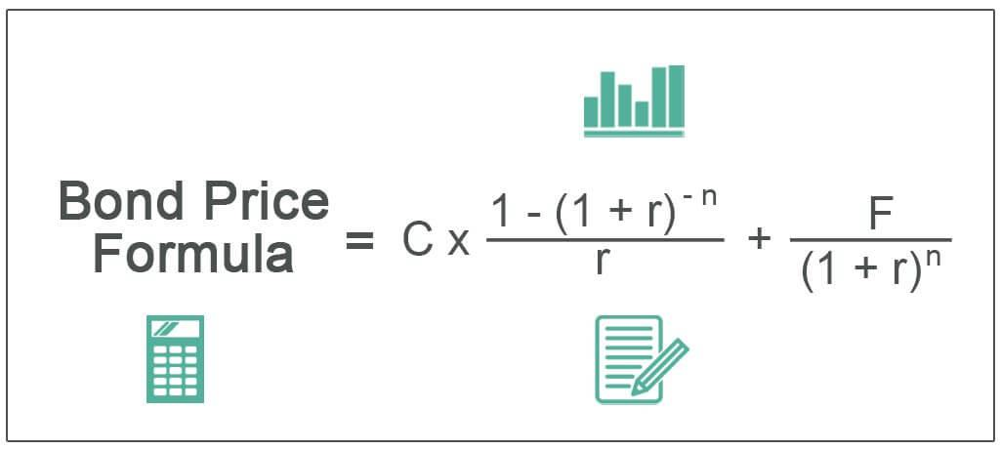

Bond valuation and pricing are integral components of financial markets, playing a crucial role for both investors and issuers. Bonds represent a significant portion of investment portfolios, offering stable returns and diversification benefits. The valuation of bonds involves determining the present value of expected future cash flows, considering critical factors like interest rates, the bond's coupon rate, and the time to maturity. Accurate bond pricing enables investors to make informed decisions regarding purchasing, holding, or selling bonds. 

Understanding the nuances of bond valuation allows investors and issuers to gauge the fair market value of bonds, ensuring that investment decisions align with financial goals and risk tolerance. Key concepts such as face value, bond pricing, and the application of algorithmic trading are essential for both novice and seasoned investors aiming to maximize returns while mitigating risks. 



Algorithmic trading, in particular, has transformed bond markets by utilizing advanced computational models to analyze large datasets, identify price discrepancies, and automate trading strategies. This has increased market efficiency and opened opportunities for capturing arbitrage profits. As financial markets evolve, mastering these elements of bond valuation and pricing becomes increasingly important to remain competitive and optimize investment strategies.

## Table of Contents

## Understanding Bond Valuation

Bond valuation requires calculating the present value of a bond's future cash flows, a process that provides insight into a bond's fair market value. This valuation is crucial in making informed investment decisions, as it indicates whether a bond is overvalued, undervalued, or fairly priced. The core components of bond valuation include the face value, coupon payments, and discount rate, each playing a pivotal role in the valuation process.

1. **Face Value**: The face value, also known as par value, is the amount the bondholder will receive upon the bond's maturity. Typically, bonds have a face value of $1,000, but this can vary. The face value is fundamental in calculating a bond's coupon payments and final redemption value.

2. **Coupon Payments**: These are the periodic interest payments made to the bondholder during the bond's life. Calculated as a percentage of the face value (the coupon rate), these payments are usually made annually or semi-annually. The sum of these future coupon payments contributes significantly to the total cash flows from the bond.

3. **Discount Rate**: The discount rate, often equivalent to the bond's yield to maturity (YTM), is used to calculate the present value of the bond's future cash flows. It reflects the bond's riskiness, prevailing interest rates, and inflation expectations. A higher discount rate indicates a higher perceived risk, thus lowering the present value of the bond's cash flows. The present value (PV) of a bond can be represented mathematically as:
$$
   PV = \sum_{t=1}^{n} \frac{C}{(1 + r)^t} + \frac{F}{(1 + r)^n}

$$

   Where $C$ is the coupon payment, $F$ is the face value, $r$ is the discount rate, and $n$ is the number of periods until maturity.

Different bonds require unique valuation approaches due to their specific characteristics. For example, zero-coupon bonds, which do not make periodic interest payments, are valued by discounting their face value back to the present using the discount rate. Callable bonds, on the other hand, include provisions that allow the issuer to redeem them before maturity, complicating their valuation. Here, factors like the call price and potential call dates must be considered, often necessitating a more complex valuation model or price simulation techniques to account for the additional options embedded in the bond.

Understanding and applying these fundamental concepts allows investors to accurately determine a bond's value, informing strategic decisions in bond pricing and portfolio management. With these insights, investors can better assess and optimize their investment holdings in varying market conditions.

## The Basics of Bond Pricing

Bond pricing is a fundamental process in financial markets that determines the price investors are willing to pay for a bond. This assessment is pivotal, as it influences investment decisions and ensures that bonds are traded at a fair value. Central to bond pricing is the comparison of a bond's yield—a measure of the bond's return on investment—against prevailing market interest rates. When a bond's yield matches the market [interest rate](/wiki/interest-rate-trading-strategies), the bond is usually priced at its face value. However, variations in market interest rates can cause a bond's price to fluctuate. 

For instance, if market interest rates increase, existing bonds with lower yields become less attractive, resulting in a price drop. Conversely, if market interest rates decline, bonds with higher yields become more desirable, which can drive up their price. This dynamic interplay between yield and market rates is a core consideration for investors.

In addition to yield and interest rates, the issuer's creditworthiness significantly impacts bond pricing. Bonds issued by entities with strong credit ratings are perceived as lower risk, often resulting in lower yields compared to those from issuers with poor credit ratings, which need to offer higher yields to attract investors. Macroeconomic conditions also play a critical role; factors such as inflation expectations, economic growth prospects, and monetary policy can all influence interest rates and, consequently, bond prices.

A primary model used in bond pricing calculations is the discounted cash flow (DCF) model. This method involves determining the present value of future coupon payments and the bond's face value at maturity, discounted back at the interest rate that reflects the bond's risk level. The formula for bond pricing using DCF is:

$$
P = \sum_{t=1}^{n} \frac{C}{(1+r)^t} + \frac{F}{(1+r)^n}
$$

where:
- $P$ is the present price of the bond,
- $C$ represents the annual coupon payment,
- $r$ is the discount rate,
- $F$ denotes the face value of the bond,
- $n$ is the time to maturity.

This computation provides a systematic approach to evaluating whether a bond is overvalued or undervalued in the market. By leveraging these foundational concepts, investors can make more informed decisions about buying or selling bonds based on their yield compared to market conditions.

## Face Value and Market Dynamics

The face value, or par value, of a bond represents the amount that will be repaid to the bondholder upon maturity. Usually set at a standard denomination like $1,000, this value is fundamental in calculating the bond's interest payments, known as coupon payments. However, the market value of a bond can fluctuate in response to varying market conditions, leading to a trading price that differs from its face value.

**Market Influences on Bond Prices**

The trading price of a bond is primarily influenced by changes in interest rates and inflation expectations. Within the financial markets, as interest rates rise, the price of existing bonds typically falls. This inverse relationship arises because new bonds are likely to be issued with higher coupon rates, making older bonds with lower rates less attractive. Conversely, when interest rates decline, existing bonds with higher coupon rates become more valuable, leading to an increase in their market prices.

Mathematically, the price of a bond can be expressed using the formula for the present value of its cash flows:

$$

P = \sum_{t=1}^{N} \frac{C}{(1+r)^t} + \frac{F}{(1+r)^N} 
$$

Where:
- $P$ is the price of the bond
- $C$ is the annual coupon payment
- $r$ is the discount rate or yield
- $F$ is the face value of the bond
- $N$ is the number of years until maturity

**The Role of Inflation Expectations**

Inflation is another critical [factor](/wiki/factor-investing) that can affect bond prices. If inflation is expected to rise, the purchasing power of future cash flows (both coupon payments and the principal at maturity) decreases. Investors may then demand a higher yield as compensation, which results in lower bond prices. Conversely, if inflation expectations decrease, bond prices may increase as the purchasing power of their cash flows holds better value in real terms.

**Predicting Bond Price Fluctuations**

Investors can make informed predictions about bond price movements by analyzing interest rates and inflation trends. Tools like yield curves, which show the relationship between interest rates and different maturity dates, provide insights into future rate movements. Moreover, monitoring central bank policies can give additional context regarding how macroeconomic factors (such as inflation) might shift over time.

By understanding face value, market dynamics, and the macroeconomic indicators affecting interest rates and inflation, investors can better anticipate and respond to fluctuations in bond pricing, optimizing their investment strategies.

## Algorithmic Trading in Bond Markets

Algorithmic trading has fundamentally transformed the bond markets by leveraging complex models to automate and execute trades based on predefined criteria. These models are equipped with the ability to swiftly analyze market data, identify patterns, and make decisions that would be infeasible for human traders given the vast [volume](/wiki/volume-trading-strategy) and speed of trading activity.

In bond markets, [algorithmic trading](/wiki/algorithmic-trading) is particularly effective for identifying mispricings and exploiting [arbitrage](/wiki/arbitrage) opportunities. Arbitrage involves the simultaneous purchase and sale of a security in different markets to profit from price discrepancies. Algorithms are adept at detecting such disparities in bond prices, even when the differences are minimal and fleeting, thus optimizing profit margins. This process typically involves sophisticated programming and statistical models that can quickly compute potential gains and execute trades before market conditions change.

Machine learning models play a pivotal role in enhancing predictive analytics for bond pricing. These models are trained on historical market data to identify trends and forecast future price movements. For example, a [machine learning](/wiki/machine-learning) algorithm can be designed to predict interest rate changes based on macroeconomic indicators and historical yield curves, providing traders with insights to make informed decisions.

The implementation of algorithmic strategies in bond markets demands robust computational resources and advanced data analysis capabilities. High-frequency trading systems, for instance, rely on low-latency networks and powerful processors to execute transactions in microseconds. Moreover, algorithms require continuous refinement and monitoring to adapt to evolving market conditions and regulatory environments.

Here’s an example of a simple Python script utilizing libraries like NumPy and pandas for analyzing bond yields:

```python
import numpy as np
import pandas as pd

# Simulated bond data
bond_data = {'bond_id': ['B1', 'B2', 'B3'],
             'price': [102, 98, 105],
             'coupon_rate': [0.03, 0.04, 0.035],
             'maturity_years': [5, 10, 7]}

bonds = pd.DataFrame(bond_data)

# Function to calculate bond yield
def calculate_yield(price, coupon, maturity):
    return (coupon + (100 - price) / maturity) / ((100 + price) / 2)

# Apply yield calculation to each bond
bonds['yield'] = bonds.apply(lambda row: calculate_yield(row['price'], row['coupon_rate']*100, row['maturity_years']), axis=1)

print(bonds)
```

In conclusion, algorithmic trading asserts a significant influence on how bonds are traded. The rapid, data-driven decisions facilitated by algorithms not only improve market efficiency but also present enhanced opportunities for traders to optimize their bond portfolios. As technology continues to advance, the integration of machine learning and algorithmic strategies will further refine and elevate bond trading methodologies.

## Real-World Application: Valuing Bonds Using Python

Python is a widely embraced programming language in finance, known for its ease of use and robust capabilities, making it ideal for automating bond valuation processes. When valuing bonds, the essential task is to calculate the present value of the bond's future cash flows, including periodic coupon payments and the principal repayment at maturity.

To begin, one must understand the formula for calculating the present value of future cash flows:

$$

PV = \sum_{t=1}^{n} \frac{C}{(1 + r)^t} + \frac{F}{(1 + r)^n} 
$$

where:
- $PV$ is the present value of the bond
- $C$ is the coupon payment
- $r$ is the discount rate (yield to maturity)
- $F$ is the face value of the bond
- $n$ is the number of periods until maturity

Python allows for the automation of this calculation through scripts. By using libraries such as NumPy and Pandas, investors can set up automated systems to evaluate bond prices efficiently and accurately. The script can take bond parameters as inputs and output the present value, enabling investors to identify whether a bond is undervalued or overvalued compared with the current market price.

Here's an example of how to perform a bond valuation using Python:

```python
import numpy as np

def bond_valuation(coupon_rate, periods, face_value, market_rate):
    coupon_payment = coupon_rate * face_value
    discount_factors = [(1 + market_rate) ** (-t) for t in range(1, periods + 1)]
    present_value_coupons = np.sum(coupon_payment * np.array(discount_factors))
    present_value_face_value = face_value / ((1 + market_rate) ** periods)
    bond_value = present_value_coupons + present_value_face_value
    return bond_value

# Example usage:
coupon_rate = 0.05
periods = 10
face_value = 1000
market_rate = 0.04

bond_price = bond_valuation(coupon_rate, periods, face_value, market_rate)
print(f"The calculated bond price is: {bond_price}")
```

In this script, `bond_valuation` function calculates the present value of the coupon payments and the face value separately, and then sums them to find the total bond value. 

Such automation aids significantly in quickly assessing bond portfolios, offering the added advantage of real-time analysis. By integrating current market data into these scripts, investors can maintain up-to-date assessments, identify trends and make evidence-based investment decisions.

Practical applications in Python are further enhanced by libraries such as SciPy for optimization or Matplotlib for data visualization, facilitating comprehensive analysis and visualization of bond valuation output. Consequently, Python remains a pivotal tool in modern finance, particularly in streamlining and enhancing the bond valuation process.

## Conclusion

Mastering bond valuation and pricing techniques is essential for making informed investment decisions in today's dynamic financial landscape. These techniques serve as the foundation for assessing the fair value of bonds, enabling investors to make strategic trades and manage risk effectively. A profound understanding of bond valuation and pricing not only allows investors to gauge the intrinsic value of securities but also aids in identifying profitable opportunities in the bond markets.

Algorithmic trading and predictive analytics are revolutionizing how bond portfolios are managed. By leveraging complex models, algorithms enable the rapid execution of trades based on predefined criteria, identifying mispriced securities and arbitrage opportunities. These advanced methods are bolstered by predictive analytics, which harness machine learning and statistical methods to forecast future bond pricing trends. This confluence of technology and finance results in more efficient and responsive strategies, enhancing yields and minimizing risks.

To thrive in an ever-evolving market environment, investors must remain vigilant about macroeconomic trends and technological advancements. Changes in interest rates, inflation expectations, and geopolitical events can significantly impact bond markets, making it critical for investors to adapt and optimize their strategies accordingly. Staying informed about these variables ensures that investors can respond proactively to market shifts.

Additionally, investors need to continually explore and integrate new resources and tools to deepen their understanding of bond markets. This could involve utilizing programming languages such as Python for automating bond valuation processes, applying machine learning techniques for market predictions, or engaging with educational content that elucidates complex financial concepts. As the financial markets grow increasingly sophisticated, harnessing these resources will empower investors to make well-informed decisions, ultimately enhancing their investment outcomes.

## References & Further Reading

[1]: Hull, J. C. (2017). ["Options, Futures, and Other Derivatives"](https://www.semanticscholar.org/paper/Options%2C-Futures%2C-and-Other-Derivatives-Hull/89bdee500c8623864fc9eb7a471546aa713acc44). Pearson Education.

[2]: Fabozzi, F. J. (2012). ["Bond Markets, Analysis, and Strategies"](https://books.google.com/books/about/Bond_Markets_Analysis_and_Strategies_ten.html?id=bQpNEAAAQBAJ). Pearson Education.

[3]: ["Advances in Financial Machine Learning"](https://www.amazon.com/Advances-Financial-Machine-Learning-Marcos/dp/1119482089) by Marcos Lopez de Prado

[4]: ["Algorithmic Trading: Winning Strategies and Their Rationale"](https://www.wiley.com/en-us/Algorithmic+Trading%3A+Winning+Strategies+and+Their+Rationale-p-9781118746912) by Ernie Chan

[5]: ["Quantitative Credit Portfolio Management"](https://onlinelibrary.wiley.com/doi/book/10.1002/9781119202851) by Arik Ben Dor, Lev Dynkin, Jay Hyman, Bruce D. Phelps, and Christof Zeng

[6]: ["Bond Pricing and Portfolio Analysis: Protecting Investors in the Long Run"](https://www.amazon.com/Bond-Pricing-Portfolio-Analysis-Protecting/dp/0262541459) by Olivier de La Grandville