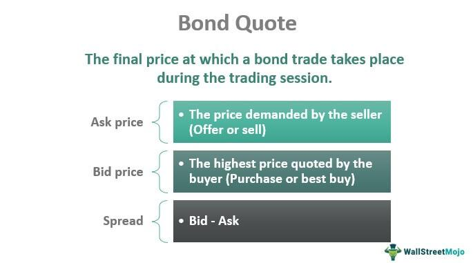

The financial world has witnessed significant changes with the emergence of bond trading as a prominent segment. Bonds, as debt securities, have become a crucial component of modern financial markets, offering investors various avenues to maximize returns while safeguarding against risks. Unlike equities, bond investments typically provide a more predictable income stream, attracting both conservative and dynamic investors seeking diversification in their portfolios.

Algorithmic trading, often referred to as 'algo trading', has revolutionized the investment landscape, bringing profound changes, especially within the bond market. This technology-driven approach utilizes computer algorithms to execute trades at speeds and frequencies that are impossible for human traders, opening new opportunities for precise and efficient market participation. Consequently, algorithmic trading has enhanced liquidity, reduced transaction costs, and facilitated sophisticated trading strategies, marking a significant evolution in how traders interact with financial markets.



This article explores the intersection of bond trading, financial markets, investors, and algorithmic trading. By understanding how these elements integrate, investors can effectively navigate the complexities of today's trading environment and harness the potential for optimized investment strategies. The convergence of traditional bond trading and cutting-edge algorithmic techniques shapes the contemporary trading landscape and is paramount for developing competitive strategies in an ever-evolving financial sector. Recognizing these dynamics aids investors in effectively capitalizing on market opportunities and minimizing associated risks.

## Table of Contents

## The Fundamentals of Bond Trading

Bond trading involves the buying and selling of debt securities, primarily corporate or government bonds. These securities are interest-bearing instruments issued by entities to raise capital, and they obligate the issuer to pay the bondholder a specified sum of money at regular intervals and return the principal at maturity. Investors engage in bond trading to maximize returns through interest payments or by capitalizing on price fluctuations in the market.

### Bond Market Influences

The bond market is influenced by several key factors, notably interest rates, economic indicators, and demographic trends. Interest rates play a critical role as they inversely affect bond prices; when interest rates rise, existing bond prices typically fall, and vice versa. This inverse relationship is fundamental to understanding bond pricing dynamics. For example, the price $P$ of a bond can be expressed as:

$$
P = \frac{C}{(1 + r)^1} + \frac{C}{(1 + r)^2} + \cdots + \frac{C + F}{(1 + r)^n}
$$

where $C$ is the coupon payment, $r$ is the discount rate, and $F$ is the face value of the bond.

Economic indicators, such as Gross Domestic Product (GDP) growth rates, inflation, and employment figures, also impact bond markets. Strong economic growth can lead to higher interest rates, thus affecting bond prices negatively, while high inflation may erode the real returns on bonds. Demographic trends, such as an aging population, can lead to increased demand for bonds as these investors seek stable income streams, thus impacting overall market demand and pricing.

### Characteristics of Bonds vs. Stocks

Compared to stocks, bonds typically exhibit less [volatility](/wiki/volatility-trading-strategies), offering a steadier income stream, which is especially attractive to risk-averse investors. The relatively predictable nature of bond interest payments provides a level of certainty in cash flows that is generally not available with equity investments. This steady income is largely due to predetermined coupon payments made by the issuer to the bondholder.

### Trading Strategies

Strategies in bond trading often focus on [interest rate](/wiki/interest-rate-trading-strategies) forecasts and predictions of economic growth. Investors may develop interest rate models to forecast future rate movements and subsequently adjust their bond portfolios to maximize returns. Such strategies can include yield curve analysis, duration management, and credit analysis.

For instance, yield curve trading involves analyzing the graphical representation of interest rates across different maturities. Traders may capitalize on anticipated changes in the slope and shape of the yield curve, positioning themselves to benefit from sweeping rate changes.

In summary, bond trading forms a crucial part of the financial markets, offering a blend of stability through income and potential capital gains through strategic forecasting. Understanding the influences and characteristics of bonds compared to equities equips investors with the tools they need to optimize their portfolios.

## Impact of Financial Markets on Bond Trading

The health of financial markets plays a crucial role in shaping bond trading activities, primarily through its influence on investor confidence and market [liquidity](/wiki/liquidity-risk-premium). When financial markets are stable and prosperous, bond trading tends to flourish due to increased investor optimism and the availability of capital. Conversely, market instability can lead to decreased bond trading activity as investors become cautious and liquidity constraints arise.

Market dynamics significantly impact bond prices and yields, with fluctuations influenced by various economic conditions such as recessions, economic booms, and changes in interest rates. During a recession, bond prices often increase as investors seek the safety of fixed-income securities, resulting in declining yields. Conversely, in economic booms, investors might shift their focus to equities, causing bond prices to fall and yields to rise. Furthermore, central banks may alter interest rates in response to economic conditions, directly affecting bond yields. For instance, a rise in interest rates typically leads to a decline in bond prices as newly issued bonds offer higher coupons, making older bonds less attractive.

Global events, including geopolitical tensions and economic crises, can drive significant market movements, leading to increased trading volumes as investors react to perceived risks and uncertainties. During such events, the demand for bonds, particularly those considered safe havens like U.S. Treasury securities, might surge, affecting their prices and yields. Conversely, positive geopolitical developments can boost investor confidence, potentially reducing the demand for safe-haven bonds.

Investors meticulously monitor market data and central bank policies to guide their bond trading decisions. Economic indicators such as GDP growth, inflation rates, and employment figures provide insights into the broader economic environment, affecting expectations for future interest rate movements. Central banks, particularly through their monetary policy stances, exert substantial influence over bond markets. Traders analyze central bank communications and policy changes to anticipate potential shifts in interest rates and adjust their bond portfolios accordingly.

In conclusion, the intricate interplay between financial markets and bond trading underscores the importance of maintaining robust market structures to support investor confidence and liquidity. A comprehensive understanding of economic indicators and central bank actions enables investors to navigate this complex landscape effectively, optimizing their bond trading strategies to adjust to changing market conditions.

## Tech Advancements: Rise of Algorithmic Trading

Algorithmic trading involves the use of complex computer algorithms to execute trades automatically based on pre-defined strategies. This approach to trading has revolutionized the financial markets by enhancing the efficiency and accuracy with which transactions are conducted. At the core of [algorithmic trading](/wiki/algorithmic-trading) is the ability to process and analyze vast amounts of market data at speeds far beyond human capability.

One of the primary advantages of algorithmic trading is its capacity to execute large orders without significant impact on market prices. Traditional trading methods often struggle with large transactions, which can drastically alter the market dynamics. However, by employing algorithms, these trades can be broken down into smaller, strategically timed orders that minimize market disruption.

Algorithmic trading also provides unmatched speed and precision. The algorithms can quickly react to market conditions and execute trades in fractions of a second, ensuring that they capitalize on opportunities that arise. This precision is vital in fast-paced markets where milliseconds can make a substantial difference in profitability.

Moreover, algorithms are equipped to automate a variety of trading strategies, ranging from simple executions to more complex ones like [arbitrage](/wiki/arbitrage) and market-making. Arbitrage involves simultaneously buying and selling an asset in different markets to exploit price differences. An example of a simple arbitrage strategy could be defined in Python:

```python
def arbitrage_opportunity(price_a, price_b, transaction_cost):
    if price_a + transaction_cost < price_b:
        # Opportunity to buy in market A and sell in market B
        return "Buy A, Sell B"
    elif price_b + transaction_cost < price_a:
        # Opportunity to buy in market B and sell in market A
        return "Buy B, Sell A"
    else:
        return "No Arbitrage Opportunity"

# Example use:
arbitrage_opportunity(100, 105, 2)
```

Market making, another strategy powered by algorithms, involves providing liquidity to the market by continuously quoting both buy and sell prices for a particular asset, thereby profiting from the spread.

The advancements in algorithmic trading are driven by its ability to harness and process large datasets, enabling traders to develop and refine strategies based on extensive historical and real-time data. This technological leap has not only increased trade execution speed but has also improved market liquidity and price accuracy, providing a more stable and efficient market environment for all participants.

In summary, algorithmic trading stands at the forefront of financial technology innovation, offering unparalleled efficiency, speed, and strategic automation that are reshaping the landscape of trading.

## Investor Advantages in Algorithmic Bond Trading

Algorithmic trading in bond markets has revolutionized how investors execute trades, significantly enhancing efficiency and market liquidity. The application of algorithmic strategies allows traders to execute large-[volume](/wiki/volume-trading-strategy) orders with precision and speed, avoiding the market disturbances often associated with manual trading. This methodology leverages sophisticated algorithms capable of processing vast amounts of market data in real-time, thus ensuring the swift execution of trades and optimization of trading strategies.

One primary advantage of algorithmic bond trading for investors is the ability to exploit price discrepancies. Algorithms, equipped with advanced technologies, can scan numerous markets simultaneously to identify arbitrage opportunities. By capitalizing on tiny price differences between markets, traders can gain profits that are often negligible in manual trading scenarios. This high-frequency trading capability is particularly beneficial in the bond market, where pricing can be influenced by minute fluctuations in interest rates and economic indicators.

Both retail and institutional investors reap significant benefits from the efficiency gains provided by algorithmic trading. One such benefit is the reduction in transaction costs. Traditional trading incurs various costs, such as broker fees and market impact costs. However, with algorithmic trading, the automation of order execution minimizes these expenses, allowing investors to enhance their returns. Furthermore, the precision of algorithms in order execution ensures that trades are executed at the most favorable prices, further reducing costs.

Algorithmic trading also facilitates enhanced trading strategies through the integration of [artificial intelligence](/wiki/ai-artificial-intelligence) (AI) and [machine learning](/wiki/machine-learning) (ML). These technologies enable the analysis and interpretation of large datasets to forecast market trends and make informed trading decisions. AI and ML algorithms can learn from historical data to predict future market movements, providing traders with a competitive advantage. This predictive capability is vital in the bond market, where market conditions can rapidly change due to economic, political, or social factors.

Incorporating AI and ML into trading strategies allows investors to optimize their portfolios by making data-driven decisions. For instance, machine learning models can identify patterns in bond price movements, helping investors to adjust their positions accordingly. Moreover, AI systems can continuously evolve by learning from new data inputs, thereby improving the accuracy of market predictions over time.

Overall, algorithmic bond trading offers a robust framework for enhancing trade execution and portfolio management. By leveraging technology, investors can not only minimize costs but also gain an edge in predicting market trends, resulting in improved investment outcomes. As technology continues to evolve, the advantages of automated trading are expected to expand, offering further opportunities for investors in the bond market.

## Challenges and Risks in Bond Algo Trading

Algorithmic trading in bond markets, often referred to as "algo trading," introduces several challenges and risks that market participants must navigate. One of the primary concerns is the dependency on market conditions, which can significantly influence algorithmic performance. Changes in interest rates, liquidity, and price volatility can affect the effectiveness of algorithmic trading strategies. An algorithm optimized for stable market conditions may perform poorly under conditions of high volatility, leading to unexpected trading losses.

Technical failures present another considerable risk in algorithmic bond trading. As operations are deeply reliant on technology, any system glitch or malfunction can lead to incorrect execution of trades or an inability to execute trades at all. These technical failures can stem from software bugs, hardware malfunctions, or connectivity issues. Ensuring the algorithms operate correctly requires rigorous testing and regular maintenance of the trading infrastructure. This involves employing robust validation processes to verify algorithmic accuracy, as well as implementing fail-safes to minimize disruptions.

The high-speed nature of algorithmic trading can exacerbate existing market volatility and liquidity risks. In a high-frequency trading environment, algorithms react to market stimuli in fractions of a second, potentially leading to rapid, wide-ranging fluctuations in bond prices. This speed can amplify market moves, increasing the likelihood of slippage, where trades are executed at less favorable prices than intended. Additionally, during periods of market stress or unexpectedly high trading volumes, liquidity can dry up, resulting in higher transaction costs or inability to [exit](/wiki/exit-strategy) positions swiftly.

Regulatory compliance remains a critical challenge for algorithmic trading in bonds. Traders must adhere to a complex set of regulations designed to promote market transparency, integrity, and prevent systemic risks. These regulations can vary significantly across jurisdictions, requiring careful navigation and adaptation by trading firms. Failure to comply can result in significant financial penalties and reputational damage.

Cybersecurity threats pose an additional risk associated with algorithmic bond trading. The digital nature of trading systems makes them susceptible to cyber-attacks, which can lead to data breaches, unauthorized trade executions, and system outages. Implementing robust cybersecurity measures is essential to protect sensitive data and secure trading operations.

To mitigate these challenges and risks, traders must ensure that their algorithms are robust and their risk management strategies comprehensive. This involves developing adaptive algorithms that can adjust to varying market conditions, extensive [backtesting](/wiki/backtesting) to evaluate algorithmic strategies under different scenarios, and implementing circuit breakers to halt trading during extreme market conditions. Integrating cybersecurity protocols and maintaining compliance with regulatory standards are also vital strategies for managing risks in algorithmic bond trading.

## The Regulatory Landscape

Global regulators have established comprehensive frameworks to oversee algorithmic trading activities, ensuring they align with financial market integrity and stability. These frameworks aim to mitigate systemic risks while ensuring fairness and transparency in trading operations.

One of the critical aspects of these regulations is the focus on market transparency. Regulators require trading activities to be transparent, allowing for the accurate monitoring and assessment of market conduct. This involves strict transaction reporting requirements, where all executed trades must be documented and made available for regulatory scrutiny. For instance, the European Union's Markets in Financial Instruments Directive II (MiFID II) mandates extensive trade reporting obligations and improved transparency in pre- and post-trade data.

Error prevention mechanisms also play a significant role in regulatory frameworks, aiming to prevent trading anomalies that could disrupt market stability. This includes implementing circuit breakers and kill switches to halt trading operations in case of technical failures or significant market disruptions. For algorithmic trading, secure and robust systems are mandatory to prevent unauthorized access or malfunction that could lead to erroneous trades.

Compliance with these regulatory standards is crucial for minimizing systemic risks. Systemic risks can arise from excessive market exposure or high-frequency trading strategies that amplify market movements during volatile periods. Regulators often require algorithmic trading systems to undergo rigorous testing and validation before deployment to ensure they can handle varied market conditions without contributing to systemic instability.

Both investors and trading platforms are responsible for adhering to these rules to maintain market integrity. For trading platforms, this often involves implementing comprehensive risk management controls and ensuring their technology infrastructure is resilient and secure. Investors must ensure their trading strategies comply with regulatory standards, including maintaining audit trails and engaging in periodic reviews of their algorithmic models to align with evolving regulations.

Globally, regulations also emphasize the importance of cybersecurity measures to safeguard trading systems against cyber threats. As algorithmic trading increasingly relies on digital platforms, the potential for cyberattacks poses a significant risk, necessitating robust cybersecurity protocols as part of compliance requirements.

In conclusion, understanding and complying with the regulatory landscape is essential for participants in algorithmic bond trading. These regulations are designed to uphold the integrity and stability of financial markets, fostering an environment where algorithmic trading can thrive responsibly and securely.

## Future Trends in Bond Trading and Algo Trading

The future of bond trading and algorithmic trading is poised for transformative changes driven by the integration of emerging technologies like blockchain, artificial intelligence (AI), and machine learning (ML). These innovations are expected to enhance the efficiency, security, and sophistication of trading platforms, enabling a new era of market dynamics and participation.

The integration of blockchain technology could revolutionize bond trading practices by providing a transparent, immutable, and decentralized ledger system. Blockchain can enhance the settlement process, reducing the time and cost associated with traditional systems through automation and smart contracts. By enabling peer-to-peer transactions and reducing reliance on intermediaries, blockchain could increase market efficiency and accessibility. A study by Deloitte in 2019 highlighted that blockchain's potential to streamline back-office processes could result in substantial cost savings for financial institutions [1].

Future trading platforms are anticipated to offer enhanced data processing capabilities and user-friendliness. As data volumes grow, the ability to quickly and accurately analyze vast datasets becomes paramount. Modern platforms are integrating advanced data analytics and visualization tools to empower traders with insightful decision-making capabilities. This is particularly significant for retail investors, who can benefit from intuitive interfaces and robust analytical tools without needing extensive technical expertise.

AI and ML are becoming integral to driving trading strategies by providing predictive analytics and automated decision-making processes. Algorithms trained on historical data can identify patterns, predict market trends, and execute trades with precision. The use of [reinforcement learning](/wiki/reinforcement-learning), a subset of machine learning, allows algorithms to improve over time by learning from the outcomes of past trades. For instance, an algorithm may be used to continually optimize a bond portfolio's allocation to maximize returns based on predicted interest rate changes.

Here is an example in Python of how AI can be applied to predict bond prices using historical data:

```python
import pandas as pd
from sklearn.model_selection import train_test_split
from sklearn.ensemble import RandomForestRegressor
from sklearn.metrics import mean_squared_error

# Load historical bond price data
data = pd.read_csv('bond_prices.csv')
X = data.drop('Price', axis=1)
y = data['Price']

# Split the data into training and testing sets
X_train, X_test, y_train, y_test = train_test_split(X, y, test_size=0.2, random_state=42)

# Train a Random Forest Regressor
model = RandomForestRegressor(n_estimators=100, random_state=42)
model.fit(X_train, y_train)

# Predict and evaluate the model
predictions = model.predict(X_test)
mse = mean_squared_error(y_test, predictions)
print(f'Mean Squared Error: {mse}')
```

Technological advancements will undoubtedly open new avenues for market participation and efficiency. For instance, firms are exploring the use of quantum computing to solve complex optimization problems in real-time, further pushing the boundaries of what's possible in bond trading. As technology continues to evolve, market participants who embrace these changes are likely to gain a competitive edge, navigating the complexities of modern markets with greater confidence and efficacy.

[1] Deloitte. (2019). Blockchain and the future of finance. [Link to the study or PDF here].

## Conclusion

The convergence of bond trading, financial markets, and algorithmic trading represents a fundamental shift in how investment strategies are crafted and executed. Understanding each component's intricate aspects can significantly enhance an investor's strategic approach. In today's dynamic market environment, leveraging the synergy of these elements allows investors to navigate complex scenarios and capitalize on emerging opportunities. 

Algorithmic trading, with its blend of technology and finance, offers remarkable advantages in executing trades with precision and speed. It reduces transaction costs and expands possibilities for investment strategies. Simultaneously, awareness of the broader financial market environment, including interest rates, economic indicators, and geopolitical events, remains crucial for informed decision-making. By harmonizing these insights with advanced trading algorithms, investors stand to gain a competitive edge.

Furthermore, remaining informed about new technological advancements and regulatory changes ensures that investors maintain agility in their strategies. As the landscape of bond trading continues to evolve with innovations such as machine learning and blockchain, the capacity to adapt and integrate these tools will distinguish successful market participants from others.

Sustained success in bond trading requires a commitment to ongoing learning and adaptation, reflecting both the complexity and the potential of the modern financial market. Investors who prioritize these principles are well-positioned to thrive amid the challenges and opportunities of contemporary bond trading.

## References & Further Reading

[1]: Bergstra, J., Bardenet, R., Bengio, Y., & Kégl, B. (2011). ["Algorithms for Hyper-Parameter Optimization."](https://proceedings.neurips.cc/paper/2011/file/86e8f7ab32cfd12577bc2619bc635690-Paper.pdf) Advances in Neural Information Processing Systems 24.

[2]: ["Advances in Financial Machine Learning"](https://www.amazon.com/Advances-Financial-Machine-Learning-Marcos/dp/1119482089) by Marcos Lopez de Prado

[3]: ["Evidence-Based Technical Analysis: Applying the Scientific Method and Statistical Inference to Trading Signals"](https://www.amazon.com/Evidence-Based-Technical-Analysis-Scientific-Statistical/dp/0470008741) by David Aronson

[4]: ["Machine Learning for Algorithmic Trading"](https://github.com/PacktPublishing/Machine-Learning-for-Algorithmic-Trading-Second-Edition) by Stefan Jansen

[5]: ["Quantitative Trading: How to Build Your Own Algorithmic Trading Business"](https://www.amazon.com/Quantitative-Trading-Build-Algorithmic-Business/dp/1119800064) by Ernest P. Chan

[6]: Deloitte. (2019). ["Blockchain and the future of finance."](https://www2.deloitte.com/us/en/pages/consulting/articles/future-of-blockchain.html) Deloitte Insights.

[7]: Hasbrouck, J., & Saar, G. (2009). ["Technology and Liquidity Provision: The Blurring of Traditional Definitions."](https://www.sciencedirect.com/science/article/pii/S1386418108000220) Journal of Financial Markets, 12(2), 143-172.

[8]: Aldridge, I. (2013). ["High-Frequency Trading: A Practical Guide to Algorithmic Strategies and Trading Systems"](https://books.google.com/books/about/High_Frequency_Trading.html?id=8QpIsVUMhmEC), 2nd Edition. Wiley Trading Series.