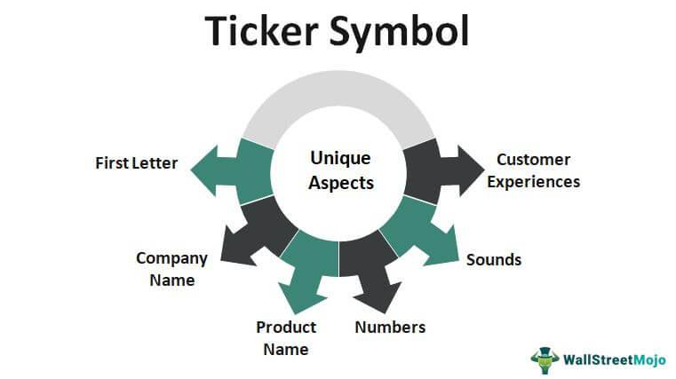

The stock market represents one of the most intricate and vigorous financial systems globally, where companies raise capital and investors seek returns. At its core, this ecosystem facilitates the exchange of millions of shares daily, driven by the interests and strategies of a diverse group of investors. Among the fundamental elements that enable the smooth operation of this market are stock market symbols, commonly referred to as ticker symbols. Despite their understated presence in the financial narrative, these symbols play a pivotal role in simplifying the identification and trading of securities.

Ticker symbols serve as shorthand representations for publicly traded companies, significantly streamlining communication and transaction processes in the stock market. Their universal adoption and standardized format allow traders and investors from different regions and backgrounds to uniformly identify and discuss specific securities without ambiguity.



While the presence of ticker symbols is a constant in the financial world, these symbols are subject to change due to a variety of catalysts. Corporate actions such as mergers and acquisitions, as well as rebranding efforts resulting in company name changes, can necessitate the update of a company's ticker symbol. Additionally, delisting from a major exchange might lead to the assignment of a new ticker when a stock begins trading in over-the-counter markets.

The fluid nature of ticker symbols introduces specific challenges, particularly for algorithmic trading systems which heavily rely on these identifiers to execute trades efficiently and accurately. Consequently, understanding ticker symbols, the reasons behind their transformations, and their subsequent effects on algorithmic trading is essential for market participants aiming to navigate this dynamic and complex financial ecosystem effectively.

## Table of Contents

## Understanding Stock Ticker Symbols

A stock ticker symbol is a unique identifier composed of letters assigned to a publicly traded company on a stock exchange. This system of representation allows for efficient communication, identification, and transaction processing in the stock market. Ticker symbols play an essential role in the daily operations of traders and investors, as they provide a shorthand reference to companies, facilitating easy access to trading data.

The concept of ticker symbols was significantly standardized by organizations such as Standard & Poor's, which aimed to create a cohesive system for identifying publicly traded equities. This standardization is crucial in maintaining order and ensuring that stocks can be easily and accurately referenced across various platforms and by different market participants.

It’s important to note that ticker symbols can vary depending on the exchange where a company is listed. In the United States, two prominent stock exchanges, the New York Stock Exchange (NYSE) and the Nasdaq Stock Market, utilize different conventions for ticker symbols:

1. **NYSE**: On the NYSE, companies are typically assigned ticker symbols consisting of one to three letters. This shorter format is a legacy of the exchange's longer history and traditional methods of trading, which necessitated more concise symbols.

2. **Nasdaq**: In contrast, companies listed on the Nasdaq are usually given ticker symbols that have four letters. The Nasdaq's electronic trading model and its focus on technology and innovation are reflected in its distinct naming conventions.

These variations underscore the importance of ticker symbols as a tool for operational efficiency across different trading environments. By adhering to exchange-specific guidelines, ticker symbols help ensure that traders and investors can quickly execute transactions with minimal confusion or error.

Additionally, the uniqueness of ticker symbols helps differentiate companies in instances where corporate names might be similar, thereby minimizing potential operational mishaps in the trading process. As trading technologies evolve, the functionality and significance of ticker symbols remain a fundamental aspect of stock market operations.

## Reasons for Ticker Symbol Changes

Ticker symbols serve as unique identifiers for publicly traded companies and can undergo changes for various corporate reasons. One primary cause for a ticker symbol change is a corporate action such as a merger or acquisition. During a merger, one company might acquire another, resulting in the consolidation of both entities into a new or existing company. Consequently, the acquired company’s ticker might be updated to reflect the new corporate entity. For example, if Company A (with ticker AAA) merges with Company B (with ticker BBB), and the new entity is named Company AB, the ticker might change to ABB.

Name changes are another reason for ticker updates. Companies often rebrand to better align with their evolving business focus or strategic direction. When a company changes its name, it typically updates its ticker symbol to reflect the new branding. This ensures consistency across its public identity and helps maintain brand recognition in the stock market.

Delistings also lead to changes in ticker symbols. When a company is removed from a major stock exchange, such as the NYSE or NASDAQ, its symbol may change, especially if the stock transitions to being traded on over-the-counter (OTC) markets. In such cases, the ticker symbol might be altered to distinguish the now OTC-traded stock from its former exchange-listed status, helping investors recognize the different trading conditions and regulations applied to it.

## Impact of Ticker Changes on Algo Trading

Algorithmic trading systems depend heavily on ticker symbols as the backbone for executing trades efficiently and accurately within the stock market. These systems are engineered to interact with market data feeds, perform real-time analytics, and execute trades with minimal human intervention. As such, an accurate and up-to-date database of ticker symbols is critical for their functioning.

A change in a ticker symbol mandates an immediate update within an [algorithmic trading](/wiki/algorithmic-trading) system’s database. For example, consider an algorithm designed to trade shares of a company with a ticker symbol 'XYZ'. If the company undergoes a merger and the symbol changes to 'XYZA', failing to update the algorithm might lead the system to use outdated data, which could result in trading errors or even financial losses.

Timeliness in updating ticker symbol details is crucial to prevent trading mishaps, such as the execution of trades on incorrect securities. For instance, if the algorithm attempts to trade using the old ticker symbol, it may inadvertently trade a different company's shares or execute no trade at all. This highlights the importance of real-time updates and alerts within trading platforms. 

A typical algorithm trading system might look like this in Python:

```python
def update_ticker(database, old_symbol, new_symbol):
    """Updates the ticker symbol in the trading database."""
    if old_symbol in database:
        database[new_symbol] = database.pop(old_symbol)
    else:
        raise KeyError("Old ticker symbol not found in database.")

# Example usage
trading_database = {'XYZ': {'price': 100, 'volume': 1000}}
update_ticker(trading_database, 'XYZ', 'XYZA')
```

In this example, once an update is made, the system continues to trade with the new symbol, avoiding errors associated with outdated information. Proper redundancies should be in place to alert traders to any discrepancies immediately, ensuring algorithms respond to changes adeptly. Ultimately, these updates must be seamless and integrated into the software design to maintain trading accuracy and efficiency.

## Practical Steps for Traders When Ticker Symbols Change

Traders generally do not need to take manual action when ticker symbols change, as most modern trading platforms are equipped to handle updates automatically. These platforms are designed to recognize and reflect changes in ticker symbols seamlessly, allowing traders to focus more on their investment strategies rather than administrative updates. However, traders should remain vigilant and informed about potential corporate announcements, such as mergers or name changes, that could result in ticker symbol alterations. 

It's important for traders to routinely monitor official communications from the companies in which they invest, as well as announcements from stock exchanges, to anticipate ticker symbol changes. Being proactive in this manner ensures they are not caught off guard by unexpected changes, which could briefly disrupt their trading activities or affect their investment analyses.

For developers and operators of algorithmic trading systems, it is crucial to implement robust procedures to accommodate ticker symbol changes. This includes programming automatic updates for ticker symbol changes within their databases and algorithms. An effective way to manage this is by employing real-time data feeds and APIs provided by exchanges and financial data providers, which are programmed to notify systems of any ticker symbol updates.

In addition, algorithmic trading systems should incorporate safeguards that pause operations if a discrepancy in symbols is detected. For instance, an algorithm could be written to halt trading and send an alert if an attempt is made to execute a trade with an unrecognized or mismatched ticker symbol. Here is a simplified example of such logic implemented in Python:

```python
class AlgoTradingSystem:
    def __init__(self):
        self.ticker_database = self.load_ticker_data()

    def load_ticker_data(self):
        # Load current ticker data from an API or database
        return {"AAPL": "Apple Inc.", "TSLA": "Tesla Inc."}

    def update_ticker_data(self, new_ticker, company_name):
        self.ticker_database[new_ticker] = company_name

    def execute_trade(self, ticker_symbol):
        try:
            company = self.ticker_database[ticker_symbol]
            print(f"Executing trade for {company}")
        except KeyError:
            print("Alert: Ticker symbol not recognized, halting trade execution.")
            # Send notification to update ticker database

# Use case
trading_system = AlgoTradingSystem()
trading_system.execute_trade("TSLA")  # Executes successfully
trading_system.execute_trade("XYZ")   # Halts due to unrecognized ticker
```

Here, the algorithmic system automatically handles recognized tickers and provides a mechanism to alert traders or operators when a ticker update is required. By having a comprehensive strategy in place for managing ticker symbol changes, traders and developers can preserve the efficiency and accuracy of their trading operations, minimizing the risk of errors and maintaining a competitive edge in the market.

## Conclusion

Ticker symbols are indispensable in the stock market, serving as the primary identifiers for securities. These alphanumeric codes are vital for ensuring clarity and precision in financial markets. Understanding the reasons behind ticker changes helps investors and traders adapt to evolving market conditions. Companies may update their ticker symbols for various strategic reasons, such as mergers, acquisitions, or rebranding efforts. Awareness of these changes empowers investors and traders to make informed decisions and align their trading strategies accordingly.

For those involved in algorithmic (algo) trading, being ready for ticker symbol changes is crucial to maintaining effective and error-free trading operations. Algo traders rely heavily on data feeds and need to ensure their systems are consistently up-to-date to prevent trading inaccuracies. Updating ticker symbols in an algorithm’s code is essential for accurate data analysis and trade execution. Algo trading systems must be designed to handle such changes efficiently without human intervention, using automated update processes to minimize the risk of errors. By proactively managing ticker symbol updates, traders can maintain the integrity of their trading strategies and ensure continuous market engagement.

## References & Further Reading

[1]: ["Handbook of Corporate Actions"](https://www.oreilly.com/library/view/handbook-of-investment/9780470033623/13_chapter-05.html) by Sonia Solera

[2]: ["Mergers, Acquisitions, and Other Restructuring Activities: An Integrated Approach to Process, Tools, Cases, and Solutions"](https://www.sciencedirect.com/book/9780128016091/mergers-acquisitions-and-other-restructuring-activities) by Donald DePamphilis

[3]: ["Quantitative Finance for Dummies"](https://www.amazon.com/Quantitative-Finance-Dummies-Steve-DPhil/dp/1118769465) by Steve Bell

[4]: ["Algorithmic Trading & DMA: An introduction to direct access trading strategies"](https://www.amazon.com/Algorithmic-Trading-DMA-introduction-strategies/dp/0956399207) by Barry Johnson

[5]: ["Trading and Exchanges: Market Microstructure for Practitioners"](https://archive.org/details/tradingexchanges0000harr) by Larry Harris