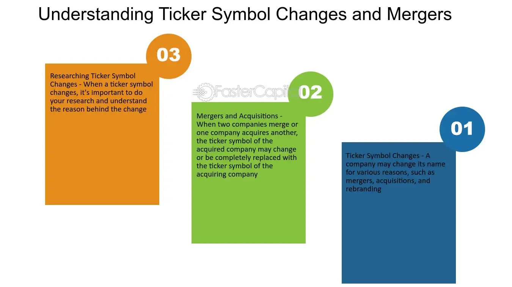

## Table of Contents

## What is a stock ticker symbol?

A stock ticker symbol is a short, unique set of letters used to represent a company's stock on a stock exchange. It's like a nickname for the company's stock that makes it easy to find and trade. For example, if you want to buy shares of Apple, you would look for the ticker symbol "AAPL" on the stock market.

These symbols are important because they help keep track of stock prices and trades in a simple way. Each stock exchange has its own list of ticker symbols, and they can be different from one exchange to another. This system makes it easier for investors to quickly identify and monitor the stocks they are interested in.

## Why do companies change their stock ticker symbols?

Companies change their stock ticker symbols for a few main reasons. One big reason is when a company changes its name or goes through a big change, like merging with another company. For example, if a company called "OldCo" merges with "NewCo" and decides to call itself "NewCo," it might want to change its ticker symbol to match the new name. This helps keep things clear for investors and makes it easier for them to find the company's stock.

Another reason is to make the stock more appealing or easier to remember. Sometimes, a company might pick a new ticker symbol that is shorter or more catchy. This can help the company stand out more in the stock market. For instance, if a company's old ticker symbol was hard to remember, like "XYZPDQ," it might change it to something simpler, like "XYZ," to make it easier for people to find and trade its stock.

## How does a company decide on a new ticker symbol?

When a company wants to pick a new ticker symbol, it usually starts by thinking about what would be easy for people to remember. They might choose letters that are part of their new name or something that stands for what they do. For example, if a company that makes cars changes its name to "Speedy Motors," it might pick "SPD" as its new ticker symbol because it's short and people can easily connect it to the company.

The company also has to check with the stock exchange to make sure the new ticker symbol isn't already being used by another company. The stock exchange has rules about what can and can't be used as a ticker symbol, so the company has to follow those rules. Once they find a symbol that works and isn't taken, they can ask the stock exchange to approve it. After getting approval, the company can start using the new ticker symbol, and investors will see it when they look up the stock.

## What are the common reasons for a ticker symbol change due to mergers or acquisitions?

When companies merge or one company buys another, they often change their ticker symbol. This happens because the company's name usually changes after a merger or acquisition. For example, if "Big Company" buys "Small Company" and decides to call itself "Bigger Company," it might want a new ticker symbol to match its new name. This helps everyone know that the company has changed and makes it easier for investors to find the stock.

Another reason for changing the ticker symbol after a merger or acquisition is to show that the company is starting fresh. The new ticker symbol can represent the new direction or goals of the combined company. It's like getting a new name tag that tells everyone, "We're different now." This can be important for making the stock more interesting to investors and helping them understand the changes in the company.

## Can a ticker symbol change affect a company's stock price?

A ticker symbol change can affect a company's stock price, but it's usually not the main reason for any big changes. When a company changes its ticker symbol, it often happens because of a big event like a merger or a name change. These events can make investors think differently about the company, which might cause the stock price to go up or down. For example, if investors think the merger will make the company stronger, the stock price might go up. But if they think it's a bad idea, the price might go down.

The actual change of the ticker symbol itself doesn't usually cause the stock price to change a lot. It's more about what the change means to investors. If the new ticker symbol is easier to remember or more appealing, it might make the stock a bit more popular. But the big changes in the stock price usually come from the reasons behind the ticker symbol change, like the success or failure of a merger or acquisition. So, while a ticker symbol change can have some effect, it's the bigger events that really move the stock price.

## What is the process for changing a stock ticker symbol?

When a company wants to change its stock ticker symbol, it starts by deciding on a new symbol that fits its new name or what it does. They have to make sure the new symbol is easy to remember and not already used by another company. The company then talks to the stock exchange where its stock is listed. They need to ask the stock exchange if they can use the new symbol. The stock exchange checks to see if the new symbol follows their rules and if it's available.

Once the stock exchange approves the new ticker symbol, the company can start using it. They let everyone know about the change through news announcements and updates on their website. Investors will see the new symbol when they look up the stock on the stock exchange. The whole process can take a few weeks, and during this time, the company makes sure everyone knows about the change so there's no confusion.

## How do regulatory bodies influence ticker symbol changes?

Regulatory bodies like the Securities and Exchange Commission (SEC) and stock exchanges have a big say in ticker symbol changes. They make sure the new symbol follows all the rules and isn't already used by another company. The company has to ask the stock exchange for permission to use the new symbol. The stock exchange checks the new symbol to make sure it's okay and then gives the go-ahead if everything is good.

Once the regulatory body approves the new ticker symbol, the company can start using it. They have to tell everyone about the change through announcements and updates on their website. This helps investors know about the new symbol so they can find the stock easily. The whole process makes sure that the change is done in a way that's fair and clear for everyone involved.

## What are the financial implications of changing a ticker symbol?

Changing a ticker symbol can have some financial effects on a company, but they are usually small compared to other things that can happen. The main cost comes from telling everyone about the change. The company has to pay for announcements and updates on their website to make sure investors know about the new symbol. This can cost some money, but it's not usually a big deal for the company's finances.

The bigger financial impact often comes from the reason behind the ticker symbol change, like a merger or a name change. These events can make the stock price go up or down, depending on what investors think about them. If investors like the changes, the stock price might go up. But if they don't, it might go down. So, while the ticker symbol change itself doesn't cost much, the events that cause it can have a bigger effect on the company's stock price and overall finances.

## How does a ticker symbol change impact investors and shareholders?

When a company changes its ticker symbol, it can affect investors and shareholders in a few ways. The main thing is that they need to know about the new symbol so they can find the stock easily. If they don't know about the change, they might have trouble looking up the stock or trading it. The company usually tells everyone about the new symbol through announcements and updates on their website, so investors and shareholders can stay informed.

The bigger impact often comes from the reason behind the ticker symbol change, like a merger or a name change. These events can make the stock price go up or down, depending on what investors think about them. If investors like the changes, they might buy more stock, which can make the price go up. But if they don't like the changes, they might sell their stock, which can make the price go down. So, while the ticker symbol change itself is mostly about keeping things clear, the events that cause it can have a bigger effect on investors and shareholders.

## What are the historical trends in ticker symbol changes?

Over the years, ticker symbol changes have happened a lot because of big events like mergers, acquisitions, and name changes. When two companies merge or one buys another, they often want a new ticker symbol to show that they are now different. For example, when Exxon and Mobil merged in 1999, they changed their ticker symbol from "XON" and "MOB" to "XOM" to show they were now one company. These changes help investors know that something big has happened and can make it easier for them to find the stock.

Another reason for ticker symbol changes is to make the stock more appealing or easier to remember. Companies sometimes pick new symbols that are shorter or more catchy. This can help them stand out in the stock market. For instance, in 2002, Google changed its ticker symbol from "GOOG" to "GOOGL" when it did a stock split and created a new class of shares. The new symbol was easier for people to remember and helped the company stay in the spotlight. Overall, ticker symbol changes have been a way for companies to keep up with changes and make their stocks more attractive to investors.

## How do ticker symbol changes relate to corporate rebranding efforts?

When a company changes its name or goes through a big change, it often changes its ticker symbol too. This is part of a bigger effort to rebrand itself. Rebranding means changing how people see the company. A new ticker symbol can help show that the company is different now. It's like getting a new name tag that tells everyone, "We're starting fresh." This can be important when a company wants to show that it's moving in a new direction or has new goals.

The ticker symbol change is just one part of rebranding, but it's a big deal because it's what investors see when they look up the stock. If the company has a new name, it makes sense to have a new ticker symbol to match. This helps keep things clear and makes it easier for investors to find the stock. The new symbol can also be more appealing or easier to remember, which can help the company stand out more in the stock market. So, changing the ticker symbol is a way to show that the company is changing and to make sure everyone knows about it.

## What are the best practices for companies considering a ticker symbol change?

When a company thinks about changing its ticker symbol, it should start by picking a new symbol that's easy to remember and fits its new name or what it does. The company needs to check with the stock exchange to make sure the new symbol isn't already used by someone else and follows all the rules. It's also important to think about why they want to change the symbol, like if it's because of a merger or a name change. The reason behind the change can affect how investors feel about the company, so it's good to be clear about it.

Once the company has a new symbol picked out and approved by the stock exchange, it needs to tell everyone about the change. This means making announcements and updating the company's website so investors know what's going on. It's also a good idea to talk about the change in a way that helps investors understand why it's happening and what it means for the company. By being open and clear, the company can make sure the ticker symbol change goes smoothly and doesn't cause any confusion for investors.

## References & Further Reading

[1]: ["Handbook of Corporate Actions"](https://www.oreilly.com/library/view/handbook-of-investment/9780470033623/13_chapter-05.html) by Sonia Solera

[2]: ["Mergers, Acquisitions, and Other Restructuring Activities: An Integrated Approach to Process, Tools, Cases, and Solutions"](https://www.sciencedirect.com/book/9780128016091/mergers-acquisitions-and-other-restructuring-activities) by Donald DePamphilis

[3]: ["Quantitative Finance for Dummies"](https://www.amazon.com/Quantitative-Finance-Dummies-Steve-DPhil/dp/1118769465) by Steve Bell

[4]: ["Algorithmic Trading & DMA: An introduction to direct access trading strategies"](https://www.amazon.com/Algorithmic-Trading-DMA-introduction-strategies/dp/0956399207) by Barry Johnson

[5]: ["Trading and Exchanges: Market Microstructure for Practitioners"](https://archive.org/details/tradingexchanges0000harr) by Larry Harris