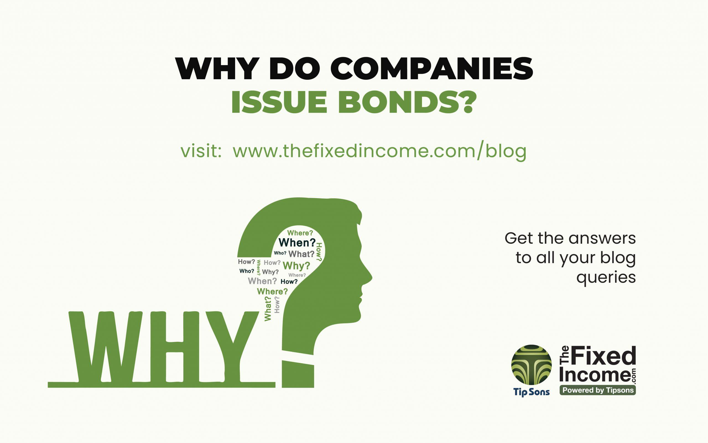

## Table of Contents

## What is a corporate bond?

A corporate bond is a type of loan that a company takes from investors. When a company needs money, it can borrow from people who want to invest their money. In return, the company promises to pay back the money with interest over a certain period of time. These bonds are like IOUs that the company issues to the investors.

Investors buy corporate bonds because they want to earn interest. The interest rate depends on how risky the company is. If the company is very safe and likely to pay back the money, the interest rate might be lower. But if the company is riskier, the interest rate might be higher to make up for the risk. This way, investors can decide if they want to take the risk for a chance to earn more money.

## Why do companies issue corporate bonds?

Companies issue corporate bonds mainly to raise money. They need this money to grow their business, like building new factories or buying new equipment. Sometimes, they use the money to pay off other debts or to buy other companies. By selling bonds, they can get a lot of money quickly from many investors.

Another reason companies issue bonds is that it can be cheaper than other ways of getting money. For example, borrowing from a bank might have higher interest rates. Also, if a company sells shares of its stock to raise money, it gives up some control of the company to new shareholders. With bonds, the company keeps control and just has to pay back the money with interest over time.

## What are the different types of corporate bonds?

There are different types of corporate bonds that companies can issue. One common type is the fixed-rate bond, where the [interest rate](/wiki/interest-rate-trading-strategies) stays the same until the bond matures. This means investors know exactly how much interest they will get each year. Another type is the floating-rate bond, where the interest rate can change based on a benchmark like the LIBOR. This can be good for investors if interest rates go up, but it can also mean less money if rates go down.

Another type of bond is the zero-coupon bond, which does not pay interest during its term. Instead, it is sold at a lower price than its face value, and when it matures, the investor gets the full face value. This makes money for the investor because they buy low and get paid back more later. There are also convertible bonds, which can be turned into a certain number of the company's stock shares. This can be good for investors if they think the company's stock will go up in value.

Lastly, there are callable bonds, where the company can choose to pay back the bond early. This can be good for the company if interest rates go down, but it can be bad for investors because they might lose out on future interest payments. Each type of bond has its own risks and benefits, so investors need to think about what they want before they buy.

## How does issuing bonds affect a company's financial structure?

When a company issues bonds, it changes the way its money is set up. Instead of just using money from owners or banks, the company now has to pay back the money it borrowed from bond investors. This can make the company's money situation more complicated because it has to keep track of when to pay back the bonds and the interest. But it can also help the company grow because it gets more money to use for new projects or to pay off other debts.

Issuing bonds can also change how risky the company seems to other people. If the company can pay back the bonds easily, it might look safer and more stable. But if the company has a lot of bonds and might have trouble paying them back, it could look riskier. This can affect how much it costs the company to borrow money in the future. So, the company needs to think carefully about how many bonds to issue and how it will affect its money situation in the long run.

## What are the advantages of issuing bonds over other financing methods?

Issuing bonds can be a good choice for companies because it lets them get a lot of money without giving up control of the business. When a company sells shares of its stock, it brings in new owners who might want to make decisions. But with bonds, the company just has to pay back the money with interest, and the bondholders don't get a say in how the company is run. This keeps the current owners in charge and helps the company do what it wants without interference.

Another advantage of bonds is that they can be cheaper than other ways to get money. For example, borrowing from a bank might come with higher interest rates, especially if the bank thinks the company is risky. Bonds can have lower interest rates if a lot of people want to invest in them. Also, the interest payments on bonds can be tax-deductible, which means the company pays less in taxes. This can save the company money and make bonds a smart choice for financing.

## What are the potential risks for a company issuing bonds?

When a company issues bonds, it takes on the risk of having to pay back the money it borrowed plus interest. If the company does not make enough money to cover these payments, it could run into big problems. This is called defaulting on the bonds, and it can make the company look bad to other people who might want to lend it money in the future. If a company defaults, it might have to pay even more money or even go out of business.

Another risk is that interest rates might change. If interest rates go up after the company issues its bonds, it might be hard for the company to borrow more money at a good rate. This can make it harder for the company to grow or even to keep running. Also, if the company has bonds that can be paid back early, and interest rates go down, the company might have to pay back the bonds sooner than it planned. This can mess up the company's plans for using the money it borrowed.

## How do interest rates impact the decision to issue corporate bonds?

Interest rates play a big role in whether a company decides to issue corporate bonds. When interest rates are low, it can be a good time for a company to issue bonds because it means they can borrow money at a cheaper rate. The company will have to pay less interest on the money it borrows, which can save them money and make it easier to pay back the bonds. So, when interest rates are low, more companies might want to issue bonds to take advantage of the lower costs.

On the other hand, if interest rates are high, it can be more expensive for a company to issue bonds. They will have to pay more interest to the people who buy the bonds, which can make it harder for the company to make enough money to cover the payments. This might make the company think twice about issuing bonds because it could be too costly. Companies need to watch interest rates carefully and decide if it's the right time to issue bonds based on how much it will cost them.

## What role does the bond's credit rating play in issuance?

A bond's credit rating is really important when a company decides to issue bonds. The credit rating tells investors how safe or risky it is to lend money to the company. If a company has a high credit rating, it means the company is seen as safe and likely to pay back the money it borrows. This can make it easier for the company to sell its bonds because more investors will want to buy them. A high credit rating can also mean the company can offer a lower interest rate on its bonds because investors see it as less risky.

On the other hand, if a company has a low credit rating, it means the company is seen as riskier. Investors might be worried that the company won't be able to pay back the money, so they might want a higher interest rate to make up for the risk. This can make it harder for the company to issue bonds because it has to offer more money to attract investors. So, the credit rating can affect how much it costs the company to borrow money and how easy it is to find people who want to buy the bonds.

## How do companies use the funds raised from bond issuance?

When a company issues bonds, it gets a lot of money from people who want to invest. The company can use this money to grow its business. For example, it might build new factories or buy new machines to make more products. Sometimes, the company might use the money to buy other companies that can help it make more money. This can help the company get bigger and stronger.

The money from bonds can also be used to pay off other debts. If a company has loans from banks that have high interest rates, it can use the money from bonds to pay those off. This can save the company money because the interest rates on bonds might be lower. By doing this, the company can make its money situation better and have more money to use for other things in the future.

## What is the process of issuing corporate bonds?

When a company wants to issue corporate bonds, it starts by deciding how much money it needs and what kind of bonds it wants to issue. The company works with investment banks, which help them figure out the details like the interest rate and how long the bonds will last. The investment banks also help the company sell the bonds to investors. The company makes a document called a prospectus that tells investors all about the bonds, like how much interest they will get and when the company will pay back the money.

Once everything is ready, the company and the investment banks start selling the bonds. They might do this through a public offering, where anyone can buy the bonds, or a private placement, where they sell the bonds to a few big investors. After the bonds are sold, the company gets the money and uses it for things like building new factories or paying off other debts. The company then has to make regular interest payments to the bondholders and pay back the full amount of the bond when it matures.

## How do market conditions influence the timing of bond issuance?

Market conditions play a big role in deciding when a company should issue bonds. If the economy is doing well and people feel confident about investing, it can be a good time for a company to issue bonds. When investors are feeling good, they might be more willing to buy bonds, even if the interest rates are lower. This can help the company get the money it needs at a cheaper cost. On the other hand, if the economy is not doing well, investors might be more worried and want higher interest rates to feel safe about lending money. This can make it more expensive for the company to issue bonds, so they might wait for a better time.

Another important thing to think about is what interest rates are doing. If interest rates are low, it's usually a good time for a company to issue bonds because they can borrow money at a lower cost. The company will have to pay less interest to the people who buy the bonds, which can save them money. But if interest rates are high, it can be more expensive for the company to issue bonds. They will have to pay more interest, which can make it harder for them to make enough money to cover the payments. So, companies need to watch the market carefully and choose the right time to issue bonds based on what's happening with the economy and interest rates.

## What are the tax implications for both the issuer and the bondholder?

For the company that issues the bonds, there can be some good tax benefits. The interest payments they make to bondholders can often be taken off their taxes. This means the company pays less in taxes because they can subtract the interest they paid from their income. This can save the company a lot of money and make issuing bonds a smart choice for getting money.

For the people who buy the bonds, the tax situation can be different. The interest they get from the bonds is usually counted as income, so they have to pay taxes on it. But if they buy certain types of bonds, like municipal bonds, the interest might not be taxed. This can be a good reason for some people to buy bonds, especially if they want to keep more of the money they earn from their investments.

## References & Further Reading

[1]: ["Corporate Bonds: A Guide to Understanding the Basics"](https://www.nerdwallet.com/article/investing/corporate-bonds) - Investopedia

[2]: Fabozzi, F. J. (2007). ["Handbook of Fixed Income Securities"](https://www.amazon.com/Handbook-Fixed-Income-Securities-Ninth/dp/1260473899). McGraw-Hill Education.

[3]: ["Algorithmic Trading: Winning Strategies and Their Rationale"](https://www.wiley.com/en-us/Algorithmic+Trading%3A+Winning+Strategies+and+Their+Rationale-p-9781118460146) by Ernest P. Chan

[4]: ["Python for Finance: Mastering Data-Driven Finance"](https://www.amazon.com/Python-Finance-Mastering-Data-Driven/dp/1492024333) by Yves Hilpisch

[5]: Treynor, J. L. (1962). ["Toward a Theory of Market Value of Risky Assets."](http://www.empirical.net/wp-content/uploads/2014/12/Treynor-Toward-a-Theory-of-Market-Value-of-Risky-Assets.pdf) Journal of Portfolio Management.