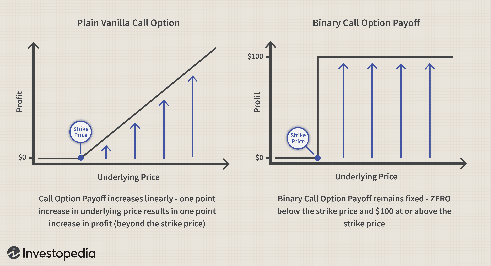

In the world of investing, stock buyouts present intriguing opportunities and challenges for traders due to the often observed differential between the targeted buyout price and the current market price of a stock. This discrepancy arises from a variety of factors, including market speculation, regulatory hurdles, and the overall financial health of the companies involved. When a buyout is announced, the target company's stock price usually witnesses a significant surge; however, it doesn't always hit the proposed buyout price immediately. This price gap can be attributed to uncertainties about whether the deal will close at the announced terms. 

Algorithmic trading plays a crucial role in managing and exploiting these pricing discrepancies. It leverages computer algorithms to execute trades quickly and under pre-defined parameters that help in capitalizing on the differential between the current trading price and the buyout price. The ability of these algorithms to process vast amounts of market data in real-time increases the speed and precision of trades, reducing the impact of emotional biases that can affect human traders. 



As algorithmic trading technology continues to evolve, it brings both opportunities and challenges to investors and traders. The efficient handling of pricing discrepancies can lead to lucrative trading strategies, but the rapid execution of trades also demands a thorough understanding of potential market risks and systems' reliability. Navigating these complexities requires staying informed and adaptable, providing a competitive edge in the fast-paced environment of stock buyouts and algorithm-driven trading.

## Table of Contents

## Understanding Stock Buyouts

A stock buyout occurs when one company acquires another by purchasing its shares, often offering a price per share that exceeds the current market price. This premium is an incentive for shareholders of the target company to sell their shares and approve the acquisition. The announcement of a buyout usually results in an immediate surge in the target company's stock price as investors anticipate the acquisition. However, several factors can obstruct the stock from reaching the exact buyout price.

First, speculation plays a significant role. Investors might speculate on whether the buyout will go through or whether competing bids might emerge, affecting the target's stock price. For instance, if there is talk of a higher offer from another potential acquirer, the stock price might adjust upwards in anticipation.

Regulatory hurdles are another important [factor](/wiki/factor-investing). Acquisitions, especially those involving large companies, often require approval from regulatory bodies to ensure market competitiveness is maintained and antitrust concerns are addressed. The possibility of a deal being blocked or delayed due to regulatory scrutiny often leads to a gap between the current stock price and the proposed buyout price.

Market conditions and sentiment further influence this pricing gap. Unfavorable market conditions can create uncertainty about the financial health of the acquiring company or the economic environment in which the acquisition will proceed. Such factors can lead investors to reassess the likelihood of the deal closing, thus impacting the stock price movement in relation to the buyout offer.

In conclusion, stock buyouts present a complex interplay of expected returns and risks, driven by strategic, regulatory, and market dynamics. Understanding these driving forces is crucial for analyzing and predicting stock behavior in the context of mergers and acquisitions.

## Pricing Discrepancies in Buyouts

Even after a buyout announcement, the stock often trades below the agreed price due to a multitude of factors that contribute to the uncertainty surrounding deal completion. One primary reason for this discrepancy is the requirement for regulatory approval, which can be a lengthy and uncertain process. Regulatory bodies, such as the Federal Trade Commission in the United States or the European Commission in the EU, review acquisitions to prevent anti-competitive practices, potentially introducing delays or even blocking the deal if it poses market dominance risks [1]. 

Market speculation also plays a crucial role in maintaining this price gap. Speculators and analysts may question the likelihood of the buyout materializing, based on various indicators such as shifts in the financial health of the involved companies, consideration of other competing bids, or geopolitical influences that could affect company valuations. Therefore, the financial dynamics of the acquirer and target companies can shift after the buyout announcement, due to changes in market conditions or unexpected announcements from either party, contributing further to the pricing discrepancy.

Additionally, there's the inherent risk that the deal might fall apart or become renegotiated. If stakeholders suspect that the purchase agreement terms might change, there will be corresponding adjustments in stock pricing. For instance, a due diligence phase that uncovers unforeseen liabilities or financial weaknesses in the target company could prompt a renegotiation of the buyout price or potentially lead to the deal's collapse.

To capitalize on these opportunities, traders often employ meticulous analysis of the price gaps through strategies such as merger [arbitrage](/wiki/arbitrage). By examining the spread between the target company's current trading price and the announced buyout price, investors can gauge potential profits. The formula for calculating this arbitrage return is:

$$
\text{Arbitrage Return} = \frac{\text{Target Price} - \text{Current Price}}{\text{Current Price}} \times 100
$$

For instance, if the announced buyout price of a stock is $100 and it is currently trading at $95, the potential arbitrage return is approximately 5.26%. This potential for profit drives traders to continuously assess various factors that might influence the completion of the buyout, making this a highly dynamic and complex field within stock trading.

---
[1] "Mergers and Acquisitions," U.S. Federal Trade Commission, https://www.ftc.gov/news-events/topics/competition-mergers.

## Algorithmic Trading and Its Role

Algorithmic trading, commonly known as algo-trading, employs computer algorithms to automate and execute trades based on pre-defined rules and parameters. This approach enables traders to capitalize on pricing discrepancies in stock buyouts efficiently. By removing human intervention, [algorithmic trading](/wiki/algorithmic-trading) minimizes emotional bias, thus enhancing the reliability and consistency of trading strategies. Algorithms assess vast amounts of market data in real-time, executing trades at speeds unattainable by human traders.

One of the primary advantages of algo-trading is the ability to quickly identify and exploit minor price differences in buyout-related stocks. The algorithms are programmed to act within milliseconds, enabling traders to benefit from small yet frequent gains. For example, consider a scenario where a buyout offer prices a stock at $100, but the current market price is $98. An algorithm can swiftly execute a buy order to potentially profit from the $2 disparity once the buyout completes.

The scalability of algo-trading allows traders to manage multiple trades across varied markets seamlessly. Strategies can be backtested over historical data to evaluate their effectiveness and optimize parameters before deployment. This involves feeding the algorithms with past market data to identify patterns and refine decision-making processes. The equation used for [backtesting](/wiki/backtesting) might involve calculating the expected return, R(t), for different strategies over a time period, t:

$$
R(t) = \frac{\sum_{i=1}^{n} (P_{\text{sell},i} - P_{\text{buy},i})}{n}
$$

where $P_{\text{sell},i}$ and $P_{\text{buy},i}$ are the selling and buying prices in trade i, and n is the number of trades.

Python, being a versatile programming language, offers libraries such as NumPy and pandas for numerical computations and data handling, enhancing the robustness of algo-trading systems.

```python
import numpy as np

def backtest_strategy(trades):
    returns = [(sell_price - buy_price) for buy_price, sell_price in trades]
    expected_return = np.mean(returns)
    return expected_return

# Example usage
trades = [(98, 100), (99, 101), (97, 99)]
print("Expected Return:", backtest_strategy(trades))
```

Overall, algorithmic trading represents a paradigm shift in stock trading practices. By leveraging technology, traders can maneuver through the complexities of stock buyouts with increased precision and efficiency.

## Strategies Leveraging Buyout Discrepancies

Arbitrage strategies are fundamental in exploiting price discrepancies that arise from stock buyout announcements. These strategies involve the simultaneous purchase and sale of the target company’s stock across different markets to profit from pricing inefficiencies. Arbitrageurs often look for the spread between the current stock price and the proposed buyout price, taking positions that reflect their expectation of the deal's completion. 

Trend-following strategies can be effectively applied post-announcement to capitalize on price movements as the market adjusts to the news. These strategies involve identifying and following the direction of the market trend, assuming that prices follow a [momentum](/wiki/momentum). Traders might use technical indicators such as moving averages to identify entry and [exit](/wiki/exit-strategy) points in alignment with the trend.

Mean reversion strategies are based on the premise that stock prices will revert to their historical mean or average level. In the context of buyouts, a stock might initially exhibit [volatility](/wiki/volatility-trading-strategies) upon announcement, followed by a reversion to a more stable price reflecting the perceived likelihood of deal completion. By analyzing historical price data, traders can predict price movements and strategically place trades for optimal returns.

Advanced [statistical arbitrage](/wiki/statistical-arbitrage) strategies deploy sophisticated algorithms to analyze large data sets for patterns and correlations between assets. This approach often involves quantitative models that assess vast amounts of market data to uncover predictive relationships, enabling trades that capitalize on relative price movements.

Incorporating these strategies into algorithmic trading systems allows traders to navigate buyout discrepancies with efficiency and precision. Algorithms can be programmed to automatically execute trades based on predefined criteria, significantly reducing the emotional biases and manual errors associated with traditional trading. Additionally, backtesting these strategies against historical data can help refine parameters to improve performance over time.

Here is a basic example of a Python function that could be part of a statistical arbitrage strategy, using moving averages for mean reversion:

```python
import pandas as pd

def moving_average_strategy(prices, short_window=20, long_window=50):
    signals = pd.DataFrame(index=prices.index)
    signals['price'] = prices
    signals['short_mavg'] = prices.rolling(window=short_window, min_periods=1).mean()
    signals['long_mavg'] = prices.rolling(window=long_window, min_periods=1).mean()

    # Generate buy/sell signals
    signals['signal'] = 0.0
    signals['signal'][short_window:] = np.where(signals['short_mavg'][short_window:] 
                                                > signals['long_mavg'][short_window:], 1.0, 0.0)   
    signals['positions'] = signals['signal'].diff()

    return signals

# Example usage:
# prices = pd.Series(your_stock_price_data)
# signals = moving_average_strategy(prices)
```

Such trading models are designed to identify potential buy and sell signals based on the moving average crossovers, allowing traders to respond swiftly to market changes triggered by buyout speculation and announcements.

## Challenges and Risks

Algorithmic trading, despite its numerous advantages, faces a range of challenges and risks that can impact its effectiveness and reliability. Among the most significant challenges are technical failures and risks of market manipulation. System errors, such as those that contributed to the 2010 Flash Crash, illustrate the potential for large-scale disruptions. During the Flash Crash, the U.S. stock market experienced a sudden and severe drop in equity prices within a very short timeframe, largely attributed to the interaction of algorithmic trading programs. This incident highlighted the susceptibility of markets to rapid fluctuations caused by erroneous or unexpected algorithmic behaviors.

Another challenge in algorithmic trading is the risk associated with overcrowded strategies. When numerous traders utilize similar algorithms to exploit pricing discrepancies, the resultant competition can diminish the anticipated profits. This overcrowding can compress spreads and, in some cases, lead to adverse market impacts where the original price discrepancy intended for exploitation is eliminated by the sheer [volume](/wiki/volume-trading-strategy) of trades. As an example, if a large number of trading algorithms simultaneously identify and act on the same arbitrage opportunity, the rapid execution of trades can quickly adjust prices, eroding the profitability of the strategy.

Furthermore, the rapid innovations and advancements in algorithmic trading pose regulatory challenges. Regulators strive to maintain market fairness and integrity in environments where trading occurs at incredible speeds. The complexity of algorithms and the vast amounts of data they process require updated regulatory frameworks to ensure transparency, prevent unfair practices, and manage market risks. Regulatory bodies are constantly developing and updating policies to address issues like market manipulation, ensuring that trading activities align with established financial regulations.

In summary, while algorithmic trading provides the tools for efficient and precise trading, it is accompanied by significant challenges such as system errors, the risk of strategy overcrowding, and regulatory hurdles. Addressing these challenges is essential to harness the benefits of algorithmic trading while safeguarding market stability.

## Conclusion

Algorithmic trading has fundamentally transformed how traders handle stock buyouts, providing efficient means to address pricing discrepancies that naturally arise during these events. Using sophisticated computer algorithms, traders can swiftly identify and exploit the gaps between the market price and the intended buyout price, optimizing their strategies for maximum profitability. These algorithms allow for a systematic approach that minimizes emotional biases, offering a more consistent and reliable trading experience.

While the benefits of algorithmic trading are substantial, traders must navigate a range of challenges. Technical failures, such as system glitches or unexpected software bugs, can disrupt trading activities and lead to significant financial consequences. Moreover, the rapid and automated nature of algorithmic trading can sometimes contribute to market disturbances, as demonstrated by incidents like the Flash Crash. Therefore, risk management and contingency planning are crucial to mitigate potential losses from such events.

Leveraging cutting-edge trading strategies allows traders to take advantage of market inefficiencies, thus enhancing their investment returns. Strategies such as arbitrage, trend-following, and mean reversion are effectively implemented through algorithmic systems, processing large datasets to identify and execute trades at opportune moments. As competition in the trading arena intensifies, these advanced strategies become indispensable for maintaining an edge.

The continual advancements in technology underline the necessity for traders to remain informed and flexible. Staying abreast of technological innovations and regulatory changes and adapting strategies accordingly are vital for success. As the landscape of stock trading evolves, the ability to adopt new tools and techniques will be a key determinant of traders' ability to thrive amidst the complexities of stock buyouts and algorithm-driven trading.

## Frequently Asked Questions (FAQs)

### Frequently Asked Questions (FAQs)

**What are the primary reasons for stock buyout price discrepancies?**

Stock buyout price discrepancies primarily arise due to several factors including regulatory hurdles, market speculation, and financial uncertainties. Regulatory approval is a significant component, as acquisitions may be subject to antitrust laws that could delay or prevent completion. Market speculation regarding potential competing offers or synergy outcomes also impacts pricing. Lastly, any unforeseen financial changes in either company involved could alter the perceived value of the buyout or halt negotiations altogether.

**How does algorithmic trading enhance trading efficiency?**

Algorithmic trading boosts trading efficiency by leveraging computer algorithms to execute trades based on predefined criteria. These algorithms enable rapid decision-making, allowing trades to be executed with great speed and precision, often faster than human capability. Algo-trading minimizes emotional biases, thereby increasing the consistency and reliability of strategies. The ability to backtest strategies and scale operations across diverse markets further enhances efficiency by ensuring informed and optimized trading decisions.

**What are some popular algorithmic trading strategies used in buyouts?**

In the context of buyouts, traders often employ several algorithmic strategies to capitalize on price discrepancies. Arbitrage strategies are one of the most prevalent, where traders exploit price differences in the market. Mean reversion strategies identify and benefit from deviations in stock pricing, assuming that prices will revert to their historical averages. Trend-following strategies track stock price momentum post-announcement to capture price movements. Statistical arbitrage, an advanced technique, utilizes large datasets to find opportunities in correlated assets, enhancing the probability of profitable trades.

**What challenges accompany the use of algorithmic trading?**

Despite the advantages of algorithmic trading, several challenges exist. Technical failures such as system errors can lead to significant disruptions, exemplified by events like the Flash Crash. Market manipulation is another risk, where certain trades or anomalies can unjustly alter stock prices. Overcrowded strategies pose a problem, as too many traders pursuing similar strategies can mitigate potential profits and affect market prices. Regulatory challenges also persist, as maintaining fair and transparent markets amidst rapidly evolving algorithms requires constant oversight and adaptation of regulatory frameworks.

## References & Further Reading

[1]: ["Mergers and Acquisitions," U.S. Federal Trade Commission](https://www.ftc.gov/news-events/topics/competition-enforcement/merger-review).

[2]: Bergstra, J., Bardenet, R., Bengio, Y., & Kégl, B. (2011). ["Algorithms for Hyper-Parameter Optimization."](https://dl.acm.org/doi/10.5555/2986459.2986743) Advances in Neural Information Processing Systems 24.

[3]: ["Advances in Financial Machine Learning"](https://www.amazon.com/Advances-Financial-Machine-Learning-Marcos/dp/1119482089) by Marcos Lopez de Prado

[4]: ["Quantitative Trading: How to Build Your Own Algorithmic Trading Business"](https://www.amazon.com/Quantitative-Trading-Build-Algorithmic-Business/dp/1119800064) by Ernest P. Chan

[5]: ["Evidence-Based Technical Analysis: Applying the Scientific Method and Statistical Inference to Trading Signals"](https://www.amazon.com/Evidence-Based-Technical-Analysis-Scientific-Statistical/dp/0470008741) by David Aronson

[6]: ["Machine Learning for Algorithmic Trading"](https://github.com/stefan-jansen/machine-learning-for-trading) by Stefan Jansen