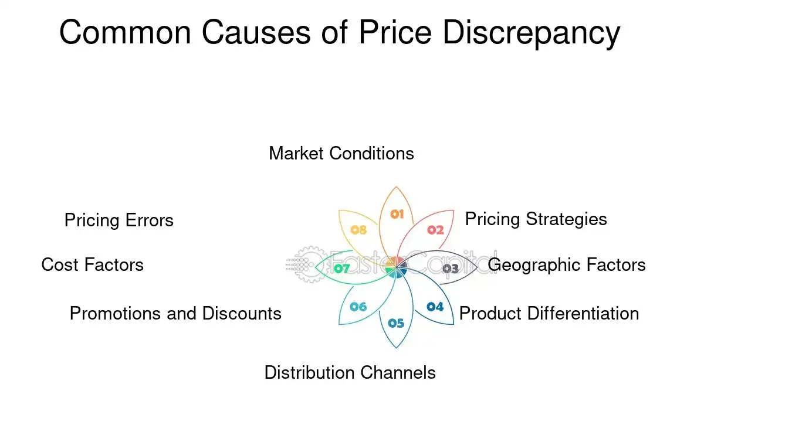

## Table of Contents

## What is a stock buyout?

A stock buyout happens when a company buys back its own shares from the stock market. This means the company is taking its own stock away from investors and reducing the total number of shares that are available to the public. Companies might do this for different reasons, like if they think their stock is undervalued or if they want to increase the value of the remaining shares.

When a company decides to do a stock buyout, it uses its own money to buy the shares. This can be good for shareholders because it often makes the value of their remaining shares go up. Fewer shares mean that each share represents a bigger part of the company. But, it can also mean the company is using money that could have been used for other things, like growing the business or paying dividends.

## Why do companies engage in stock buyouts?

Companies engage in stock buyouts for a few main reasons. One reason is that they believe their stock is undervalued. When a company thinks its stock price is lower than it should be, buying back shares can help push the price up. This is because when there are fewer shares available, each share becomes more valuable. Another reason is to return money to shareholders. Instead of paying dividends, a company might buy back shares as a way to give money back to investors. This can be especially appealing if the company wants to avoid the regular commitment of paying dividends.

Another reason companies do stock buyouts is to improve their financial ratios. When a company buys back its own stock, it reduces the number of shares outstanding. This can make earnings per share (EPS) go up, which can make the company look more profitable and attractive to investors. Additionally, stock buybacks can be used to signal confidence to the market. When a company uses its cash to buy back its own shares, it shows that the company's leaders believe in its future and think the stock is a good investment. This can boost investor confidence and potentially drive up the stock price.

## What are discrepancies in stock buyout pricing?

Discrepancies in stock buyout pricing happen when the price a company offers to buy back its shares is different from what people think the shares are really worth. Sometimes, the company might offer a price that's higher than the current market price. This can make shareholders happy because they get more money for their shares than they would if they sold them on the open market. But, it can also make some investors think the company is spending too much money on buying back shares instead of using it for other things like growing the business.

Other times, the buyout price might be lower than what people think the shares are worth. This can upset shareholders because they feel they're not getting a fair deal. They might decide to hold onto their shares and not sell them back to the company. This can make the buyback process harder for the company because they might not be able to buy back as many shares as they wanted. In the end, discrepancies in pricing can lead to disagreements between the company and its shareholders about what the shares are really worth.

## How can market conditions affect stock buyout pricing?

Market conditions can really change how much a company offers to buy back its shares. If the stock market is doing well and people feel good about the economy, the company might have to offer a higher price to get shareholders to sell their shares. This is because when the market is strong, people think their shares are worth more and they want a good price for them. On the other hand, if the market is not doing well and people are worried about the economy, the company might be able to offer a lower price. This is because shareholders might be more willing to sell their shares for less money if they think the market is going to keep going down.

Sometimes, the company's own situation can affect the buyout price too. If the company is doing really well and making a lot of money, it might offer a higher price to show that it believes in its future. But if the company is not doing so well and needs to save money, it might offer a lower price. Either way, the company has to think about what's happening in the market and its own business when deciding how much to offer for its shares.

## What role do negotiations play in determining buyout prices?

Negotiations are important when a company wants to buy back its shares. The company and the shareholders talk to each other to agree on a price that everyone thinks is fair. Sometimes, shareholders might think the company's offer is too low. They can ask for a higher price, and the company might agree to pay more if it really wants to buy back the shares. This back-and-forth helps both sides feel happy with the deal.

Other times, the company might start with a high offer to make shareholders happy and get them to sell quickly. But if shareholders think they can get even more, they might try to negotiate for a better price. Negotiations can take time, but they help make sure the buyout price is something everyone can agree on. In the end, it's all about finding a price that works for both the company and the shareholders.

## How do different valuation methods impact the pricing of a stock buyout?

Different valuation methods can change how much a company offers to buy back its shares. One common method is the market approach, where the company looks at what similar companies' stocks are worth. If other companies in the same industry have high stock prices, the company might offer a higher price to buy back its shares. Another method is the income approach, which looks at how much money the company makes. If the company is making a lot of money, it might offer a higher price because it thinks its shares are worth more.

Another valuation method is the asset approach, which looks at what the company owns, like buildings or equipment. If the company has a lot of valuable stuff, it might offer a higher price for its shares. Each method can lead to different prices because they look at different things. The company has to choose the method that makes the most sense for its situation and what it thinks its shares are really worth.

## What are the common reasons for discrepancies in stock buyout pricing?

Discrepancies in stock buyout pricing often happen because the company and the shareholders have different ideas about what the shares are worth. The company might think its shares are not worth as much as the current market price, so it offers a lower price to buy them back. But shareholders might disagree and think the shares are worth more, especially if they believe the company is doing well or if the market is strong. This difference in opinion can lead to disagreements and make it hard for the company to buy back as many shares as it wants.

Another reason for discrepancies is the method used to value the shares. Different valuation methods can lead to different prices. For example, if the company uses the market approach and looks at similar companies, it might offer a different price than if it uses the income approach and looks at its own earnings. Shareholders might prefer one method over another, which can cause disagreements about the right price. In the end, these differences in valuation and opinion can make it tricky to agree on a buyout price that everyone is happy with.

## How can insider information lead to pricing discrepancies in stock buyouts?

Insider information can lead to pricing discrepancies in stock buyouts because people inside the company might know things that the public doesn't. For example, if insiders know that the company is going to do really well in the future, they might think the shares are worth more than the company is offering. This can make them ask for a higher price when the company wants to buy back the shares. On the other hand, if insiders know that the company is not doing so well, they might be okay with selling their shares for less than the market price because they think the value will go down.

This kind of information can cause big differences between what the company thinks the shares are worth and what the shareholders think. If insiders use this secret information to negotiate a better price for themselves, it can make other shareholders feel like they're not getting a fair deal. This can lead to disagreements and make it harder for the company to buy back its shares at a price everyone agrees on.

## What regulatory factors should be considered that might cause pricing discrepancies?

Regulatory factors can really affect how much a company offers to buy back its shares. One big thing to think about is the rules that stop people from using secret information to make money. These rules are there to make sure everyone gets a fair deal. If a company breaks these rules, it might have to pay a lot of money or even go to court. This can make the company more careful about what price it offers for its shares because it wants to avoid getting in trouble.

Another thing to consider is the rules about how a company has to tell everyone what it's doing. If a company wants to buy back its shares, it has to let everyone know about it in a clear way. If the company doesn't do this right, it can cause confusion and disagreements about what the shares are really worth. This can lead to different ideas about the right price and make it hard for the company and its shareholders to agree on a buyout price that everyone is happy with.

## How do strategic motives of the acquiring company influence buyout pricing?

When a company wants to buy back its shares, it often has a plan or a goal in mind. This plan can change how much the company is willing to pay for the shares. For example, if the company wants to make its stock price go up, it might offer a higher price to buy back shares. This can make shareholders happy and show the market that the company believes in itself. On the other hand, if the company wants to save money or use its cash for other things, it might offer a lower price. This can help the company keep more money for other projects or to pay off debts.

Sometimes, the company might want to buy back shares to stop another company from taking it over. If another company is trying to buy a lot of shares to take control, the company might offer a high price to buy back its shares and keep control. This can make it harder for the other company to take over. In the end, the company's goals and plans play a big role in deciding how much it offers to buy back its shares. The price can be different based on what the company wants to achieve.

## What advanced financial models are used to assess and potentially correct pricing discrepancies in stock buyouts?

When companies want to buy back their shares, they use fancy financial models to figure out the right price. One model they use is called the Discounted Cash Flow (DCF) model. This model looks at how much money the company will make in the future and then figures out what that money is worth right now. If the DCF model shows that the shares are worth more than what the company is offering, it can help fix any pricing problems. Another model is the Comparable Company Analysis (CCA), which looks at what similar companies' shares are worth. This can help the company see if its offer is fair compared to others.

Another model is the Option Pricing Model, like the Black-Scholes model. This one is used when the company has stock options or other complicated financial things. It helps figure out what these options are worth and how they affect the price of the shares. By using these models, the company can make sure its buyback price is right and fair. If the models show that the price is off, the company can change its offer to match what the shares are really worth. This helps avoid disagreements with shareholders and makes the buyback process smoother.

## How can historical data and trend analysis be utilized to predict and manage discrepancies in future stock buyouts?

Historical data and trend analysis can help companies predict and manage pricing discrepancies in future stock buyouts by looking at what happened in the past. If a company looks at old buyouts, it can see if it offered too much or too little for its shares before. This can help the company guess what might happen next time. For example, if the company sees that it always had to pay more during good economic times, it can plan to offer a higher price when the economy is strong again. By studying trends, the company can also see how things like market conditions or its own performance affect buyout prices. This helps the company set a fair price that shareholders will be happy with.

Using historical data also helps the company understand how shareholders reacted to past buyouts. If shareholders were unhappy with a low offer last time, the company might decide to offer a higher price next time to avoid the same problem. Trend analysis can show the company how often it needs to buy back shares and how much it usually costs. This information can help the company plan its finances better and make sure it has enough money for future buyouts. By learning from the past, the company can make smarter decisions and reduce the chances of pricing discrepancies in the future.

## What are the pricing discrepancies in buyouts?

Even after a buyout announcement, the stock often trades below the agreed price due to a multitude of factors that contribute to the uncertainty surrounding deal completion. One primary reason for this discrepancy is the requirement for regulatory approval, which can be a lengthy and uncertain process. Regulatory bodies, such as the Federal Trade Commission in the United States or the European Commission in the EU, review acquisitions to prevent anti-competitive practices, potentially introducing delays or even blocking the deal if it poses market dominance risks [1]. 

Market speculation also plays a crucial role in maintaining this price gap. Speculators and analysts may question the likelihood of the buyout materializing, based on various indicators such as shifts in the financial health of the involved companies, consideration of other competing bids, or geopolitical influences that could affect company valuations. Therefore, the financial dynamics of the acquirer and target companies can shift after the buyout announcement, due to changes in market conditions or unexpected announcements from either party, contributing further to the pricing discrepancy.

Additionally, there's the inherent risk that the deal might fall apart or become renegotiated. If stakeholders suspect that the purchase agreement terms might change, there will be corresponding adjustments in stock pricing. For instance, a due diligence phase that uncovers unforeseen liabilities or financial weaknesses in the target company could prompt a renegotiation of the buyout price or potentially lead to the deal's collapse.

To capitalize on these opportunities, traders often employ meticulous analysis of the price gaps through strategies such as merger [arbitrage](/wiki/arbitrage). By examining the spread between the target company's current trading price and the announced buyout price, investors can gauge potential profits. The formula for calculating this arbitrage return is:

$$
\text{Arbitrage Return} = \frac{\text{Target Price} - \text{Current Price}}{\text{Current Price}} \times 100
$$

For instance, if the announced buyout price of a stock is $100 and it is currently trading at $95, the potential arbitrage return is approximately 5.26%. This potential for profit drives traders to continuously assess various factors that might influence the completion of the buyout, making this a highly dynamic and complex field within stock trading.

---
[1] "Mergers and Acquisitions," U.S. Federal Trade Commission, https://www.ftc.gov/news-events/topics/competition-mergers.

## What is the role of algorithmic trading?

Algorithmic trading, commonly known as algo-trading, employs computer algorithms to automate and execute trades based on pre-defined rules and parameters. This approach enables traders to capitalize on pricing discrepancies in stock buyouts efficiently. By removing human intervention, [algorithmic trading](/wiki/algorithmic-trading) minimizes emotional bias, thus enhancing the reliability and consistency of trading strategies. Algorithms assess vast amounts of market data in real-time, executing trades at speeds unattainable by human traders.

One of the primary advantages of algo-trading is the ability to quickly identify and exploit minor price differences in buyout-related stocks. The algorithms are programmed to act within milliseconds, enabling traders to benefit from small yet frequent gains. For example, consider a scenario where a buyout offer prices a stock at $100, but the current market price is $98. An algorithm can swiftly execute a buy order to potentially profit from the $2 disparity once the buyout completes.

The scalability of algo-trading allows traders to manage multiple trades across varied markets seamlessly. Strategies can be backtested over historical data to evaluate their effectiveness and optimize parameters before deployment. This involves feeding the algorithms with past market data to identify patterns and refine decision-making processes. The equation used for [backtesting](/wiki/backtesting) might involve calculating the expected return, R(t), for different strategies over a time period, t:

$$
R(t) = \frac{\sum_{i=1}^{n} (P_{\text{sell},i} - P_{\text{buy},i})}{n}
$$

where $P_{\text{sell},i}$ and $P_{\text{buy},i}$ are the selling and buying prices in trade i, and n is the number of trades.

Python, being a versatile programming language, offers libraries such as NumPy and pandas for numerical computations and data handling, enhancing the robustness of algo-trading systems.

```python
import numpy as np

def backtest_strategy(trades):
    returns = [(sell_price - buy_price) for buy_price, sell_price in trades]
    expected_return = np.mean(returns)
    return expected_return

# Example usage
trades = [(98, 100), (99, 101), (97, 99)]
print("Expected Return:", backtest_strategy(trades))
```

Overall, algorithmic trading represents a paradigm shift in stock trading practices. By leveraging technology, traders can maneuver through the complexities of stock buyouts with increased precision and efficiency.

## References & Further Reading

[1]: ["Mergers and Acquisitions," U.S. Federal Trade Commission](https://www.ftc.gov/news-events/topics/competition-enforcement/merger-review).

[2]: Bergstra, J., Bardenet, R., Bengio, Y., & Kégl, B. (2011). ["Algorithms for Hyper-Parameter Optimization."](https://dl.acm.org/doi/10.5555/2986459.2986743) Advances in Neural Information Processing Systems 24.

[3]: ["Advances in Financial Machine Learning"](https://www.amazon.com/Advances-Financial-Machine-Learning-Marcos/dp/1119482089) by Marcos Lopez de Prado

[4]: ["Quantitative Trading: How to Build Your Own Algorithmic Trading Business"](https://www.amazon.com/Quantitative-Trading-Build-Algorithmic-Business/dp/1119800064) by Ernest P. Chan

[5]: ["Evidence-Based Technical Analysis: Applying the Scientific Method and Statistical Inference to Trading Signals"](https://www.amazon.com/Evidence-Based-Technical-Analysis-Scientific-Statistical/dp/0470008741) by David Aronson

[6]: ["Machine Learning for Algorithmic Trading"](https://github.com/stefan-jansen/machine-learning-for-trading) by Stefan Jansen