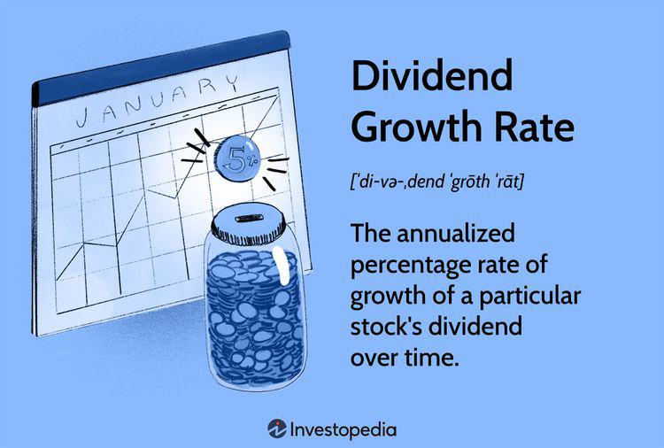

In today's fast-paced financial world, companies frequently encounter challenging decisions regarding their dividend policies, decisions that hold significant implications for both the company and its shareholders. Dividends, which represent a portion of a company's earnings distributed to shareholders, are often seen as indicators of a company's financial health. Regular dividend payments are associated with stability and growth, thereby attracting investors' attention and influencing their investment choices.

The financial markets have witnessed a transformation with the advent of algorithmic trading, a technology-driven investment strategy that utilizes computer algorithms to automate trading decisions based on market data. This has added a new dimension to how financial decisions are made, particularly concerning dividends. Algorithmic trading plays a pivotal role in influencing and predicting dividend-related decisions, thereby shaping the landscape of corporate financial strategy. Understanding the intersection of dividends, dividend suspensions, and financial decision-making in the context of algorithmic trading is crucial for navigating today's financial environment.

This article examines the implications and strategies surrounding these interconnected financial phenomena. By analyzing how companies manage their dividend policies and the impact of algorithmic trading, the article aims to provide insights into the complex decision-making processes in the current financial milieu. This exploration is vital not only for corporations seeking to optimize their financial strategies but also for investors who rely on dividends and algorithmic insights to inform their investment decisions.

## Table of Contents

## Understanding Company Dividends

Dividends are distributions of a company's earnings to its shareholders, representing a reward for their investment. They are a critical component of shareholder returns, alongside capital gains, and can signal a company's financial health and management's confidence in future earnings. Regular dividends indicate stability or growth, while fluctuations may suggest underlying issues or changes in corporate strategy.

There are different types of dividends:

1. **Cash Dividends**: The most common form, where shareholders receive cash payments. Companies usually pay these quarterly, and they provide a direct source of income to investors. Cash dividends are typically taxed as income for the recipients.

2. **Stock Dividends**: These are dividends paid in additional shares rather than cash. They dilute the share price but allow the shareholder to increase their stake in the company without incurring immediate tax liabilities.

3. **Special Dividends**: These are one-time payments to shareholders, often resulting from extraordinary profits or asset sales. They are not indicative of future performance, but they reflect management's decision to share unexpected financial gains.

The importance of dividends in investor decision-making stems from their role in providing a steady income stream and the signal they send about a company's stability and profitability. For many investors, particularly those with income-focused strategies, dividends are essential for portfolio stability.

Historically, dividend policies have varied across companies and industries. For instance, utility companies are traditionally known for regular, stable dividends due to their predictable cash flows. In contrast, technology firms often reinvest earnings into research and development, offering lower or no dividends. Notable examples include Apple, which reinitiated dividend payments in 2012 after a long hiatus, reflecting its shift into a more mature, cash-rich phase, and signaling its commitment to returning value to shareholders.

Capital allocation decisions, including dividend policies, are crucial strategic choices. Companies must balance the need to return funds to shareholders with opportunities for reinvestment and growth, which can lead to competitive advantages over the long term. Dividends thus become a reflection of a company's operational success, capital management efficiency, and future growth prospects, influencing individual investor strategies and broader market dynamics.

## Dividend Suspension: Causes and Consequences

Dividend suspension occurs when a company temporarily halts its dividend payments. This decision is often driven by one of two primary factors: financial stress or strategic reallocation of resources. Financial strain can arise from macroeconomic downturns, shifts in industry dynamics, or unforeseen liabilities. For example, during an economic recession, companies might experience reduced revenue, prompting them to conserve cash by suspending dividends. Similarly, industry-specific challenges, such as regulatory changes or technological disruptions, can necessitate a pause in dividend payouts to maintain financial stability.

Strategic shifts in corporate priorities may also lead to dividend suspensions. A company might choose to redirect funds initially earmarked for dividends towards growth opportunities, such as mergers and acquisitions, research and development, or debt reduction. For instance, a tech firm may prioritize capital-intensive projects over immediate shareholder returns to secure long-term growth.

The suspension of dividends can significantly affect investor confidence and stock values. Investors often view dividends as a sign of a company's financial health and stability. Thus, a suspension can lead to a negative perception, potentially triggering a decline in stock prices as institutional and retail investors adjust their portfolios.

Historical case studies offer valuable insights into the consequences of dividend suspensions. During the 2008 financial crisis, numerous companies, including General Electric, suspended or cut dividends to conserve cash amidst an economic downturn. This decision impacted their stock prices and required management to communicate effectively with shareholders to mitigate concerns about long-term viability.

Another notable example is Ford Motor Company, which suspended dividends in early 2020 due to the COVID-19 pandemic's impact on the automotive industry. The move was part of a broader strategy to maintain [liquidity](/wiki/liquidity-risk-premium) in uncertain times, reassuring investors through transparent communication about the company's financial health and future plans.

In summary, dividend suspensions have far-reaching implications for companies and investors alike. Understanding the causes and consequences of these decisions is crucial for stakeholders looking to navigate the complexities of financial markets.

## Financial Decisions in Uncertain Times

Economic uncertainty compels companies to reevaluate their financial strategies, especially concerning dividends. During such times, a company's management must carefully consider various factors that influence financial decision-making. Two of the most significant factors are cash flow and investment opportunities.

### Cash Flow and Investment Opportunities

Cash flow represents the lifeline of any company, dictating its operational capabilities and investment potential. In uncertain times, ensuring a positive cash flow becomes crucial as companies strive to maintain liquidity to weather potential downturns. Effective management of cash reserves allows firms to sustain core operations without compromising their strategic objectives. Investment opportunities, on the other hand, are evaluated with greater scrutiny as companies seek projects with lower risk and higher potential returns. Companies may adopt a more conservative investment approach, prioritizing projects that promise stability and gradual growth over speculative ventures.

### Boardroom Deliberations and Stakeholder Influence

The role of boardroom deliberations is pivotal during financially unstable periods. Board members and executives come together to chart out strategies that align with the overarching goals of the organization while safeguarding shareholder interests. Deliberations often focus on finding a balance between distributing profits through dividends and retaining earnings to fortify the company's financial standing. The influence of stakeholders, including investors, creditors, and employees, also plays a crucial role in these decisions. Investors seeking consistent dividend returns may press for higher payouts, while employees may advocate for investments in growth initiatives and job security.

### Balancing Short-term Profitability and Long-term Growth

A critical aspect of financial planning in uncertain times is balancing short-term profitability with long-term growth objectives. Companies must evaluate whether to prioritize immediate returns to appease shareholders or invest in growth-oriented strategies that promise sustained profitability in the future. This balance is often achieved by carefully analyzing current market conditions, competitor strategies, and internal capabilities. Strategic asset allocation, cost optimization, and efficient capital expenditure are essential tools companies utilize to maintain this equilibrium.

### Real-world Scenarios

Several real-world scenarios illustrate how companies navigate economic uncertainty through strategic decisions. For instance, during the 2008 financial crisis, numerous firms across industries had to cut or suspend dividends to bolster their cash reserves and reallocate resources towards stabilizing operations. Companies such as General Electric and Ford adopted measures to reduce costs, optimize asset utilization, and improve cash flow management, prioritizing business sustainability over immediate shareholder returns.

In contrast, there are examples of tech companies that prioritized long-term growth by continuing to invest in research and development during economic downturns. These firms recognized the potential for innovation to drive future profitability and opted to retain earnings instead of increasing dividend distributions. Such decisions often resulted in stronger market positions and competitive advantages when economic conditions improved.

Ultimately, financial decisions during uncertain times require a multifaceted approach, balancing immediate financial stability with strategic foresight. By carefully considering cash flow, investment opportunities, stakeholder perspectives, and the delicate interplay between short-term profit and long-term growth, companies can navigate economic uncertainty effectively and emerge resilient in the face of adversity.

## The Role of Algorithmic Trading

Algorithmic trading, commonly referred to as algo trading, employs computer algorithms to automate trading decisions based on real-time market data. These algorithms are designed to execute orders at speeds and frequencies that are impossible for human traders, making them an essential tool in the modern financial landscape.

### Influence on Stock Prices and Market Volatility

Algorithms can significantly affect stock prices and market [volatility](/wiki/volatility-trading-strategies). By processing vast amounts of data quickly, [algorithmic trading](/wiki/algorithmic-trading) systems can identify patterns and execute trades based on these insights, often before human traders are even aware of them. The speed at which these trades occur can lead to noticeable market shifts, particularly during significant events such as dividend announcements or suspensions.

### Responding to Dividend Announcements and Suspensions

Algorithmic systems are designed to respond to market signals effectively. Dividend announcements are one such signal, and algorithms can be programmed to react to these changes quickly. When a company announces a dividend increase, the stock price often rises because investors interpret it as a sign of financial health. Conversely, a dividend suspension might signal cash flow problems, potentially leading to a drop in the stock price. Algorithms are adept at capturing these trends and executing trades that align with the anticipated market movement.

### Tools and Techniques in Algorithmic Trading

Several tools and techniques are employed in algorithmic trading to optimize investment strategies. These include:

- **Statistical Arbitrage**: This involves using mathematical models to identify pricing inefficiencies between related financial instruments. The algorithm can execute trades to exploit these inefficiencies.

- **Market Making**: This strategy involves placing limit orders to buy and sell a particular stock and profiting from the bid-ask spread.

- **Trend Following**: Algorithms can be programmed to identify and follow market trends. By analyzing historical data, an algorithm may predict that a stock with upward momentum will continue to rise.

Algorithms utilize sophisticated techniques like [machine learning](/wiki/machine-learning) and natural language processing to analyze unstructured data such as news releases and social media. Additionally, quantum computing, though still in its nascent stages, holds promise for enhancing the capabilities of algorithmic systems by solving complex problems even faster.

### The Future of Algorithmic Trading

The future of algorithmic trading in a rapidly evolving financial landscape is promising yet challenging. With advancements in [artificial intelligence](/wiki/ai-artificial-intelligence) and machine learning, algorithms are expected to become more autonomous and possibly predictive rather than just reactive.

However, the rise of algo trading also presents challenges, such as the potential for increased market volatility and the risk of flash crashes. Regulatory bodies are investing in monitoring and controlling these systems to mitigate risks.

In conclusion, algorithmic trading stands as a transformative force in financial markets, revolutionizing how trades are executed and decisions made. As technology advances, its role in shaping financial strategies will only grow, necessitating continuous adaptation and understanding by traders and investors alike.

## Interplay Between Dividends, Decisions, and Algorithms

The intersection of dividends, financial decisions, and algorithmic trading underscores a dynamic area where corporate strategy and technology converge. Companies increasingly rely on algorithmic insights to enhance their financial strategies, including their approach to dividends. Algorithms analyze vast datasets, monitoring market conditions and company performance, to guide decisions on dividend payments. This data-driven approach allows companies to optimize their financial strategies by balancing shareholder expectations with operational needs.

A primary challenge in this interplay is the accurate interpretation of market signals by algorithms, particularly in the context of unpredictable economic shifts. For instance, when a firm considers altering its dividend policy, algorithmic models can evaluate historical data and simulate scenarios to predict potential market reactions. However, algorithms may not fully capture qualitative factors, such as management sentiment or regulatory changes, which can impact these decisions.

Conversely, the opportunity lies in the precision and speed algorithmic trading offers. Companies can leverage real-time data analysis to anticipate investor reactions faster than traditional methods. For example, algorithms can identify patterns in how stock prices responded to previous dividend announcements, enabling more informed predictions about future movements.

Moreover, the influence of data-driven decisions on corporate dividend strategies has become increasingly apparent. Companies employing sophisticated algorithms can fine-tune their dividend policies, ensuring alignment with market dynamics and internal financial health. This strategic flexibility allows firms to adjust their approaches to dividends in response to both macroeconomic conditions and specific business needs.

Looking ahead, the relationship between dividends, decisions, and algorithms is poised for further evolution. Advances in artificial intelligence, particularly in machine learning, hold the potential to enhance algorithmic precision, offering deeper insights into market trends and investor behaviors. As algorithms become more adept at processing complex data sets, the accuracy of financial forecasts and the agility of dividend strategies are likely to improve.

However, the growing reliance on algorithms also necessitates robust governance frameworks to mitigate risks associated with over-automation. Ensuring that human oversight complements algorithmic analysis is crucial for maintaining a balance between technology-driven insights and strategic human decision-making.

In summary, the integration of algorithmic trading within corporate financial decision-making processes offers significant advantages but demands careful management to harness its full potential. As technology progresses, the synergy between dividends, financial strategies, and algorithmic trading will likely deepen, shaping the future landscape of corporate finance.

## Conclusion

The landscape of dividends, financial decision-making, and algorithmic trading is continuously evolving, shaping the corporate financial environment in complex ways. This article has explored the intersection between these elements, highlighting how each [factor](/wiki/factor-investing) influences the other in the financial markets.

One of the key points emphasized is the dynamic nature of dividend policies. Companies must navigate an ever-changing economic environment, which directly impacts their ability and decision to pay dividends. As such, understanding the motivations behind dividend suspensions or alterations can provide valuable insights into a company's financial health and strategic priorities.

Algorithmic trading has emerged as a significant player in the financial markets, influencing stock prices and market volatility. Its ability to process vast amounts of data swiftly allows for real-time responsiveness to dividend announcements and financial shifts. This highlights the necessity for companies to consider the effect of algorithmic trading when making financial decisions, as algorithms can rapidly alter market perceptions and investor behavior.

Investors are encouraged to gain a deep understanding of how these interconnections impact their investments. Recognizing the relationship between dividend policies, corporate financial decisions, and algorithmic trading can enable more informed and strategic investment choices.

The future of dividends and algorithmic trading is poised for further transformation as technology advances. Predictive analytics and machine learning are expected to play more profound roles, potentially reshaping traditional dividend strategies and financial market operations. Investors must remain vigilant and adaptable, as ongoing technological and economic changes can significantly influence investment landscapes.

In conclusion, continuous monitoring and analysis of these complex relationships will be crucial for investors and companies alike, promoting better decision-making and fostering resilience in financial markets.

## References & Further Reading

[1]: ["The Impact of Algorithmic Trading on the Financial Markets"](https://www.semanticscholar.org/paper/Analyzing-the-impact-of-algorithmic-trading-on-A-Damilare-Oyeniyi/cfaa220cded37f824aa2bf5b97f26c9b2aa6cb95) by Terrence Hendershott, Charles M. Jones, and Albert J. Menkveld. National Bureau of Economic Research.

[2]: ["Advances in Financial Machine Learning"](https://www.amazon.com/Advances-Financial-Machine-Learning-Marcos/dp/1119482089) by Marcos Lopez de Prado.

[3]: ["The Dividend Discount Model in the Long-Run: A Clinical Study"](https://www.ivey.uwo.ca/faculty/ssapp/Research/Papers/Foerster_Sapp_JAF_Oct_2005.pdf) published by CFA Institute Research Foundation.

[4]: ["Technical Analysis of the Financial Markets: A Comprehensive Guide to Trading Methods and Applications"](https://archive.org/details/technicalanalysi0000murp) by John J. Murphy.

[5]: ["Algorithmic and High-Frequency Trading"](https://www.amazon.com/Algorithmic-High-Frequency-Trading-Mathematics-Finance/dp/1107091144) by Álvaro Cartea, Sebastian Jaimungal, and José Penalva.