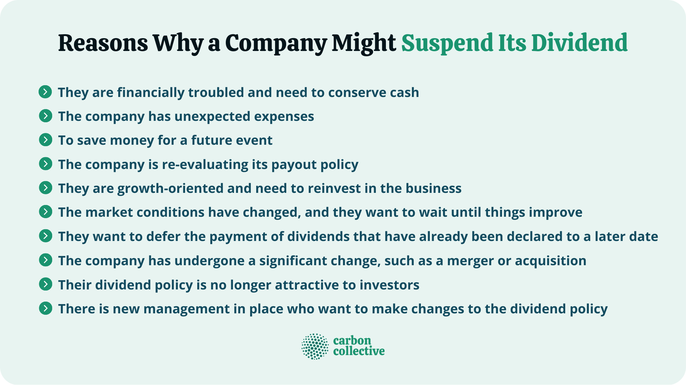

## Table of Contents

## What is a dividend?

A dividend is money that a company pays to its shareholders. It's like a reward for owning part of the company. When a company makes a profit, it can choose to share some of that profit with its shareholders in the form of dividends.

Not all companies pay dividends. Some companies, especially newer ones, might use their profits to grow the business instead. But for companies that do pay dividends, they usually do it a few times a year. Shareholders can either take this money or use it to buy more shares in the company.

## Why do companies pay dividends?

Companies pay dividends to share their profits with their shareholders. When a company makes money, it can choose to give some of it back to the people who own its stock. This is a way to say thank you to shareholders for investing in the company. By paying dividends, a company can show that it is doing well and has extra money to share.

Dividends can also attract more investors. People who want a steady income might buy stocks that pay dividends. This can make the company's stock more popular and help its stock price go up. So, paying dividends can be a good way for a company to keep its current shareholders happy and bring in new ones.

## What does it mean when a company suspends its dividends?

When a company suspends its dividends, it means they stop paying money to their shareholders for a while. This can happen if the company is not making enough profit or if it needs to use its money for something else, like growing the business or paying off debts.

Suspending dividends can make shareholders worried because they might think the company is having problems. But sometimes, a company might do this to save money for future growth, which could be good for the company in the long run. It's important for shareholders to understand why the company made this decision and what it plans to do next.

## What are the most common reasons for a company to suspend dividends?

One of the most common reasons for a company to suspend dividends is financial trouble. If a company is not making enough money, it might need to stop paying dividends to save cash. This can happen if the company's profits go down or if it has a lot of debts to pay. When a company is struggling, it might need to use all its money to keep the business running, so it can't afford to share profits with shareholders.

Another reason a company might suspend dividends is to invest in growth. Sometimes, a company wants to use its money to expand the business or start new projects. By stopping dividend payments, the company can keep more money to spend on these opportunities. This can be a good sign for the future, because it means the company is planning to grow and might make more money later on. Shareholders might be okay with this if they believe the company will be successful in the long run.

## How does a company's financial health impact its decision to suspend dividends?

A company's financial health is really important when it decides to suspend dividends. If a company is not doing well and not making enough money, it might have to stop paying dividends to save cash. This can happen if the company has a lot of debts or if its profits are going down. When a company is struggling, it needs all its money to keep the business going, so it can't share profits with shareholders.

On the other hand, if a company is doing well but still decides to suspend dividends, it might be because it wants to grow. Sometimes, a company wants to use its money to start new projects or expand the business. By stopping dividend payments, the company can keep more money for these opportunities. This can be a good sign for the future, because it means the company is planning to make more money later on. Shareholders might be okay with this if they believe the company will be successful in the long run.

## Can external economic conditions lead to dividend suspension?

Yes, external economic conditions can lead to a company suspending its dividends. When the economy is not doing well, like during a recession, companies might make less money. Customers might buy less, and it can be harder for the company to sell its products or services. If a company's profits go down because of these tough economic times, it might need to stop paying dividends to save money and keep the business running.

Sometimes, even if a company is doing okay, it might still choose to suspend dividends because of what's happening in the economy. For example, if the future looks uncertain, a company might want to keep more cash on hand just in case things get worse. By not paying dividends, the company can build up its savings and be ready for any economic challenges that might come up. This can help the company stay strong and keep going, even when times are tough.

## What role does a company's cash flow play in dividend suspension?

A company's cash flow is really important when it decides whether to keep paying dividends or not. Cash flow is the money that comes in and goes out of a business. If a company has good cash flow, it means it has enough money coming in to pay for its bills, keep the business running, and still have some left over to pay dividends. But if the cash flow is not good, the company might not have enough money to do all these things. When a company's cash flow goes down, it might have to stop paying dividends to make sure it has enough money to keep going.

Sometimes, even if a company's cash flow is okay, it might still choose to suspend dividends. This can happen if the company wants to use its cash for something else, like growing the business or paying off debts. By not paying dividends, the company can keep more cash on hand. This can be a smart move if the company thinks it will need that money for future projects or to handle any unexpected problems. So, a company's cash flow is a big part of deciding whether to keep paying dividends or to stop them for a while.

## How do regulatory changes affect a company's decision to suspend dividends?

Regulatory changes can make a big difference in whether a company decides to keep paying dividends or not. Sometimes, new rules from the government or other groups can make it harder for a company to make money. For example, if a new law makes it more expensive to do business, the company might not have as much profit to share with shareholders. This could lead the company to suspend dividends to save money and follow the new rules.

Also, some regulatory changes might require a company to keep more money in the bank. If the government says a company needs to have a certain amount of cash on hand, the company might not be able to pay dividends anymore. This is because the money that would go to shareholders needs to stay in the company to meet the new rules. So, regulatory changes can push a company to stop paying dividends to make sure it can keep following the law and stay financially stable.

## What are the long-term effects on a company's stock price after suspending dividends?

When a company stops paying dividends, it can affect its stock price in different ways over the long term. If shareholders think the company is having money problems, they might sell their shares, which can make the stock price go down. People might worry that the company won't make money in the future, so they don't want to own its stock. This can lead to a lower stock price for a long time until the company shows it's doing better.

On the other hand, if the company stops paying dividends to save money for growth, the stock price might go up in the long run. If shareholders believe the company is making smart choices to get bigger and make more money later, they might keep their shares or even buy more. This can make the stock price go up over time, especially if the company starts doing well and making more profits. So, the long-term effect on the stock price depends a lot on why the company stopped paying dividends and how it plans to use the money it saved.

## How can investors predict potential dividend suspensions?

Investors can predict potential dividend suspensions by looking at a company's financial health. If a company's profits are going down or if it has a lot of debt, it might not have enough money to keep paying dividends. Investors can check the company's financial reports to see if its earnings are shrinking or if it's spending more than it's making. Also, if a company's cash flow is not good, it might need to stop paying dividends to save money. By keeping an eye on these financial signs, investors can guess if a company might suspend its dividends.

Another way investors can predict dividend suspensions is by watching what's happening in the economy and with regulations. If the economy is doing badly, like during a recession, companies might make less money and need to stop paying dividends. Investors can pay attention to economic news and reports to see if tough times are coming. Also, if new laws or rules make it harder for a company to make money, it might have to save its cash instead of paying dividends. By staying informed about these external factors, investors can better predict if a company will suspend its dividends.

## What strategies can companies employ to avoid suspending dividends during financial distress?

Companies can try to avoid suspending dividends during financial distress by cutting costs. This means they might spend less money on things like office supplies, travel, or even salaries. By saving money in these areas, the company can keep more cash to pay dividends. Another way is to look for new ways to make money. This could mean selling new products or services, or finding new customers. If the company can increase its income, it might not need to stop paying dividends.

Another strategy is to use debt wisely. If a company can borrow money at a low [interest rate](/wiki/interest-rate-trading-strategies), it might be able to use that money to keep paying dividends. But this can be risky because the company will need to pay back the loan later. Companies can also talk to their shareholders and explain the situation. If shareholders understand that the company is trying its best to keep paying dividends, they might be more patient and supportive during tough times. By being open and honest, the company can build trust and avoid having to suspend dividends.

## How do dividend suspensions impact different types of shareholders, such as institutional versus retail investors?

Dividend suspensions can affect institutional and retail investors differently. Institutional investors, like big investment firms or pension funds, often have a lot of money invested in a company. They might be more worried about a dividend suspension because they rely on those payments to meet their own financial goals. These investors might sell their shares if they think the company is in trouble, which can make the stock price go down. But if they believe the company is making smart choices to grow, they might keep their shares and wait for better times.

Retail investors, who are everyday people investing their own money, might feel the impact of a dividend suspension in a different way. They might not have as much money invested, but they could be counting on the dividends for extra income. If a company stops paying dividends, retail investors might need to find other ways to make money. Some might sell their shares out of worry, while others might hold onto them if they believe in the company's long-term plans. The reaction of retail investors can depend a lot on their personal financial situation and how much they trust the company's future.

## References & Further Reading

[1]: ["The Impact of Algorithmic Trading on the Financial Markets"](https://www.semanticscholar.org/paper/Analyzing-the-impact-of-algorithmic-trading-on-A-Damilare-Oyeniyi/cfaa220cded37f824aa2bf5b97f26c9b2aa6cb95) by Terrence Hendershott, Charles M. Jones, and Albert J. Menkveld. National Bureau of Economic Research.

[2]: ["Advances in Financial Machine Learning"](https://www.amazon.com/Advances-Financial-Machine-Learning-Marcos/dp/1119482089) by Marcos Lopez de Prado.

[3]: ["The Dividend Discount Model in the Long-Run: A Clinical Study"](https://www.ivey.uwo.ca/faculty/ssapp/Research/Papers/Foerster_Sapp_JAF_Oct_2005.pdf) published by CFA Institute Research Foundation.

[4]: ["Technical Analysis of the Financial Markets: A Comprehensive Guide to Trading Methods and Applications"](https://archive.org/details/technicalanalysi0000murp) by John J. Murphy.

[5]: ["Algorithmic and High-Frequency Trading"](https://www.amazon.com/Algorithmic-High-Frequency-Trading-Mathematics-Finance/dp/1107091144) by Álvaro Cartea, Sebastian Jaimungal, and José Penalva.