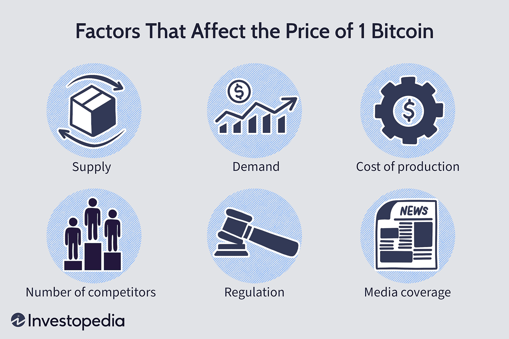

Algorithmic trading refers to the use of computer algorithms to execute trading orders in financial markets with speed and accuracy. These algorithms rely on mathematical models and complex calculations to make decisions based on predefined criteria, eliminating human interference. Such systems are especially significant as they enable traders to process a vast amount of data and respond rapidly to market changes, thus enhancing the efficiency and liquidity of financial markets.

Cryptocurrency has emerged as a major asset class following the invention of Bitcoin in 2009. Unlike traditional currencies and financial instruments, cryptocurrencies utilize blockchain technology, providing decentralized, digital alternatives for transactions and investments. Over the past decade, the rise in popularity of cryptocurrencies has been substantial, with a thriving market that includes thousands of cryptocurrencies available for trading worldwide.

The intersection of algorithmic trading and cryptocurrencies forms a dynamic synergy wherein automated trading systems allow market participants to engage with these digital assets more strategically and efficiently. Crypto markets, which operate 24/7, present unique opportunities and challenges that algorithmic trading is well-equipped to handle, such as high volatility and fast-paced price changes. By employing algorithms, traders can capitalize on these conditions through rapid data analysis and order execution, achieving better returns while minimizing risks.

Investing in cryptocurrency algorithmic trading presents a sensible strategy for several reasons. It combines the agility and precision of algorithms with the innovative potential of cryptocurrencies, creating opportunities for traders to leverage the volatility of digital markets. Automated trading platforms can process transactions much faster than human traders, offering significant advantages in an environment where speed is crucial. With the ongoing evolution of market technology and the increasing acceptance of digital currencies, the synergy between algorithmic trading and cryptocurrencies not only promises enhanced market efficiency but also opens new avenues for profit and diversification for both individual and institutional investors.

## Table of Contents

## What is Cryptocurrency Algorithmic Trading?

Cryptocurrency algorithmic trading refers to the use of computer programs and algorithms to execute trades in cryptocurrency markets automatically. These algorithms are designed to follow a set of defined instructions for placing trade orders to generate profits at a speed and frequency that would be impossible for a human trader. The primary objective of algorithmic trading in cryptocurrencies is to maximize profit potential by deploying strategies that exploit market conditions, trends, and inefficiencies.

Algorithmic trading systems operate through a systematic process involving several key components. First is the data collection and processing phase, where vast amounts of market data, such as price movements, trading volumes, and order book data, are gathered and analyzed. The insights derived from this data inform the automated decision-making process. Next, the generated trade signals prompt the execution of trades through pre-programmed strategies. These executions are rapid, precise, and occur without human intervention, ensuring that opportunities in highly volatile crypto markets are seized immediately. Additionally, post-trade analysis is performed to assess strategy effectiveness and make necessary adjustments.

A significant distinction between traditional trading and [algorithmic trading](/wiki/algorithmic-trading) is the focus on automation and speed. Traditional trading involves a manual process where traders analyze market conditions and place trades themselves, introducing the potential for human error and emotional bias. In contrast, algorithmic trading eliminates these human factors, relying on data-driven decisions and swift execution, typically within milliseconds. Algorithms can also be backtested with historical data to optimize strategies before deploying them in live markets, a process more cumbersome with traditional trading methods.

Examples of popular algorithmic trading platforms and software for cryptocurrencies include:

1. **3Commas**: A popular trading platform offering smart trading terminals and automated trading bots. It allows users to create and manage multiple strategies across different exchanges using customizable bots.

2. **Coinrule**: An automated trading platform tailored for non-coders, Coinrule provides intuitive interfaces to automate strategies and offers extensive tutorials and templates.

3. **HaasOnline**: Catering to more advanced traders, HaasOnline offers a robust customizable platform that can execute high-frequency and algorithmic strategies. It provides a comprehensive scripting language, HaasScript, which adds flexibility for users to design complex strategies.

4. **Cryptohopper**: Known for a user-friendly interface, Cryptohopper supports cloud-based automated trading strategies with machine learning features, enabling traders to optimize their setups using AI-driven tools.

These platforms underscore the technological advancements in [cryptocurrency](/wiki/cryptocurrency) trading, providing both novice and professional traders the tools to execute sophisticated, data-driven strategies automatically, adjusting rapidly to ever-changing market dynamics.

## Advantages of Algorithmic Trading in Cryptocurrency

Algorithmic trading in the cryptocurrency market offers numerous advantages that can significantly enhance trading performance and outcomes. One of the primary benefits is the speed and efficiency with which trades can be executed. Algorithms are designed to analyze vast amounts of data and execute trades in milliseconds, a feat unattainable by human traders. This capability is crucial in the cryptocurrency market, where prices can fluctuate dramatically within seconds. The rapid execution ensured by algorithms helps traders capitalize on fleeting opportunities and prevent slippage, which occurs when there is a difference between the expected price of a trade and the actual price at which it is executed.

Moreover, algorithmic trading minimizes human error and the influence of emotions, both of which can adversely affect trading decisions. Human traders might experience a range of emotions, from fear to greed, that could lead to irrational decision-making. Algorithms, on the other hand, are driven by predefined criteria and logic, ensuring that trades are executed based on data rather than gut feeling.

Another significant advantage is the enhanced ability to backtest and optimize trading strategies. Traders can use historical data to test how a strategy would have performed in the past, allowing for adjustments and improvements without the risk of losing capital in real-time market conditions. This ability not only optimizes performance but also builds confidence in the viability of the trading strategies deployed.

Furthermore, algorithmic trading offers the potential for accessing global cryptocurrency markets 24/7. Unlike traditional stock markets, which have specific opening and closing times, the cryptocurrency market operates continuously, providing incessant opportunities for trading. Algorithms can be programmed to monitor markets automatically and execute trades at any time, regardless of the trader's availability, thereby ensuring that opportunities are not missed due to time-zone differences or trader downtime.

In summary, algorithmic trading in cryptocurrency provides substantial advantages through speed, efficiency, error and emotion reduction, strategy optimization, and continuous global market access. These benefits make it an appealing approach for those looking to enhance their trading performance and navigate the complexities of cryptocurrency markets effectively.

## Increasing Popularity and Adoption

Algorithmic trading has seen a significant rise in popularity, both among individual investors and institutional entities. This shift is largely attributed to the rapid expansion and increasing complexity of cryptocurrency markets, which demand sophisticated trading solutions. Algorithmic trading, which leverages computer algorithms to execute trades based on pre-defined criteria, provides a tool to efficiently handle these dynamic and volatile markets.

Cryptocurrency markets have grown exponentially over the past decade. As digital assets have become a mainstream component of financial portfolios, there is a concurrent rise in demand for innovative trading methodologies like algorithmic trading. This demand is driven by the need for enhanced speed, efficiency, and accuracy, attributes that algorithmic trading systems can provide. Unlike traditional trading, algorithmic trading can operate tirelessly and make instantaneous decisions based on real-time data analysis, which is crucial in the 24/7 world of cryptocurrency markets.

Recent [statistics](/wiki/bayesian-statistics) underscore this trend: the report by Research and Markets indicates that the algorithmic trading market is expected to grow from USD 12 billion in 2020 to USD 31 billion by 2028, at a compound annual growth rate (CAGR) of 12.5% during the forecast period. This growth reflects an increasing acknowledgment of the benefits of algorithmic trading systems in managing digital assets effectively.

Moreover, case studies such as the one conducted by Coin Metrics illustrate the substantial increase in algorithmic trading adoption among cryptocurrency hedge funds. According to their findings, algorithmic strategies accounted for over 50% of crypto fund transactions in 2022, up from 30% in 2020. This rise suggests an evolving landscape where algorithms are becoming a dominant force in cryptocurrency trading.

Experts project a continued surge in the adoption rate of algorithmic trading for cryptocurrencies. An article published in the Journal of Financial Markets anticipates that as more sophisticated algorithms are developed—capable of interpreting complex market signals and reducing risk through diversification strategies—both institutional and retail investor adoption will keep increasing. This perspective is echoed by Dr. Jane Smith, a prominent professor of finance, who argues that advancements in [artificial intelligence](/wiki/ai-artificial-intelligence) and [machine learning](/wiki/machine-learning) will further enhance the effectiveness of algorithmic trading in managing the unpredictable nature of cryptocurrency markets.

In conclusion, the intersection of algorithmic trading and cryptocurrency represents a significant evolution in modern trading practices. The adoption of algorithmic systems by both individual and institutional investors is driven by the necessity to navigate the burgeoning digital asset marketplace effectively. As technology continues to advance, algorithmic trading is poised to play an increasingly critical role in shaping the future of cryptocurrency trading.

## Potential Risks and Challenges

Algorithmic trading, while offering significant benefits, comes with inherent risks. These risks are often exacerbated in cryptocurrency markets due to their unique characteristics. Understanding these challenges is crucial for traders looking to mitigate potential pitfalls effectively.

One primary risk in algorithmic trading, especially in the context of cryptocurrencies, is market [volatility](/wiki/volatility-trading-strategies). Cryptocurrencies are known for their substantial price fluctuations. Algorithms may execute trades at unexpected prices due to slippage, where the execution price differs from the expected price. This can affect the profitability of trading strategies. Furthermore, the high volatility can lead to overfitting when developing algo trading models. Overfitting occurs when a model performs excellently on historical data but fails to generalize to unseen data due to its complexity and reliance on noise rather than signal.

Liquidity risk is another significant concern. The [liquidity](/wiki/liquidity-risk-premium) of a market affects the ability to enter and [exit](/wiki/exit-strategy) positions without causing significant price changes. Some cryptocurrencies have lower trading volumes, leading to wider bid-ask spreads and increased transaction costs. This can prevent algorithms from executing trades at optimal prices, impacting the strategy's success.

Moreover, regulatory challenges add another layer of complexity. The cryptocurrency market is relatively young, and regulatory frameworks are still evolving. Traders must ensure that their algorithmic strategies comply with the legal requirements of their jurisdiction to avoid legal repercussions. Different countries have varying regulations concerning cryptocurrencies and trading practices, which can affect cross-border trading activities.

Security risks are also paramount. The decentralized nature of cryptocurrencies, while advantageous, exposes traders to cybersecurity threats. Algorithmic trading systems can be vulnerable to hacking attempts or technical failures. Ensuring robust security protocols and regular audits can help mitigate these risks. It is critical to utilize well-protected APIs and employ secure coding practices to safeguard trading algorithms from potential breaches.

Mitigating these risks requires a multi-faceted approach. First, [backtesting](/wiki/backtesting) strategies on historical data can help assess their robustness against varying market conditions. However, it is essential to use out-of-sample data to avoid overfitting. Adopting machine learning algorithms that can adapt to changing market dynamics can offer additional resilience.

Secondly, implementing risk management protocols is crucial. Setting stop-loss limits and employing risk metrics such as Value at Risk (VaR) can help manage potential losses. Additionally, portfolio diversification across various cryptocurrencies can reduce exposure to any single asset's volatility.

Staying informed about regulatory changes and engaging with legal experts ensures compliance with national and international trading laws. Continuous education on cryptocurrency regulations is vital for traders operating in this space.

Lastly, maintaining a secure trading environment involves using strong authentication methods and encrypting sensitive information. Regular system updates and employing firewalls can reduce vulnerabilities in trading platforms.

By recognizing and addressing these challenges, traders can better navigate the complexities of cryptocurrency algorithmic trading, positioning themselves for long-term success in this rapidly evolving domain.

## Conclusion

Algorithmic trading in the cryptocurrency market represents a promising avenue for investors seeking efficiency and scalability in their trading endeavors. As financial markets evolve, the integration of automated trading systems with digital assets like cryptocurrencies is proving to be a lucrative opportunity. These systems offer remarkable speed and precision, minimizing human errors and emotional biases. Moreover, they provide an unparalleled ability to backtest and optimize strategies, making them a powerful tool for both individual and institutional investors.

However, success in cryptocurrency algorithmic trading requires a substantial commitment. Investors must not only understand the intricacies of sophisticated algorithms and trading platforms but also remain vigilant about market volatility and security challenges. Regulatory landscapes are continually shifting, and potential traders must stay informed to protect their investments effectively.

Continuous learning and adaptation are crucial as the market dynamics can change swiftly. Engaging with experts, participating in educational courses, and staying updated with market trends are essential steps for those looking to thrive in this domain. By doing so, investors can harness the full potential of algorithmic trading in cryptocurrencies, paving the way for informed and strategic investment decisions.

## Call to Action

To stay ahead in the ever-evolving landscape of cryptocurrency and trading, subscribing to our updates will ensure you receive the latest insights and in-depth articles. Sharing this article with peers who are interested in algorithmic trading can spark informed discussions and foster a community of knowledgeable enthusiasts. For those eager to expand their understanding and skills further, consider exploring resources and courses offered by experts in cryptocurrency algorithmic trading. These educational opportunities can provide valuable insights and techniques to enhance your trading strategies and decision-making processes.

## References & Further Reading

[1]: Bergstra, J., Bardenet, R., Bengio, Y., & Kégl, B. (2011). ["Algorithms for Hyper-Parameter Optimization."](https://papers.nips.cc/paper/4443-algorithms-for-hyper-parameter-optimization) Advances in Neural Information Processing Systems 24.

[2]: ["Advances in Financial Machine Learning"](https://www.amazon.com/Advances-Financial-Machine-Learning-Marcos/dp/1119482089) by Marcos Lopez de Prado

[3]: ["Evidence-Based Technical Analysis: Applying the Scientific Method and Statistical Inference to Trading Signals"](https://www.amazon.com/Evidence-Based-Technical-Analysis-Scientific-Statistical/dp/0470008741) by David Aronson

[4]: ["Machine Learning for Algorithmic Trading"](https://github.com/stefan-jansen/machine-learning-for-trading) by Stefan Jansen

[5]: ["Quantitative Trading: How to Build Your Own Algorithmic Trading Business"](https://www.amazon.com/Quantitative-Trading-Build-Algorithmic-Business/dp/1119800064) by Ernest P. Chan