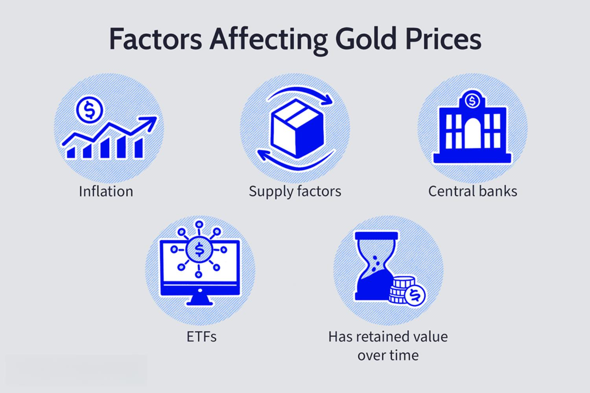

Gold has long been regarded as a stalwart investment choice, earning its place as a cornerstone of wealth preservation. Its intrinsic appeal stems from its ability to act as a safeguard against economic uncertainties, providing stability when other assets falter. This article embarks on a comprehensive exploration of gold's benefits as an investment and the strategic methods for trading it, including the innovative role of algorithmic trading.

Renowned for enduring value, gold has been a symbol of wealth across civilizations for centuries. Its allure is not only historical but also practical; gold functions as a hedge against inflation and deflation, ensuring that it maintains its purchasing power over time. This wealth-preserving quality has allowed gold to maintain its status as a safe haven during times of economic turmoil and currency devaluation.



In the modern era, the methods for investing in gold have expanded beyond the traditional purchase of physical bullion. Investors can now access gold through exchange-traded funds (ETFs), mining stocks, and emerging digital gold platforms, offering a myriad of avenues tailored to diverse investment strategies. The introduction of algorithmic trading has further transformed the landscape, providing sophisticated tools that enhance decision-making and optimize trading outcomes.

Algorithmic trading, characterized by the use of computer algorithms to execute trades based on pre-defined criteria, is increasingly relevant in gold investment. Its capacity to process large datasets and execute complex strategies at high speeds can mitigate risks and exploit market opportunities that may be imperceptible to human traders. As such, algorithmic trading represents an important innovation for those seeking to refine their gold investment strategies in contemporary markets.

Ultimately, gold's unique attributes as a durable asset, combined with the advancements in trading technology, underscore its continued significance in diversified portfolios. As we proceed through this article, the focus will be on unraveling the numerous benefits of owning gold, understanding the various investment avenues and trading strategies, and harnessing modern tools to navigate the complexities of gold investment.

## Table of Contents

## Benefits of Owning Gold

Gold has long been considered a reliable hedge against both inflation and deflation, acting as a stabilizing force in tumultuous economic times. Its inherent ability to preserve wealth across various economic conditions has made it a significant element in investment strategies.

### Gold as a Hedge Against Inflation and Deflation

Gold's status as a hedge against inflation is well-documented. Inflation erodes the purchasing power of fiat currencies, but gold often maintains or increases its value during such periods. For example, when inflation rates rise, the value of paper currency declines, leading investors to turn to gold as it typically appreciates or holds its value. The World Gold Council notes that gold's demand escalates during high inflation periods, which consequently boosts its price.

Similarly, during deflation, when prices of goods and services drop, and currencies may strengthen, gold remains a valuable asset. Deflation can lead to economic decline, as consumers and businesses reduce spending. However, gold retains its purchasing power and provides financial security to investors. Its historical performance during periods of deflation underscores its credibility as a safe investment.

### Historical Role of Gold as a Safe Haven

Gold's role as a safe haven is evident during periods of economic uncertainty and instability. Throughout history, during wars, recessions, or financial crises, investors have flocked to gold to safeguard their wealth. An example is the 2008 financial crisis, where gold prices surged as investors sought refuge from the collapsing stock markets and depreciating currencies. During such tumultuous times, gold's prominence as a secure asset is reinforced by its intrinsic value, unlinked to the performance of stocks and bonds.

### Intrinsic Value and Wealth Preservation

The intrinsic value of gold stems from its physical properties and universal acceptance as a medium of exchange and store of wealth. Unlike paper currency, gold cannot be printed or artificially created, ensuring its scarcity and long-term value. Its aesthetic appeal and practical uses in jewelry and technology further strengthen its demand.

Gold's scarcity and historical acceptance contribute significantly to its role in wealth preservation. Unlike currencies or other financial assets, gold does not rely on the creditworthiness of issuers or governments. This independence from external economic and political pressures enforces gold's standing as a reliable storage of wealth.

### Portfolio Diversification and Volatility Reduction

Gold's ability to diversify portfolios effectively is another critical benefit. By adding gold, investors can reduce overall portfolio [volatility](/wiki/volatility-trading-strategies), as gold often exhibits a low or negative correlation with other asset classes, such as equities or bonds. When market conditions cause stocks or bonds to lose value, gold's value tends to remain stable or even increase, thus balancing the overall performance of a diversified portfolio.

Theoretically, the inclusion of gold in a portfolio can be modeled using Markowitz's Modern Portfolio Theory. The theory suggests that diversification can optimize the balance between expected returns and risk, with the goal of achieving an efficient frontier. By incorporating gold, investors can move closer to this efficient frontier, achieving better risk-adjusted returns. 

In summary, owning gold provides essential benefits like acting as a hedge against inflation and deflation, serving as a safe haven during financial uncertainties, maintaining intrinsic value for wealth preservation, and offering portfolio diversification with reduced volatility. These attributes reinforce gold's esteemed position as a strategic asset in any diversified investment portfolio.

## Reasons to Own Gold

Gold has long been considered a valuable asset, particularly during periods when the U.S. dollar shows signs of weakness. This historical trend arises from the inverse relationship that commonly exists between the value of the dollar and gold prices. When the dollar depreciates, gold tends to become more attractive to investors seeking to preserve their purchasing power; this phenomenon can be attributed to gold’s intrinsic value and limited supply. As a tangible asset, gold is not directly tied to the monetary policy fluctuations that can often undermine the currency values, making it a robust option for diversifying portfolios during unfavorable currency cycles.

Geopolitical uncertainties further amplify the value of gold. In periods of political unrest or military conflict, gold is considered a "safe haven" asset. Investors gravitate towards it when the stability of other investment vehicles, such as stocks or bonds, might be threatened. This heightened demand during geopolitical crises is driven by the perception of gold as a stable store of value that is not subject to government controls or inflationary pressures. The history of gold price surges during crises such as the Gulf War, the 2008 financial crash, and the recent geopolitical tensions in various parts of the world underscore its role as a hedge against uncertainty.

The demand and supply dynamics of gold also significantly influence its appeal as an investment. Gold's supply is predominantly dictated by mining production, central bank reserves, and recycling. However, increasing difficulty in discovering new gold deposits and the complex, resource-intensive extraction process generally restrict supply growth. On the demand side, apart from its use as an investment, gold is sought after for jewelry, technology, and industrial applications. Central banks are also major holders of gold, often maintaining reserves for national security purposes, which can impact global gold demand.

Culturally and economically, gold's popularity continues to rise. Across many cultures, gold is not just a form of wealth but also a symbol of prestige and prosperity. For example, in countries like India and China, gold is deeply embedded in cultural traditions and is an integral part of celebrations, such as weddings and festivals. Economically, gold's universal acceptance and its role as a non-fiat currency make it particularly attractive in diversifying economic portfolios, especially amid growing concerns about fiat currency inflation and economic instability.

In conclusion, factors such as the weakness of the U.S. dollar, geopolitical tensions, and the complex dynamics of demand and supply contribute to gold's enduring appeal. Its cultural and economic significance further underscores why it remains a critical component of investment portfolios worldwide.

## Gold as an Investment

Investing in gold can be accomplished through several methods, each with its own characteristics and implications for investor portfolios. Common approaches include purchasing physical gold, investing in gold exchange-traded funds (ETFs), and utilizing digital gold.

1. **Physical Gold**: This category includes the acquisition of tangible assets such as coins, bars, and jewelry. Owning physical gold allows investors to directly hold the metal, offering a sense of security and control. However, it requires secure storage and insurance, which can incur additional costs. The liquidity of physical gold can vary depending on the market, potentially impacting ease of sale.

2. **Gold ETFs**: Gold ETFs provide a way to invest in gold without holding physical metal. These funds track the price of gold and are traded on stock exchanges, making them easily accessible and highly liquid. Gold ETFs can involve management fees, and they eliminate the need for storage and insurance. They also enable small or large investments based on investor preferences and offers flexibility similar to trading equities.

3. **Digital Gold**: With technological advancements, digital gold investment platforms have emerged, allowing fractional ownership of gold. Digital gold combines the simplicity of ETFs with the tangibility of physical gold, providing investors with a convenient means of exposure. Digital platforms may levy transaction fees, but they offer the advantages of easy transactions and storage handled by the platform itself.

### Gold Mining Stocks

Gold mining stocks offer another investment avenue, representing shares in companies engaged in gold extraction and production. The performance of these stocks is influenced by various factors, including gold prices, operational efficiency, and geopolitical issues affecting mining operations. They can serve as a leveraged play on gold prices; while gold mining stocks may amplify profits when gold prices rise, they can also entail higher risk and volatility.

### Market Behavior and Price Influencers

Understanding gold's market behavior involves studying various price influencers, including:

- **Supply and Demand**: Gold supply is impacted by mining output and recycling, while demand is driven by consumption in jewelry, technology, and investment. Discrepancies between supply and demand affect price stability.

- **Currency Strength**: Generally priced in U.S. dollars, gold often has an inverse relationship with the dollar's strength. When the dollar weakens, gold prices tend to rise, attracting investors seeking protection against currency depreciation.

- **Interest Rates**: Lower interest rates decrease the opportunity cost of holding gold, as gold does not offer interest or dividends. Consequently, gold becomes more attractive when interest rates are low.

- **Geopolitical Instability**: In times of political or economic uncertainty, gold often serves as a safe haven asset. Its value increases as investors flock to it for security, driving up demand and prices.

Investors should consider these factors carefully when exploring gold as an investment option, tailoring their approach to align with personal financial goals and market conditions.

## Algorithmic Trading in Gold Investment

Algorithmic trading refers to the use of computer algorithms to automate trading decisions and execute orders at speeds and frequencies that are unachievable by human traders. This advancement is particularly relevant in modern markets, where timeliness and efficiency can significantly influence investment outcomes. Algorithmic trading systems, often powered by complex mathematical models and high-speed data analysis, allow investors to enhance their gold investment strategies by providing rapid execution and the ability to process large datasets that drive trading decisions.

**Benefits of Algorithmic Trading in Gold Investment**

Algorithmic trading offers multiple benefits for investors focusing on gold. Firstly, it reduces the emotional and cognitive biases that often plague human decision-making, ensuring that trades adhere strictly to predefined criteria. Secondly, algorithms can operate around the clock, monitoring market conditions and executing trades in response to real-time data, thereby optimizing the timing of transactions. This is particularly advantageous in the gold market, known for its volatility and susceptibility to political and economic events.

Furthermore, [algorithmic trading](/wiki/algorithmic-trading) enables [backtesting](/wiki/backtesting), allowing investors to test their strategies against historical data before committing capital. This feature enhances risk management by revealing the potential performance and risks associated with specific trading approaches.

**Examples of Algorithmic Models and Technologies**

Numerous algorithmic models and technologies are employed in gold trading platforms. These range from simple moving averages and trend-following strategies to more intricate ones like statistical [arbitrage](/wiki/arbitrage), where the algorithm seeks to exploit pricing inefficiencies between gold and related securities.

One popular model is the Mean Reversion strategy, which speculates that gold prices will revert to their historical average over time. This involves identifying periods when gold is overbought or oversold relative to historical norms and executing trades based on these insights. The Mean Reversion model can be mathematically expressed as:

$$
P_t = \mu + \theta (P_{t-1} - \mu) + \epsilon_t
$$

Where $P_t$ is the current gold price, $\mu$ is the mean price level, $\theta$ is the speed of reversion, and $\epsilon_t$ represents random noise.

Python implementations of such strategies make use of libraries like Pandas for data manipulation, NumPy for numerical calculations, and SciPy for statistical analysis:

```python
import numpy as np
import pandas as pd

# Example of a simple Mean Reversion Strategy
def mean_reversion_strategy(prices, window=50):
    rolling_mean = prices.rolling(window=window).mean()
    rolling_std = prices.rolling(window=window).std()

    # Define buy and sell signals
    buy_signals = prices < (rolling_mean - rolling_std)
    sell_signals = prices > (rolling_mean + rolling_std)

    return buy_signals, sell_signals

# Assume 'gold_prices' is a DataFrame with historical gold prices
buy, sell = mean_reversion_strategy(gold_prices['close'])
```

More sophisticated techniques involve Machine Learning algorithms, such as Support Vector Machines (SVM) or Random Forests, which analyze complex patterns in market data and predict future movements in gold prices with greater accuracy.

Lastly, high-frequency trading ([HFT](/wiki/high-frequency-trading-strategies)) strategies capitalize on minute price fluctuations over extremely short time frames. These require highly specialized infrastructure, including low-latency networks and direct market access, to gain an edge in execution speed and data processing.

Algorithmic trading fundamentally changes how investors approach gold markets by enhancing efficiency and decision-making through advanced technologies and strategic insight.

## Risks Associated with Gold Investment

Gold investment, while often viewed as a secure asset, carries several risks closely tied to various global factors. One primary risk is the volatility in gold prices due to economic changes. Gold prices tend to fluctuate based on macroeconomic indicators like inflation rates, interest rates, and currency strength, particularly the U.S. dollar. During periods of economic instability, gold is generally seen as a safe haven, but its prices can experience sharp swings due to speculative trading and economic forecasts.

Another significant risk is the potential for regulatory and geopolitical events to influence gold markets. Changes in mining regulations or export/import restrictions can affect gold supply and subsequently impact its pricing. Additionally, geopolitical tensions can lead to increased demand for gold as a protective investment, further driving up prices but also increasing market unpredictability.

Technology advancements and algorithmic trading offer tools to mitigate some of these risks. Algorithmic trading uses computer programs to execute trades at high speeds and can analyze vast datasets to identify patterns and forecast market movements. This efficiency can help investors respond swiftly to market volatilities caused by economic shifts or geopolitical events. For example, sentiment analysis algorithms can gauge market mood based on geopolitical developments, allowing investors to adjust their positions accordingly.

Python, a programming language widely used in financial markets, can aid in developing these trading algorithms. Here's a simple example of using Python to analyze volatility:

```python
import pandas as pd
import numpy as np

# Simulate gold prices
data = {'Date': pd.date_range(start='1/1/2020', periods=100, freq='D'),
        'Gold_Price': np.random.normal(loc=1500, scale=50, size=100)}

df = pd.DataFrame(data)
df['Returns'] = df['Gold_Price'].pct_change()

# Calculate Volatility
volatility = df['Returns'].std() * np.sqrt(252)  # Annualized volatility
print(f"Annualized Volatility: {volatility}")
```

This script calculates annualized volatility, helping investors understand potential price fluctuations. By integrating such analyses into trading strategies, investors can potentially reduce exposure to sudden market changes. Moreover, continual advancements in [machine learning](/wiki/machine-learning) and [artificial intelligence](/wiki/ai-artificial-intelligence) promise even more robust tools for predictive analytics, offering further pathways to mitigate the inherent risks associated with gold investment.

## Conclusion

Gold has historically proven itself to be a pivotal component of a diversified investment portfolio. Its strategic importance is rooted in its ability to act as a hedge against economic instability and currency fluctuations. By providing a counterbalance to more volatile asset classes, gold helps investors mitigate risks and preserve wealth. Incorporating gold into a portfolio can effectively reduce overall volatility, as evidenced by its negative correlation with equities and bonds during certain economic cycles.

In recent years, the advent of modern trading tools and technologies has further enhanced the accessibility and appeal of gold investment. Algorithmic trading and advanced analytical platforms have enabled investors to execute trades with greater precision and reduced transaction costs. These technologies allow for optimizing investment strategies in real-time, catering to both short-term gains and long-term sustainability.

Moreover, the timeless value of gold underscores its significance in future investment strategies. As geopolitical tensions and economic uncertainties persist worldwide, gold's intrinsic value remains a constant, offering assurance to investors. Its demand dynamics, influenced by cultural, industrial, and technological applications, strengthen its position within global markets.

In conclusion, gold's versatility as both a traditional store of value and a modern investment tool makes it indispensable for investors seeking resilience and growth potential. By leveraging contemporary trading technologies, investors can unlock new opportunities and enhance the strategic impact of gold within their diversified portfolios. As such, gold continues to promise a robust outlook for the future of investment strategies, given its ability to adapt to changing market landscapes while retaining its core value propositions.

## References & Further Reading

[1]: Erb, C. B., & Harvey, C. R. (2013). ["The Golden Dilemma."](https://www.nber.org/papers/w18706) Financial Analysts Journal, 69(4), 10-42.

[2]: ["The Strategic Case for Gold as a Central Bank Reserve Asset"](https://www.gold.org/central-banks/gold-reserve-asset) by the World Gold Council

[3]: Baur, D. G., & Lucey, B. M. (2010). ["Is Gold a Hedge or a Safe Haven? An Analysis of Stocks, Bonds and Gold."](https://onlinelibrary.wiley.com/doi/10.1111/j.1540-6288.2010.00244.x) Financial Review, 45(2), 217-229.

[4]: ["Guide to Gold: How is gold a safe haven, inflation hedge, and portfolio diversifier?"](https://www.forbes.com/advisor/investing/guide-to-investing-in-gold/) by S&P Global Market Intelligence

[5]: Farmer, J. D., & Skouras, S. (2013). ["Review of 'The Impact of Algorithmic Trading on Market Dynamics: Evidence from the Johannesburg Stock Exchange'"](https://pmc.ncbi.nlm.nih.gov/articles/PMC10535977/) Economic Journal, Royal Economic Society.