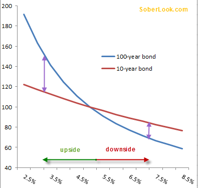

## Table of Contents

## What is a 100-year bond?

A 100-year bond is a type of bond that lasts for 100 years before it matures. When you buy a bond, you are lending money to the issuer, which could be a government or a company. In return, they promise to pay you back the full amount after 100 years, plus interest payments along the way. These bonds are also called centennial bonds because they last for a century.

These long-term bonds are not very common because it's hard to predict what will happen over such a long time. For example, a company might not exist in 100 years, or a government might face many changes. Investors who buy these bonds usually believe that the issuer is very stable and will be around for the full term. They might also want a steady income from the interest payments over a very long period.

## Why would a company issue a 100-year bond?

A company might issue a 100-year bond to get money for a long time without having to pay it back soon. This can be helpful if the company is working on big projects that will take many years to finish, like building new factories or doing research that will pay off in the future. By using a 100-year bond, the company can spread out the cost of these projects over a very long time, making it easier to manage their money.

Another reason is that a 100-year bond can show that the company is very stable and confident about its future. If investors see that a company is willing to borrow money for such a long time, they might think the company will be around for a long time too. This can make the company look more trustworthy and attract more investors. Also, the interest rates on these bonds might be lower than shorter-term bonds, which can save the company money on interest payments over time.

## What are the benefits of issuing a 100-year bond for a company?

Issuing a 100-year bond can help a company get money for a very long time. This is good if the company is doing big projects that will take many years to finish, like building new factories or doing research that will pay off in the future. By using a 100-year bond, the company can spread out the cost of these projects over a very long time. This makes it easier for the company to manage their money because they don't have to pay back the money soon.

Another benefit is that issuing a 100-year bond can show that the company is very stable and confident about its future. When investors see that a company is willing to borrow money for such a long time, they might think the company will be around for a long time too. This can make the company look more trustworthy and attract more investors. Also, the interest rates on these long-term bonds might be lower than shorter-term bonds, which can save the company money on interest payments over time.

## What are the risks associated with issuing a 100-year bond?

Issuing a 100-year bond can be risky for a company because it's hard to predict what will happen over such a long time. The company might face big changes or problems that make it hard to keep paying the interest on the bond. For example, if the company's business does not do well, it might not have enough money to make the interest payments. This can lead to financial trouble and even bankruptcy if the company cannot meet its obligations.

Another risk is that interest rates might change a lot over 100 years. If interest rates go up, the company might have to pay more in interest than it planned. This can make the bond more expensive than expected. Also, if the company wants to borrow more money in the future, it might have to pay higher interest rates because it already has a big debt from the 100-year bond.

Lastly, the value of the bond can change a lot over time. If investors think the company is not doing well or if the economy changes, the bond might lose value. This can make it hard for the company to sell the bond if it needs to raise money quickly. It also means that investors might lose confidence in the company, which can hurt its reputation and make it harder to get money in the future.

## How do 100-year bonds affect a company's financial strategy?

Issuing a 100-year bond can change a company's financial strategy a lot. It gives the company money for a very long time, which is good if they are working on big projects that will take many years to finish. This means they can spread out the cost of these projects over a long time, making it easier to manage their money. It also shows that the company is stable and confident about its future, which can attract more investors and make the company look more trustworthy. Plus, the interest rates on these long-term bonds might be lower, which can save the company money on interest payments over time.

But there are also risks that can affect the company's financial strategy. It's hard to predict what will happen over 100 years, and the company might face big changes or problems that make it hard to keep paying the interest on the bond. If the company's business does not do well, it might not have enough money to make the interest payments, which can lead to financial trouble. Also, if interest rates go up, the company might have to pay more in interest than it planned, making the bond more expensive. The value of the bond can also change a lot over time, which can hurt the company's reputation and make it harder to get money in the future.

## What types of companies typically issue 100-year bonds?

Companies that issue 100-year bonds are usually very big and stable. They might be big companies in industries like energy, utilities, or infrastructure. These companies often need a lot of money to build things like power plants or highways that will last for many years. By issuing a 100-year bond, they can get the money they need without having to pay it back soon. This helps them spread out the cost of their big projects over a very long time.

Sometimes, governments or government-owned companies also issue 100-year bonds. They might do this to pay for big projects like building new roads or schools. These bonds show that the government is confident about its future and can attract investors who want to invest in something that will last a long time. But, it's a big commitment because the government has to keep paying interest for 100 years, which can be hard if things change a lot over that time.

## How does the interest rate environment influence the decision to issue a 100-year bond?

The [interest rate](/wiki/interest-rate-trading-strategies) environment plays a big role in a company's decision to issue a 100-year bond. When interest rates are low, it's a good time for companies to borrow money because they can get it at a lower cost. Issuing a 100-year bond during a period of low interest rates means the company can lock in these low rates for a very long time. This can save them a lot of money on interest payments over the next century. Companies might want to take advantage of this opportunity if they think interest rates will go up in the future.

On the other hand, if interest rates are high, companies might be less likely to issue a 100-year bond. High interest rates mean the company will have to pay more to borrow money, and locking in high rates for 100 years can be very expensive. Companies might wait for a better time when rates are lower. Also, if interest rates are expected to go down in the future, companies might choose shorter-term bonds instead, so they can borrow again at lower rates later. So, the current and expected future interest rate environment can really affect a company's decision to issue a 100-year bond.

## What is the impact of 100-year bonds on a company's credit rating?

Issuing a 100-year bond can affect a company's credit rating in different ways. If the company is seen as very stable and able to pay back the bond over such a long time, its credit rating might stay the same or even get better. This is because investors might think the company is confident about its future and can handle the long-term debt. A good credit rating helps the company borrow money more easily and at lower interest rates.

But, there are also risks that can hurt the company's credit rating. If investors think the company might have trouble paying the interest on the bond for 100 years, the credit rating might go down. This can happen if the company's business does not do well or if the economy changes a lot. A lower credit rating makes it harder for the company to borrow money and can make future borrowing more expensive. So, the impact on the credit rating depends a lot on how investors see the company's ability to manage the long-term debt.

## How do investors perceive 100-year bonds, and what influences their decision to invest in them?

Investors see 100-year bonds as a way to get money over a very long time. They might like these bonds if they think the company or government that issued them is very stable and will be around for the next 100 years. These bonds can be good for investors who want a steady income from interest payments for a long time. But, they also know that it's hard to predict what will happen over such a long time, so they might be worried about the company's ability to keep paying the interest.

A few things can influence an investor's decision to buy a 100-year bond. They look at the interest rate the bond offers. If the rate is high compared to other investments, they might be more interested. They also think about the credit rating of the company or government issuing the bond. A good credit rating makes them feel more confident that the bond will be paid back. Lastly, they consider the overall economy and how it might change over the next century. If they think the economy will stay strong, they might be more likely to invest in a 100-year bond.

## What are the historical examples of companies issuing 100-year bonds, and what were the outcomes?

One famous example of a company issuing a 100-year bond is Coca-Cola. In 1993, Coca-Cola issued a 100-year bond to raise money. They did this because they thought they would be around for a long time and could pay back the bond. The bond was successful, and it showed that investors trusted Coca-Cola a lot. The bond was issued at a time when interest rates were good, and it helped Coca-Cola get money at a low cost. Over the years, Coca-Cola has been able to keep paying the interest on the bond, which has helped them stay stable.

Another example is the French company, Pernod Ricard, which issued a 100-year bond in 2015. They did this to get money for their long-term plans. The bond was well-received by investors because Pernod Ricard is a big and stable company. They issued the bond when interest rates were low, which helped them save money on interest payments. So far, Pernod Ricard has been able to keep up with the interest payments, showing that they can handle the long-term debt well.

## How do regulatory environments affect the issuance of 100-year bonds?

Regulatory environments can have a big impact on whether a company decides to issue a 100-year bond. Different countries have different rules about how companies can borrow money and what they need to do to issue long-term bonds. For example, some countries might have strict rules about how much debt a company can have or what kind of information they need to share with investors. If the rules are too strict, it might be hard for a company to issue a 100-year bond because they might not be able to meet all the requirements. On the other hand, if the rules are more relaxed, it might be easier for companies to issue these bonds and attract investors.

Also, changes in regulations can affect existing 100-year bonds. If a government changes the rules about how companies can handle their debt, it might make it harder for a company to keep paying the interest on their bond. For example, new rules might limit how much money a company can borrow or change the way they have to report their finances. These changes can make investors worried about the company's ability to meet its long-term obligations, which can affect the value of the bond and the company's ability to issue new bonds in the future. So, the regulatory environment plays a big role in the decision to issue a 100-year bond and how well it does over time.

## What are the future trends and predictions regarding the use of 100-year bonds by companies?

In the future, more companies might start using 100-year bonds if interest rates stay low. When interest rates are low, it's cheaper for companies to borrow money. They can lock in these low rates for a long time, which can save them a lot of money on interest payments. Also, if companies think the economy will stay strong and they will be around for a long time, they might feel more confident about issuing these long-term bonds. This can help them get money for big projects that will take many years to finish.

But, there are also reasons why fewer companies might use 100-year bonds in the future. It's hard to predict what will happen over such a long time, and companies might be worried about big changes or problems that could make it hard to keep paying the interest on the bond. Also, if regulations get stricter about how much debt companies can have, it might be harder for them to issue these bonds. So, the future of 100-year bonds will depend a lot on the economy, interest rates, and the rules that companies have to follow.

## References & Further Reading

[1]: ["The Perils of 100-Year Debt"](https://www.thebalancemoney.com/national-debt-by-year-compared-to-gdp-and-major-events-3306287) - The Economist.

[2]: ["The Walt Disney Company Sells 100-Year Bonds"](https://www.latimes.com/archives/la-xpm-1993-07-22-fi-15802-story.html) - The New York Times, 1993.

[3]: ["Austria Sells 100-Year Bonds at Just 2.1%"](https://www.marketwatch.com/story/bond-buyers-battered-as-austrias-100-year-note-shows-danger-of-duration-risk-c4f137a5) - Financial Times, 2017. 

[4]: Aldridge, I. (2013). ["High-Frequency Trading: A Practical Guide to Algorithmic Strategies and Trading Systems."](https://www.amazon.com/High-Frequency-Trading-Practical-Algorithmic-Strategies/dp/1118343506) Wiley.

[5]: Narang, R. (2009). ["Inside the Black Box: A Simple Guide to Quantitative and High-Frequency Trading."](https://onlinelibrary.wiley.com/doi/book/10.1002/9781118267738) Wiley.