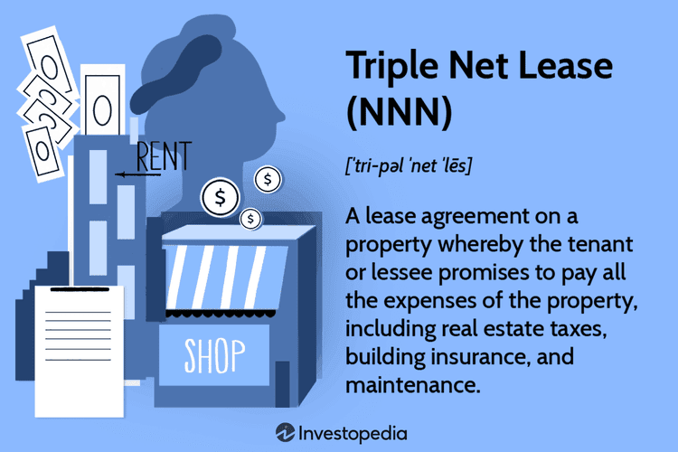

The commercial real estate landscape is undergoing significant transformation due to technological advancements and evolving market demands. As investors seek new strategies for maximizing returns, innovative approaches like triple net leases and algorithmic trading have gained prominence. 

Triple net leases (NNN) involve a property leasing arrangement where tenants assume responsibility for property taxes, insurance, and maintenance costs, in addition to paying rent. This lease structure appeals to landlords seeking reduced management duties and stable income streams due to its predictability and lower financial risk. Commonly utilized for commercial properties such as retail spaces, office buildings, and industrial facilities, triple net leases typically attract creditworthy tenants, thus ensuring consistent revenue.

Algorithmic trading, traditionally associated with financial markets, is being adapted for real estate investments. By leveraging data-driven algorithms, investors can optimize portfolio management and decision-making processes. The adaptation of algorithmic strategies to real estate involves utilizing large datasets for predictive analysis, enhancing trading efficiency, and minimizing emotional bias.

The integration of triple net leases and algorithmic trading presents an innovative strategy for landlords. Triple net leases provide stable and predictable inputs for algorithmic models, enabling more reliable analysis and forecasting. This synergy allows for enhanced portfolio optimization and risk management, offering potential benefits such as increased profitability and streamlined operations.

This article aims to elucidate the advantages and considerations for landlords exploring the integration of triple net leases and algorithmic trading. By understanding these approaches, landlords can better position themselves to harness the benefits of these strategies, ultimately maximizing their commercial real estate investments.

## Table of Contents

## Understanding Triple Net Leases

A triple net lease (NNN) is a lease agreement on a property whereby the tenant agrees to pay all the expenses of the property, including real estate taxes, building insurance, and maintenance. This structure contrasts with a gross lease, where the landlord agrees to cover these costs. The primary appeal of a triple net lease lies in its capacity to generate predictable income streams for landlords, minimizing their management responsibilities, as the tenant assumes the burden of maintenance costs and other property-related expenses.

### Key Advantages for Landlords

One of the principal advantages for landlords engaging in NNN leases is the reduction of management responsibilities. Since tenants are responsible for most property-related expenses, landlords are relieved from dealing with the logistics of managing these aspects. This leads to predictable income streams as the likelihood of unexpected expenses affecting monthly returns is minimized.

This lease structure is particularly appealing to investors seeking stable, passive income, as it allows them to focus on other investments or business ventures. The fixed income associated with NNN leases can also be leveraged for borrowing against the property, providing landlords with increased financial flexibility.

### Typical Properties and Tenants

NNN leases are commonly applied to commercial properties, including retail spaces, industrial properties, and office buildings. They often attract tenants who require long-term occupancy and are willing to invest in the property's maintenance due to the nature of their business operations. These tenants typically include large retail chains, fast-food franchises, grocery stores, and other established businesses that benefit from consistent location presence.

### Factors for Consideration

When drafting NNN leases, landlords must consider several critical factors to optimize profitability and tenant satisfaction:

1. **Tenant Creditworthiness**: The tenant's financial stability is paramount. Landlords should assess the creditworthiness of potential tenants to minimize the risk of default.

2. **Lease Terms**: Detailed lease terms should be established, covering the duration, rent adjustments, and responsibility for specific expenses. Clear terms help prevent disputes and ensure a smooth landlord-tenant relationship.

3. **Property Location**: Market conditions and location significantly influence NNN lease profitability. Properties in high-demand areas with robust consumer traffic generally yield higher returns.

4. **Maintenance Clauses**: While tenants are typically responsible for maintenance, the lease should specify which expenses are covered to avoid future conflicts.

### Impact of Market Conditions

Market conditions have a direct impact on the profitability of NNN leases. In strong economic environments, high occupancy rates and competitive rental prices can increase income and property value. However, in downturns, landlords might face challenges such as tenant defaults or the need for rent concessions.

Investors must remain vigilant about market trends and economic indicators to adjust their strategies accordingly. For example, during economic expansion, landlords might take advantage of increasing demand to negotiate higher rents, whereas economic slowdowns may necessitate more flexible leasing terms to retain tenants.

Overall, triple net leases offer landlords a strategic investment opportunity by combining reduced management responsibilities with predictable income. By carefully evaluating tenant profiles, lease terms, and market dynamics, landlords can maximize the benefits of this lease structure.

## Algorithmic Trading in Real Estate

Algorithmic trading, also known as algo trading, has its origins in the financial markets, where it was developed to automate trading strategies and make quick, data-driven decisions based on algorithms. Algorithms, essentially a set of instructions or rules, were initially employed to exploit market inefficiencies or simply to execute large orders without impacting the market price significantly. The advent of high-frequency trading ([HFT](/wiki/high-frequency-trading-strategies)) in the late 20th century marked the significant uptake of algorithms in trading, leveraging advancements in technology to make trades within microseconds.

In the context of real estate investments, [algorithmic trading](/wiki/algorithmic-trading) is beginning to make its mark by adapting financial market strategies to the real estate sector's unique characteristics. Real estate, traditionally viewed as a less liquid and slower-moving market compared to equities, presents different challenges and opportunities for algorithmic applications. The adaptation involves using algorithms to analyze large datasets related to property prices, rental rates, demographic information, and economic indicators, aiming to identify investment opportunities or optimize property portfolio management strategies.

The key advantages of employing algorithmic trading in real estate are its efficiency, reliance on data-driven decisions, and reduced emotional bias. Efficiency stems from the algorithm's ability to process vast amounts of information quickly and execute trades or decisions rapidly. Data-driven decision-making allows for the analysis of historical and real-time data to forecast future trends and identify investment opportunities. By eliminating the emotional component of decision-making, algorithms help investors avoid impulsive decisions driven by fear or greed, which can happen in manual trading processes.

Several specific algorithms are being adapted for use in the real estate market. Statistical [arbitrage](/wiki/arbitrage), commonly used in the equities market, can be modified to explore pricing inefficiencies in different real estate assets or locations. Machine learning algorithms, such as regression analysis or neural networks, are used to predict future property values based on historical data and current trends. Another noteworthy algorithm is the genetic algorithm, which mimics the process of natural evolution to identify optimal solutions for complex problems, like determining the best property investment strategies based on a set of variables.

Despite its advantages, integrating algorithmic trading into real estate portfolios is not without challenges and risks. One significant challenge is the availability and quality of data. While financial markets offer vast amounts of high-frequency data, real estate data can be sparse, non-standardized, and often requires significant preprocessing to be useful. Another risk is overfitting, where an algorithm is trained so closely on historical data that it performs poorly on new, unseen data. Market conditions can also change, rendering an algorithm that performed well in the past less effective in the future. Additionally, real estate investments often involve larger capital requirements and longer time horizons, which may not align well with the fast-paced modifications typically seen in algorithmic trading strategies in financial markets.

Ultimately, the integration of algorithmic trading into real estate holds great potential for optimizing investment strategies and improving decision-making processes. However, it requires careful consideration of data quality, model reliability, and market conditions to ensure successful implementation.

## The Synergy between Triple Net Leases and Algorithmic Trading

The integration of Triple Net Leases (NNN) into algorithmic trading can significantly enhance investment strategies by offering stable inputs for trading models. NNN leases provide predictable, long-term cash flows, largely due to the tenant's responsibility for property expenses such as taxes, insurance, and maintenance. This financial stability can be quantified and incorporated into algorithmic trading models, which thrive on consistency and reliable data.

Case studies demonstrate successful integrations of NNN leases and algorithms. For instance, some real estate investment trusts (REITs) have adopted algorithms to assess property performance and optimize lease agreements. These algorithms use data from NNN leases to adjust investment strategies, ensuring that portfolios remain aligned with current market conditions. A notable example involves a REIT implementing a [machine learning](/wiki/machine-learning) algorithm to predict property values and tenant solvency based on historical data from their NNN properties. By analyzing these trends, the REIT could enhance their portfolio's overall return while mitigating risk.

The advantages of algorithmic trading in managing and optimizing NNN lease portfolios are manifold. Algorithms can analyze large datasets quickly and efficiently, identifying optimal lease terms and flagging potential issues, such as a tenant's financial instability. This data-driven approach reduces emotional biases and improves decision-making processes by relying on objective insights rather than subjective judgments.

Landlords considering a shift to algorithm-based portfolio management can deploy several strategies. A starting point involves collaborating with data scientists to develop algorithms tailored to their specific portfolio characteristics. These algorithms can be trained using historical lease and market data to enhance prediction accuracy. Additionally, landlords should invest in technology that integrates seamlessly with existing property management systems, facilitating real-time data collection and analysis. 

Future trends in the synergy between NNN leases and algorithmic trading point towards increased use of [artificial intelligence](/wiki/ai-artificial-intelligence) (AI) and machine learning (ML) to enhance predictive accuracy further. As more sophisticated algorithms are developed, they will be capable of processing complex datasets from various sources, including macroeconomic indicators and real estate market trends, to predict future performance more accurately. This evolution suggests a growing role for algorithmic models in not only maintaining and optimizing real estate portfolios but also in strategic planning and investment decision-making processes.

In conclusion, integrating NNN leases into algorithmic trading models offers significant benefits for landlords aiming to enhance their investment strategies. By leveraging stable cash flows from NNN leases, landlords can effectively utilize algorithmic trading to optimize their portfolios, foresee market changes, and mitigate risks. As technology progresses, these innovative approaches are expected to become integral to real estate investment strategies, prompting landlords to adapt and evolve continuously.

## Considerations and Best Practices for Landlords

When landlords choose to leverage triple net leases (NNN) with algorithmic trading, they must navigate a complex investment landscape. Identifying and understanding potential pitfalls will enable more effective decision-making and strategy development. 

One critical consideration is the integration of two disparate domains: real estate management and algorithmic trading. The former involves stable, often long-term property agreements, while the latter relies on rapid, data-driven market actions. The first pitfall lies in the synchronization between these two investment approaches. Landlords must ensure that their algorithmic models are equipped to handle the relatively static data from NNN leases without making premature or excessive trading decisions. The challenge is to balance the historically slow-moving nature of real estate data with the fast-paced demands of algorithmic trading.

Effective due diligence and market research are indispensable. Landlords should analyze historical data on property performance and market trends to calibrate their algorithms accurately. Detailed risk management protocols should be put in place, incorporating stress testing of trading models against various economic scenarios. These measures can mitigate risks associated with overreliance on algorithmic predictions in a field that has inherent stability but can face sudden fluctuations due to unforeseen events.

Collaboration is key to success in this hybrid approach. Landlords should partner with technology experts who specialize in algorithmic models, as well as financial analysts with experience in real estate markets. Such collaboration can help bridge the knowledge gap between real estate management and algorithmic trading, facilitating a more coherent and efficient integration process. By working alongside these experts, landlords can develop and refine algorithms that are attuned to the unique characteristics of NNN leases, thereby optimizing investment outcomes.

To maintain a competitive edge, staying updated with technological advancements and market trends is vital. Real estate markets can be influenced by technological changes such as smart building technologies, blockchain for transparent transactions, and new data analytics platforms. Similarly, advancements in artificial intelligence and machine learning are continuously evolving the capabilities of algorithmic trading systems. Engaging in continuous learning and adapting to these changes can prevent obsolescence and improve investment outcomes.

For landlords seeking to enhance their investment strategies, a number of resources and tools are recommended. Online platforms offering real estate analytics and market forecasting, such as CoStar and REIS, provide valuable data to inform decision-making. Additionally, software solutions like QuantConnect and Algorithmia enable the testing and validation of algorithmic trading strategies in real estate settings. Engaging in professional networks and forums can also be beneficial, offering insights and shared experiences from peers in the industry.

By recognizing and addressing these considerations, landlords can effectively harness the synergies between triple net leases and algorithmic trading, maximizing the profitability and resilience of their investment portfolios.

## Conclusion

The integration of Triple Net Leases (NNN) and algorithmic trading presents significant opportunities for landlords looking to enhance their investment portfolios. NNN leases offer predictable income with reduced management responsibilities, making them an attractive component of a stable real estate portfolio. This stability provides a solid foundation for algorithmic trading strategies, which can use these reliable income streams as crucial inputs for data-driven decision making.

Algorithmic trading in real estate introduces efficiency and accuracy by minimizing human bias and optimizing asset management through advanced data analytics. With algorithms capable of processing vast amounts of data swiftly, landlords can better understand market trends and capitalize on them effectively. The synergy between NNN leases and algorithmic models allows for the dynamic management of portfolios, potentially leading to optimizations and increased profitability.

Thorough research and preparation are vital to successfully leverage these strategies. Understanding market dynamics, investing in the right technologies, and collaborating with experts can mitigate risks associated with these approaches. Engaging with these innovative methods requires a commitment to staying informed about technological advancements and evolving market conditions, which are crucial for maintaining a competitive edge.

The world of commercial real estate investment is evolving rapidly, with technology playing an increasingly pivotal role. Landlords are encouraged to embrace these innovative strategies to maximize profitability and ensure sustainable growth. Continuous learning and participation in discussions within the field can further enhance the capabilities and strategies landlords employ.

As the real estate landscape continues to innovate, the amalgamation of traditional models like NNN leases with cutting-edge technologies such as algorithmic trading will likely chart the path forward. This convergence not only marks a shift towards more sophisticated investment strategies but also heralds a promising future for commercial real estate investments.

## References & Further Reading

[1]: ["Triple Net Lease: Defined and Explained"](https://www.investopedia.com/terms/t/triple-net-lease-nnn.asp) by Investopedia

[2]: ["Algorithmic and High-Frequency Trading"](https://www.cambridge.org/us/universitypress/subjects/mathematics/mathematical-finance/algorithmic-and-high-frequency-trading) by Álvaro Cartea, Sebastian Jaimungal, and José Penalva

[3]: ["Blockchain in Commercial Real Estate: The Future of Leasing & Investing?"](https://www2.deloitte.com/us/en/pages/financial-services/articles/blockchain-in-commercial-real-estate.html) by Built In

[4]: ["The Real Estate Wholesaling Bible: The Fastest, Easiest way to Get Started in Real Estate Investing"](https://www.amazon.com/Real-Estate-Wholesaling-Bible-Investing/dp/1118807529) by Than Merrill

[5]: ["Adaptive Markets: Financial Evolution at the Speed of Thought"](https://www.jstor.org/stable/j.ctvc7778k) by Andrew W. Lo

[6]: ["Machine Learning for Factor Investing: R Version"](http://www.mlfactor.com/) by Guillaume Coqueret and Tony Guida

[7]: ["Real Estate Market Analysis: Trends, Methods, and Information Sources"](https://www.amazon.com/Real-Estate-Market-Analysis-Information/dp/0874204283) by John D. Bardwell and Deborah L. Brett