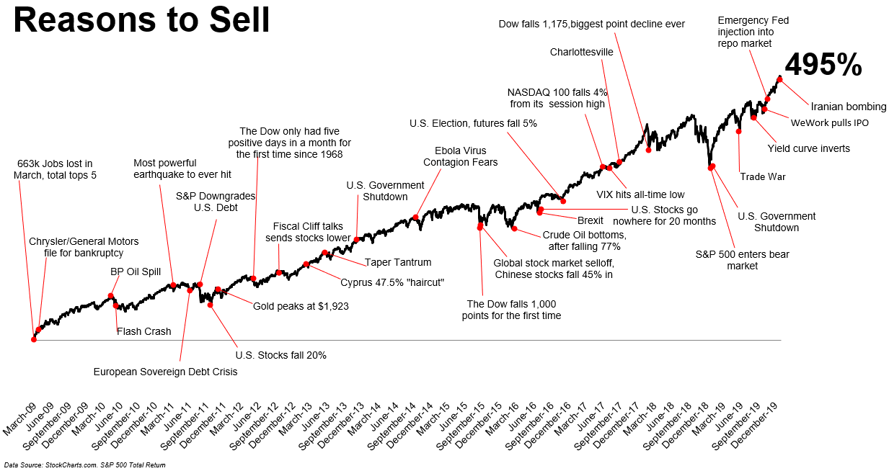

## Table of Contents

## What are the basic reasons a beginner might consider selling stocks?

A beginner might consider selling stocks for a few basic reasons. One reason is if the stock's price has gone up a lot and they want to make a profit. If they bought the stock at a lower price and it's now worth more, selling it can give them that profit. Another reason is if the stock's price is going down and they want to avoid losing more money. If they see the price dropping and think it will keep dropping, selling the stock can help them lose less money than if they waited.

Another reason a beginner might sell stocks is if they need money for something else. If they have an emergency or a big expense coming up, they might need to sell their stocks to get cash. Lastly, a beginner might sell if they change their mind about the company. Maybe they learn something bad about the company or the industry, or maybe they just don't believe in the company anymore. In any of these cases, selling the stock can be a good choice for them.

## How can a change in personal financial goals influence the decision to sell stocks?

A change in personal financial goals can really affect whether someone decides to sell their stocks. If someone's goal used to be to grow their money over a long time, they might have been okay with keeping their stocks even if the prices went up and down a lot. But if their goal changes to needing money sooner, like to buy a house or pay for school, they might decide to sell their stocks to get that money. They might not want to wait for the stock prices to go up more if they need the money now.

Also, if someone's goal changes from wanting to take big risks to wanting to be safer with their money, they might sell their stocks. Stocks can be risky because their prices can change a lot. If someone decides they want to be more careful with their money, they might sell their stocks and put the money in something safer, like a savings account or bonds. So, when someone's financial goals change, it can make them think differently about whether to keep or sell their stocks.

## What role does portfolio diversification play in deciding to sell stocks?

Portfolio diversification means spreading your money across different types of investments, like stocks, bonds, and maybe even real estate. It's like not putting all your eggs in one basket. If you have a lot of your money in just one or two stocks, you might decide to sell some of them to make your portfolio more diverse. This way, if one of your investments does badly, it won't hurt your whole portfolio as much. So, selling stocks to buy other types of investments can help you manage risk better.

Diversification can also make you think about selling stocks if one part of your portfolio is doing much better than the others. If you see that one stock or type of stock is growing a lot more than the rest, you might want to sell some of it to keep your portfolio balanced. This way, you're not too dependent on just one investment. By selling some of your stocks and using the money to buy other investments, you can keep your portfolio diverse and reduce the chance of big losses if something goes wrong with one of your investments.

## How do market conditions affect the decision to sell stocks?

Market conditions can really change whether someone decides to sell their stocks. If the market is doing well and stock prices are going up, someone might sell their stocks to take some profit. They might think the prices are as high as they will go for a while, so it's a good time to sell and get some money out. But if the market is going down and stock prices are dropping, someone might sell their stocks to avoid losing even more money. They might see the prices going down and think it's better to sell now rather than wait and lose more.

Sometimes, big news or changes in the economy can make someone decide to sell their stocks. If there's bad news about the economy, like a recession coming, people might sell their stocks because they're worried the prices will keep going down. Or if there's a big change in interest rates or a new law that affects businesses, people might sell their stocks if they think it will hurt the companies they own. So, keeping an eye on what's happening in the market and the economy can help someone decide if it's a good time to sell their stocks.

## What are some common technical indicators that might suggest it's time to sell a stock?

Technical indicators are tools that traders use to help them decide when to buy or sell stocks. One common indicator is the moving average, which is a line that shows the average price of a stock over a certain time, like 50 days or 200 days. If a stock's price falls below its moving average, it might be a sign that the stock's price is going to keep going down, and it could be a good time to sell. Another indicator is the Relative Strength Index (RSI), which measures how fast a stock's price is going up or down. If the RSI goes above 70, it means the stock might be overbought and due for a price drop, which could be a signal to sell.

Another useful indicator is the MACD (Moving Average Convergence Divergence), which looks at the difference between two moving averages. When the MACD line crosses below the signal line, it can be a sign that the stock's price momentum is turning downward, suggesting it might be time to sell. Volume is also important; if a stock's price is dropping and the trading volume is high, it might mean more people are selling, which could be a good reason to sell too. By watching these indicators, someone can get a better idea of when it might be smart to sell their stocks.

## How can fundamental analysis help in deciding whether to sell a stock?

Fundamental analysis looks at a company's financial health and other important factors to decide if its stock is a good buy or if it's time to sell. If a company's earnings are going down, or if it's making less money than before, that could be a sign to sell the stock. Another thing to check is the company's debt. If the company is borrowing a lot of money and struggling to pay it back, that's not good. Also, if something big happens in the company's industry that might hurt it, like new laws or a new competitor, it might be smart to sell the stock before its price drops.

Another part of fundamental analysis is looking at the company's future. If the company's plans for growing or making more money don't seem strong, it might be time to sell. For example, if the company says it will make less money next year than this year, that's a warning sign. Also, if the company's leaders are not doing a good job, or if they leave the company, that can be a reason to sell. By keeping an eye on these things, someone can use fundamental analysis to decide if it's time to sell their stock.

## What are the tax implications of selling stocks and how should they influence the decision?

When you sell stocks, you have to think about taxes because selling stocks can mean you owe money to the government. If you make a profit from selling your stocks, that profit is called a capital gain, and you have to pay taxes on it. The tax rate depends on how long you owned the stock before selling it. If you owned it for less than a year, it's a short-term capital gain, and you pay your regular income tax rate on it. If you owned it for more than a year, it's a long-term capital gain, and the tax rate is usually lower. So, knowing how long you've held the stock can help you decide when to sell, especially if you're close to the one-year mark and want to pay less in taxes.

Taxes can also make you think about selling at a loss. If you sell a stock for less than you paid for it, that's called a capital loss. You can use capital losses to lower your taxes by offsetting your capital gains. If your losses are more than your gains, you can even use some of the loss to lower your regular income, up to a certain amount each year. This means selling a stock at a loss might not be as bad as it sounds because it can save you money on taxes. So, when deciding whether to sell a stock, think about how it will affect your taxes. It might be smart to sell some stocks at a loss to lower your tax bill, or to wait a bit longer to sell a stock at a profit to get a lower tax rate.

## How does a company's performance and future outlook impact the decision to sell its stock?

A company's performance can make someone decide to sell its stock. If the company is not doing well, like if it's making less money or losing customers, that's a big reason to sell. If the company's earnings reports show that things are getting worse, it might be smart to sell the stock before the price goes down more. Also, if the company has a lot of debt and is having trouble paying it back, that's another sign to sell. Nobody wants to own stock in a company that might go bankrupt.

The future outlook of a company is also important. If the company's plans for the future don't look good, it might be time to sell the stock. For example, if the company says it will make less money next year or if it's losing important people like the CEO, that's a warning sign. Also, if something big happens in the company's industry that could hurt it, like new laws or a new competitor, it's a good idea to sell before the stock price drops. By keeping an eye on the company's performance and future plans, someone can make a smart choice about whether to sell their stock.

## What are the psychological factors that might lead an investor to sell stocks?

Sometimes, people sell their stocks because of how they feel, not just because of numbers or facts. If someone is feeling scared or worried about the stock market going down, they might sell their stocks to feel safer. This is called being afraid of losing money, or "loss aversion." They might see the stock price dropping a little and think it will keep going down, so they sell quickly to avoid losing more. But selling out of fear can make them miss out on the stock going back up later.

Another feeling that can make someone sell stocks is if they're feeling too excited or happy about making money. If they see the stock price going up a lot, they might get too excited and sell the stock to lock in their profit. This is called "greed" or "fear of missing out on gains." They might think the price won't go up anymore and want to take their money and run. But if they sell too soon, they might miss out on even bigger gains if the stock keeps going up. So, feelings like fear and excitement can really affect when someone decides to sell their stocks.

## How can sector rotation strategies inform the decision to sell certain stocks?

Sector rotation is when investors move their money from one part of the economy to another, depending on where they think the money will do best. If someone uses this strategy, they might decide to sell stocks in one sector if they think another sector will do better soon. For example, if they think technology stocks will do better than energy stocks, they might sell their energy stocks and buy technology stocks. By watching which sectors are doing well and which ones are not, someone can decide when it's a good time to sell certain stocks and move their money to a different sector.

Sometimes, the economy goes through different stages, like growing or slowing down. During these stages, different sectors do better or worse. If someone thinks the economy is going to change from growing to slowing down, they might sell stocks in sectors that do well when the economy is growing, like consumer goods, and buy stocks in sectors that do well when the economy is slowing down, like utilities. By understanding these cycles and how different sectors perform during them, someone can make smart choices about when to sell their stocks and move their money to where it might do better.

## What advanced risk management techniques should be considered when deciding to sell stocks?

When deciding to sell stocks, one advanced risk management technique is to use stop-loss orders. A stop-loss order is like a safety net that automatically sells your stock if its price drops to a certain level. This can help you avoid losing too much money if the stock price keeps going down. Another technique is to use options, like put options, to protect your stocks. A put option gives you the right to sell your stock at a certain price, even if the market price drops lower. This can help you limit your losses and feel more secure about holding onto your stocks.

Another important technique is to use position sizing, which means deciding how much money to put into each stock based on how risky it is. If a stock is very risky, you might decide to only put a small amount of money into it. This way, if you need to sell the stock because it's not doing well, you won't lose too much money. Also, using a strategy called diversification can help. This means spreading your money across different types of investments, so if one stock goes down, it won't hurt your whole portfolio too much. By using these techniques, you can make smarter decisions about when to sell your stocks and manage your risks better.

## How do macroeconomic factors and global events influence the decision to sell stocks?

Macroeconomic factors and global events can really affect whether someone decides to sell their stocks. If the economy is doing badly, like during a recession, people might sell their stocks because they're worried the stock prices will keep going down. Things like high unemployment, rising interest rates, or inflation can make people think the economy is going to get worse, so they sell their stocks to avoid losing money. Also, if there's a big event happening around the world, like a war or a natural disaster, it can make stock prices go up and down a lot. If someone thinks these events will hurt the companies they own stocks in, they might decide to sell to protect their money.

Sometimes, changes in government policies or laws can make people sell their stocks too. For example, if a new law makes it harder for a company to make money, the stock price might go down, and people might sell their stocks before it drops more. Also, if there's a big change in how other countries are doing business with the country where the company is based, that can affect stock prices. If trade between countries gets harder or stops, it can hurt companies that rely on that trade, so people might sell those stocks. By keeping an eye on these big factors and events, someone can make smarter choices about when to sell their stocks.

## References & Further Reading

[1]: Bergstra, J., Bardenet, R., Bengio, Y., & Kégl, B. (2011). ["Algorithms for Hyper-Parameter Optimization."](https://papers.nips.cc/paper/4443-algorithms-for-hyper-parameter-optimization) Advances in Neural Information Processing Systems 24.

[2]: ["Advances in Financial Machine Learning"](https://www.amazon.com/Advances-Financial-Machine-Learning-Marcos/dp/1119482089) by Marcos Lopez de Prado

[3]: ["Evidence-Based Technical Analysis: Applying the Scientific Method and Statistical Inference to Trading Signals"](https://www.amazon.com/Evidence-Based-Technical-Analysis-Scientific-Statistical/dp/0470008741) by David Aronson

[4]: ["Machine Learning for Algorithmic Trading"](https://github.com/PacktPublishing/Machine-Learning-for-Algorithmic-Trading-Second-Edition) by Stefan Jansen

[5]: ["Quantitative Trading: How to Build Your Own Algorithmic Trading Business"](https://www.amazon.com/Quantitative-Trading-Build-Algorithmic-Business/dp/1119800064) by Ernest P. Chan