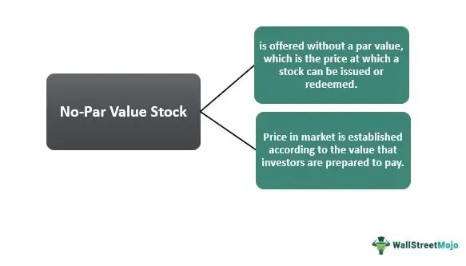

Understanding the dynamics of financial markets involves key concepts such as stocks, par value, and algorithmic trading. These elements form the cornerstone of modern finance, influencing investment decisions and shaping financial strategies. Stocks represent ownership stakes in corporations and are fundamental assets in investment portfolios. Par value, though often misunderstood, denotes the nominal value assigned to a stock at issuance. Despite its diminished relevance in modern markets, par value holds legal significance, impacting the financial structuring of corporations.

Algorithmic trading, another critical component, has revolutionized the trading landscape through technological advancements. Utilizing complex algorithms, this method automates trading decisions, enhancing speed, efficiency, and reducing human error. High-frequency trading (HFT) and statistical arbitrage are prominent strategies within algorithmic trading, influencing market liquidity and price discovery mechanisms.

This article will explore these essential elements, examining how they impact investment choices and financial strategies. Readers will gain insights into the relevance of par value in stocks, the evolution of algorithmic trading, and their collective influence on modern finance. With the rise in technological advancements, it's crucial to understand how these components interrelate, providing a comprehensive understanding necessary for navigating today's complex financial markets.

## Table of Contents

## Stocks and Par Value

Stocks, representing ownership in a corporation, are crucial components of investment portfolios. They provide investors with potential returns through capital appreciation and dividends, while also offering voting rights and a stake in the company's decision-making processes. Understanding key aspects such as par value is essential for investors to make informed decisions.

Par value is defined as the nominal value of a stock at the time of its issuance. Traditionally, it has held more legal significance than market relevance. Set by the issuing corporation, this value often serves as a baseline for the stock's initial offering price; however, it is largely unrelated to the stock's actual market value, which fluctuates based on supply and demand dynamics.

Most modern stocks today have low or no par value. This practice provides several benefits for issuing companies. By setting a low par value, firms can offer stocks with more flexibility and reduced liability concerns, as the financial obligations linked to par value are minimized. This change reflects a strategic adaptation, allowing companies to more freely navigate legal requirements regarding shareholder equity and capital maintenance.

The distinction between market and par value is critical for investors. Market value represents the current trading price of the stock, determined by factors such as market sentiment, corporate performance, and macroeconomic conditions. In contrast, par value retains its importance primarily for legal and accounting purposes.

While par value may seem like an antiquated concept, it retains its significance in certain jurisdictions and scenarios, such as in the calculation of legal capital. Legal capital is the minimum amount of equity that must be maintained for the protection of creditors, calculated as the aggregate par value of all issued stocks. Investors should be mindful of this distinction to comprehend the financial health and legal obligations of the companies in which they invest. This nuanced understanding enhances an investor's ability to evaluate corporate financial structures and their potential impact on stock performance.

## The Significance of No-Par Value Stocks

In the evolving landscape of corporate finance, no-par value stocks have emerged as a strategic tool for companies seeking flexibility and simplicity in their financial structuring. Unlike traditional stocks, which are typically issued with a par value—a nominal value assigned during issuance—no-par value stocks circumvent the complications that often accompany this nominal assignment. This shift is particularly advantageous for firms looking to minimize the legal and financial intricacies tied to par value.

The primary benefit of no-par value stocks lies in their flexibility. By eliminating the fixed nominal value, companies gain the ability to set issuance prices dynamically, aligning more closely with current market demands and conditions. This adaptability is particularly appealing to startups and technology firms, where rapid growth and market [volatility](/wiki/volatility-trading-strategies) necessitate a more fluid financial approach. These firms often prefer a capital structure that allows for quick adjustments without the constraints imposed by a predetermined par value. 

Moreover, the absence of par value frees companies from certain legal obligations that can arise when the market price of a stock falls below its par value. In such scenarios, companies could be required to issue additional equity or adjust their balance sheets to reflect these discrepancies. No-par value stocks essentially mitigate this risk, making them an attractive option for companies concerned with potential legal liabilities and asset revaluation requirements.

From a strategic perspective, choosing between par and no-par value stocks requires a deep understanding of corporate financial health. Par value stocks traditionally offer a measure of legal capital, serving as a buffer for creditors by indicating a baseline value of a company's equity. However, in the contemporary market setting, this distinction has become less relevant, with greater emphasis placed on the market value and earnings potential of a company.

Ultimately, the decision to issue no-par value stocks should be informed by a company's financial strategy and growth prospects. Companies need to weigh the benefits of flexibility and reduced legal liability against the potential implications for investor perception and financial reporting. As businesses continue to innovate and expand in complexity, no-par value stocks present a compelling option for those seeking uncomplicated and adaptable financial structures.

## Algorithmic Trading: A Technological Revolution

Algorithmic trading utilizes advanced computational techniques to execute trading decisions rapidly and efficiently based on predefined criteria. These algorithms analyze vast datasets, allowing for swift reactions to dynamic market conditions. A core advantage of [algorithmic trading](/wiki/algorithmic-trading) is its ability to significantly enhance the speed of transactions while minimizing human error, thereby optimizing the trading process.

One prominent form of algorithmic trading is high-frequency trading ([HFT](/wiki/high-frequency-trading-strategies)), which involves executing a large number of orders at extremely high speeds, often in fractions of a second. HFT strategies capitalize on minute price movements and require low latency systems to ensure timely execution. Firms engaged in HFT often deploy complex algorithms capable of making thousands of trades in a split second, effectively providing [liquidity](/wiki/liquidity-risk-premium) to the market.

Statistical [arbitrage](/wiki/arbitrage) represents another key strategy within algorithmic trading, relying on statistical and mathematical models to predict price movements and identify trading opportunities. This approach often involves pairs trading, where algorithms identify relative value discrepancies between correlated stocks, allowing traders to exploit temporary anomalies in prices. 

Algorithmic trading not only enhances the execution speed and precision of trades but also plays a significant role in market liquidity and price discovery. By automating the trading process and facilitating rapid transactions, algorithmic traders contribute to a more liquid market environment, minimizing bid-ask spreads and enhancing overall market efficiency. Furthermore, the continuous analysis and trading by algorithms aid in the discovery of accurate asset prices, reflecting real-time market information and sentiments.

As algorithmic trading continues to evolve, it leverages cutting-edge technologies such as [machine learning](/wiki/machine-learning) and [artificial intelligence](/wiki/ai-artificial-intelligence), enabling more sophisticated models capable of learning from market data to refine trading strategies further. Consequently, algorithmic trading remains an indispensable component of modern financial markets, setting the stage for future advancements that could reshape trading paradigms.

## Integration of Stocks, Par Value, and Algorithmic Trading

Combining knowledge of stocks, par value, and algorithmic trading presents significant opportunities to enhance investment strategies. Algorithmic trading, which employs mathematical models and algorithms to execute trades, can dynamically adjust portfolios by responding to changes in stock valuations and shifting market conditions. This capability allows traders to automatically buy or sell stocks based on predetermined criteria, such as specific price points or market trends, without the need for constant human oversight. The algorithm's capacity to process vast amounts of data rapidly enables more informed decision-making, reduces latency, and enhances precision in trading activities.

In the context of stocks, understanding par value is crucial as it represents the minimum price that shares can be issued at a company’s initial offering, thus having implications for a company's legal capital. This legal capital must be maintained to ensure company stability and creditor protection. While par value may not always align with market value, which fluctuates based on market performance, it plays a fundamental role in defining the company's equity structure. In automated trading, where swift decision-making is critical, being aware of par value helps traders evaluate stocks more wisely, reinforcing portfolio adjustments that comply with necessary legal and financial frameworks.

Effective portfolio management involves leveraging technology to optimize and balance investments, which is where the convergence of stocks, par value, and algorithmic trading becomes crucial. By utilizing algorithmic trading strategies, investors can create algorithms that take into account both market prices and par values, enabling more refined control over their investments. For instance, Python can be used to write and backtest trading algorithms by incorporating libraries like NumPy and Pandas to analyze historical data and predict future trends. This allows investors to implement real-time adjustments to their portfolios, optimizing returns while managing risk and adhering to necessary regulatory requirements.

In summary, the integration of these financial concepts—stocks, par value, and algorithmic trading—provides investors with the tools necessary to navigate complex markets. By harnessing technology and understanding the legal and financial implications of par value, investors can craft more robust and responsive investment strategies that align with both current market dynamics and long-term financial goals.

## Conclusion

In today's financial landscape, possessing a thorough understanding of stocks, par value, and algorithmic trading is crucial for constructing effective investment strategies and mitigating financial risk. These elements serve as cornerstones for investors aiming to navigate the complexities of modern financial markets.

Stocks, as fundamental instruments representing ownership in corporations, require investors to distinguish between par value and market value. Par value, being the nominal value of a stock at issuance, although often not reflective of its market price, carries significant legal implications. Recognizing this distinction is essential in assessing the financial health and legal capital of a corporation, particularly during automated trading operations.

Algorithmic trading, characterized by the deployment of complex algorithms to execute trading strategies, has revolutionized market dynamics by enhancing speed and efficiency. These technological advancements minimize human error and have introduced new dimensions to market liquidity and price discovery. As technology continues to evolve, the influence of algorithmic trading is anticipated to grow, further shaping trading practices.

A balanced portfolio approach that integrates traditional financial knowledge with cutting-edge trading technology offers substantial advantages to investors. By leveraging algorithmic trading to dynamically adjust portfolios in response to fluctuating stock valuations and market conditions, investors can optimize their returns while managing risks effectively. This comprehensive strategy not only enhances investment performance but also empowers investors to adapt to the ever-evolving financial environment. As a result, mastering these critical elements is indispensable for thriving in the contemporary marketplace.

## References & Further Reading

[1]: Malkiel, B. G. (2011). ["A Random Walk Down Wall Street: The Time-Tested Strategy for Successful Investing"](https://yourknowledgedigest.org/wp-content/uploads/2020/04/a-random-walk-down-wall-street.pdf). W. W. Norton & Company.

[2]: Lopez de Prado, M. (2018). ["Advances in Financial Machine Learning"](https://www.amazon.com/Advances-Financial-Machine-Learning-Marcos/dp/1119482089). Wiley.

[3]: Kissell, R. (2013). ["The Science of Algorithmic Trading and Portfolio Management"](https://www.sciencedirect.com/book/9780124016897/the-science-of-algorithmic-trading-and-portfolio-management). Academic Press.

[4]: Aronson, D. R. (2007). ["Evidence-Based Technical Analysis: Applying the Scientific Method and Statistical Inference to Trading Signals"](https://onlinelibrary.wiley.com/doi/book/10.1002/9781118268315). Wiley.

[5]: Chan, E. P. (2008). ["Quantitative Trading: How to Build Your Own Algorithmic Trading Business"](https://github.com/ftvision/quant_trading_echan_book). Wiley.

[6]: Jansen, S. (2020). ["Machine Learning for Algorithmic Trading"](https://github.com/stefan-jansen/machine-learning-for-trading). Packt Publishing.

[7]: Aldridge, I. (2013). ["High-Frequency Trading: A Practical Guide to Algorithmic Strategies and Trading Systems"](https://www.amazon.com/High-Frequency-Trading-Practical-Algorithmic-Strategies/dp/1118343506). Wiley.