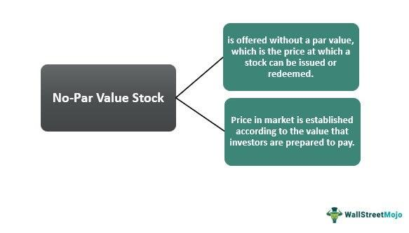

## Table of Contents

## What is the concept of par value in stocks?

Par value in stocks is a basic idea that refers to the minimum price at which shares can be issued. It's like a starting point set by the company when they first offer their stock to the public. This value is usually very low, often just a few cents, and it doesn't have much to do with what the stock is actually worth in the market. Think of it as a legal formality that helps set the groundwork for the stock's initial offering.

Even though par value doesn't change and isn't related to the stock's market price, it can still be important for accounting and legal reasons. For example, if a company issues a stock with a par value of $0.01, they can't sell it for less than that amount. This helps protect investors by ensuring that the stock has at least some minimum value. However, the real value of the stock, which is what people are willing to pay for it in the market, can be much higher or lower than the par value.

## Why do some companies issue stocks without par value?

Some companies choose to issue stocks without a par value because it gives them more flexibility. When a stock has no par value, the company can set the initial selling price without worrying about a minimum legal value. This can be helpful if the company wants to start selling its stock at a higher price right away. It also simplifies the accounting process since there's no need to keep track of a par value that doesn't really matter in the market.

Another reason is to avoid potential legal issues. In some places, if a company issues stock below its par value, it might be seen as selling stock at a discount, which could lead to legal problems. By issuing no-par value stock, the company avoids this risk entirely. This way, they can focus on setting a fair market price for their stock without worrying about meeting a minimum value that doesn't reflect the stock's true worth.

## How does the absence of par value affect stock pricing?

When a company issues stocks without a par value, it means they can set the price of the stock based on what they think it's worth in the market. This gives them more freedom to decide how much to charge for their shares right from the start. Without a par value, the company doesn't have to worry about meeting a minimum legal price, so they can focus on what investors are willing to pay.

The absence of par value doesn't change how the stock's price moves in the market after it's been sold. The price of the stock will still go up or down based on things like how well the company is doing, what's happening in the economy, and what investors think about the stock. So, while no-par value stocks give companies more flexibility at the start, the way the stock's price changes over time is the same as with stocks that have a par value.

## What are the legal implications of issuing no-par value stocks?

When a company decides to issue stocks without a par value, it can help them avoid some legal issues. In some places, if a company sells stocks below their par value, it might be seen as selling at a discount, which can cause legal problems. By choosing no-par value stocks, the company can set the price freely without worrying about breaking any rules about selling below a certain price.

This choice also makes things simpler for the company. They don't have to keep track of a par value that doesn't really matter in the market. This can make their accounting easier and help them focus on setting a fair price for their stocks based on what investors are willing to pay. So, issuing no-par value stocks can be a smart move to avoid legal headaches and keep things straightforward.

## How do no-par value stocks impact a company's balance sheet?

When a company issues no-par value stocks, it affects the balance sheet by changing how the stock's value is shown. Instead of having a "par value" section on the balance sheet, the company will just list the total amount of money they got from selling the stocks. This makes the balance sheet simpler because they don't have to show a separate par value and then an additional amount for anything sold above that.

This change can also make the company's equity section look different. With no-par value stocks, the entire amount paid for the stocks goes into the "common stock" account. This means the company doesn't need to use a separate "additional paid-in capital" account for the amount above the par value. So, the balance sheet becomes cleaner and easier to read, showing just the total money received from selling the stocks.

## What are the advantages of issuing no-par value stocks for a company?

Issuing no-par value stocks gives a company more freedom to set the price of their stocks. They don't have to worry about a minimum price set by the par value, so they can start selling their stocks at a price that they think is fair based on what investors are willing to pay. This can be really helpful if the company wants to start with a higher price right away. It also makes things easier because they don't have to keep track of a par value that doesn't really matter in the market.

Another big advantage is that no-par value stocks can help the company avoid legal problems. In some places, selling stocks below the par value can be seen as selling at a discount, which might cause legal issues. By choosing no-par value stocks, the company can set any price they want without worrying about breaking any rules. This makes their life easier and lets them focus on running their business and making their stocks attractive to investors.

## Are there any disadvantages to issuing stocks without par value?

Issuing stocks without par value can sometimes make things confusing for investors. When a stock has no par value, it might be harder for investors to understand what the stock is really worth. They might think the stock is worth less because there's no minimum value set by the company. This can make the stock seem riskier, which might make some investors less interested in buying it.

Another thing to think about is that in some places, the laws might not be clear about no-par value stocks. This could lead to legal issues if the rules change or if there's a misunderstanding about what the stock's value should be. So, while no-par value stocks can give a company more freedom, they need to be careful about how investors and the law might see this choice.

## How do no-par value stocks affect shareholder equity?

When a company issues no-par value stocks, it changes how shareholder equity is shown on the balance sheet. Instead of having a par value and an additional paid-in capital account, the whole amount of money the company gets from selling the stocks goes into the common stock account. This makes things simpler because the company doesn't have to split the money into different parts.

This change can make the shareholder equity section look different, but it doesn't change how much money the shareholders actually have in the company. The total amount of money from selling the stocks is still the same, it's just shown in a different way. So, even though no-par value stocks change how things look on the balance sheet, the real value of the shareholders' equity stays the same.

## What is the historical context behind the use of no-par value stocks?

The idea of no-par value stocks started a long time ago, back in the early 1900s. At that time, many companies were using par value to set a minimum price for their stocks. But this caused problems because if a company sold its stocks for less than the par value, it could get into legal trouble. People thought this was unfair, so they came up with no-par value stocks. This way, companies could set any price they wanted for their stocks without worrying about breaking any rules.

Over time, more and more companies started using no-par value stocks because it made things simpler. They didn't have to keep track of a par value that didn't really matter in the market. This made their accounting easier and let them focus on setting a fair price for their stocks based on what investors were willing to pay. Today, no-par value stocks are common, and they help companies avoid legal issues while giving them more freedom to decide how much to charge for their shares.

## How do different jurisdictions regulate no-par value stocks?

Different countries have their own rules about no-par value stocks. In the United States, many states allow companies to issue no-par value stocks. This makes things easier for companies because they don't have to worry about a minimum price set by the par value. But some states still have rules about par value, so companies need to check the laws where they are based. In Canada, the rules are similar. Companies can issue no-par value stocks, but they need to follow the rules set by the province they are in.

In Europe, the rules can be different from one country to another. For example, in the United Kingdom, companies can issue no-par value stocks, but they need to make sure they follow the rules set by the Companies Act. In Germany, companies can also issue no-par value stocks, but they need to be careful about how they show the value of their stocks on their balance sheets. So, even though no-par value stocks can be helpful for companies, they need to know the rules in their country and make sure they follow them.

## What should investors consider when buying no-par value stocks?

When investors are thinking about buying no-par value stocks, they should remember that these stocks don't have a set minimum price. This means the company can decide to sell the stocks at any price they want. Investors need to look at how much the company is asking for the stocks and think about if that price makes sense based on how well the company is doing and what's happening in the market. They should also check if the company has a good plan for making money and growing in the future.

Another thing to consider is that no-par value stocks might seem riskier to some people because there's no minimum value to fall back on. Investors should do their homework and see what other people think about the company and its stocks. They can read reports, look at the company's financial statements, and talk to other investors to get a better idea of whether the no-par value stocks are a good choice for them.

## How do accounting practices differ for no-par value stocks compared to par value stocks?

When a company issues stocks with a par value, they have to keep track of two things on their balance sheet: the par value of the stocks and any money they get above that par value. This extra money goes into a separate account called "additional paid-in capital." So, if a company sells a stock with a par value of $1 for $10, they would put $1 in the common stock account and $9 in the additional paid-in capital account. This makes the balance sheet more complicated because they have to show these two different amounts.

But when a company issues no-par value stocks, it's simpler. They just put all the money they get from selling the stocks into the common stock account. There's no need for a separate additional paid-in capital account because there's no par value to worry about. So, if they sell a no-par value stock for $10, they would put the whole $10 into the common stock account. This makes the balance sheet easier to read and keeps things straightforward for the company.

## References & Further Reading

[1]: Malkiel, B. G. (2011). ["A Random Walk Down Wall Street: The Time-Tested Strategy for Successful Investing"](https://yourknowledgedigest.org/wp-content/uploads/2020/04/a-random-walk-down-wall-street.pdf). W. W. Norton & Company.

[2]: Lopez de Prado, M. (2018). ["Advances in Financial Machine Learning"](https://www.amazon.com/Advances-Financial-Machine-Learning-Marcos/dp/1119482089). Wiley.

[3]: Kissell, R. (2013). ["The Science of Algorithmic Trading and Portfolio Management"](https://www.sciencedirect.com/book/9780124016897/the-science-of-algorithmic-trading-and-portfolio-management). Academic Press.

[4]: Aronson, D. R. (2007). ["Evidence-Based Technical Analysis: Applying the Scientific Method and Statistical Inference to Trading Signals"](https://onlinelibrary.wiley.com/doi/book/10.1002/9781118268315). Wiley.

[5]: Chan, E. P. (2008). ["Quantitative Trading: How to Build Your Own Algorithmic Trading Business"](https://github.com/ftvision/quant_trading_echan_book). Wiley.

[6]: Jansen, S. (2020). ["Machine Learning for Algorithmic Trading"](https://github.com/stefan-jansen/machine-learning-for-trading). Packt Publishing.

[7]: Aldridge, I. (2013). ["High-Frequency Trading: A Practical Guide to Algorithmic Strategies and Trading Systems"](https://www.amazon.com/High-Frequency-Trading-Practical-Algorithmic-Strategies/dp/1118343506). Wiley.