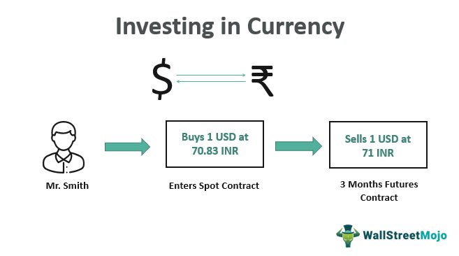

Forex trading, or foreign exchange trading, involves the buying and selling of currencies in a global market that is open 24 hours a day, five days a week. This decentralized market facilitates the exchange of national currencies and is, by volume, the largest financial market in the world, surpassing stock markets due to the sheer volume of currency traded daily, which can exceed trillions of dollars.

The accessibility of the forex market has expanded significantly, partly due to advances in technology and the internet. This has allowed more individuals to participate alongside traditional players such as financial institutions, corporations, and governments. The democratization of access has brought about notable changes, one of which is the incorporation of algorithmic trading. Algorithmic trading utilizes computer algorithms to execute trades based on predetermined criteria at high speeds and frequencies, enhancing efficiency and potentially generating profits in the highly fluid forex market.



This article provides an overview of forex trading and details the strategic advantages of investing in currencies. It also examines algorithmic trading, which offers speed and efficiency but requires careful management of its potential risks, such as technical failures and high market volatility. Understanding these elements is crucial for anyone looking to engage in forex trading, whether for speculation or as a hedge against economic uncertainties.

## Table of Contents

## The Basics of Forex Trading

Forex trading, often referred to as FX trading, represents the epitome of global financial markets due to its unparalleled size and liquidity. The market operates by leveraging currency pairs, each consisting of a base currency and a quote currency. This structure enables traders to speculate on the fluctuating value differences between two currencies. For instance, in the popular EUR/USD currency pair, the euro (EUR) is the base currency, and the U.S. dollar (USD) operates as the quote currency. When trading this pair, you're essentially predicting whether the euro will strengthen or weaken against the dollar.

Participants in the forex market are diverse, encompassing a wide array of players from large financial institutions, multinational corporations, and government entities, to individual retail traders. Notably, financial institutions such as banks and hedge funds are significant participants, as they are instrumental in money transfer and speculative activities across borders.

Governments also actively engage in forex through their central banks. They execute monetary policies impacting currency supply and interest rates, thus playing a crucial role in currency value determination. For example, central banks might intervene to stabilize or increase their national currency's value to control inflation or to ensure economic stability.

Individual investors are increasingly participating in [forex](/wiki/forex-system) trading, empowered by technological advancements and the proliferation of online trading platforms. These platforms provide investors with access to real-time currency exchange rate information, charting tools, and the ability to execute trades seamlessly from virtually anywhere in the world.

The primary function of the forex market is to facilitate international trade and investment—activities that necessitate currency exchange operations. Companies need to convert currencies to pay for goods and services purchased abroad or to convert foreign revenues into their base currency. However, beyond these fundamental functions, forex markets also offer opportunities for speculation. Speculative trading is driven by the possibility of profiting from fluctuations in exchange rates. Traders deploy various strategies, such as analyzing macroeconomic factors, leveraging technical analysis, and responding to geopolitical events, to predict currency movements and capitalize on these opportunities.

Currency price quotes are typically expressed to four decimal places. For example, a EUR/USD quote of 1.1200 signifies that one euro can be exchanged for 1.1200 U.S. dollars. The smallest movement in price, known as a pip (percentage in point), is usually equivalent to 0.0001 for most currency pairs, except for those involving the Japanese yen, where a pip is 0.01.

Forex trading stands out due to its high leverage ratios, which allow traders to control larger positions with a relatively small amount of capital—often referred to as the margin. This can amplify both potential gains and losses. For instance, a trader using a 50:1 leverage can control $50,000 with an initial margin of $1,000.

In summary, forex trading serves as an essential mechanism facilitating global economic activity while offering diverse speculative opportunities. The market's vastness and [liquidity](/wiki/liquidity-risk-premium) create a unique platform where economic theories meet practical trading, driven by a complex web of national policies, institutional motives, and individual objectives.

## Currency Investment: A Strategic Overview

Currency investing plays a pivotal role in diversifying an investment portfolio, particularly when employed as a hedge against economic downturns. This strategy involves engaging with the forex market, where currencies are traded in pairs, such as EUR/USD or USD/JPY. This pairing system means that the value of one currency is always quoted in relation to another, making it a relative movement market. Hence, understanding the economic indicators and geopolitical events that influence currency values becomes essential for successful investment.

Investors can leverage fluctuations in currency values to gain capital appreciation or protect against inflation and political risks. For instance, during periods of political instability or economic uncertainty in a country, its currency might depreciate against a more stable currency. Traders can exploit such conditions by short-selling the unstable currency and going long on the stable one. Moreover, currency investment can serve as a hedge against inflation. When domestic inflation erodes the purchasing power of money, holding foreign currency assets might provide a buffer, as currencies of countries with stable economies and low inflation rates tend to maintain or increase their value relative to others.

Economic indicators such as GDP growth rates, interest rates, employment [statistics](/wiki/bayesian-statistics), and consumer price indices are critical for predicting currency movements. For instance, higher interest rates typically attract foreign capital, leading to currency appreciation. Conversely, lower interest rates might weaken a currency. Political factors, including changes in government, fiscal policies, and international relations, also play significant roles in currency valuation.

In considering currency investments, it is also important to manage risks effectively. The forex market is known for its high [volatility](/wiki/volatility-trading-strategies), which can lead to significant gains but also substantial losses. Tools such as stop-loss orders, hedging techniques, and thorough market analysis can mitigate these risks.

Overall, currency investment not only diversifies and protects an investment portfolio but also offers opportunities for substantial returns. However, it necessitates a sound understanding of both economic and geopolitical factors that impact currency markets.

 to Algorithmic Trading

Algorithmic trading encompasses the utilization of computer algorithms to execute trades with exceptional speed and efficiency. This method leverages automated systems to process vast amounts of market data, removing emotional biases often associated with manual trading. By establishing predefined conditions, algorithms ensure that trading decisions are consistent, precise, and timely, which is particularly advantageous in the fast-paced forex market.

These algorithms are designed to analyze real-time data and execute trades based on various inputs, such as price, timing, and [volume](/wiki/volume-trading-strategy). By doing so, they enable traders to harness opportunities that might be missed when relying solely on human decision-making. A significant advantage of [algorithmic trading](/wiki/algorithmic-trading) is the ability to employ sophisticated strategies and mathematical models to interpret market signals and trends. One typical task could be implemented using Python, demonstrating how a simple moving average (SMA) crossover strategy might be set up:

```python
import pandas as pd
import numpy as np

# Sample data: a DataFrame with 'Close' price data
data = pd.DataFrame({
    'Close': [1.1200, 1.1215, 1.1230, 1.1190, 1.1175, 1.1250, 1.1235]
})

# Calculate short and long simple moving averages
short_window = 3
long_window = 5

data['Short_SMA'] = data['Close'].rolling(window=short_window, min_periods=1).mean()
data['Long_SMA'] = data['Close'].rolling(window=long_window, min_periods=1).mean()

# Generate signals
data['Signal'] = 0  # Default to no position
data['Signal'][short_window:] = np.where(data['Short_SMA'][short_window:]
                                         > data['Long_SMA'][short_window:], 1, 0)

# Calculate position changes
data['Position'] = data['Signal'].diff()

print(data)
```

In this example, the algorithm computes short-term (using a 3-day window) and long-term (using a 5-day window) simple moving averages of the currency's closing price. It generates buy signals when the short-term average surpasses the long-term average, indicating an upward trend. The automated system can place buy or sell orders based on the crossovers detected.

Algorithmic trading's rapid response capability is crucial in the forex market, where milliseconds can make a substantial difference in profitability. The elimination of emotional decision-making minimizes human error and enables adherence to strategic norms, translating intricate data into actionable and potentially lucrative trades. By integrating technology and financial acumen, algorithmic trading continues to emerge as a powerful tool for traders seeking to optimize performance and efficiency in the diverse forex landscape.

## Algorithmic Trading Strategies for Forex

Algorithmic trading in the forex market has transformed the way currency trading is conducted, offering sophisticated strategies that leverage advanced computational techniques. Among these, trend-following algorithms stand out by taking advantage of consistent price movements in currency markets. These algorithms identify and follow upward or downward price trends, attempting to enter the market early in the trend and [exit](/wiki/exit-strategy) before it reverses. Trend-following is particularly effective in highly liquid forex markets, where trends can persist over extended periods. Algorithms in this category often utilize technical indicators such as moving averages and [momentum](/wiki/momentum) oscillators to generate buy or sell signals. For instance, a simple moving average crossover strategy might involve buying a currency pair when a short-term moving average crosses above a long-term moving average.

Arbitrage opportunities constitute another strategy in forex algorithmic trading. Arbitrage exploits price discrepancies across different markets or platforms, aiming to buy low in one and sell high in another. In the context of forex, triangular [arbitrage](/wiki/arbitrage) is common, where three currency pairs are involved to lock in risk-free profits from pricing inefficiencies. To successfully perform arbitrage, algorithms must quickly execute trades, as these price differences are often minuscule and rapidly corrected by the market. High-frequency trading systems are typically employed to capture these fleeting opportunities.

Index fund rebalancing represents another area where algorithms have a strategic advantage. This involves the periodic adjustment of forex portfolios to maintain a desired level of exposure to specific currencies, based on an index benchmark. Automated rebalancing ensures that portfolios adhere to the predefined asset allocation with minimal manual intervention, reducing costs and emotional bias.

Mean reversion strategies operate on the assumption that prices will revert to their historical averages over time. These strategies identify currencies that have deviated significantly from their average values and place trades expecting a return to the mean. Mean reversion can be effective in volatile markets, where prices frequently oscillate around a central value. Algorithms implementing this strategy apply statistical analysis to determine the probability of reversion, often using metrics like the standard deviation.

Algorithmic trading in forex leverages mathematical models and programming techniques to optimize decision-making. By using advanced analysis of market data, these systems can adapt to varying market conditions. For example, a Python snippet for a simple mean reversion strategy could be:

```python
import pandas as pd

def mean_reversion_strategy(prices, window_size):
    rolling_mean = prices.rolling(window=window_size).mean()
    rolling_std = prices.rolling(window=window_size).std()

    buy_signal = (prices < rolling_mean - rolling_std)
    sell_signal = (prices > rolling_mean + rolling_std)

    return buy_signal, sell_signal

prices = pd.Series([1.2, 1.21, 1.22, 1.19, 1.18, 1.2, 1.23, 1.21])
buy_signal, sell_signal = mean_reversion_strategy(prices, window_size=3)

print("Buy signals:", buy_signal)
print("Sell signals:", sell_signal)
```

Here, a mean reversion strategy is applied to a series of prices, looking for deviations beyond one standard deviation from the moving average. Such simple models are the basis for more complex algorithms that incorporate [machine learning](/wiki/machine-learning) and [artificial intelligence](/wiki/ai-artificial-intelligence) to predict market movements with greater accuracy.

## Risks and Challenges of Algorithmic Trading

Algorithmic trading in the forex market, while offering speed and efficiency, comes with its own set of risks and challenges that need to be meticulously managed. One of the primary risks is the potential for technical failures. These can be caused by software bugs, hardware malfunctions, or network connectivity issues, all of which can lead to significant losses if not promptly addressed. With the high volume and rapid execution of trades, even a small glitch can have amplified consequences.

Moreover, market volatility poses a substantial risk to algorithmic trading systems. During periods of high market volatility, prices can fluctuate widely within short time frames, making it difficult for algorithms to make accurate predictions. High-frequency trading, a subset of algorithmic trading, can exacerbate these market swings. It involves executing a large number of orders at extremely fast speeds, which can contribute to increased market volatility and even market instability in extreme cases.

Robust risk management strategies are imperative to mitigate these risks. Traders must ensure that their algorithms are equipped with comprehensive risk controls, such as real-time monitoring, to detect anomalies promptly. Additionally, implementing fail-safes and automatic shutdown mechanisms can help avoid catastrophic losses during unexpected technical failures or volatile market conditions.

Over-reliance on technology and algorithms can also lead to missed opportunities or errors, especially in volatile markets. While algorithms are designed to remove human emotional bias, they lack the ability to adapt to unforeseen events or nuanced market conditions that a human trader might recognize. This can result in either missing potential profitable trades or executing trades based on outdated or incomplete information.

Furthermore, the "flash crash" phenomenon, which is sometimes exacerbated by high-frequency trading, highlights the risks associated with algorithmic trading. These occurrences, where markets experience rapid and deep price declines followed by a quick recovery, underscore the importance of implementing safeguards to prevent algorithms from contributing to such events.

In conclusion, while algorithmic trading offers substantial benefits, traders must approach it with caution and be prepared to address its inherent risks. By employing rigorous testing, continuous monitoring, and effective risk management strategies, traders can better navigate the challenges presented by fast-paced and volatile forex markets.

## Conclusion

Forex trading presents a substantial opportunity for diversification and capital appreciation, attracting investors across the globe. The ability to trade currencies, often influenced by macroeconomic factors, offers both the chance for profit and a hedge against inflation and political instability. As technology progresses, algorithmic trading has bolstered the efficiency and speed of this complex market, making it accessible and appealing to more participants.

However, the benefits of algorithmic trading come with significant responsibilities. While the use of sophisticated algorithms can optimize trading strategies and reduce emotional biases, these systems require a profound understanding of both their potential and limitations. The risks associated with technical failures, market volatility, and the potential for exacerbating price swings necessitate a solid risk management framework. Traders must remain vigilant to ensure that automation serves as an asset rather than a liability.

Successful engagement in forex trading and currency investment demands comprehensive research and strategic foresight. A well-structured approach, combining traditional analysis with cutting-edge technology, can help investors navigate the intricate dynamics of the forex market. Adequate risk assessment and management strategies are paramount to safeguarding investments and maximizing potential returns. By aligning technology with prudent trading practices, investors can enhance their prospects in this ever-evolving financial landscape.

## References & Further Reading

[1]: Harris, L. (2003). ["Trading and Exchanges: Market Microstructure for Practitioners."](https://www.amazon.com/Trading-Exchanges-Market-Microstructure-Practitioners/dp/0195144708) Oxford University Press.

[2]: Murphy, J. J. (1999). ["Technical Analysis of the Financial Markets: A Comprehensive Guide to Trading Methods and Applications."](https://archive.org/details/technicalanalysi0000murp) New York Institute of Finance.

[3]: Chande, T. S. (1997). ["Beyond Technical Analysis: How to Develop and Implement a Winning Trading System."](https://cdn.preterhuman.net/texts/finance_and_marketing/stock_market/Chande,%20Tushar%20-%20Technical%20Analysis%20-%20How%20To%20Develop%20And%20Imp.pdf) Wiley Finance.

[4]: Gomber, P., Arndt, B., Lutat, M., & Uhle, T. (2011). ["High-Frequency Trading."](https://papers.ssrn.com/sol3/papers.cfm?abstract_id=1858626) WIRTSCHAFTSINFORMATIK, 53(2), 83-90.

[5]: Aldridge, I. (2013). ["High-Frequency Trading: A Practical Guide to Algorithmic Strategies and Trading Systems."](https://books.google.com/books/about/High_Frequency_Trading.html?id=6l0DDQAAQBAJ) Wiley.