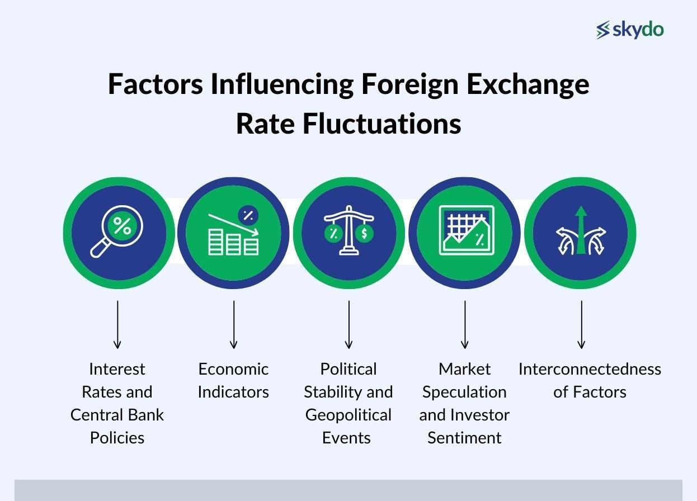

## Table of Contents

## What is foreign exchange and how does it work?

Foreign exchange, often called forex or FX, is the trading of one country's currency for another. It's like a big marketplace where people, banks, and businesses from all over the world buy and sell different currencies. The main reason people trade currencies is to do business in other countries. For example, if a company in the United States wants to buy something from Japan, it needs Japanese yen. So, it will exchange its U.S. dollars for yen in the foreign exchange market.

The value of currencies in the foreign exchange market goes up and down based on things like how well a country's economy is doing, interest rates, and even big news events. If a country's economy is strong, its currency usually gets stronger too. Traders try to predict these changes and make money by buying currencies they think will go up in value and selling those they think will go down. The foreign exchange market is open 24 hours a day during the week, so trading can happen at any time.

## Why should someone consider investing in foreign exchange?

Someone might want to invest in foreign exchange because it can be a good way to make money. The forex market is the biggest financial market in the world, with lots of people and money moving around. This means there are many chances to buy and sell currencies and make a profit. If you can guess which way a currency's value will go, you can buy it when it's cheap and sell it when it's more expensive. Plus, the market is open all the time during the week, so you can trade whenever you want.

Another reason to think about [forex](/wiki/forex-system) is that it can help you spread out your investments. Instead of putting all your money into one thing, like stocks or real estate, you can also invest in currencies. This can make your overall investment safer because if one type of investment goes down, your forex investments might go up. Also, you don't need a lot of money to start trading forex, which makes it easier for more people to get involved.

## What are the basic concepts of forex trading for beginners?

Forex trading is all about buying and selling different countries' money. When you trade forex, you're trying to make money by guessing if one currency will get stronger or weaker compared to another. For example, if you think the U.S. dollar will get stronger against the euro, you might buy dollars with euros. If the dollar does get stronger, you can sell your dollars back for more euros than you started with, making a profit.

To start trading, you need to open an account with a forex broker. These are companies that let you buy and sell currencies. They also give you tools to help you trade, like charts and news updates. When you trade, you usually use something called leverage, which means you can control a big amount of money with just a little bit of your own. This can make your profits bigger, but it can also make your losses bigger, so it's important to be careful.

There are a few important things to remember when you're trading forex. First, the market is always moving because it's open 24 hours a day during the week. This means you need to keep an eye on what's happening around the world because news and events can change currency values quickly. Second, you should have a plan for your trades, knowing when to buy, when to sell, and how much you're willing to lose. Finally, it's good to start small and learn as you go, because forex trading can be risky but also rewarding if you do it right.

## How can foreign exchange investment diversify an investment portfolio?

Adding foreign exchange to your investment portfolio can help spread out your risk. If you only invest in things like stocks or real estate from one country, your money can go up and down a lot based on what happens in that one place. But if you also invest in different currencies, you're not putting all your eggs in one basket. For example, if the stock market in your country goes down, the currencies you've invested in might go up, which can help balance out your losses.

Forex trading can also give you more chances to make money. The forex market is huge and always moving, so there are lots of opportunities to buy and sell currencies. This means you can try to make money from different parts of the world, not just from one country or one type of investment. By including forex in your portfolio, you can take advantage of these opportunities and possibly make your overall investment safer and more profitable.

## What are the risks associated with forex trading?

Forex trading can be risky because the value of currencies can change a lot and very quickly. This is because many things can affect currency values, like news, economic reports, or even big events happening around the world. If you guess wrong about which way a currency will move, you could lose money. Also, using leverage means you're borrowing money to trade, which can make your losses bigger if things don't go your way. So, it's important to be careful and know what you're doing.

Another risk is that the forex market is very big and can be hard to understand at first. There are lots of different currencies and pairs to trade, and it can be tricky to keep up with all the information you need to make good decisions. Plus, there are many brokers out there, and not all of them are honest. Some might charge high fees or not give you the best prices, which can eat into your profits. It's a good idea to do your homework and choose a reliable broker to help lower these risks.

## How does leverage work in forex trading and what are its implications?

Leverage in forex trading is like borrowing money from your broker to trade bigger amounts than you have in your account. For example, if you have $1,000 and your broker gives you a leverage of 100:1, you can control a trade worth $100,000. This means you can make bigger profits if your trade goes well. But, it also means you can lose more money if your trade goes badly. So, leverage can make your wins bigger, but it can also make your losses bigger.

Because of this, using leverage is risky. If the market moves against you, even a small change can wipe out your whole account. That's why it's important to use leverage carefully and understand how much you're willing to lose. Some people use something called a stop-loss order to limit their losses, which means the trade will close automatically if it loses a certain amount. But even with these tools, leverage can still be dangerous if you're not careful.

## What are the most common strategies used in forex trading?

One common strategy in forex trading is called the trend-following strategy. This means traders try to find out if a currency's value is going up or down over time and then make trades based on that. If a currency is going up, they might buy it, hoping it will keep going up so they can sell it later for more money. If it's going down, they might sell it or "go short," hoping to buy it back later for less money. To do this, traders often use charts and other tools to see the trends and make their decisions.

Another strategy is called the range trading strategy. This is when traders look for times when a currency's value stays between two points without going too high or too low. They might buy the currency when it's near the bottom of the range and sell it when it's near the top, hoping to make money from the ups and downs within that range. This strategy needs patience because you have to wait for the right moments to buy and sell.

A third strategy is the [breakout](/wiki/breakout-trading) strategy. This is when traders watch for a currency's value to break out of its usual range, either going much higher or much lower than it has been. If the currency breaks out and goes up, traders might buy it, hoping it will keep going up. If it breaks out and goes down, they might sell it, hoping it will keep going down. This strategy can be exciting but also risky because breakouts can be hard to predict and might not last long.

## How do global economic events influence foreign exchange rates?

Global economic events can have a big impact on foreign exchange rates. When something important happens in the world, like a country's economy growing or shrinking, it can change how much people want to buy or sell that country's currency. For example, if a country's economy is doing well, more people might want to invest there, which can make its currency stronger. On the other hand, if a country's economy is struggling, people might not want to invest there as much, which can make its currency weaker. Big news like changes in interest rates, inflation reports, or even political events can also move currency values a lot.

These events can cause quick and big changes in the forex market. Traders and investors are always watching the news to try to guess what will happen next. If they think a currency will get stronger because of good news, they might buy it to make a profit later. If they think it will get weaker because of bad news, they might sell it to avoid losing money. This constant guessing and trading based on global events is what makes the forex market so lively and sometimes unpredictable.

## What technical analysis tools are essential for advanced forex traders?

Advanced forex traders often use a few key technical analysis tools to help them make better trading decisions. One important tool is the moving average, which helps traders see the average price of a currency over a certain time. This can show them if the currency is trending up or down. Another useful tool is the Relative Strength Index (RSI), which measures how fast a currency's price is changing to see if it's overbought or oversold. This can help traders decide if it's a good time to buy or sell. Lastly, many traders use Fibonacci retracement levels to find potential support and resistance points, which are places where the currency's price might stop moving and change direction.

These tools help traders understand the market better and make more informed trades. For example, if the moving average shows a currency is trending up and the RSI suggests it's not overbought, a trader might decide to buy. If the Fibonacci levels show a strong resistance point, the trader might set a target to sell near that level. By combining these tools, advanced traders can get a clearer picture of what might happen next in the market and plan their trades accordingly.

## How can one manage and mitigate risks in forex trading?

Managing and mitigating risks in forex trading is important because the market can be very unpredictable. One way to do this is by using a stop-loss order. This is a tool that automatically closes your trade if the currency's value moves against you by a certain amount. It helps limit how much money you can lose on a single trade. Another way to manage risk is by not using too much leverage. Leverage lets you trade bigger amounts than you have in your account, but it can also make your losses bigger. So, it's a good idea to use less leverage and only risk a small part of your money on each trade.

Another important thing to do is to have a trading plan and stick to it. This means deciding ahead of time when you will buy, when you will sell, and how much you are willing to lose. A good plan can help you stay calm and make better decisions, even when the market is moving a lot. It's also helpful to keep learning and staying updated on what's happening in the world, because big news can affect currency values. By combining these strategies, you can manage your risks better and trade more safely in the forex market.

## What are the differences between forex trading and other forms of investment?

Forex trading is different from other investments like stocks or real estate because it involves buying and selling currencies from different countries. In forex trading, you're trying to make money by guessing if one currency will get stronger or weaker compared to another. This is different from stocks, where you're buying a piece of a company and hoping its value goes up over time. Forex trading also happens all the time, 24 hours a day during the week, which is different from the stock market that has set hours. This means you can trade forex whenever you want, but it also means the market can change quickly because it's always open.

Another big difference is that forex trading often uses leverage, which means you can control a big amount of money with just a little bit of your own. This can make your profits bigger, but it can also make your losses bigger, so it's riskier than many other types of investments. With stocks or real estate, you usually don't use leverage as much, so your risks and rewards are different. Also, forex trading lets you spread out your investments across different countries, which can help make your overall investment safer. But it's also more complicated because you need to keep up with news and events from around the world that can affect currency values.

## How do regulatory environments affect forex trading globally?

Regulatory environments can make a big difference in how forex trading works around the world. Different countries have their own rules about forex trading, and these rules can affect who can trade, how they can trade, and what they need to know before they start. For example, some countries have strict rules to protect traders from losing too much money, while others have fewer rules and let traders take more risks. These rules can also change over time, so traders need to keep up with what's happening in the countries they're trading in.

Because forex trading happens all over the world, traders have to think about the rules in different places. If a country changes its rules, it can affect the value of its currency and how easy it is to trade it. Sometimes, these changes can make trading harder or more expensive, which can make traders move their money to other countries with better rules. So, understanding the regulatory environment is important for anyone who wants to trade forex successfully.

## References & Further Reading

[1]: Harris, L. (2003). ["Trading and Exchanges: Market Microstructure for Practitioners."](https://www.amazon.com/Trading-Exchanges-Market-Microstructure-Practitioners/dp/0195144708) Oxford University Press.

[2]: Murphy, J. J. (1999). ["Technical Analysis of the Financial Markets: A Comprehensive Guide to Trading Methods and Applications."](https://archive.org/details/technicalanalysi0000murp) New York Institute of Finance.

[3]: Chande, T. S. (1997). ["Beyond Technical Analysis: How to Develop and Implement a Winning Trading System."](https://cdn.preterhuman.net/texts/finance_and_marketing/stock_market/Chande,%20Tushar%20-%20Technical%20Analysis%20-%20How%20To%20Develop%20And%20Imp.pdf) Wiley Finance.

[4]: Gomber, P., Arndt, B., Lutat, M., & Uhle, T. (2011). ["High-Frequency Trading."](https://papers.ssrn.com/sol3/papers.cfm?abstract_id=1858626) WIRTSCHAFTSINFORMATIK, 53(2), 83-90.

[5]: Aldridge, I. (2013). ["High-Frequency Trading: A Practical Guide to Algorithmic Strategies and Trading Systems."](https://books.google.com/books/about/High_Frequency_Trading.html?id=6l0DDQAAQBAJ) Wiley.