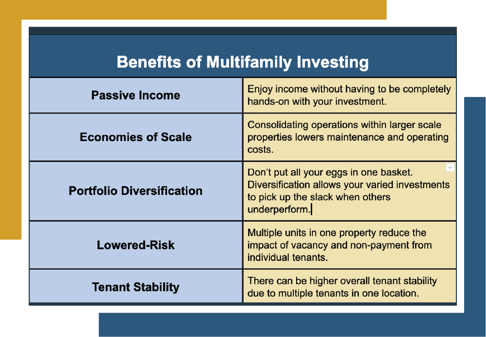

## Table of Contents

## What is multi-family real estate?

Multi-family real estate is a type of property that has more than one home or apartment in it. This can be a small building with two apartments, called a duplex, or a big building with many apartments. People who own these buildings can rent out the apartments to different families or people. This way, the owner can earn money from rent every month.

Investing in multi-family real estate can be a good idea because it can bring in a steady income. If one tenant moves out, the owner still has rent coming in from the other tenants. This can make it easier to pay for the building and other costs. But, it also means more work because the owner has to take care of many apartments and deal with different tenants.

## Why should beginners consider investing in multi-family real estate?

Beginners should consider investing in multi-family real estate because it can help them earn money from several tenants at once. Instead of buying a single house and renting it out to one family, a multi-family property lets you rent to many families. This means you can get more rent money every month. If one tenant moves out, you still have rent coming in from the other tenants, which can make it easier to pay for the building and other costs.

Another reason beginners might like multi-family real estate is that it can be a good way to learn about being a landlord. With more than one tenant, you get to practice managing different people and fixing problems in different apartments. This experience can help you become better at handling properties. Plus, if you take good care of the building and keep it full of tenants, the value of your property might go up over time, which could make it a smart investment.

## How does multi-family real estate differ from single-family homes?

Multi-family real estate and single-family homes are different in a few big ways. Multi-family real estate means a building with more than one home or apartment in it. This could be a small building with two apartments, called a duplex, or a big building with many apartments. People who own these buildings can rent out the apartments to different families or people. On the other hand, a single-family home is just one house that usually has one family living in it. If the owner wants to make money from it, they can rent it out to one family.

Another difference is how much money you can make from them. With multi-family real estate, you can get rent money from many tenants at the same time. This can help you earn more money every month. If one tenant moves out, you still have rent coming in from the other tenants, which can make it easier to pay for the building and other costs. With a single-family home, you only get rent from one family. If they move out, you don't get any rent until you find a new family to move in. So, multi-family real estate might be a better choice if you want to earn more money and have a steady income.

## What are the potential cash flow benefits of investing in multi-family properties?

Investing in multi-family properties can help you earn more money every month because you get rent from many tenants at the same time. If you own a building with ten apartments, you can get rent from all ten families. This means more money coming in every month compared to a single-family home where you only get rent from one family. Having multiple tenants also makes your income more steady. If one tenant moves out, you still have rent coming in from the other tenants, which can help you pay for the building and other costs.

Another benefit is that multi-family properties can help you cover your expenses better. When you have many tenants, you can spread out the costs of owning the building, like repairs and maintenance, over all of them. This can make it easier to keep up with these costs. Plus, if you take good care of the building and keep it full of tenants, the value of your property might go up over time. This could mean more money for you if you decide to sell the property later.

## How can multi-family real estate help in diversifying an investment portfolio?

Multi-family real estate can help you spread out your investments by adding a different kind of asset to your portfolio. Instead of putting all your money into stocks or bonds, you can invest in a property that earns you rent every month. This means you're not relying on just one type of investment to make money. If the stock market goes down, you still have the rent coming in from your multi-family property, which can help keep your overall investment safer.

Another way multi-family real estate helps with diversification is by giving you income from different tenants. If you own a building with many apartments, you get rent from all those different families. This can make your income more stable because if one tenant moves out, you still have rent coming in from the others. This kind of steady income can balance out the ups and downs you might see in other parts of your investment portfolio, like stocks or mutual funds.

## What are the tax advantages associated with multi-family real estate investments?

One big tax advantage of investing in multi-family real estate is that you can deduct a lot of expenses from your taxes. When you own a building with many apartments, you can write off things like repairs, maintenance, property taxes, and even the interest on your mortgage. These deductions can lower the amount of income you have to pay taxes on, which means you keep more of your rental income.

Another tax benefit is called depreciation. This lets you claim a part of the building's value as an expense each year, even though the building isn't actually losing value. Depreciation can help you lower your taxable income even more. Plus, if you decide to sell the property later, you might be able to use a 1031 exchange to swap it for another property without paying taxes on the profit right away. This can help you keep growing your real estate investments without a big tax hit.

## How does economies of scale apply to multi-family real estate?

Economies of scale in multi-family real estate means that it can be cheaper to manage and maintain a big building with many apartments than many small buildings with fewer apartments. When you own a big multi-family property, you can spread out the costs of things like repairs, maintenance, and management over all the tenants. For example, if you need to fix the roof, you only have to do it once for a big building, instead of fixing many roofs on smaller buildings. This can save you a lot of money and make it easier to keep the property in good shape.

Another way economies of scale help with multi-family real estate is by making it easier to hire help. If you own a big building, you can hire a property manager or a maintenance team to take care of everything. This can be cheaper than hiring someone for each small building you own. Plus, having one team for a big building means they can do their job more efficiently because they're always working in the same place. This can make your life easier and help you save money in the long run.

## What financing options are available for multi-family real estate investments?

There are several ways to get money for buying multi-family real estate. One common way is to get a loan from a bank or a mortgage lender. These loans can be for different amounts, depending on how big the building is and how much money you need. Some loans are called conventional loans, and they might need you to put down a big part of the money yourself. Other loans, like those from the Federal Housing Administration (FHA) or the Department of Veterans Affairs (VA), might let you put down less money if you meet certain rules.

Another way to finance multi-family real estate is by using a real estate investment trust (REIT) or a partnership. In a REIT, many people put their money together to buy and manage properties. This can help you buy a bigger building than you could on your own. Partnerships are similar, where you and other people share the cost and the work of owning the property. This can make it easier to get started because you don't have to come up with all the money by yourself.

You can also use seller financing to buy multi-family real estate. This is when the person selling the building agrees to let you pay them over time instead of getting all the money at once. This can be a good option if you can't get a loan from a bank or if you want to avoid the usual loan process. Seller financing can be more flexible, but you need to make sure you understand the terms and can keep up with the payments.

## How can one assess the market demand for multi-family housing in a specific area?

To figure out if people want to live in multi-family housing in a certain area, you can start by looking at how many apartments are empty. If a lot of apartments are empty, it might mean that not many people want to live there. But if most apartments are full, it's a good sign that people like living in that area. You can also talk to local real estate agents and property managers. They know a lot about what's happening in the area and can tell you if people are moving in or out.

Another way to check the demand is by looking at job growth and new businesses in the area. If a lot of new jobs are being created, more people might need a place to live nearby. You can also look at how much rent is going up or down. If rent is going up, it usually means more people want to live there than there are apartments available. Checking the local population growth can also help. If more people are moving into the area, it's likely that the demand for multi-family housing will go up too.

## What are the key management challenges and solutions in multi-family real estate?

One big challenge in managing multi-family real estate is dealing with many tenants at the same time. Each tenant might have different needs and problems, like fixing a broken sink or dealing with noise from neighbors. This can be a lot of work and can take a lot of time. To solve this, you can hire a property manager to help you. A good property manager can take care of the day-to-day stuff, like collecting rent and fixing problems, so you don't have to do it all yourself. Another solution is to use software that helps you keep track of everything, like when rent is due or when something needs to be fixed.

Another challenge is keeping the building in good shape. With many apartments, there are more things that can break or need fixing. This can be expensive and time-consuming. To make it easier, you can set up a regular schedule for checking and fixing things before they become big problems. You can also save money by buying things in bulk, like light bulbs or cleaning supplies, because it's usually cheaper that way. Having a good relationship with reliable repair people can also help, so you can get things fixed quickly without spending too much money.

## How do zoning laws and regulations impact multi-family real estate investments?

Zoning laws and regulations can have a big impact on multi-family real estate investments. These laws decide what kind of buildings can be built in certain areas. If you want to buy a building with many apartments, you need to make sure the area is zoned for multi-family housing. If it's not, you might not be able to use the building the way you want, or you might have to ask for special permission from the city, which can take a long time and cost a lot of money.

Another way zoning laws affect multi-family real estate is by setting rules about how big the building can be and how many apartments it can have. These rules can limit how much money you can make from the property. For example, if the zoning laws say you can only have a certain number of apartments, you can't add more to earn more rent. It's important to check these rules before you buy a property, so you know what you can and can't do with it. Understanding zoning laws can help you make better decisions and avoid problems later on.

## What advanced strategies can expert investors use to maximize returns in multi-family real estate?

Expert investors can maximize returns in multi-family real estate by using a strategy called value-add investing. This means they buy buildings that need some work and then fix them up to make them worth more money. They might update the apartments, add new amenities like a gym or a pool, or improve the outside of the building. By doing this, they can charge more rent and make the property more attractive to tenants. Once the building is in better shape and bringing in more rent, they can sell it for a higher price or keep it for steady income. This strategy can be a smart way to increase the value of their investment and earn more money over time.

Another advanced strategy is to use leverage to buy bigger properties. This means borrowing money to buy a building that costs more than they can afford on their own. By using a loan, they can control a bigger property and earn more rent every month. If the rent they collect is more than the cost of the loan, they can make a good profit. But this also comes with more risk, because if they can't pay back the loan, they could lose the property. Expert investors need to be careful and make sure they can handle the costs before they use this strategy. It's all about balancing the potential for higher returns with the risks involved.

## References & Further Reading

[1]: "Investing in Apartment Buildings: Create a Reliable Stream of Income and Build Long-Term Wealth" by Matthew A. Martinez

[2]: "Multi-Family Millions: How Anyone Can Reposition Apartments for Big Profits" by David Lindahl

[3]: "Real Estate Investing For Dummies" by Eric Tyson and Robert S. Griswold

[4]: "Advances in Financial Machine Learning" by Marcos Lopez de Prado

[5]: "Machine Learning for Asset Managers" by Marcos Lopez de Prado

[6]: Burgess, B. J., & Geppert, J. M. (2019). "Real Estate Portfolio Management using Machine Learning," Journal of Real Estate Portfolio Management.

[7]: Chan, E. P. (2009). "Quantitative Trading: How to Build Your Own Algorithmic Trading Business" 

[8]: "Algorithmic Trading: Winning Strategies and Their Rationale" by Ernie Chan