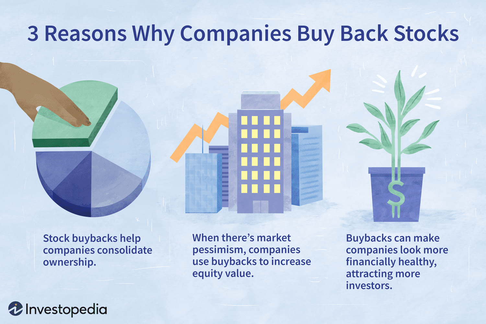

In the ever-evolving world of finance, investors are perpetually on the lookout for advanced strategies to enhance their potential returns. Among these strategies, stock buybacks and algorithmic trading have emerged as particularly influential in the arsenal of modern investors. Stock buybacks, or share repurchases, involve companies buying back their own shares from the marketplace, which can lead to a reduction in the number of outstanding shares and potentially increase the value of the remaining shares. This practice is favored by investors for reasons such as improved shareholder value and potential tax benefits.

On the other hand, algorithmic trading employs computer software to automate trading activities based on predetermined criteria, characterized by speed and precision. This approach is not only leveraged by institutional investors but is also becoming increasingly accessible to retail investors seeking to exploit the efficiencies presented by algorithmic strategies.



This article explores the interplay between these two prominent strategies—stock buybacks and algorithmic trading—and their impact on optimizing investment outcomes. The focus is to provide a comprehensive overview of how these strategies can be effectively utilized individually or in combination, offering invaluable insights for both seasoned and novice investors. By understanding the advantages and potential pitfalls of these approaches, investors can make more informed decisions, ultimately enhancing their portfolio performance.

## Table of Contents

## Understanding Stock Buybacks

Stock buybacks, commonly referred to as share repurchases, represent a corporate action where a company opts to reacquire its own shares from the open market. This strategic maneuver results in a reduction of the total number of outstanding shares, consequently leading to a higher ownership percentage for the remaining shareholders and potentially elevating the value of their shares. 

The appeal of stock buybacks to investors can be attributed to several key advantages. First, by reducing the share count, earnings per share (EPS) can increase if the company's net income remains unchanged, thereby enhancing perceived shareholder value. This enhancement often attracts investors who are drawn to companies with strong EPS metrics, believing it to signify financial health and effective corporate governance.

Additionally, stock buybacks can offer substantial tax benefits compared to dividends. When a company distributes dividends, shareholders may be subject to taxation on this income. In contrast, buybacks enable shareholders to defer capital gains taxes until they decide to sell their shares, offering a more tax-efficient route for capital return.

In recent years, buybacks have become increasingly popular as they are often interpreted as signals of corporate confidence. When a company chooses to repurchase its shares, it can indicate to the market that the company's leadership believes its stock is undervalued, worth investing in, or that the firm is in a strong cash position. This perception can lead to positive market sentiment and influence share prices favorably.

However, the strategy of stock buybacks is not without its criticisms. A primary concern is the potential for market manipulation. By reducing outstanding shares and artificially inflating EPS, companies might present an overly optimistic view of their financial health, which may not accurately reflect underlying operational performance. This can mislead investors about the company’s true economic state.

Furthermore, an excessive focus on buybacks may divert resources away from essential investments such as research and development or innovation. When companies prioritize returning capital to shareholders over reinvesting in business growth, it might lead to long-term competitive disadvantages. Thus, while buybacks can offer immediate financial benefits, they require careful consideration of their broader implications on corporate strategy and shareholder value.

## Algorithmic Trading: A Modern Approach

Algorithmic trading utilizes computer software to automate trading based on predefined criteria. This method has redefined financial markets with its speed, efficiency, and precision, and is predominantly utilized by institutional investors such as hedge funds, investment banks, and pension funds. Institutional investors favor [algorithmic trading](/wiki/algorithmic-trading) for its ability to execute large orders quickly and at preferable prices, minimizing market impact and reducing transaction costs.

The increased accessibility of algorithmic trading tools has allowed retail investors to take advantage of these sophisticated strategies, democratizing the trading landscape. As a result, retail investors now have access to platforms and tools that facilitate algorithmic trading, such as MetaTrader, QuantConnect, and [Interactive Brokers](/wiki/interactive-brokers-api). These platforms often provide the necessary infrastructure for [backtesting](/wiki/backtesting), strategy development, and execution, empowering individual traders to leverage their own custom algorithms.

Common strategies in algorithmic trading include [momentum](/wiki/momentum) trading, statistical [arbitrage](/wiki/arbitrage), and [market making](/wiki/market-making). Momentum trading involves algorithms designed to identify and capitalize on trends in stock prices, often operating under the assumption that securities that have performed well in the past will continue to perform well in the short-term future. Statistical arbitrage exploits price inefficiencies between related securities, using complex mathematical models to predict mean reversion events. Market making, on the other hand, involves providing [liquidity](/wiki/liquidity-risk-premium) to the markets by simultaneously posting buy and sell orders, profiting from the bid-ask spread.

While algorithmic trading offers numerous advantages, including enhanced decision-making and the ability to exploit minute price movements, it requires comprehensive knowledge of both financial markets and programming. Traders must have a solid grasp of market microstructures, data analysis, and mathematical modeling. Additionally, proficiency in programming languages such as Python, R, or C++ is essential to develop and implement effective trading algorithms. Here is an example of a simple momentum trading strategy implemented in Python:

```python
import pandas as pd
from pandas_datareader import data as pdr

# Downloading historical stock price data
stock_data = pdr.get_data_yahoo('AAPL', start='2020-01-01', end='2023-01-01')

# Calculating simple moving averages (SMA)
short_window = 40
long_window = 100

signals = pd.DataFrame(index=stock_data.index)
signals['signal'] = 0.0
signals['short_mavg'] = stock_data['Close'].rolling(window=short_window, min_periods=1).mean()
signals['long_mavg'] = stock_data['Close'].rolling(window=long_window, min_periods=1).mean()

# Generating buy/sell signals
signals['signal'][short_window:] = np.where(signals['short_mavg'][short_window:] >
                                            signals['long_mavg'][short_window:], 1.0, 0.0)   
signals['positions'] = signals['signal'].diff()

# Display signals
print(signals[signals['positions'] == 1.0])  # Buy signals
print(signals[signals['positions'] == -1.0]) # Sell signals
```

Despite its potential, algorithmic trading also brings challenges. It requires robust risk management to address market [volatility](/wiki/volatility-trading-strategies) and technological failures, such as system glitches or outages. Furthermore, algorithmic trading can exacerbate market instability during periods of crises, as evidenced by events like the "Flash Crash" of 2010. Therefore, while algorithmic trading provides considerable opportunities to enhance investment strategies, traders must be equipped with the necessary technical skills and market understanding to succeed.

## Benefits and Drawbacks of Stock Buybacks

Stock buybacks, also referred to as share repurchases, are actions taken by companies to purchase their own shares from the marketplace. This practice can have significant implications for a company's financial metrics, particularly earnings per share (EPS). By reducing the total number of outstanding shares, stock buybacks can directly increase EPS as shown in the following formula:

$$
\text{EPS} = \frac{\text{Net Income}}{\text{Outstanding Shares}}
$$

A reduction in the denominator, given a constant net income, results in a higher EPS, which often serves as an indicator of improved financial health and can attract investors. The immediate market perception of a buyback announcement often leads to a short-term increase in the company's stock price, providing rapid returns for investors.

From a tax perspective, buybacks offer companies a tax-efficient alternative to dividend payouts when distributing excess cash to shareholders. While dividends are typically taxable income for shareholders, buybacks can enhance shareholder value without creating an immediate tax burden, making them an attractive option for companies.

Despite these benefits, there are criticisms concerning the potential negative impacts of stock buybacks. One concern is the emphasis on short-term gains potentially overshadowing the company's long-term growth strategies and financial stability. When companies allocate significant resources to buybacks, they may undermine investments in crucial areas such as research and development (R&D) and innovation, which are vital for sustainable growth.

Additionally, excessive focus on buybacks can raise concerns about opportunistic market manipulation and the prioritization of shareholder wealth over other stakeholders' interests. In such cases, buybacks may be perceived as financially engineering stock prices without fundamentally improving the company's operational performance. Balancing stock buybacks with strategic investments in the company's future remains crucial for maintaining a healthy and innovative business environment.

## The Role of Algorithmic Trading in Investment Strategies

Algorithmic trading enhances investment strategies by automating the identification and exploitation of market inefficiencies. This automation allows trades to be executed at speeds and accuracies that far surpass the capabilities of human traders. By reducing execution times, algorithmic trading mitigates the risks associated with price slippage and ensures that trading strategies can be applied consistently, even in rapidly changing market conditions.

One significant advantage of algorithmic trading is its capacity to minimize emotional biases and irrational decision-making in trading practices. Human traders are inherently subject to psychological biases, such as overconfidence and fear of loss, which can lead to inconsistent trading outcomes. By relying on algorithms driven by objective criteria, traders can achieve a level of discipline that improves the consistency of their strategies.

Despite these advantages, algorithmic trading is not without risks. The reliance on automated systems necessitates comprehensive risk management strategies to handle market volatility and potential errors arising from technological failures. For instance, a malfunction in algorithm logic can lead to erroneous trades, which may result in significant financial losses. Therefore, it is crucial for traders to implement extensive backtesting and monitoring of their algorithms.

The incorporation of [machine learning](/wiki/machine-learning) and [artificial intelligence](/wiki/ai-artificial-intelligence) (AI) into algorithmic trading further increases its adaptability and sophistication. Machine learning techniques enable algorithms to learn from historical data and improve their decision-making over time. For example, using Python, traders can deploy machine learning models to forecast stock prices or identify patterns in market data:

```python
from sklearn.ensemble import RandomForestRegressor
from sklearn.model_selection import train_test_split
import numpy as np

# Example data
X = np.random.rand(100, 5)  # Predictor variables
y = np.random.rand(100)     # Target variable

# Splitting the dataset
X_train, X_test, y_train, y_test = train_test_split(X, y, test_size=0.2)

# Training a Random Forest model
model = RandomForestRegressor(n_estimators=100)
model.fit(X_train, y_train)

# Making predictions
predictions = model.predict(X_test)
```

This snippet demonstrates how traders can use machine learning libraries like Scikit-learn to implement predictive models, providing a competitive edge in analyzing and reacting to market conditions. The fusion of AI with algorithmic trading not only refines trading strategies but also enables them to evolve with emerging market trends.

In summary, algorithmic trading represents a modern approach to investment strategies that combines speed, precision, and data-driven insights. While its implementation requires careful crafting and monitoring, the integration of machine learning and AI holds significant promise for enhancing the performance and robustness of trading systems.

## Synergizing Buybacks and Algo Trading

Combining stock buybacks with algorithmic trading represents an advanced strategy aimed at maximizing investor returns. Algorithmic trading, with its ability to analyze large amounts of data and execute orders at high speed, can significantly optimize the timing and execution of stock buyback strategies. When stock buybacks are executed during favorable market conditions, they can bolster investor confidence and positively impact stock prices. 

The inherent characteristics of algo trading, such as speed and precision, facilitate the identification of optimal price points for executing buybacks. By analyzing market trends and data patterns, algorithms can detect periods when buybacks would have the most substantial positive effect on share value. This makes it possible for companies to adjust their buyback activities dynamically, enhancing portfolio performance for both the company's shareholders and external investors.

Implementing this synergy requires a comprehensive understanding of market dynamics and regulatory frameworks. Companies and investors must be informed about legal constraints and ensure compliance to avoid issues related to market manipulation. For instance, knowing the rules surrounding blackout periods, during which buybacks cannot occur, is critical to maintain ethical standards.

The integration of algorithmic trading with stock buybacks not only provides potential financial benefits but opens up opportunities for more strategic decision-making and resource allocation. An evolving understanding of machine learning and artificial intelligence can further elevate this synergy, allowing for even more sophisticated and adaptive strategies. These advancements can help in creating more resilient and diversified investment frameworks, ultimately contributing to a more robust financial ecosystem.

## Conclusion

The landscape of investing is continuously reshaped by the innovative application of stock buybacks and algorithmic trading. While each strategy offers distinct advantages on its own, their combined use can markedly enhance an investor's toolkit by amplifying potential returns and mitigating risks. 

Navigating these complex strategies requires a commitment to ongoing education and the ability to adapt to evolving market dynamics. The financial markets are not static, and the successful integration of stock buybacks and algorithmic trading relies on an investor's capacity to remain informed and flexible. Continuous learning about new methodologies, tools, and technologies is crucial, as it equips investors to make informed decisions and optimize their strategies for varying market conditions.

As technology and regulations continue to advance, vigilance becomes key. Regulatory changes can impact how strategies are implemented, and staying updated on these shifts helps investors maintain compliance and capitalize on emerging opportunities. Similarly, technological advancements, such as the incorporation of machine learning and artificial intelligence in algorithmic trading, present new possibilities for enhancing decision-making and predictive accuracy.

Integrating these modern techniques into an investment approach can lead to more robust and diversified investment portfolios. By harnessing the strengths of both stock buybacks and algorithmic trading, investors can achieve a balanced approach that leverages the precision and speed of automated processes with the strategic value enhancements from buybacks. This synthesis not only optimizes portfolio performance but also provides a more resilient foundation to navigate the uncertainties inherent in financial markets.

## References & Further Reading

[1]: ["Why Stock Buybacks Are Dangerous for the Economy"](https://hbr.org/2020/01/why-stock-buybacks-are-dangerous-for-the-economy) by William Lazonick, Harvard Business Review, 2014.

[2]: ["Stock Buybacks: A Breakdown"](https://www.investopedia.com/terms/b/buyback.asp) by James Chen, Investopedia.

[3]: ["Algorithmic and High-Frequency Trading"](https://www.cambridge.org/us/universitypress/subjects/mathematics/mathematical-finance/algorithmic-and-high-frequency-trading) by Alvaro Cartea, Sebastian Jaimungal, and José Penalva.

[4]: ["Conceptualizing Momentum Trading"](https://www.investopedia.com/trading/introduction-to-momentum-trading/) by Tarun Chordia, Goizueta Business School.

[5]: ["Flash Boys: A Wall Street Revolt"](https://en.wikipedia.org/wiki/Flash_Boys) by Michael Lewis.