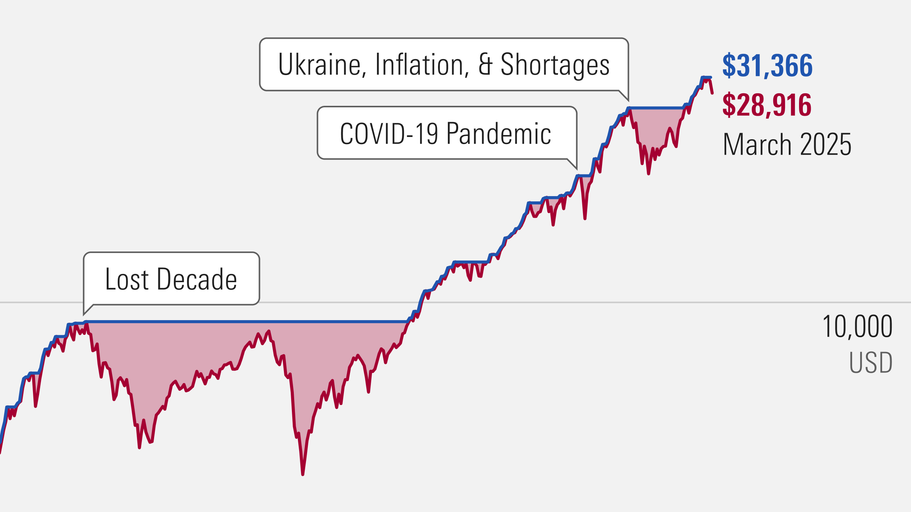

Understanding market downturns is fundamental for investors who seek to navigate turbulent financial environments wisely. During such times, the instability can lead to hasty decisions driven by fear and uncertainty. Therefore, arming oneself with effective strategies is vital for preserving and potentially growing one's investments amidst declining markets.

This article provides a comprehensive examination of several effective investment strategies during market downturns. It particularly accentuates the benefits of holding investments and the utilization of algorithmic trading as viable approaches. Holding onto investments through thick and thin can mitigate the risk of locking in losses prematurely, given that markets have historically rebounded following declines. By maintaining one's investment positions, investors are better positioned to harness the eventual recovery of the markets.



Additionally, algorithmic trading offers a systematic way to manage investments amidst the volatility characteristic of downturns. This approach leverages pre-set criteria to execute trades autonomously, minimizing the emotional biases inherent in human trading, and allowing investors to seize short-term market opportunities even during falling markets.

Moreover, maintaining a long-term perspective and diversifying investments are critical components of a robust strategy. A diversified portfolio spreads risk across various sectors and asset classes, providing a buffer against market fluctuations. This approach not only enhances resilience but also aligns with long-term financial goals, ensuring a steadier journey through uncertain times.

By harnessing these strategies, investors can achieve a level of stability and find potential opportunities, even when markets exhibit downward trends. The insights offered in this article are designed to equip readers with an informed approach to managing investments during market downturns, ultimately fostering a resilient and adaptable investment portfolio.

## Table of Contents

## Understanding Market Downturns and Their Causes

Market downturns are significant events in the financial world, often characterized by a 20% or more decline in stock indices from recent highs, signaling a transition from a bull market to a bear market. The causes of such downturns are multifaceted, encompassing various economic, political, and financial factors that together influence investor behavior and market dynamics. 

Economic recessions are a primary cause of market downturns. Recessions typically occur following a period of economic contraction, where GDP falls for two consecutive quarters. During a recession, businesses may experience lower profits due to reduced consumer spending, leading to layoffs and rising unemployment. This chain reaction can dampen market sentiment, resulting in a decline in stock prices as investors anticipate reduced future earnings potential for companies.

Political instability is another critical [factor](/wiki/factor-investing) that can trigger market downturns. Political events such as elections, governmental changes, geopolitical tensions, or unexpected policy shifts can introduce uncertainty into the markets. For instance, prolonged political uncertainty can cause capital flight as investors seek stable investment environments. Furthermore, international conflicts or trade wars can disrupt global supply chains and impact the economic outlook, exerting downward pressure on financial markets.

Financial crises, such as banking or credit crises, also play a major role in precipitating market downturns. These crises often lead to a [liquidity](/wiki/liquidity-risk-premium) crunch, where the availability of credit is severely restricted, forcing businesses and consumers to cut back on spending. The financial instability can lead investors to re-evaluate risk and pull out investments from stock markets, causing prices to plummet. Historical examples include the 2008 financial crisis, where the failure of major financial institutions led to a global market downturn.

Investor sentiment is directly affected during downturns. As prices start to fall, a negative feedback loop may develop where declining asset values further erode confidence, prompting more selling. This broad sell-off can exacerbate the decline, as fear often outweighs rational decision-making in such environments. Behavioral finance suggests that during downturns, emotions significantly influence trading decisions, which can compound losses as investment decisions become reactionary rather than strategic.

While market downturns are typically temporary, the consequences can be lasting. They often lead to more robust regulatory frameworks aimed at preventing future crises, as seen after the implementation of tighter banking regulations following the 2008 financial crisis. Additionally, downturns can alter investor perceptions, leading to long-term changes in investment strategy and risk tolerance. Strategic planning becomes crucial during these times, as investors must navigate the challenges of a declining market with the foresight to position themselves for eventual recovery.

In summary, market downturns are complex phenomena caused by interrelated economic, political, and financial factors. Understanding these factors is essential for investors aiming to strategically navigate these challenging periods. The historical context of past downturns provides valuable lessons on their temporary nature and the importance of planning to mitigate their long-term impacts.

## The Importance of Holding Investments During Downturns

During market downturns, investors are often tempted to sell their holdings to avoid further losses. However, selling during these periods can lock in losses, making it challenging to recover when the market rebounds. The strategy of holding investments through downturns is essential, as evidenced by historical market behavior.

One of the primary advantages of holding investments is the ability to participate in market recovery. Financial markets have demonstrated an overall upward trajectory over the long term, despite periodic declines. By remaining invested, long-term investors can benefit from this historical trend. Research indicates that markets tend to recover and reach new highs after periods of decline. For instance, the S&P 500 has consistently returned to its pre-downturn levels and beyond, rewarding those who maintained their positions during turbulent times.

The psychological aspect of investing during downturns is significant. Investors often experience fear and uncertainty, which can lead to panic selling. However, this impulsive behavior undermines the potential for recovery gains. Instead, focusing on the intrinsic value of their investments allows investors to sidestep temporary market fluctuations. Companies with robust fundamentals are likely to withstand economic challenges, making them valuable assets in an investor's portfolio.

Historical data supports the notion that patience pays off. An analysis of stock market performance over decades shows resilience following economic downturns. According to a study by Fidelity Investments, investors who stayed invested during the 2008 financial crisis saw their portfolios recover and grow substantially in the ensuing years. This pattern highlights the importance of not succumbing to the short-term pressures that accompany downturns.

Holding investments is particularly beneficial for long-term investors who can afford to weather market [volatility](/wiki/volatility-trading-strategies). This approach aligns with the principle of compounding, where reinvested earnings generate additional returns over time. By maintaining their position, investors maximize the compounding effect, further enhancing the growth of their portfolio once the market stabilizes.

In summary, holding onto investments during market downturns is a strategic approach that prevents the realization of losses and positions investors to capitalize on eventual recoveries. While it requires discipline and confidence in the long-term potential of the market, this strategy has historically proven to reward patient investors.

## Leveraging Algorithmic Trading in Market Downturns

Algorithmic trading has become a valuable tool for managing investments during market downturns. By harnessing the power of sophisticated algorithms, investors can execute trades systematically, minimizing the impact of human emotions that often lead to impulsive decisions in turbulent markets. This section explores how [algorithmic trading](/wiki/algorithmic-trading) functions and its advantages in volatile conditions.

### Fundamentals of Algorithmic Trading

At its core, algorithmic trading involves using pre-defined mathematical models and rules to execute trades. These algorithms analyze numerous market variables and can operate at speeds unattainable by human traders. The primary benefit of this approach is the elimination of emotional bias, ensuring that decisions are based on logic and data-driven strategies.

#### Example of an Algorithmic Trading Strategy

One simple strategy is the Moving Average Crossover, where buy and sell signals are triggered based on the interaction of short-term and long-term moving averages. Python can be used to implement this strategy effectively:

```python
import numpy as np
import pandas as pd

# Assume df is a DataFrame containing your stock data with 'Close' prices
def moving_average_crossover_strategy(df, short_window=40, long_window=100):
    signals = pd.DataFrame(index=df.index)
    signals['price'] = df['Close']
    signals['short_mavg'] = df['Close'].rolling(window=short_window, min_periods=1, center=False).mean()
    signals['long_mavg'] = df['Close'].rolling(window=long_window, min_periods=1, center=False).mean()
    signals['signal'] = 0.0
    signals['signal'][short_window:] = np.where(signals['short_mavg'][short_window:] > signals['long_mavg'][short_window:], 1.0, 0.0)
    signals['positions'] = signals['signal'].diff()

    return signals

# Example usage
# simulated_df is a DataFrame containing the historical prices
signals = moving_average_crossover_strategy(simulated_df)
print(signals)
```

### Capitalizing on Short-Term Movements

Algorithmic trading enables investors to leverage short-term market fluctuations. Advanced algorithms can scan multiple asset classes simultaneously, identifying transient opportunities that are characteristic of downturns. These algorithms often use technical indicators, statistical [arbitrage](/wiki/arbitrage), or high-frequency trading to profit from fleeting discrepancies in asset prices.

### Portfolio Optimization

A well-designed algorithmic trading system can optimize portfolio performance, even under unpredictable conditions. By dynamically adjusting asset allocations as market conditions evolve, these systems maintain a balance between risk and return. For instance, algorithms might increase cash holdings when market volatility spikes, preserving capital while waiting for improved market conditions.

### Reducing Transaction Costs

Another advantage of algorithmic trading is the reduction of transaction costs. By automating the execution process, these systems can split large trades into smaller, less impactful transactions, minimizing market impact and slippage. Moreover, algorithms can take advantage of dark pools and alternative trading systems to secure better pricing, further enhancing cost efficiency.

### Considerations and Risks

While algorithmic trading offers substantial benefits, it is not without risks. Algorithm malfunction, sudden market shifts, and over-optimization (also known as curve fitting) can lead to unexpected losses. Therefore, comprehensive [backtesting](/wiki/backtesting) and regular algorithm audits are essential to maintain operational integrity and performance.

In conclusion, algorithmic trading presents an effective way for investors to manage investments during market downturns. Through precise execution and strategic adaptability, it provides a systematic approach to navigating volatile conditions, enhancing investment resilience and capitalizing on market opportunities.

## Diversification as a Defense Strategy

Diversification is a fundamental strategy for mitigating risk, especially during market downturns. By spreading investments across various sectors and asset classes, investors can reduce the overall volatility of their portfolios. This approach is grounded in the idea that different sectors often react differently to economic conditions. For instance, while technology stocks might suffer during a particular downturn, consumer staples or utilities might remain stable or even thrive.

Balanced portfolios are more resilient to fluctuations because they are not overly reliant on the performance of a single sector. Instead, they include a mix of stocks, bonds, commodities, and possibly real estate. The logic behind diversification is encapsulated in the adage "don't put all your eggs in one basket." This strategy helps ensure that poor performance in one asset class or sector is offset by stability or gains in another.

For effective risk management, it's essential to periodically rebalance the portfolio. Rebalancing involves adjusting the weights of different assets to return to a predefined asset allocation. For example, if a portfolio was initially composed of 60% stocks and 40% bonds, and due to stock market growth, the portfolio becomes 70% stocks and 30% bonds, an investor might sell some stocks and purchase bonds to return to the 60/40 target. This process not only maintains the investor's risk tolerance and financial goals but also enforces a disciplined buy-low, sell-high strategy.

Incorporating international investments can further shield a portfolio from domestic economic turbulence. International diversification broadens geographical exposure, which can be particularly advantageous when foreign markets are experiencing different economic cycles than domestic markets. Similarly, alternative investments, such as hedge funds, private equity, or natural resources, can introduce additional diversification since their performance often does not correlate directly with traditional assets like stocks and bonds.

A classic example of diversification's effectiveness comes from the application of Modern Portfolio Theory, which suggests that an optimized portfolio can achieve the maximum expected return for a given level of risk. Mathematically, the expected return of a portfolio $E(R_p)$ is the weighted sum of the expected returns of the individual assets:

$$
E(R_p) = \sum_{i=1}^{n} w_i \times E(R_i)
$$

where $w_i$ is the weight of asset $i$ in the portfolio, and $E(R_i)$ is the expected return of asset $i$.

To illustrate, consider the following Python code that creates a simple diversified portfolio using basic financial data:

```python
import numpy as np

# Expected returns of different asset classes
expected_returns = np.array([0.08, 0.04, 0.12])  # e.g., stocks, bonds, real estate

# Weights in the portfolio
weights = np.array([0.5, 0.3, 0.2])

# Calculate the expected portfolio return
portfolio_return = np.dot(weights, expected_returns)

print(f"Expected Portfolio Return: {portfolio_return:.2%}")
```

This code calculates the expected return of a portfolio with a 50% investment in stocks, 30% in bonds, and 20% in real estate, demonstrating how diversification can be quantified and managed systematically. By maintaining a diversified portfolio and adhering to strategic rebalancing and asset allocation principles, investors can better navigate economic downturns, reducing risk and potentially enhancing returns over the long term.

## The Role of Dollar Cost Averaging

Dollar cost averaging (DCA) is a strategic investment approach that entails allocating a fixed sum of money to purchase investments at regular intervals. This method systematically addresses market volatility, ensuring that investors buy more shares when prices are lower and fewer shares when prices are higher. By doing so, the average cost of shares is effectively smoothed out over time, reducing the impact of price fluctuations on the overall investment.

### Mechanism of Dollar Cost Averaging

The fundamental principle behind DCA is straightforward: by committing a consistent amount of investment periodically, typically monthly or quarterly, investors benefit from the fluctuating prices of assets. For instance, if an investor commits $500 monthly to a mutual fund, the number of shares purchased will vary according to the fund's current price. When prices drop, more shares are acquired; conversely, when prices rise, fewer shares are purchased.

Mathematically, this can be expressed as:

$$
\text{Average Cost per Share} = \frac{\sum (\text{Investment Amount})}{\sum (\text{Number of Shares Purchased})}
$$

This approach ensures that investors avoid the common pitfall of market timing, which can lead to emotional and impulsive investment decisions. By maintaining a steady purchase routine, investors are less susceptible to making reactive choices based on short-term market conditions.

### Benefits of Dollar Cost Averaging

1. **Reduction of Emotional Influence**: DCA prevents investors from making hasty decisions brought about by short-term market volatility. Since investments are made regularly and automatically, this method minimizes the emotional stress of attempting to time the market's highs and lows.

2. **Effective Risk Mitigation**: DCA reduces the risk associated with investing large sums at a single point in time. By spreading purchases across various market conditions, this strategy lowers the probability of investing heavily at market peaks, thereby mitigating potential losses.

3. **Facilitating Long-term Investment**: This method encourages continued participation in the market across different phases, reinforcing a long-term investment perspective. As a result, investors gradually build a diversified portfolio aligned with their financial goals.

4. **Improved Market Participation**: By adopting a DCA approach, individuals with limited capital can participate in the investment market without needing to accumulate significant sums for investments. This regular investment habit also promotes financial discipline and incremental wealth building.

### Practical Example

Consider an investor who decides to implement DCA with an initial investment goal of $500 monthly in a stock fund. Over the [course](/wiki/best-algorithmic-trading-courses) of five months, the stock prices and purchased shares might look like:

| Month | Share Price | Investment | Shares Purchased |
|-------|-------------|------------|------------------|
| 1     | $10         | $500       | 50               |
| 2     | $8          | $500       | 62.5             |
| 3     | $12         | $500       | 41.67            |
| 4     | $11         | $500       | 45.45            |
| 5     | $9          | $500       | 55.56            |

In this scenario, despite the inherent volatility, the investor accumulates a total of 255.18 shares at an average cost of approximately $9.80 per share, demonstrating the capability of DCA to leverage market movements effectively.

### Conclusion

Dollar cost averaging stands out as a valuable approach for individuals seeking to mitigate the impact of market volatility while steadily building their investment portfolios. By adhering to a disciplined investment rhythm, investors not only minimize emotional biases but also cultivate a robust foundation for long-term financial growth. This strategy's simplicity and efficacy make it an appealing choice for both novice and seasoned investors aiming to enhance their market engagement.

## Conclusion

Market downturns present a unique set of challenges for investors, but they also bring potential opportunities for those who exercise discipline and strategic thinking. The inherent market fluctuations can be daunting, but adopting a methodical approach can provide significant advantages.

One of the most critical strategies during such times is holding investments. Historical data consistently shows that markets tend to recover and achieve growth after downturn periods. By resisting the urge to sell during a decline, investors can avoid locking in losses and position themselves to benefit when the market rebounds. This long-term perspective is essential for capitalizing on the eventual upswing of the market cycle.

Alongside holding investments, algorithmic trading offers a way to optimize investment strategies in volatile conditions. Algorithms, which operate on predefined criteria, eliminate emotional bias from trading decisions and allow investors to capitalize on short-term market movements. A well-configured algorithmic trading system can maximize portfolio performance during fluctuating market periods by executing trades with precision and speed that humans may not achieve.

Diversification remains a cornerstone of risk management in turbulent times. By spreading investments across multiple sectors and asset classes, investors can cushion against sector-specific downturns. Rebalancing portfolios periodically ensures adherence to long-term financial objectives and includes a variety of investment vehicles, such as international and alternative options, to bolster resilience further.

Another essential approach is dollar cost averaging (DCA). This method involves investing a fixed sum of money at regular intervals, regardless of market conditions. DCA mitigates the impact of volatility by purchasing more shares when prices are low and fewer when they are high, thus averaging the cost over time. This consistent investment discipline helps investors remain committed to their strategy through downturns and contributes to building a substantial financial position over time.

Ultimately, by maintaining discipline and focus, investors can not only navigate market downturns but emerge with stronger, more resilient portfolios. The integration of holding investments, leveraging technology like algorithmic trading, mastering diversification, and employing techniques such as dollar cost averaging equips investors with a robust framework to weather market volatility. Embracing these strategies transforms market downturns from being mere challenges to potential opportunities for future growth and stability.

## References & Further Reading

[1]: Bergstra, J., Bardenet, R., Bengio, Y., & Kégl, B. (2011). ["Algorithms for Hyper-Parameter Optimization."](https://dl.acm.org/doi/10.5555/2986459.2986743) Advances in Neural Information Processing Systems 24.

[2]: ["Advances in Financial Machine Learning"](https://www.amazon.com/Advances-Financial-Machine-Learning-Marcos/dp/1119482089) by Marcos Lopez de Prado

[3]: ["Evidence-Based Technical Analysis: Applying the Scientific Method and Statistical Inference to Trading Signals"](https://www.semanticscholar.org/paper/Evidence-Based-Technical-Analysis%3A-Applying-the-and-Aronson/3b33df8737f1772e9e14d66a08c9696f140a2ee1) by David Aronson

[4]: ["Machine Learning for Algorithmic Trading"](https://github.com/PacktPublishing/Machine-Learning-for-Algorithmic-Trading-Second-Edition) by Stefan Jansen

[5]: ["Quantitative Trading: How to Build Your Own Algorithmic Trading Business"](https://books.google.com/books/about/Quantitative_Trading.html?id=j70yEAAAQBAJ) by Ernest P. Chan