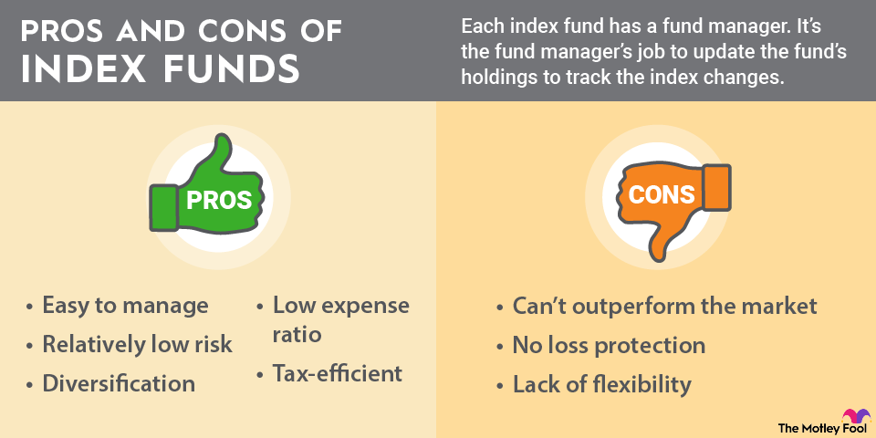

## Table of Contents

## What are index funds?

Index funds are a type of investment that tries to match the performance of a specific market index, like the S&P 500. Instead of picking individual stocks, an index fund buys all the stocks in the index it's tracking. This makes it easier for people to invest in the market without having to choose which stocks to buy.

One big advantage of index funds is that they usually have lower fees than other types of funds. This is because they don't need a lot of people to manage them, since they just follow the index. Over time, these lower fees can make a big difference in how much money you end up with. Index funds are popular with people who want a simple, low-cost way to invest in the stock market.

## How do index funds differ from actively managed funds?

Index funds and actively managed funds are two different ways to invest your money. Index funds try to match the performance of a specific market index, like the S&P 500. They do this by buying all the stocks in that index. This means they don't need a lot of people to manage them, so they usually have lower fees. On the other hand, actively managed funds have people, called fund managers, who pick which stocks to buy and sell. They try to beat the market by choosing stocks they think will do better than others. Because of this, actively managed funds usually have higher fees.

Another big difference is how they perform. Index funds aim to give you the same return as the market index they follow. They don't try to beat the market, just match it. This can be a good choice if you want a steady, predictable way to invest. Actively managed funds, however, try to do better than the market. But this isn't always easy, and many actively managed funds don't end up beating the market after you take out their higher fees. So, while they might have the potential for higher returns, they also come with more risk and cost.

## What are the potential drawbacks of low diversification in some index funds?

Some index funds might not be as diversified as you think. If an index fund follows a specific sector or a small part of the market, it might only have a few types of stocks. This means if that sector does badly, the whole fund could lose value. For example, if you have an index fund that only tracks tech companies, and the tech industry has a bad year, your fund will likely go down too. So, even though index funds are usually good for spreading out risk, some might not do this as well as others.

Another problem with low diversification in some index funds is that they might be too focused on a few big companies. Some indexes are weighted by how much a company is worth, so a few big companies can make up a big part of the fund. If those big companies do badly, it can drag down the whole fund. For instance, if an index fund is heavily invested in just a few giant companies, and those companies have problems, the fund's performance could suffer a lot. So, it's important to check what's in an index fund to make sure it's spread out enough to lower your risk.

## Can index funds lead to market bubbles?

Index funds can sometimes help create market bubbles. A bubble happens when the price of something, like stocks, goes up a lot and then crashes. When lots of people put their money into index funds, these funds have to buy more of the stocks in the index. If everyone is doing this at the same time, it can push the prices of those stocks up higher than they should be. This can make a bubble because the prices are not based on how well the companies are doing, but on how much money is going into the index funds.

But, it's not just index funds that can cause bubbles. Other things like people getting too excited about certain stocks or industries can also make prices go up too high. Also, index funds are just one part of the market, and they follow the market instead of trying to beat it. So, while they might add to a bubble, they are not the only reason bubbles happen. It's important to look at the whole picture to understand why bubbles form and burst.

## How do index funds impact market efficiency?

Index funds can make the market more efficient by making it easier for people to invest. When lots of people use index funds, it means more money is spread out across many different companies. This can help keep prices more in line with how well the companies are doing, because the money is not just going into a few stocks that people think will do well. It's like spreading butter evenly on toast instead of just putting it all in one spot.

But index funds can also make the market less efficient in some ways. Because index funds have to buy all the stocks in an index, even the ones that might not be doing so well, they can push up the prices of those stocks more than they should be. This can make the market less efficient because the prices are not just based on how the companies are doing, but also on how much money is going into index funds. So, while index funds help in some ways, they can also cause problems in others.

## What are the tax implications of investing in index funds?

When you invest in index funds, you have to think about taxes. Index funds can be good for taxes because they don't trade a lot of stocks. When funds trade stocks, they can make something called capital gains. These gains can mean you have to pay taxes, even if you haven't sold your own shares in the fund. But index funds usually don't trade as much, so they might not make as many capital gains. This can mean you pay less in taxes while you hold onto your investment.

But there are still taxes to think about when you sell your index fund shares. If you sell your shares for more money than you paid for them, you will have to pay capital gains tax. How much tax you pay depends on how long you held the shares. If you held them for more than a year, it's called a long-term capital gain, and the tax rate is usually lower. If you held them for less than a year, it's a short-term capital gain, and the tax rate is higher. So, it's good to think about how long you plan to keep your index fund shares before you sell them.

## How does the performance of index funds compare to actively managed funds in various market conditions?

In good market conditions, index funds often do well because they follow the market. They give you a piece of the market's growth without trying to beat it. Actively managed funds, on the other hand, try to pick the best stocks to do better than the market. Sometimes they do better, but they also charge higher fees. So, even if they beat the market, after you pay their fees, you might not end up with more money than if you had just used an index fund.

In bad market conditions, index funds can lose value just like the market does. They don't try to avoid the bad parts of the market, so if the market goes down, so do they. Actively managed funds might try to move money around to avoid the worst parts of the market. But again, their higher fees can make a big difference. Over time, studies show that most actively managed funds don't beat the market after fees, so index funds can be a safer bet in all kinds of market conditions.

## What are the risks associated with tracking errors in index funds?

Tracking errors happen when an index fund doesn't match the performance of the index it's supposed to follow. This can be a problem because you might think you're getting the same returns as the market, but you're not. Tracking errors can happen for different reasons, like the costs of buying and selling stocks, or if the fund can't buy all the stocks in the index right away. If the tracking error is big, it means your investment might not do as well as you expected.

Even though tracking errors can be a risk, they are usually small in well-managed index funds. Most index funds try hard to keep these errors low. But it's still good to check how well an index fund is tracking its index before you invest. That way, you can make sure you're getting close to the market returns you're hoping for.

## How can the lack of flexibility in index funds affect investment strategies?

Index funds follow a set plan to match a market index, which means they can't change what they do based on what's happening in the market. If you want to move your money around quickly or pick different stocks when the market changes, index funds won't let you do that. They just keep buying the same stocks in the index, no matter what. So, if you have a plan that needs you to be able to change things fast, index funds might not be the best choice for you.

But, this lack of flexibility can also be a good thing. Because index funds stick to their plan, they don't make big changes that could lose you money. They keep things simple and steady, which can help you stick to your long-term plan without getting distracted by what's happening in the market right now. If you want a simple way to invest that doesn't need a lot of watching and changing, index funds can help you do that.

## What are the considerations for investing in sector-specific index funds?

When you think about investing in sector-specific index funds, you need to know that these funds focus on just one part of the market, like tech or health care. This can be good if you think that part of the market will do well. But it can also be risky because if that sector does badly, your whole investment could lose value. So, it's important to understand the sector you're investing in and how it might do in the future.

Another thing to think about is how much of your money you want to put into one sector. Because sector-specific index funds are not as spread out as broad market index funds, they can be more up and down. If you put all your money into one sector and it does badly, you could lose a lot. It might be a good idea to mix sector-specific funds with other kinds of investments to lower your risk. That way, you can still try to make money from a sector you believe in, but you won't lose everything if that sector has problems.

## How do fees and expense ratios in index funds affect long-term returns?

Fees and expense ratios in index funds can make a big difference in how much money you end up with over a long time. Even though the fees might seem small, like just 0.1% or 0.2%, they add up over many years. If you invest $10,000 and the fund grows by 7% each year, a lower fee means more of that growth stays in your pocket. Over 30 years, a fund with a 0.1% fee could leave you with thousands of dollars more than a fund with a 0.5% fee.

It's important to pick index funds with low fees because they help you keep more of your money. When you pay less in fees, more of your money can grow and compound over time. This means your investment can grow faster and bigger. So, when you're choosing an index fund, look at the expense ratio and try to pick one with the lowest fee you can find. It might not seem like a big deal now, but it will make a big difference in the long run.

## What advanced strategies can be used to mitigate the risks of investing in index funds?

One advanced strategy to lower the risks of investing in index funds is to use something called asset allocation. This means you spread your money across different types of investments, not just index funds. You might put some money in stocks, some in bonds, and maybe even some in real estate or other things. By doing this, if one type of investment does badly, the others might do well and help balance things out. It's like not putting all your eggs in one basket. You can change how much you put in each type of investment based on how old you are, how much risk you want to take, and what's happening in the market.

Another strategy is to use a technique called rebalancing. Over time, some of your investments might grow faster than others, so your mix of investments can change. Rebalancing means you check your investments every so often and move money around to get back to your original plan. For example, if your stocks have done really well and now make up a bigger part of your investments than you wanted, you might sell some stocks and buy more bonds to get back to your plan. This can help you keep the right level of risk and make sure your investments stay in line with what you want.

You can also use something called dollar-cost averaging to help lower the risk of investing in index funds. Instead of putting all your money into an index fund at once, you put in a little bit of money at regular times, like every month. This way, you buy more shares when the price is low and fewer shares when the price is high. Over time, this can help you pay a lower average price for your investments and make your returns more steady. It's a simple way to invest without trying to guess when the market will go up or down.

## References & Further Reading

[1]: Bergstra, J., Bardenet, R., Bengio, Y., & Kégl, B. (2011). ["Algorithms for Hyper-Parameter Optimization."](https://papers.nips.cc/paper/4443-algorithms-for-hyper-parameter-optimization) Advances in Neural Information Processing Systems 24.

[2]: ["Advances in Financial Machine Learning"](https://www.amazon.com/Advances-Financial-Machine-Learning-Marcos/dp/1119482089) by Marcos Lopez de Prado

[3]: ["Evidence-Based Technical Analysis: Applying the Scientific Method and Statistical Inference to Trading Signals"](https://www.amazon.com/Evidence-Based-Technical-Analysis-Scientific-Statistical/dp/0470008741) by David Aronson

[4]: ["Machine Learning for Algorithmic Trading"](https://github.com/PacktPublishing/Machine-Learning-for-Algorithmic-Trading-Second-Edition) by Stefan Jansen

[5]: ["Quantitative Trading: How to Build Your Own Algorithmic Trading Business"](https://books.google.com/books/about/Quantitative_Trading.html?id=j70yEAAAQBAJ) by Ernest P. Chan