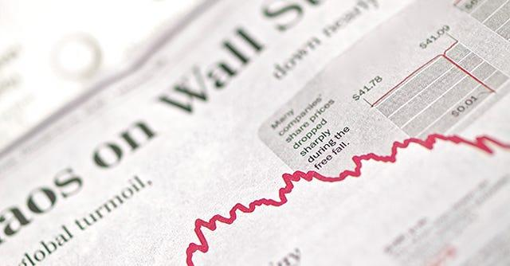

In today's dynamic financial landscape, investors are constantly seeking strategies that optimize returns while minimizing risks. Among the myriad of investment options, index funds and algorithmic trading have emerged as popular strategies. These two approaches offer distinct advantages and considerations, which will be explored in depth to aid investors in making informed decisions aligned with their financial goals.

Index funds represent a passive investing strategy that involves creating a portfolio to mirror the components of a financial market index, such as the S&P 500. Investors benefit from diversified exposure with the potential for stable, long-term growth. The popularity of index funds can be attributed to their low expense ratios and lower risks compared to individual stock selection. Their passive nature means that funds are not actively managed, which reduces management fees and provides a straightforward investment option.



On the other hand, algorithmic trading—commonly known as algo trading—employs computer algorithms to automate trading decisions based on predefined criteria. This approach provides the advantage of removing human emotions from trading activities, leading to potentially more rational and optimized decisions. Algo trading strategies range from simple moving averages to complex machine learning models that gauge market sentiment and movements. Advanced algorithms can execute trades at speeds and volumes unattainable by human traders, making them a compelling choice for those who seek to leverage cutting-edge technology in markets.

Combining the stability of index funds with the dynamic nature of algorithmic trading can result in a robust investment strategy. This symbiosis allows investors to enjoy the benefits of both worlds—consistent performance from index funds and enhanced short-term gains through adaptive trading facilitated by algorithms. This article will discuss the intricacies of these strategies and how they can be effectively integrated. By understanding their fundamental principles, investors can harness these tools to construct a financial strategy that meets their aspirations while also navigating the ever-evolving economic environment effectively.

## Table of Contents

## Understanding Index Funds

Index funds are a type of investment vehicle classified under mutual funds or exchange-traded funds (ETFs), designed to replicate the performance of a specific market index, such as the S&P 500. They aim to provide investors with broad market exposure, thereby reducing the risks associated with individual stock holdings. This is achieved through a passive management strategy that involves minimal buying and selling of assets, reflecting the components and performance of the index it aims to track.

One of the primary benefits of index funds is diversification. By tracking an entire index, an index fund encompasses a wide range of stocks or other investment types within that index, spreading out the investment risks. For example, an investor in an S&P 500 index fund holds fractional shares in all 500 companies included in the index, spanning various industries and sectors. This reduces the volatility and potential losses that might be associated with individual stocks.

Another significant advantage of index funds is their cost-effectiveness. Since they are passively managed, the operating expenses are typically lower than those of actively managed funds. Actively managed funds incur higher costs due to frequent trading and the need for extensive research and analysis. These costs are passed onto investors through higher management fees. In contrast, index funds, by matching the constituents of an index, incur lower transaction costs. The expense ratio of index funds is often less than 0.2%, compared to 0.5% to 2% for actively managed funds.

Over long investment horizons, index funds have demonstrated the ability to outperform many actively managed funds. Studies, including those conducted by S&P Dow Jones Indices, have shown that the majority of actively managed funds underperform their benchmark indices after fees are considered, especially in mature markets. Therefore, index funds offer a reliable option for investors seeking to achieve returns that mirror market averages while maintaining lower costs.

However, there are disadvantages associated with index funds. One major drawback is the lack of control over specific holdings. Since index funds aim to replicate an index, they must hold all the components of that index, regardless of the market conditions or a component's performance outlook. This means investors do not have the flexibility to exclude underperforming or ethically controversial stocks.

Additionally, index funds have limited reactive ability to market changes. Active managers can respond quickly to economic developments by adjusting their portfolios, whereas index funds remain static in their composition until the index itself rebalances. This can be detrimental during times of market [volatility](/wiki/volatility-trading-strategies) or economic downturns when strategic adjustments could potentially protect against losses.

Incorporating index funds within a broader financial strategy can be beneficial for investors seeking passive growth over the long term. By providing a stable and diversified investment option, index funds can serve as a foundational element in a diversified portfolio, especially when combined with other investment strategies that might offer flexibility or a hedge against market fluctuations.

## Algorithmic Trading: A Modern Approach

Algorithmic trading, often referred to as algo trading, utilizes computer algorithms to streamline and automate the processes of trading, making it possible to execute trades at a speed and frequency that are beyond human capabilities. The employment of these algorithms optimizes trading in several ways, primarily by removing the emotional element inherent in human traders, thus providing a more consistent and systematic approach to market predictions and timing.

These algorithms are designed based on a complex set of instructions or rules, which can range from timing and price, instructions for handling large orders, or even strategies to [arbitrage](/wiki/arbitrage) market inefficiencies. Key types of [algorithmic trading](/wiki/algorithmic-trading) strategies include:

1. **Trend Following Strategies**: These include moving averages, channel breakout, and related technical indicators. The simplicity of this strategy is that it doesn’t involve predicting or forecasting. Instead, orders are generated based on trends established by these indicators.

2. **Arbitrage Opportunities**: This strategy involves buying a dual-listed stock at a lower price in one market and selling it at a higher price in another market. The same is possible with stocks vs. futures, index vs. futures, etc.

3. **Index Fund Rebalancing**: This involves programming algorithms to buy or sell stocks sufficiently to rebalance and align with the index they are tracking, exploiting profit-making opportunities that arise due to trading based on such rebalancing.

4. **Mathematical Model-Based Strategies**: These involve trading on complicated models like the delta-neutral strategy, which consists of a combination of options and underlying assets.

5. **Market Making**: Offering to buy and sell securities, offering liquidity in the market and profiting from the spreads.

Algo trading provides significant advantages, such as improved accuracy due to the ability to backtest algorithms on historical data, consistent performance as algorithms follow the code without deviation, and a reduction in transaction costs due to the efficient execution of trades. However, there are potential pitfalls to be aware of, which include:

- **Technology Dependence**: The reliance on sophisticated hardware and software systems, which requires significant maintenance and can lead to large-scale failures during unexpected system glitches.

- **Flash Crashes**: Rapid and deep declines in securities prices within a very short time span that can be exacerbated by high-frequency trading algorithms acting in response to market movements.

In conclusion, while algorithmic trading offers significant potential for optimizing investment strategies, it requires careful consideration of its dependency on technology and the potential for market disturbances. When integrated thoughtfully, it can serve as a powerful tool within a comprehensive investment strategy.

## Combining Index Funds and Algorithmic Trading

Integrating index funds and algorithmic trading into an investment strategy harnesses the unique benefits of both approaches, offering investors a more comprehensive means of achieving their financial objectives. Index funds provide a stable and straightforward investment option characterized by diversification and low fees, while algorithmic trading offers the ability to exploit market inefficiencies through rapid, automated transactions. Together, these strategies enable investors to optimize their portfolios by balancing passive and active investment elements.

Index funds serve as the foundation of a robust investment strategy due to their stability and predictable returns. By tracking a broad market index, such as the S&P 500, they expose investors to a broad market segment, effectively reducing risks associated with individual stock volatility. The passive management aspect of index funds often results in lower costs compared to actively managed funds, contributing to improved net returns over time.

Algorithmic trading, or algo trading, enhances an investment strategy by identifying and capitalizing on short-term market opportunities with speed and precision. Algorithms can analyze massive datasets, execute trades at optimal times, and respond quickly to market changes, something that individual investors and manual traders might struggle to achieve. When employing algorithmic strategies, investors can manage their portfolios more dynamically, taking advantage of market fluctuations and timing trades to enhance returns.

Combining these approaches requires careful consideration of factors such as risk tolerance and investment objectives. For example, an investor with a moderate risk tolerance might allocate a portion of their portfolio to index funds to ensure stability, while reserving a smaller allocation for algorithmic trading to pursue higher returns from short-term market movements. This mix allows for a diversified approach where the index funds provide the core, steady growth, and algorithmic trading adds an element of tactical agility.

### Practical Implementation Example

Investors can use algorithmic trading scripts to periodically rebalance their index fund allocations based on evolving market conditions. For instance, a Python script could be developed to execute trades that adjust index fund weights based on changes in volatility or economic indicators. This automated approach ensures that the portfolio remains aligned with the investor's strategic goals without the need for constant manual oversight.

Here is a simple Python example of how such a script might function using a library like `pandas` to handle financial data:

```python
import pandas as pd
import numpy as np

# Simulate market data
market_data = np.random.randn(100)

# Define index fund and trading thresholds
index_fund_weights = 0.7  # 70% of portfolio in index funds
trading_threshold = 0.05  # 5% threshold for algorithmic action

# Define a basic algorithmic trading strategy
def algo_trade(data):
    moving_average = np.mean(data)
    # Decision based on moving average
    if moving_average > trading_threshold:
        return "Buy"
    elif moving_average < -trading_threshold:
        return "Sell"
    else:
        return "Hold"

# Execute trading decisions
trading_decision = algo_trade(market_data)
print(f"Algorithmic Trading Decision: {trading_decision}")
```

This integrated approach allows investors to diversify their investments and reduce risks while maximizing returns through strategic rebalancing. By positioning index funds for long-term growth and leveraging algo trading for short-term opportunities, investors can create a balanced portfolio that aligns with their financial goals.

Case studies further illustrate the success of combining these strategies. For instance, a portfolio manager might combine an index fund approach for global markets while applying algorithmic trading to execute currency hedging strategies. This combination can mitigate adverse currency impacts and enhance overall portfolio performance. 

The integration of index funds and algorithmic trading epitomizes a modern investment strategy that synthesizes stability with strategic adaptability, enabling investors to navigate various market conditions effectively.

## Challenges and Considerations

As with any investment strategy, index funds and algorithmic trading come with their own set of challenges and risks that investors must navigate. One of the primary concerns is market volatility. Both index funds and algorithmic trading strategies are subject to fluctuations in the market, which can lead to significant changes in asset values. Investors need to be aware of how market volatility can impact the effectiveness of their strategies, particularly during periods of economic uncertainty or major global events.

Technology failures are another critical consideration, especially with algorithmic trading. The reliance on complex algorithms and trading platforms means that technological glitches or outages can lead to missed trading opportunities or unintended trades. For instance, flash crashes, where rapid, deep market drops happen within minutes, often result from algorithmic trading mishaps. Such events highlight the importance of having robust technological infrastructure and contingency plans in place to mitigate these risks.

The regulatory environment is another [factor](/wiki/factor-investing) that influences both index funds and algorithmic trading. Regulatory changes can significantly impact how these investment vehicles operate. For example, regulations that increase transparency and disclosure requirements for algorithmic trades may affect the strategies employed by traders. Investors need to stay informed about existing and upcoming regulations to ensure compliance and adjust their strategies accordingly.

Moreover, the potential for increased market volatility due to a high [volume](/wiki/volume-trading-strategy) of algorithmic trades is a growing concern. Algorithmic trading can lead to more frequent and severe market swings, affecting both individual and institutional investors. It's crucial for market participants to understand this dynamic and employ risk management techniques to protect their investments. These techniques may include diversification, setting stop-loss limits, and regularly reviewing and adjusting the algorithmic strategies used.

To navigate these challenges, monitoring mechanisms play a vital role. Using data analytics and real-time monitoring tools, investors can track the performance of their investments and the behavior of their trading algorithms. This continuous oversight helps in identifying potential issues early and making informed decisions to mitigate risks.

Understanding these factors allows investors to craft strategies that align with their financial goals while anticipating and managing potential setbacks. By integrating thorough risk management practices and staying adaptable to changing conditions, investors can enhance their ability to achieve long-term success in the financial markets.

## The Future of Investment Strategies

Advancements in technology and shifting market dynamics are significantly influencing investment strategies. As we progress further into the digital age, the role of [artificial intelligence](/wiki/ai-artificial-intelligence) (AI) and [machine learning](/wiki/machine-learning) (ML) in trading algorithms is becoming increasingly pivotal. These technologies enable the processing of vast amounts of market data at unprecedented speeds, offering traders the ability to identify and capitalize on trends with enhanced precision. AI and ML facilitate sophisticated financial strategies by optimizing trading algorithms for better accuracy in market predictions and risk assessment. This transformation enhances the decision-making process, making it more data-driven and less prone to human error.

Moreover, index funds are evolving to meet the growing demand for sustainable investment options. Environmental, Social, and Governance ([ESG](/wiki/esg-investing)) funds, a variation of traditional index funds, have gained traction among investors who prioritize ethical considerations alongside financial returns. This shift towards sustainable investment approaches reflects a broader change in consumer behavior and corporate responsibility, driven by heightened awareness of climate change and social issues. ESG-focused funds provide investors with the opportunity to align their portfolios with their values while potentially benefiting from positive returns as companies with strong ESG metrics often demonstrate competitive advantages and resilience in volatile markets.

Emerging trends in the investment landscape suggest a convergence of technology and sustainability. Investors looking to position themselves for future success must stay informed about these developments and be prepared to adapt. Employing advanced tools like AI-driven analytics and integrating ESG criteria into portfolio management are strategies that can enhance portfolio performance and resilience. Technological innovations can be leveraged to analyze ESG metrics more effectively, providing insights into risks and opportunities associated with sustainable investments.

In preparing for the future, investors should focus on continuous learning and adaptability. Engaging with financial technology platforms, participating in educational programs, and remaining attuned to regulatory changes and market innovations are imperative. By doing so, investors can ensure that their strategies remain relevant and capable of navigating the complexities of evolving financial markets. As investment strategies continue to transform, incorporating AI, ML, and sustainable investment principles will likely define future success in the investment domain.

## Conclusion

Both index funds and algorithmic trading present substantial benefits for investors aiming to diversify their portfolios and enhance returns. Index funds offer a straightforward path to diversification through broad market exposure, generally involving lower costs and reduced management requirements. This passive approach makes them a reliable option for long-term investors focusing on minimizing risks associated with stock-specific movements.

Algorithmic trading, on the other hand, provides a dynamic mechanism to capitalize on market inefficiencies and short-term fluctuations. By implementing sophisticated computer algorithms, investors can conduct trades that are both time and cost-efficient, minimizing human errors and biases. The speed and precision of algorithmic trading can be particularly advantageous in highly volatile or liquid markets.

Combining these two strategies allows investors to harness the stability of index funds while leveraging the flexibility and precision of algorithmic trading. A well-crafted strategy calls for a balance, tailoring investments to align with an investor's unique risk profile and financial objectives. For instance, a typical portfolio may allocate a portion of assets to index funds to ensure steady growth while dedicating another part to algorithm-driven trades to exploit specific market opportunities.

Strategic implementation and diligent planning are critical in utilizing these tools effectively. Investors must continuously assess market conditions and adjust their strategies accordingly to maintain alignment with their investment goals. This may involve rebalancing portfolios, updating trading algorithms, or incorporating emerging investment products.

As the financial landscape continues to evolve, driven by advances in technology and changes in market dynamics, staying informed and adaptable remains essential. The integration of artificial intelligence and machine learning into algorithmic trading systems, as well as the growing emphasis on sustainable and thematic index funds, exemplifies the shifting paradigms within investment strategies.

In summary, a nuanced understanding and application of both index funds and algorithmic trading can significantly bolster an investor's ability to navigate complex financial markets. By adhering to a balanced and informed approach, investors can leverage these strategies to achieve sustained financial success in a rapidly changing landscape.

## References & Further Reading

[1]: Bergstra, J., Bardenet, R., Bengio, Y., & Kégl, B. (2011). ["Algorithms for Hyper-Parameter Optimization."](https://papers.nips.cc/paper/4443-algorithms-for-hyper-parameter-optimization) Advances in Neural Information Processing Systems 24.

[2]: ["Advances in Financial Machine Learning"](https://www.amazon.com/Advances-Financial-Machine-Learning-Marcos/dp/1119482089) by Marcos Lopez de Prado

[3]: ["Evidence-Based Technical Analysis: Applying the Scientific Method and Statistical Inference to Trading Signals"](https://www.amazon.com/Evidence-Based-Technical-Analysis-Scientific-Statistical/dp/0470008741) by David Aronson

[4]: ["Machine Learning for Algorithmic Trading"](https://github.com/PacktPublishing/Machine-Learning-for-Algorithmic-Trading-Second-Edition) by Stefan Jansen

[5]: ["Quantitative Trading: How to Build Your Own Algorithmic Trading Business"](https://books.google.com/books/about/Quantitative_Trading.html?id=j70yEAAAQBAJ) by Ernest P. Chan