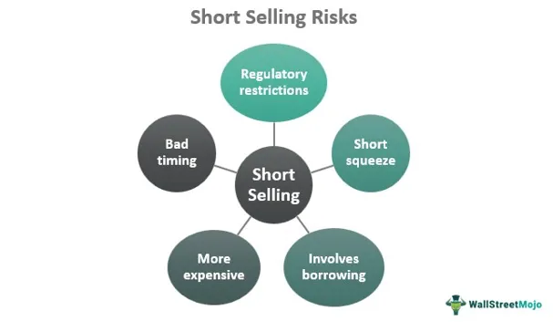

The stock market offers a diverse range of strategies that investors and traders can employ to generate profits. One of the more controversial and inherently risky methods is short selling—a strategy that involves selling borrowed stocks with the intention of buying them back at a lower price. This technique allows investors to profit from declining stock prices, earning gains from a market downturn. However, short selling carries significant risks, including potentially unlimited losses if the stock price rises instead. 

In parallel, the evolution of technology has given rise to algorithmic trading, a transformative approach that uses computer algorithms to execute trades at speeds and volumes that humans cannot match. This method aims to optimize trading efficiency and profitability while reducing the likelihood of human error. The pervasive use of algorithmic trading has dramatically influenced market dynamics, affecting liquidity and volatility.



This article aims to explore the intricate risks and potential rewards associated with both short selling and algorithmic trading. Understanding these strategies is crucial for investors seeking to navigate the modern market's complexities. By examining the associated dangers and potential benefits, individuals can better appreciate the balance required to achieve success in today's trading environments.

## Table of Contents

## Understanding Short Selling in the Stock Market

Short selling is a sophisticated financial strategy that involves selling securities that the investor does not currently own, with the intention of buying them back at a lower price. This method is predicated on the expectation that the stock's price will decline, allowing the seller to profit from the difference. In practice, short selling is executed by borrowing the stock, selling it on the open market, and then repurchasing it to return to the lender. The price difference between the selling price and the repurchase price, minus any fees or interest, constitutes the profit or loss.

One of the key attractions of short selling is the ability to capitalize on a declining market. Investors who believe that a particular stock is overvalued or anticipate negative news pertaining to the company may employ this strategy to benefit from a price fall. However, short selling involves significant risks. The potential for losses is theoretically unlimited because there is no cap on how high a stock’s price can go. If the stock price rises instead of falling, the short seller faces the obligation to repurchase the shares at a higher price, resulting in a loss.

Timing is also a critical component in short selling. Unlike traditional buy-and-hold strategies that can weather temporary downturns in anticipation of long-term gains, short selling requires precise market timing. Investors must accurately predict not only the direction of the price movement but also its timing. Market misjudgments or unexpected positive developments regarding a company can lead to steep losses.

Comprehending the mechanics and risks of short selling is fundamental for investors. A well-informed investor must be adept at analyzing market trends and possess an in-depth understanding of the specific stocks being targeted. This strategic approach, though potentially profitable, necessitates constant market vigilance and the ability to act swiftly in response to price movements.

To summarize, while short selling offers the opportunity to profit from falling stock prices, it entails significant risks. Mastery of this strategy requires a thorough understanding of market dynamics and an accurate assessment of both risk and timing.

## Key Risks and Rewards of Short Selling

Short selling presents a tantalizing opportunity for investors seeking to capitalize on declining stock prices. Despite its allure, the practice carries considerable risks due to the potential for theoretically unlimited financial losses. This financial vulnerability stems from the intrinsic nature of short selling, where an investor sells a borrowed stock anticipating a price decline, with the intention of buying it back at a lower price. However, if the stock price rises, the investor is compelled to repurchase the stock at an inflated price, incurring significant losses. There is no upper cap on how high a stock price can climb, thus presenting the prospect of limitless loss.

Margin trading, an integral part of short selling, introduces additional risk and cost. To execute short sales, investors often borrow money from brokers, utilizing margin accounts. Such transactions are not free; they accrue interest over time, adding a layer of cost that can erode potential profits. For instance, if an investor shorts a stock at $100 using borrowed funds and the [interest rate](/wiki/interest-rate-trading-strategies) on the margin account is 5% annually, the cost of holding the position could significantly increase if the stock does not decline as anticipated within a short time frame.

Market dynamics and unforeseen events also constitute significant risks for short sellers. Scenarios like short squeezes can quickly inflate stock prices, forcing short sellers to cover their positions at high prices. A short squeeze occurs when a heavily shorted stock's price begins to rise, prompting short sellers to buy shares to cover their positions, which further fuels the price increase. A notorious example of this phenomenon was observed with GameStop's stock in early 2021, where a coordinated buying effort led to explosive price surges, inflicting substantial losses on short sellers.

Sudden market rallies present another hazard. Markets can make abrupt upward movements due to economic news or political developments, exacerbating potential losses for those holding short positions. These unpredictable spikes underscore the necessity for short sellers to maintain vigilant market monitoring and rapid response capabilities.

Despite the substantial risks, short selling can be highly rewarding if executed successfully in downtrending markets. During such periods, where stock prices consistently fall, short sellers can realize significant gains. For instance, if an investor short sells a stock at $150, and the stock price falls to $100, they can profit from the $50 decline per share, adjusted for transaction costs and interest charges.

In conclusion, while short selling offers attractive potential profits, it demands a deep understanding of market risks and meticulous planning. The inherent risks associated with margin trading, market events, and the potential for unlimited losses necessitate a disciplined approach.

## The Role of Algorithmic Trading in Modern Markets

Algorithmic trading, often abbreviated as algo trading, is a method of executing trades that relies on pre-programmed instructions to account for variables such as timing, price, and [volume](/wiki/volume-trading-strategy). This technique leverages advancements in technology to trade at speeds and volumes beyond human capabilities. By utilizing computer algorithms, traders aim to optimize efficiency and profitability while reducing the probability of human error, which can be significant in fast-paced market environments.

A fundamental aspect of [algorithmic trading](/wiki/algorithmic-trading) is its capacity for processing large amounts of data quickly. Algorithms use this data to identify trading opportunities, analyze potential outcomes, and execute trades without the need for human intervention. This automation leads to trades being executed in milliseconds, a critical advantage in markets where price discrepancies may only exist briefly.

In recent years, the prevalence of algorithmic trading has increased substantially, altering the landscape of financial markets. A vital impact of this method is its effect on market [liquidity](/wiki/liquidity-risk-premium). As algorithms can execute trades rapidly and in large volumes, they contribute to the ease with which securities can be bought and sold, smoothing the functioning of the market. Enhanced liquidity often results in narrower bid-ask spreads, making trading less costly for all market participants.

However, the influence of algorithmic trading extends to market [volatility](/wiki/volatility-trading-strategies) as well. While the swift execution of trades contributes to liquidity, it can also amplify price swings. Algorithms operating on similar signals or reacting similarly to market fluctuations may concurrently execute large trades, influencing market movements.

Algorithmic trading comes in various types, including high-frequency trading ([HFT](/wiki/high-frequency-trading-strategies)), which is characterized by short holding periods and rapid turnover of positions. This form of trading captures [arbitrage](/wiki/arbitrage) opportunities and explores inefficiencies in the market that exist only for a brief duration. By doing so, HFT can foster tighter spreads and more accurate pricing, although concerns persist about its potential to exacerbate volatility.

The application of algorithmic trading strategies extends to various asset classes, not just equities. Its principles are employed across commodities, currencies, and even derivatives markets. This broad applicability makes it a cornerstone of modern financial trading.

The evolution of algorithmic trading continues as advancements in [artificial intelligence](/wiki/ai-artificial-intelligence) and [machine learning](/wiki/machine-learning) introduce new possibilities. These technologies enable more sophisticated models that can adapt to market conditions, learn from data patterns, and potentially anticipate future market actions. As machine learning algorithms improve, they may offer more nuanced insights and strategies, pushing the boundaries of what algorithmic trading can achieve.

In conclusion, algorithmic trading has transformed financial markets by increasing the speed, volume, and efficiency of trades. Its significant impact on liquidity and volatility underscores its dual role as both a facilitator of efficient markets and a potential source of market instability. As technology continues to evolve, the strategies and tools within algorithmic trading will likely continue to shape financial markets globally.

## Risks Associated with Algorithmic Trading

Algorithmic trading, characterized by its use of automated systems to execute trades at high speeds and volumes, presents unique risks to financial markets. The primary concern with algorithmic trading is its potential to exacerbate market volatility. The algorithms operate on complex mathematical models and large data sets to make split-second decisions. While these systems can operate efficiently under normal conditions, they may also react unexpectedly to market anomalies or unusual data inputs, leading to rapid and large-scale buying or selling actions that can amplify volatility.

A significant risk in algorithmic trading is the possibility of errant algorithms or technical glitches, which can cause substantial financial losses within a short timespan. Such errors might arise from flawed code, incorrect data inputs, or hardware failures. These problems are critical given the [high frequency](/wiki/high-frequency-trading) and volume of transactions involved. Historical evidence of such risks is exemplified by the "Flash Crash" of May 6, 2010, when major U.S. stock indices drastically plunged and rebounded within minutes. Investigations suggested that algorithmic trades contributed to the crash's severity and rapid recovery, indicating how sensitive modern markets are to malfunctioning algorithms.

To mitigate these risks, regulators have introduced measures like circuit breakers and kill switches. Circuit breakers are designed to pause trading temporarily on a particular stock or on the market as a whole if prices move too erratically. This cooling-off period aims to prevent panic and allows market participants time to assess information more accurately. Kill switches, on the other hand, enable traders or trading platforms to manually or automatically halt trading activity in response to abnormal trading patterns or system malfunctions. By implementing these tools, regulators and market operators aim to curb the potential adverse impacts of algorithmic trading and enhance market stability.

## Strategies for Managing Short Selling and Algorithmic Trading Risks

To effectively manage risks in short selling, investors need to prioritize thorough research and the implementation of stop-loss strategies. Research involves analyzing financial statements, industry trends, and market conditions to anticipate potential price movements accurately. A well-informed investor is better equipped to make decisions that can mitigate risk. Additionally, stop-loss strategies are crucial, as they involve setting predetermined price points at which a stock will be bought or sold to prevent further losses. For instance, if a stock price rises above this set point, the short position is closed, thus limiting potential loss.

Understanding market indicators such as moving averages, relative strength index (RSI), and candlestick patterns can significantly help short sellers. These indicators provide insights into market trends and help in timing the entry and [exit](/wiki/exit-strategy) points, which is vital given the challenge of market timing inherent in short selling. Maintaining a disciplined approach also means adhering to pre-established rules irrespective of market emotions, which can often lead to overreaction and significant financial loss.

In the context of algorithmic trading, robust risk management systems are paramount. These systems can include algorithms designed to dynamically adjust trading strategies based on real-time market data. For example, integrating safety protocols such as kill switches can curtail trading activity during unexpected market fluctuations, thereby protecting investments. Moreover, staying informed about current regulations is critical, as regulatory landscapes impact algorithmic trading strategies and compliance requirements.

Diversification and hedging strategies further enhance protection against unforeseen market movements. Diversifying involves spreading investments across various financial instruments, sectors, or markets to reduce exposure to a single asset's volatility. Python can be used to simulate diversification strategies, such as portfolio optimization. Here's a simple example of using Python with the `numpy` and `pandas` libraries to calculate the expected return and volatility of a diversified portfolio:

```python
import numpy as np
import pandas as pd

# Assume a DataFrame `df` with historical stock returns columns labeled 'Stock1', 'Stock2', etc.
returns = df.pct_change().mean()  # Calculate mean returns
cov_matrix = df.pct_change().cov()  # Calculate covariance matrix

weights = np.array([0.4, 0.6])  # Example weights for two stocks

# Calculate portfolio return
portfolio_return = np.sum(returns * weights)

# Calculate portfolio volatility
portfolio_volatility = np.sqrt(np.dot(weights.T, np.dot(cov_matrix, weights)))

print(f'Expected Portfolio Return: {portfolio_return}')
print(f'Portfolio Volatility: {portfolio_volatility}')
```

Hedging, on the other hand, involves taking positions in financial instruments like options or futures to offset potential losses in other positions. It's akin to an insurance policy against adverse price movements.

In summary, managing risks in both short selling and algorithmic trading necessitates a multifaceted approach involving research, disciplined execution, risk management protocols, and strategic diversification. Understanding and utilizing these strategies enable investors to navigate the complexities of modern markets while safeguarding their investments.

## Conclusion

Both short selling and algorithmic trading present distinct opportunities for profit generation in the stock market, yet they demand a vigilant approach to risk management. Short selling allows investors to profit from declining stock prices but carries the potential for unlimited losses if the market moves against their predictions. Thus, it is critical for investors to have a deep understanding of market dynamics and employ prudent risk management techniques, such as stop-loss orders and disciplined market monitoring.

Similarly, algorithmic trading has revolutionized the speed and efficiency of executing trades, offering potential for enhanced profits. However, the intricate nature of algorithmic systems can also introduce significant risks, particularly in the event of system errors or unexpected market movements. Therefore, traders must ensure robust risk management frameworks are in place, including regular algorithm audits and adherence to market regulations designed to curb volatility.

Ultimately, the successful navigation of both short selling and algorithmic trading hinges on a balanced approach that aligns the pursuit of profit with a comprehensive understanding of associated risks. Investors should prioritize education and continuous learning to adapt to the ever-evolving trading landscapes. By doing so, they can make informed decisions that protect against potential pitfalls while capitalizing on the available opportunities in modern financial markets.

## References & Further Reading

[1]: Bergstra, J., Bardenet, R., Bengio, Y., & Kégl, B. (2011). ["Algorithms for Hyper-Parameter Optimization."](https://papers.nips.cc/paper/4443-algorithms-for-hyper-parameter-optimization) Advances in Neural Information Processing Systems 24.

[2]: ["Advances in Financial Machine Learning"](https://www.amazon.com/Advances-Financial-Machine-Learning-Marcos/dp/1119482089) by Marcos Lopez de Prado

[3]: ["Evidence-Based Technical Analysis: Applying the Scientific Method and Statistical Inference to Trading Signals"](https://www.amazon.com/Evidence-Based-Technical-Analysis-Scientific-Statistical/dp/0470008741) by David Aronson

[4]: ["Machine Learning for Algorithmic Trading"](https://github.com/stefan-jansen/machine-learning-for-trading) by Stefan Jansen

[5]: ["Quantitative Trading: How to Build Your Own Algorithmic Trading Business"](https://www.amazon.com/Quantitative-Trading-Build-Algorithmic-Business/dp/1119800064) by Ernest P. Chan

[6]: Durbin, M. (2010). ["All About High-Frequency Trading"](https://www.amazon.com/All-About-High-Frequency-Trading/dp/0071743448). McGraw-Hill.

[7]: ["Short Selling: Strategies, Risks, and Rewards"](https://www.amazon.com/Short-Selling-Strategies-Risks-Rewards/dp/0471660205) by Amit Kumar