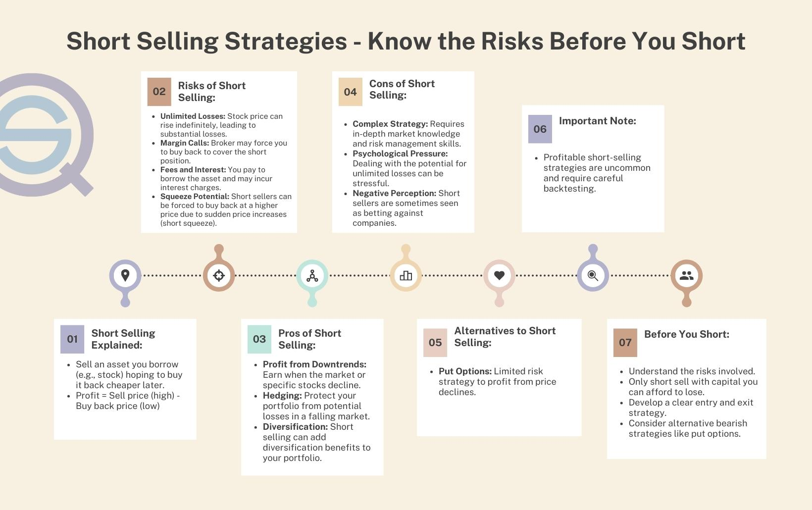

## Table of Contents

## What is short selling and how does it work?

Short selling is when someone borrows a stock or asset from a broker and sells it, hoping to buy it back later at a lower price. The goal is to make money from the difference between the selling price and the buying price. For example, if you borrow a stock and sell it for $100, then later buy it back for $80, you make a $20 profit after returning the stock to the broker.

However, short selling can be risky. If the stock price goes up instead of down, you could lose money. For instance, if you sell a stock at $100 but then have to buy it back at $120, you lose $20. Also, there's no limit to how much you could lose if the stock keeps going up. It's a strategy often used by experienced investors who think a stock's price will drop soon.

## What are the potential financial risks associated with short selling?

Short selling can be risky because there's no limit to how much money you could lose. If you borrow a stock and sell it, hoping to buy it back cheaper later, but the stock price goes up instead, you'll have to buy it back at a higher price. This means you lose money. The more the stock price rises, the more you lose. It's different from buying a stock where the most you can lose is what you paid for it. With short selling, your losses can keep growing if the stock keeps going up.

Another risk is that you might have to buy the stock back quickly. This can happen if the broker who lent you the stock wants it back, or if there's a short squeeze. A short squeeze is when a lot of people who shorted the stock have to buy it back at the same time, which pushes the price up even more. This can make your losses bigger and faster. Also, you have to pay fees to borrow the stock, which can add to your costs if you have to keep the short position open for a long time.

## Can you explain the concept of a short squeeze and its impact on short sellers?

A short squeeze happens when a lot of people who shorted a stock have to buy it back at the same time. This usually happens when the stock's price starts to go up. When short sellers see the price going up, they get worried and want to cut their losses, so they rush to buy the stock back. But when a lot of them do this at the same time, it makes the stock's price go up even more.

This can be really bad for short sellers. As the price keeps going up, they lose more and more money. They might have to buy the stock back at a much higher price than they sold it for, which means big losses. A short squeeze can make the stock's price go up really fast, and short sellers can't do much about it except buy back the stock and accept their losses.

## What are the regulatory and legal considerations one should be aware of before engaging in short selling?

Before you start short selling, it's important to know the rules and laws that apply. In many countries, there are rules about how you can short sell. For example, in the United States, the SEC (Securities and Exchange Commission) has rules that say you can't short sell a stock if it will make the price go down a lot in one day. Also, some places have rules about when you have to tell people you're short selling. It's important to know these rules so you don't break any laws and get in trouble.

Another thing to think about is that some stocks are harder to short sell than others. Some countries have lists of stocks that you can't short sell at all. Also, if you're short selling, you might need to borrow the stock from a broker, and they might not always let you do that. It's good to check all these things before you start short selling so you know what you can and can't do.

## How does the unlimited loss potential of short selling compare to traditional investing?

Short selling and traditional investing have different risks. When you buy a stock the traditional way, the most money you can lose is what you paid for it. If the stock goes to zero, you lose everything you put in, but you can't lose more than that. This is called limited loss potential because there's a clear limit to how much you can lose.

On the other hand, short selling has unlimited loss potential. When you short sell, you borrow a stock and sell it, hoping to buy it back cheaper later. But if the stock's price goes up instead of down, you have to buy it back at a higher price. There's no limit to how high the price can go, so there's no limit to how much money you could lose. This makes short selling much riskier than traditional investing.

## What are the psychological and emotional challenges faced by short sellers?

Short selling can be really stressful because you're betting that a stock's price will go down. This is different from buying a stock, where you hope it goes up. When you short sell, you're going against what most people think will happen, and that can make you feel alone and worried. If the stock's price starts to go up instead of down, you might feel even more stress because your losses could keep getting bigger. It's hard to stay calm and stick with your plan when you see your money going down.

Also, short sellers often face a lot of criticism and blame. When a stock's price goes down, people might say it's because of short sellers, even if that's not true. This can make short sellers feel bad and like they're doing something wrong, even if they're just following the rules. It can be tough to keep going when people are pointing fingers at you. That's why short selling isn't just about understanding the market; it's also about being able to handle the emotional pressure that comes with it.

## How does short selling affect the overall market and other investors?

Short selling can affect the overall market by making stock prices go down. When short sellers borrow and sell a stock, they increase the number of shares for sale. This can make the stock's price drop because there are more shares than people want to buy. If a lot of people start short selling the same stock, it can make the price go down even more. This can be good for other investors who want to buy the stock at a lower price, but it can be bad for people who already own the stock because their investment loses value.

Short selling can also make the market more efficient. When short sellers think a company's stock is overpriced, they sell it short. This can help correct the price if it's too high. It's like a warning signal to other investors that maybe the stock isn't as good as they thought. But, short selling can also cause big problems like short squeezes. If a lot of short sellers have to buy back the stock at the same time, it can make the price go up a lot very quickly. This can hurt other investors who might have to sell their stocks at a lower price because of the sudden change.

## What are the historical examples of short selling gone wrong and what lessons can be learned from them?

One famous example of short selling gone wrong is the case of Volkswagen in 2008. Many investors thought Volkswagen's stock was overpriced and started short selling it. But then Porsche announced it had secretly bought a big part of Volkswagen, which made the stock's price jump up a lot. Short sellers had to buy back the stock at much higher prices, losing billions of dollars. This is called a short squeeze. The lesson from this is that even if a lot of people think a stock will go down, something unexpected can happen and make it go up instead. It's important to be ready for surprises and not to bet too much money on one stock.

Another example is the GameStop short squeeze in early 2021. A lot of investors thought GameStop was going to fail, so they shorted its stock. But then, a group of people on the internet decided to buy a lot of GameStop stock to make the price go up. This forced the short sellers to buy back the stock at higher prices, causing huge losses. The lesson here is that short selling can be risky because other people can work together to push the stock price up on purpose. It's good to be careful and not to short sell a stock just because everyone else is doing it.

These examples show that short selling can be very risky. It's important to do a lot of research and understand the company and the market before you start short selling. Also, don't bet more money than you can afford to lose, because the price can go up in ways you don't expect.

## How can borrowing costs and availability of shares impact the feasibility of short selling?

When you want to short sell a stock, you need to borrow it from someone, usually a broker. The cost of borrowing the stock can make a big difference. If the borrowing cost is high, it can eat into your profits or make your losses even bigger. Sometimes, the cost can be so high that it doesn't make sense to short sell the stock at all. Also, the availability of shares to borrow can be a problem. If a lot of people want to short sell the same stock, there might not be enough shares to go around. This can make it hard or even impossible to start a short sell.

If you can't borrow the stock you want to short sell, you have to look for another stock or give up on the idea. Sometimes, brokers might not let you borrow certain stocks because they're too risky or hard to get. This can limit what you can do and make short selling less feasible. So, before you decide to short sell, it's important to check how much it will cost to borrow the stock and if you can even get the shares you need. These things can make a big difference in whether short selling will work out for you.

## What role do market trends and timing play in the success or failure of short selling strategies?

Market trends and timing are really important for short selling. If you think a stock's price will go down because of a bad trend, like the company losing money or people not buying its products anymore, you might decide to short sell it. But you need to get the timing right. If you short sell too early and the stock's price goes up before it goes down, you could lose a lot of money. It's like trying to catch a falling knife; if you grab it too soon, you might get hurt.

Timing also matters because short selling can be risky if the market suddenly changes. If something unexpected happens, like good news about the company or the whole market going up, the stock's price can go up fast. This can cause a short squeeze, where short sellers have to buy back the stock at higher prices, losing money. So, it's important to watch the market closely and be ready to change your plan if things don't go the way you thought they would.

## How do advanced short selling techniques like options and futures influence risk and reward?

Using options and futures can make short selling more complicated but also change the risk and reward. When you use options, you can buy a put option, which gives you the right to sell a stock at a certain price. This can limit how much money you can lose because you only lose what you paid for the option, no matter how high the stock's price goes. But, options also have a time limit, so if the stock's price doesn't go down before the option expires, you lose the money you paid for it. Futures are like betting on what the stock's price will be in the future. They can give you more ways to make money, but they can also make your losses bigger if the price goes up a lot.

Both options and futures can make short selling more flexible. With options, you can use less money to control a bigger position in the stock, which can make your profits bigger if you're right. But if you're wrong, you can still lose a lot. Futures let you lock in a price now for something you'll buy or sell later, which can help you plan better. But they also come with more risk because you have to put up money to cover possible losses, and if the market moves against you, you might have to add more money quickly. So, while options and futures can help you make more money, they also make short selling riskier and need more careful planning.

## What are the ethical considerations and criticisms of short selling from a societal perspective?

Short selling can be seen as good or bad, depending on who you ask. Some people think it's good because it helps the market work better. When short sellers think a stock's price is too high, they sell it short, which can make the price go down to where it should be. This can stop companies from lying about how good they are and help investors make smarter choices. But, short selling can also be seen as bad because it can make stock prices go down a lot very quickly. This can hurt people who own the stock and lose money because of it. Some people think short sellers are just trying to make money without caring about the companies or people they hurt.

Another criticism of short selling is that it can make the market less stable. When a lot of people short sell the same stock, it can cause big problems like short squeezes. This is when the stock's price goes up a lot because short sellers have to buy it back at the same time. This can make the market go up and down a lot, which can be scary for other investors. Also, some people think short sellers are not playing fair. They might spread bad news about a company to make its stock price go down so they can make money. This can make people trust the market less and think it's not a fair place to invest.

## References & Further Reading

[1]: Bergstra, J., Bardenet, R., Bengio, Y., & Kégl, B. (2011). ["Algorithms for Hyper-Parameter Optimization."](https://papers.nips.cc/paper/4443-algorithms-for-hyper-parameter-optimization) Advances in Neural Information Processing Systems 24.

[2]: ["Advances in Financial Machine Learning"](https://www.amazon.com/Advances-Financial-Machine-Learning-Marcos/dp/1119482089) by Marcos Lopez de Prado

[3]: ["Evidence-Based Technical Analysis: Applying the Scientific Method and Statistical Inference to Trading Signals"](https://www.amazon.com/Evidence-Based-Technical-Analysis-Scientific-Statistical/dp/0470008741) by David Aronson

[4]: ["Machine Learning for Algorithmic Trading"](https://github.com/stefan-jansen/machine-learning-for-trading) by Stefan Jansen

[5]: ["Quantitative Trading: How to Build Your Own Algorithmic Trading Business"](https://www.amazon.com/Quantitative-Trading-Build-Algorithmic-Business/dp/1119800064) by Ernest P. Chan

[6]: Durbin, M. (2010). ["All About High-Frequency Trading"](https://www.amazon.com/All-About-High-Frequency-Trading/dp/0071743448). McGraw-Hill.

[7]: ["Short Selling: Strategies, Risks, and Rewards"](https://www.amazon.com/Short-Selling-Strategies-Risks-Rewards/dp/0471660205) by Amit Kumar