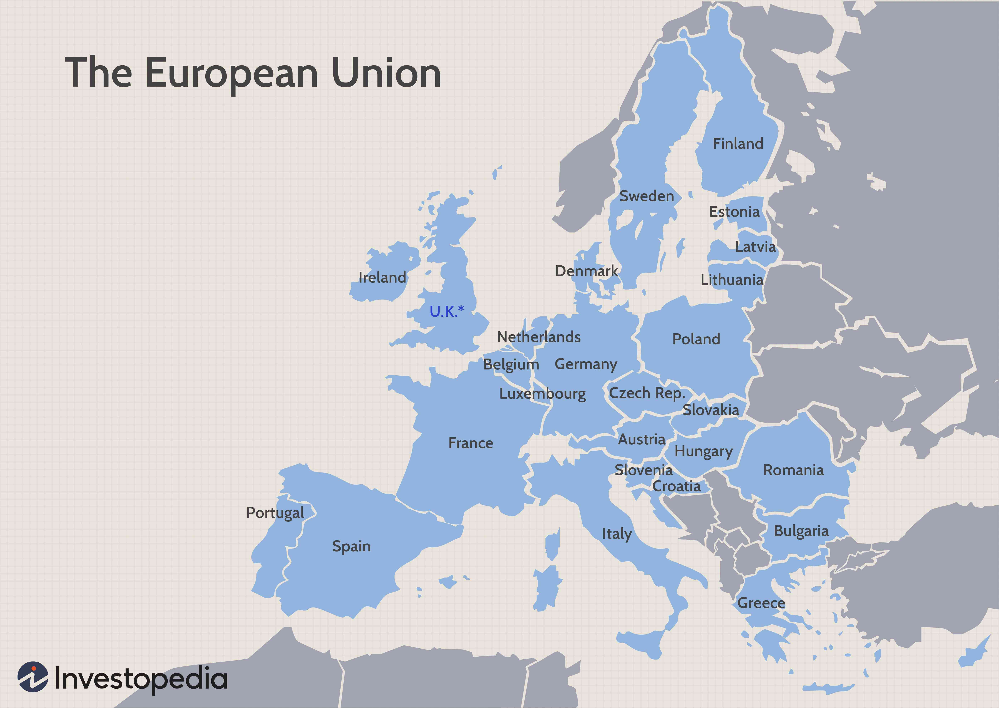

## Table of Contents

## What is the Euro and when was it introduced?

The Euro is the official currency used by many countries in Europe. It makes it easier for these countries to do business with each other because they all use the same money. The Euro is used by 20 countries, and these countries together are called the Eurozone.

The Euro was introduced on January 1, 1999. At first, it was just used for electronic payments and things like bank accounts. People started using Euro coins and notes on January 1, 2002. Since then, the Euro has become a very important currency around the world.

## Why did the United Kingdom decide not to join the Eurozone initially?

The United Kingdom decided not to join the Eurozone initially because they wanted to keep their own currency, the British pound. They thought that having their own money would help them control their economy better. They were worried that if they used the Euro, they wouldn't be able to make decisions about their money as easily. Also, many people in the UK felt a strong connection to the pound and didn't want to give it up.

Another reason was that the UK wanted to keep some distance from the European Union. They thought that joining the Eurozone would mean they had to follow more rules from the EU. The UK wanted to stay independent and not be too tied to the EU. So, they decided it was better to stay out of the Eurozone and keep the pound.

## What is the significance of the Maastricht Treaty in relation to the UK and the Euro?

The Maastricht Treaty was really important because it set up the rules for the European Union, including the Euro. It was signed in 1992 and it said that countries in the EU could use the Euro if they wanted to. But the UK decided not to join the Euro because they wanted to keep their own money, the pound. The treaty let the UK stay out of the Eurozone, which means they didn't have to use the Euro.

This decision was a big deal for the UK. It meant they could keep control over their own money and not have to follow all the rules that come with using the Euro. The Maastricht Treaty gave the UK a choice, and they chose to stay with the pound. This helped the UK feel more independent from the rest of the EU.

## How does the UK's economic structure differ from Eurozone countries?

The UK's economic structure is different from Eurozone countries in a few important ways. One big difference is that the UK uses its own currency, the British pound, instead of the Euro. This means the UK can set its own interest rates and make its own decisions about money without having to follow the rules of the European Central Bank. The UK also has a lot of financial services, like banking and insurance, which are a big part of its economy. This is different from many Eurozone countries, where manufacturing and agriculture might be more important.

Another difference is how the UK handles its budget and spending. The UK government has more freedom to decide how much to spend and how to manage its budget, compared to Eurozone countries that have to follow strict rules about their spending and debt. This flexibility can help the UK respond more quickly to economic changes. Also, the UK has different trade relationships with countries outside of Europe, which can affect its economy in ways that are different from Eurozone countries.

## What role did public opinion play in the UK's decision not to adopt the Euro?

Public opinion played a big role in the UK's decision not to adopt the Euro. Many people in the UK felt a strong connection to the British pound and didn't want to give it up. They saw the pound as a symbol of the UK's independence and history. Surveys and polls showed that a lot of people were against switching to the Euro. They worried that using the Euro would mean losing control over their own money and economy.

Politicians paid attention to what the public wanted. They knew that if they tried to join the Eurozone, it might make a lot of people unhappy. So, the government decided to keep the pound, which was what most people wanted. This decision helped keep the public satisfied and avoided a big fight over the issue. In the end, public opinion was a key reason why the UK stayed out of the Eurozone.

## How have political parties in the UK influenced the decision regarding the Euro?

Political parties in the UK have had a big impact on the decision about the Euro. The Conservative Party, which is often called the Tories, has been against joining the Eurozone. They wanted to keep the British pound and thought it was important for the UK to stay independent. When the Conservatives were in power, they made sure the UK did not join the Euro. They listened to the people who did not want to give up the pound and worked to keep the UK out of the Eurozone.

The Labour Party, on the other hand, was more open to the idea of joining the Euro at first. But even they were careful because they knew many people in the UK did not want to switch currencies. Labour promised to hold a referendum, which is like a big vote, before deciding to join the Euro. But they never actually held this vote because they saw that public opinion was against it. So, both major parties ended up supporting the decision to stay with the pound, influenced by what the public wanted.

## What economic risks did the UK foresee in adopting the Euro?

The UK saw some big economic risks in adopting the Euro. One big risk was losing control over their own money. If the UK used the Euro, they would have to follow the rules set by the European Central Bank. This could mean the UK wouldn't be able to set their own interest rates or make quick decisions about their economy. They worried that if something bad happened to the economy, they wouldn't be able to fix it as easily because they wouldn't have control over their money.

Another risk was that the UK's economy is different from many Eurozone countries. The UK has a lot of financial services, like banking and insurance, which are very important to their economy. If they joined the Eurozone, they might have to follow rules that were made for countries with different kinds of economies. This could hurt the UK's financial services and make it harder for them to grow and do well. The UK wanted to keep their own money to help protect their unique economy and stay in control of their financial future.

## How does the UK's monetary policy differ from that of the European Central Bank?

The UK's monetary policy is different from the European Central Bank's because the UK uses its own currency, the pound. This means the Bank of England, which is like the UK's version of the European Central Bank, can set its own interest rates. Interest rates are important because they affect how much it costs to borrow money and how much people can earn from saving money. The Bank of England can change these rates to help the UK's economy grow or to stop it from growing too fast. If the UK used the Euro, they would have to follow the European Central Bank's rules and couldn't make these changes on their own.

The European Central Bank, on the other hand, sets interest rates for all the countries that use the Euro. They have to think about what is best for all these different countries, not just one. This can be hard because what helps one country might hurt another. The UK's economy is different from many Eurozone countries, so the UK wanted to keep control over its own money to make decisions that are best for its own economy. By using the pound, the UK can respond quickly to its own economic problems and opportunities without having to wait for the European Central Bank to make a decision.

## What are the potential benefits the UK might have gained from adopting the Euro?

If the UK had adopted the Euro, one big benefit could have been easier trade with other countries in the Eurozone. Using the same currency would have made it simpler and cheaper for businesses in the UK to buy and sell things with countries like France, Germany, and Italy. This could have helped the UK's economy grow because more trade usually means more jobs and more money for people.

Another benefit could have been lower costs for people and businesses in the UK. When countries use different currencies, they have to pay to change money from one currency to another. This can be expensive. If the UK used the Euro, they wouldn't have to pay these costs anymore. This could have saved money for everyone and made things like traveling to other European countries cheaper and easier.

## How has the Brexit decision impacted the discussion on the UK and the Euro?

The Brexit decision, which means the UK leaving the European Union, has made the talk about the UK and the Euro even more complicated. Before Brexit, the UK was already not using the Euro, but being part of the EU meant they were still connected to the Eurozone in some ways. After Brexit, the UK is no longer part of the EU, so they are even further away from the Eurozone. This has made people think even more about the benefits and problems of using the Euro.

Since Brexit, the UK has been focusing on making their own economic rules and keeping the pound strong. They don't have to follow the EU's rules anymore, which gives them more freedom to do what they think is best for their economy. But it also means they might miss out on some of the benefits of being closer to the Eurozone, like easier trade and cheaper costs for changing money. So, the Brexit decision has made the UK think carefully about their relationship with the Euro and what it means for their future.

## What are the current economic implications for the UK due to not adopting the Euro?

Not adopting the Euro has meant that the UK can keep control over its own money, the British pound. This gives the UK the freedom to set its own interest rates and make quick decisions about its economy. For example, if the UK's economy is growing too fast, they can raise interest rates to slow it down. If the economy needs a boost, they can lower interest rates to encourage spending and borrowing. This control has been important for the UK, especially during times like the global financial crisis and the economic effects of Brexit, where they could respond to problems in their own way.

However, not using the Euro also means the UK misses out on some benefits. Trading with Eurozone countries can be more complicated and expensive because of currency exchange costs. This can make it harder for UK businesses to sell things in Europe and for European businesses to sell things in the UK. Also, not being part of the Eurozone might make some investors think the UK's economy is riskier, which could affect investment and economic growth. So, while keeping the pound gives the UK more control, it also comes with some challenges in a world where many countries use the Euro.

## How do experts predict the future relationship between the UK and the Euro might evolve?

Experts think that the relationship between the UK and the Euro might change a lot in the future. Right now, the UK uses the pound and is not part of the Eurozone. But some experts say that if the UK's economy faces big problems, they might think about using the Euro. This could help the UK trade more easily with Europe and save money on changing currencies. But it would also mean giving up control over their own money, which many people in the UK don't want to do.

Other experts think the UK will stay with the pound for a long time. They believe that the UK will keep working on making their own economy strong and won't want to join the Eurozone. The UK might try to make special deals with Eurozone countries to help with trade, but they won't use the Euro. This way, the UK can keep control over their money and make decisions that are best for them. So, the future could go in different ways, depending on what happens with the UK's economy and what people in the UK want.

## References & Further Reading

[1]: Krugman, P., & Obstfeld, M. (2009). ["International Economics: Theory and Policy"](https://books.google.com/books/about/International_Economics.html?id=NZnk5C2r8qEC). Pearson.

[2]: Lopez de Prado, M. (2018). ["Advances in Financial Machine Learning"](https://www.amazon.com/Advances-Financial-Machine-Learning-Marcos/dp/1119482089). Wiley.

[3]: Aronson, D. R. (2007). ["Evidence-Based Technical Analysis: Applying the Scientific Method and Statistical Inference to Trading Signals"](https://www.amazon.com/Evidence-Based-Technical-Analysis-Scientific-Statistical/dp/0470008741). Wiley.

[4]: Jansen, S. (2020). ["Machine Learning for Algorithmic Trading"](https://github.com/stefan-jansen/machine-learning-for-trading). Packt Publishing.

[5]: Martin, A., & Leboeuf, A. (2018). ["Algorithmic Trading and High-Frequency Trading"](https://academic.oup.com/book/27407) in Encyclopedia of Information Systems. Elsevier.

[6]: ["The Euro and the Battle of Ideas"](https://press.princeton.edu/books/hardcover/9780691172927/the-euro-and-the-battle-of-ideas) by Markus K. Brunnermeier, Harold James & Jean-Pierre Landau. Princeton University Press.

[7]: Chan, E. P. (2009). ["Quantitative Trading: How to Build Your Own Algorithmic Trading Business"](https://github.com/ftvision/quant_trading_echan_book). Wiley.