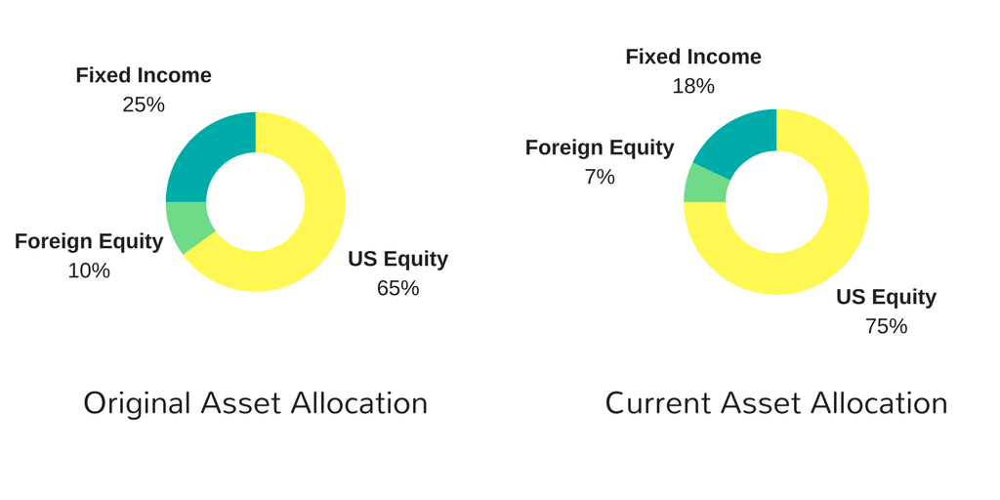

## Table of Contents

## What is a 401(k) and why is it important for retirement?

A 401(k) is a type of retirement savings plan that many companies offer to their employees. It allows you to save money for your future by putting some of your paycheck into a special account before taxes are taken out. This means you pay less in taxes now, and the money in your 401(k) can grow over time. Sometimes, your employer will even add extra money to your account, which is called a match. This is like getting free money to help you save for retirement.

Having a 401(k) is important for retirement because it helps you build a nest egg over many years. Since you start saving early and the money grows through investments, by the time you retire, you could have a lot more money than you put in. This can help you live comfortably when you're no longer working. Plus, the tax benefits and employer matches make it a smart way to save for the future.

## What does rebalancing a 401(k) mean?

Rebalancing a 401(k) means adjusting the investments in your account to keep them in line with your original plan. Over time, some of your investments might grow faster than others, causing your money to be spread out differently than you wanted. For example, if you wanted half your money in stocks and half in bonds, but the stocks did really well, you might end up with more money in stocks than you planned. Rebalancing helps fix this by selling some of the investments that grew a lot and buying more of the ones that didn't.

It's important to rebalance your 401(k) because it helps manage risk and keep your retirement savings on track. If you don't rebalance, your investments might become too risky or not grow as much as they could. By sticking to your original plan, you can feel more confident that your money is working the way you want it to. Most people rebalance their 401(k) once a year or when their investments shift a lot, but you can do it whenever you think it's needed.

## Why is rebalancing important for maintaining a 401(k) portfolio?

Rebalancing is important for keeping your 401(k) portfolio on track with your goals. Imagine you wanted your money split evenly between stocks and bonds. If stocks do really well, you might end up with more money in stocks than you planned. Rebalancing helps fix this by selling some stocks and buying more bonds, so your money stays split the way you want. This keeps your investments from getting too risky or too safe, which helps you reach your retirement goals.

It also helps manage risk. If you don't rebalance, you might end up with too much money in one type of investment, which can be risky if that investment doesn't do well. By rebalancing, you make sure your money is spread out the way you want, which can protect you from big losses. Doing this once a year or when your investments shift a lot can keep your 401(k) working the way you need it to for a comfortable retirement.

## How often should you rebalance your 401(k) assets?

You should rebalance your 401(k) assets at least once a year. This helps make sure your money stays spread out the way you want it. If you started with half your money in stocks and half in bonds, but the stocks did really well, you might end up with more money in stocks than you planned. Rebalancing once a year helps fix this by selling some stocks and buying more bonds.

Some people like to rebalance more often, like every six months or even every three months. This can be a good idea if your investments change a lot. If the stock market goes up or down a lot, you might want to rebalance more often to keep your money safe. But if you rebalance too much, you might end up paying more in fees, so it's good to find a balance that works for you.

## What are the common methods for rebalancing a 401(k)?

One common method for rebalancing a 401(k) is the calendar method. This means you pick a certain time each year, like your birthday or the start of the new year, to check your investments. If your money isn't split the way you want, you sell some of the investments that grew a lot and buy more of the ones that didn't. This keeps your money spread out the way you planned.

Another method is the threshold method. With this, you decide on a certain percentage, like 5% or 10%, that you're okay with your investments changing. If your money moves more than that percentage away from your plan, you rebalance. For example, if you wanted half your money in stocks and half in bonds, but stocks grew so much that you now have 60% in stocks, you would sell some stocks and buy more bonds to get back to 50/50.

Some people also use a mix of both methods. They might check their investments once a year, but if the market changes a lot in between, they might rebalance if their money moves more than their chosen threshold. This way, they keep their 401(k) on track without checking it too often.

## How can market volatility affect the need for rebalancing?

Market volatility can make your 401(k) investments change a lot. When the market goes up and down quickly, some of your investments might grow faster than others. This can mess up the way you wanted your money to be split. For example, if you wanted half your money in stocks and half in bonds, but the stock market goes up a lot, you might end up with more money in stocks than you planned. This means you might need to rebalance more often to keep your money spread out the way you want.

If the market is very volatile, you might want to check your 401(k) more often than once a year. You could use the threshold method, where you decide to rebalance if your investments move more than a certain percentage away from your plan. This helps you keep your money safe and on track, even when the market is jumping around a lot. By rebalancing when the market is volatile, you can make sure your retirement savings stay in line with your goals.

## What are the tax implications of rebalancing a 401(k)?

Rebalancing a 401(k) usually doesn't have any tax implications because it's done within the account. When you sell and buy investments inside your 401(k), you don't have to pay taxes on those moves. This is because the money stays in the account and isn't considered income until you take it out when you retire. So, you can rebalance as often as you need to without worrying about taxes.

However, if you move money out of your 401(k) into a different type of account, like an IRA, there might be tax issues. If you're under 59½ years old, you might have to pay a penalty for taking money out early, plus you'll have to pay income tax on the money you withdraw. But if you're just moving money around inside your 401(k), you don't need to worry about taxes at all.

## How does rebalancing impact long-term investment returns?

Rebalancing can help keep your long-term investment returns on track with your goals. If you don't rebalance, your money might end up in riskier investments than you wanted. For example, if stocks do really well and you don't rebalance, you might have too much money in stocks. This can be risky because if the stock market goes down, you could lose a lot of money. By rebalancing, you sell some of the investments that grew a lot and buy more of the ones that didn't, which keeps your money spread out the way you want.

Rebalancing also helps you stick to your plan. When you start saving for retirement, you decide how much risk you want to take. If the market changes and your investments move away from your plan, rebalancing brings them back. This can help your money grow steadily over time. By keeping your investments balanced, you might not make as much money in the short term if one investment does really well, but it can help you avoid big losses and keep your retirement savings growing in the long run.

## What role does asset allocation play in the rebalancing process?

Asset allocation is like deciding how to split your money between different types of investments, like stocks, bonds, and cash. When you set up your 401(k), you choose how much of your money goes into each type based on how much risk you want to take and how long you have until you retire. Rebalancing helps keep this split the way you want it. If stocks do really well and grow faster than bonds, you might end up with more money in stocks than you planned. Rebalancing means selling some of the stocks and buying more bonds to get back to your original plan.

Over time, the market can change a lot, and this can mess up your asset allocation. If you don't rebalance, your money might be in riskier investments than you wanted. For example, if you wanted half your money in stocks and half in bonds, but stocks grew a lot, you might have too much in stocks. This can be risky if the stock market goes down. By rebalancing, you make sure your money stays spread out the way you planned, which helps you reach your retirement goals without taking on too much risk.

## Can rebalancing help in managing risk within a 401(k)?

Rebalancing can definitely help manage risk in your 401(k). It's like making sure your money stays safe by keeping it spread out the way you want. If you started with half your money in stocks and half in bonds, but the stocks did really well, you might end up with more money in stocks than you planned. This can be risky because if the stock market goes down, you could lose a lot of money. By rebalancing, you sell some of the stocks and buy more bonds to get back to your original plan. This helps keep your investments from getting too risky.

When you rebalance, you're sticking to your plan and managing risk at the same time. If you don't rebalance, your money might be in investments that are too risky for you. Rebalancing helps you keep your money safe and growing the way you want. It's like making sure your retirement savings are on the right path, even when the market changes a lot. By doing this, you can feel more confident that your money will be there for you when you retire.

## What are the potential pitfalls to avoid when rebalancing a 401(k)?

One big pitfall to avoid when rebalancing your 401(k) is rebalancing too often. If you check and change your investments all the time, you might end up paying more in fees. These fees can add up and take away from the money you're saving for retirement. It's good to find a balance, like rebalancing once a year or when your investments move a lot, so you don't pay too much in fees.

Another pitfall is not rebalancing enough. If you don't check your investments and make changes, your money might end up in riskier investments than you wanted. For example, if stocks do really well and you don't rebalance, you might have too much money in stocks. This can be risky if the stock market goes down. By rebalancing regularly, you can keep your money safe and on track with your retirement goals.

Lastly, don't forget about taxes when moving money around. While rebalancing inside your 401(k) doesn't usually have tax implications, if you move money out of your 401(k) into a different type of account, you might have to pay taxes or penalties. Always think about the tax rules before making big changes to your retirement savings.

## How can advanced investment strategies be incorporated into 401(k) rebalancing for expert investors?

Expert investors can use advanced investment strategies in their 401(k) rebalancing by using tactics like tax-loss harvesting. This means selling investments that have lost value to offset gains from other investments, which can lower your taxes. While this usually works better in taxable accounts, some 401(k) plans allow for in-plan conversions to Roth accounts, where you can use this strategy. Another advanced strategy is using asset location, where you put different types of investments in different accounts based on their tax treatment. For example, you might keep bonds in your 401(k) because they're taxed less there, and keep stocks in a taxable account where you can use tax-loss harvesting.

Another way expert investors can enhance their 401(k) rebalancing is by using a more dynamic asset allocation approach. Instead of sticking to a fixed split between stocks and bonds, they might adjust their investments based on market conditions or economic forecasts. This could mean shifting more money into stocks when the market looks good, or into bonds when things seem risky. This strategy requires a lot of research and understanding of the market, but it can help you take advantage of opportunities and manage risk better. By using these advanced strategies, expert investors can make their 401(k) rebalancing more effective and potentially boost their long-term returns.

## References & Further Reading

[1]: Bodie, Zvi, et al. ["Investments"](https://www.mheducation.com/highered/product/Investments-Bodie.html). McGraw-Hill Education, 2013.

[2]: Markowitz, Harry. ["Portfolio Selection: Efficient Diversification of Investments"](https://archive.org/details/portfolioselecti0000mark). Wiley, 1991.

[3]: Malkiel, Burton G. ["A Random Walk Down Wall Street: The Time-Tested Strategy for Successful Investing"](https://www.amazon.com/Random-Walk-Down-Wall-Street/dp/0393358380). W. W. Norton & Company, 2019.

[4]: Sharpe, William F. ["The Sharpe Ratio"](https://web.stanford.edu/~wfsharpe/art/sr/SR.htm). The Journal of Portfolio Management, 1994.

[5]: Montier, James. ["Behavioral Investing: A Practitioner's Guide to Applying Behavioral Finance"](https://www.amazon.com/Behavioural-Investing-Practitioners-Applying-Finance/dp/0470516704). Wiley, 2007.