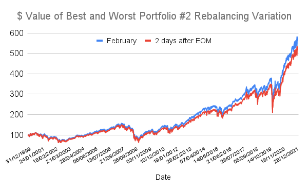

## Table of Contents

## What is portfolio rebalancing?

Portfolio rebalancing is when you adjust your investment mix to keep it in line with your original plan. Imagine you decided to put 60% of your money in stocks and 40% in bonds. Over time, if stocks do really well, you might end up with more than 60% in stocks. Rebalancing means selling some stocks and buying more bonds to get back to your 60-40 split.

Rebalancing helps you stick to your investment strategy and manage risk. It can be done at set times, like every year, or when your portfolio drifts too far from your target. By doing this, you're not just chasing the latest hot investment; you're keeping your investments balanced according to your long-term goals.

## Why is rebalancing frequency important?

Rebalancing frequency is important because it helps keep your investments in line with your goals. If you rebalance too often, you might end up selling good investments too soon or buying more of something just because it went down a little. On the other hand, if you don't rebalance enough, your portfolio can drift away from what you wanted, making it riskier than you planned.

Choosing the right rebalancing frequency depends on your personal situation. Some people like to rebalance every year to keep things steady, while others might do it when their portfolio gets too far off track, like if stocks become 70% of their portfolio instead of the planned 60%. Finding the right balance means you can keep your investments working towards your goals without overdoing it.

## How often should a beginner rebalance their portfolio?

For beginners, rebalancing your portfolio once a year is a good start. This means you look at your investments every year and make sure they still match your plan. If you wanted 60% in stocks and 40% in bonds, you check if it's still that way. If it's not, you sell some stocks or buy more bonds to get back to your plan. Doing it once a year helps you not worry about your investments too much but still keeps things on track.

Another option is to rebalance when your investments get too far off your plan. For example, if your stocks grow so much that they become 70% of your portfolio instead of 60%, you might want to sell some stocks and buy more bonds. This way, you don't have to check your investments every month, but you still make sure they stay balanced. As a beginner, sticking to one of these simple methods will help you manage your investments without it becoming too complicated.

## What are the common rebalancing intervals?

Common rebalancing intervals include doing it every year, every six months, or even every quarter. Yearly rebalancing is popular because it's easy to remember and doesn't make you check your investments too often. Some people like to do it every six months to keep things more up-to-date. And a few might choose to do it every three months if they want to be very careful about keeping their investments balanced.

Another way to rebalance is not by time, but by how much your investments have changed. For example, if you wanted 60% of your money in stocks and they grow to be 70%, you might decide it's time to rebalance. This method means you check your investments whenever they get too far from your plan, not just at set times. Both ways, by time or by change, help keep your investments in line with what you want.

## What factors influence the choice of rebalancing frequency?

The choice of how often to rebalance your portfolio depends on a few things. One big [factor](/wiki/factor-investing) is how much risk you're okay with. If you don't like taking big risks, you might want to check your investments more often to make sure they stay close to your plan. Another thing to think about is how much time you want to spend on your investments. If you don't want to think about them all the time, rebalancing once a year might be enough. But if you like to keep a close eye on things, you might do it every three or six months.

Another important thing is how much your investments change. If the stock market goes up and down a lot, you might need to rebalance more often to keep your mix right. Also, think about any fees you might have to pay when you buy or sell investments. If the fees are high, you might not want to rebalance too often because it could cost you more money. In the end, [picking](/wiki/asset-class-picking) the right rebalancing frequency is about finding a balance that works for you and your investment goals.

## How does rebalancing frequency affect investment returns?

Rebalancing frequency can affect your investment returns because it changes how often you buy and sell your investments. If you rebalance a lot, like every three months, you might end up selling investments that are doing well to buy more of those that aren't doing as well. This can help you stick to your plan and might even buy low and sell high if you're lucky. But it also means you might pay more in fees and taxes because you're trading more often. So, rebalancing too much could lower your returns if the costs are high.

On the other hand, if you don't rebalance often enough, like only once every few years, your investments might grow in a way that doesn't match your plan. This can make your portfolio riskier than you wanted. For example, if stocks do really well, you might end up with more money in stocks than you planned, which could be risky if the stock market goes down. By not rebalancing often, you might miss out on chances to keep your investments balanced and working towards your goals. So, finding the right rebalancing frequency is important to help your investments grow the way you want.

## What are the risks of rebalancing too frequently?

Rebalancing too often can make you pay more in fees. Every time you buy or sell investments, you might have to pay a fee. If you rebalance every few months, these fees can add up and take away from your returns. Also, if you have to pay taxes on your investments, rebalancing a lot can mean you owe more taxes because you're selling things more often.

Another risk is that you might sell your good investments too soon. If your stocks are doing well, rebalancing too much could mean selling them to buy more of other things that aren't doing as well. This can stop you from getting the full benefit of your good investments. It's like cutting a tree down before it's fully grown. So, rebalancing too often can make it harder for your investments to grow as much as they could.

## What are the risks of rebalancing too infrequently?

If you don't rebalance your portfolio often enough, your investments might grow in a way that doesn't match your plan. For example, if you wanted 60% of your money in stocks and they do really well, you might end up with 70% or more in stocks. This makes your portfolio riskier than you planned because you have more money tied up in stocks. If the stock market then goes down, you could lose more money than you expected.

Not rebalancing enough can also mean you miss chances to keep your investments working towards your goals. If you only check your portfolio every few years, you might not notice that it's drifted too far from what you wanted. By the time you do rebalance, it might be too late to fix things easily. So, not rebalancing often enough can make your investments less effective and more risky.

## How can tax implications influence rebalancing frequency?

When you rebalance your portfolio, you might have to pay taxes on the money you make from selling investments. If you do this a lot, you'll owe more taxes because you're selling things more often. This can make your returns smaller because you're giving more money to the tax people. So, if you know you'll have to pay a lot in taxes, you might want to rebalance less often to keep more of your money.

On the other hand, if you don't rebalance often enough, your portfolio might get too far away from what you planned. This can make it riskier and less effective. But, if you wait longer between rebalancing, you might not have to pay as much in taxes because you're not selling and buying as often. So, finding the right balance between keeping your investments on track and not paying too much in taxes is important.

## What role does market volatility play in determining rebalancing frequency?

Market [volatility](/wiki/volatility-trading-strategies), or how much the market goes up and down, can change how often you need to rebalance your portfolio. If the market is very up and down, your investments might move away from your plan faster. For example, if you wanted 60% in stocks and they drop a lot, you might end up with less than 60% in stocks. In this case, you might need to rebalance more often to keep your investments in line with what you want.

But if the market is pretty steady and doesn't change much, you might not need to check your portfolio as often. When things are calm, your investments will stay closer to your plan without much work. So, in a less volatile market, you can probably rebalance less often and still keep things on track.

## How do different asset classes affect the optimal rebalancing frequency?

Different types of investments, or asset classes, can change how often you need to rebalance your portfolio. Stocks can go up and down a lot, which might mean you need to check your portfolio more often to make sure it stays balanced. If you have a lot of stocks, you might need to rebalance every few months to keep your plan on track. On the other hand, bonds usually don't change as much as stocks, so if you have more bonds, you might not need to rebalance as often. Maybe once a year would be enough to keep things in line.

Also, if you have other types of investments like real estate or commodities, they can affect how often you rebalance too. Real estate can be pretty stable, but it can also change based on the market. Commodities, like gold or oil, can be very up and down, so if you have a lot of these, you might need to rebalance more often to keep your mix right. In the end, the types of investments you have will help you decide how often you need to check and adjust your portfolio to make sure it stays the way you want it.

## What advanced strategies can be used to optimize rebalancing frequency based on quantitative models?

Advanced strategies for optimizing rebalancing frequency often use something called quantitative models. These models use math and data to help you decide when to rebalance your portfolio. One common way is to use something called a threshold-based approach. This means you set a limit, like if your stocks go above 65% or below 55% of your portfolio, you rebalance. This helps you rebalance only when it's really needed, not just because time has passed. Another way is to use a calendar-based approach with a twist. Instead of just rebalancing every year, you use data to decide if it's a good time to rebalance based on how the market is doing.

Another strategy is to use something called mean-variance optimization. This looks at how much risk you're taking and how much return you're getting from your investments. It helps you find the best mix of investments and when to change that mix. You might also use something called monte carlo simulations. These simulations run many different scenarios to see how your portfolio might do in the future. By looking at these scenarios, you can decide when rebalancing might help your portfolio the most. Both of these methods help you make smarter choices about when to rebalance, using numbers and data to guide you.

## References & Further Reading

[1]: De Prado, M. L. (2018). ["Advances in Financial Machine Learning."](https://www.amazon.com/Advances-Financial-Machine-Learning-Marcos/dp/1119482089) Wiley.

[2]: Chan, E. (2009). ["Quantitative Trading: How to Build Your Own Algorithmic Trading Business."](https://github.com/ftvision/quant_trading_echan_book) Wiley.

[3]: Jansen, S. (2020). ["Machine Learning for Algorithmic Trading: Predictive models to extract signals from market and alternative data for systematic trading strategies with Python."](https://github.com/stefan-jansen/machine-learning-for-trading) Packt Publishing.

[4]: Farrell, J. L. (1997). ["Portfolio Management: Theory and Application."](https://archive.org/details/portfoliomanagem0000farr) McGraw-Hill.

[5]: James, J., & Webber, N. (2000). ["Interest Rate Modelling."](https://books.google.com/books/about/Interest_Rate_Modelling.html?id=_KNzQgAACAAJ) Wiley.

[6]: Sharpe, W. F., Alexander, G. J., & Bailey, J. V. (1998). ["Investments."](https://archive.org/details/investments0000shar) Prentice Hall.

[7]: Fabozzi, F. J., Kolm, P. N., Pachamanova, D. A., & Focardi, S. M. (2007). ["Robust Portfolio Optimization and Management."](https://onlinelibrary.wiley.com/doi/book/10.1002/9781119202172) Wiley.