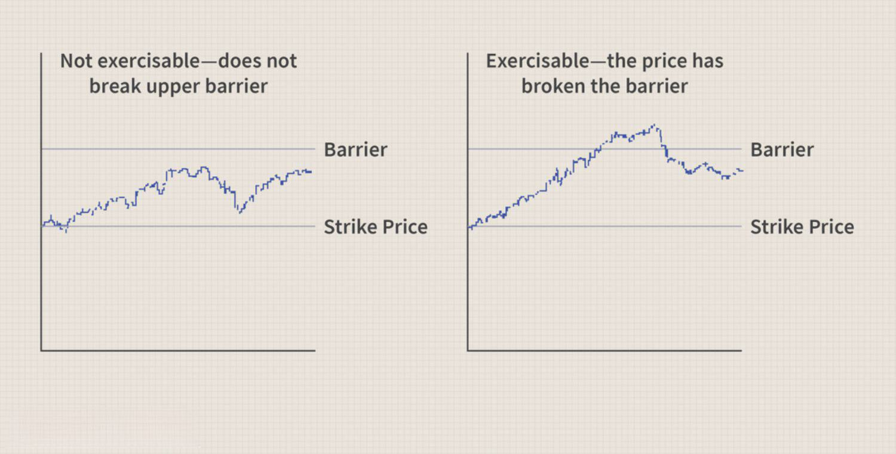

The world of finance encompasses an array of complex instruments and strategies, with options trading being a crucial segment for both hedging and speculative purposes. At the core of options trading are financial derivatives, instrumental in shaping advanced trading strategies. Among these, rebate barrier options stand out due to their unique structure and potential benefits for risk management.

This article focuses on dissecting the mechanisms of options trading, particularly how rebate barrier option strategies are employed. These exotic options, unlike standard options, offer a rebate if certain conditions are breached, effectively providing a safety net for traders. Understanding such intricacies not only aids in managing risk effectively but also opens doors to designing optimal trading strategies.



Algorithmic trading plays a transformative role in the realm of options trading by providing computational techniques that enhance trading precision. By leveraging large datasets and machine learning, algorithmic strategies can optimize barrier option trading. These techniques assess market trends and predict price movements, enabling traders to minimize risks and maximize returns through timely and informed decision-making.

In a financial landscape characterized by volatility and rapid changes, the strategic use of derivative options, coupled with algorithmic solutions, offers traders a significant competitive advantage. This article serves as a guide to understanding the multifaceted nature of rebate barrier options and their application in modern trading strategies.

## Table of Contents

## What are Financial Derivatives?

Financial derivatives are financial instruments whose value is contingent upon the value of an underlying asset or set of assets. These underlying assets can be commodities, stocks, bonds, interest rates, or market indices. Common types of financial derivatives include futures, options, and swaps.

Futures contracts obligate the buyer to purchase, and the seller to sell, an asset at a predetermined future date and price. Options, on the other hand, provide the right but not the obligation to buy or sell an asset at an agreed price before or at a specified date. Swaps are contracts to exchange cash flows or other financial instruments between parties, most commonly used in [interest rate](/wiki/interest-rate-trading-strategies) variations.

Derivatives serve two primary functions: hedging and speculation. Hedging involves offsetting potential losses in investments by taking an opposite position in a related asset, thereby reducing risk. For example, an agricultural producer might use futures contracts to lock in prices for crops, protecting against price drops. Speculation, by contrast, involves betting on the future price movement of an asset to make profits. Unlike hedging, speculation does not seek to reduce risk but rather to leverage potential price changes for gains.

These financial instruments are crucial to modern financial markets as they enhance [liquidity](/wiki/liquidity-risk-premium), allowing markets to operate more smoothly and efficiently. Liquidity is improved because derivatives enable market participants to transfer risk and acquire positions that would otherwise be too costly or impractical using the actual underlying assets. Additionally, derivatives facilitate more complex financial strategies, which can be tailored to specific investment purposes and risk profiles.

Due to their capabilities and flexibility, financial derivatives are potent tools in financial markets, albeit with inherent risks. Proper understanding and robust risk management are necessary for effectively leveraging these instruments.

## Understanding Options Trading

Options trading involves financial contracts that grant the holder the right, but not the obligation, to buy or sell an underlying asset at an agreed-upon price, known as the strike price, prior to or at a specific expiration date. This flexibility underpins the appeal of options as trading instruments, allowing for diverse strategic applications and catering to both speculative and hedging purposes. 

Options contracts are primarily categorized into calls and puts. A call option gives the holder the right to purchase the underlying asset, whereas a put option provides the right to sell. These basic contracts serve as building blocks for more complex strategies, including butterflies, where traders aim to profit from minimal movement in the underlying asset's price, and strangles, which capitalize on significant price movements without direction prediction.

The allure of options trading lies in their inherent flexibility and their potential for high returns relative to their initial investment. For speculators, options offer leveraged exposure to asset price movements with limited downside risk. For hedgers, options provide a means to mitigate potential losses from adverse price movements by locking in prices, thereby stabilizing financial outcomes. 

Mathematically, the pricing of options is often modeled using the Black-Scholes formula for European options, which is given by:

$$
C = S_0 \cdot N(d_1) - X \cdot e^{-rT} \cdot N(d_2)
$$

$$
d_1 = \frac{\ln(S_0/X) + (r + \sigma^2/2)T}{\sigma\sqrt{T}}
$$

$$
d_2 = d_1 - \sigma\sqrt{T}
$$

Where:
- $C$ is the call option price
- $S_0$ is the current price of the underlying asset
- $X$ is the strike price
- $r$ is the risk-free interest rate
- $T$ is the time to expiration
- $\sigma$ is the volatility of the asset
- $N$ is the cumulative distribution function of the standard normal distribution

Implementations of options pricing in Python can help traders simulate and evaluate different strategies efficiently. Here's a simple Python code snippet for pricing a European call option using the Black-Scholes formula:

```python
from math import log, sqrt, exp
from scipy.stats import norm

def black_scholes_call(S0, X, T, r, sigma):
    d1 = (log(S0 / X) + (r + sigma**2 / 2) * T) / (sigma * sqrt(T))
    d2 = d1 - sigma * sqrt(T)
    call_price = S0 * norm.cdf(d1) - X * exp(-r * T) * norm.cdf(d2)
    return call_price

# Example usage
S0 = 100  # Current stock price
X = 100   # Strike price
T = 1     # Time to expiration in years
r = 0.05  # Risk-free interest rate
sigma = 0.2  # Volatility

call_price = black_scholes_call(S0, X, T, r, sigma)
print(f"The Black-Scholes call option price is: {call_price}")
```

Overall, the strategic potential and adaptability of options trading contribute significantly to their popularity among diverse market participants, warranting a thorough understanding of their mechanics and related financial models.

## Rebate Barrier Options Explained

Rebate barrier options are a type of exotic option that incorporates both the traditional barrier option characteristics and an additional rebate feature. These complex financial instruments are designed to pay a predetermined rebate to investors in the event that the option becomes unexercisable due to a particular barrier being breached. This rebate acts as an insurance mechanism, providing some financial compensation when the primary strategy does not succeed.

There are two primary classifications for rebate barrier options: knock-in and knock-out options. Knock-in options come into existence only when the price of the underlying asset reaches or surpasses a defined barrier level. Conversely, knock-out options become null and void when the barrier is breached, thereby preventing the trader from exercising their position. This can occur as a "down-and-in" or "up-and-in" for knock-in options, and as a "down-and-out" or "up-and-out" for knock-out options, depending on the direction of the barrier.

The rebate feature of these options adds an extra layer of attraction, as it provides some level of recovery to investors should their original expectations not come to fruition. This characteristic can make rebate barrier options considerably more appealing to traders who seek to manage risk while engaging in speculative activities. The rebate can be structured to be either a fixed amount or a percentage of the initial premium paid, tailored to the specific risk profile and preferences of the trader.

The mathematical modeling of rebate barrier options is more intricate than that of vanilla options due to the incorporation of the barrier and rebate features. This complexity arises because it requires evaluating the option's value based on probabilistic assessments of the underlying asset's price trajectory. The valuation often involves advanced techniques such as Monte Carlo simulations or partial differential equations to derive accurate pricing and risk management strategies.

In summary, rebate barrier options offer a strategic tool for traders, providing both potential for speculative gains and a safety net through the rebate mechanism. This dual advantage makes them a versatile inclusion in the financial products available for advanced trading strategies in the market.

## Variations of Rebate Barrier Options

Rebate barrier options are specialized financial instruments that combine the features of barrier options with a rebate component. These options are categorized into two principal variations: knock-in and knock-out options, each with their unique mechanics and strategic advantages.

**Knock-In Options**

Knock-in options are characterized by their activation upon the underlying asset's price reaching a predetermined barrier level. These can be further divided into two categories:

1. **Down-and-In Knock-In Options**: These options become active when the underlying asset's price falls to or below a specified lower barrier. Prior to reaching this barrier, the option remains inactive, but its engagement allows the holder to utilize it according to the original option terms once the barrier is crossed.

2. **Up-and-In Knock-In Options**: Conversely, up-and-in options activate when the underlying asset's price rises to or exceeds a defined upper barrier. This type suits scenarios where the trader anticipates an upward movement but seeks to defer option activation until a specific price level is attained.

**Knock-Out Options**

Knock-out options, in contrast, are designed to deactivate once the asset price hits the barrier, terminating the option's validity. This category also includes two variants:

1. **Down-and-Out Knock-Out Options**: These options cease to exist if the underlying asset's price drops to or below a certain barrier. This type can serve as a protective mechanism, automatically nullifying the option to prevent further losses from downward trends.

2. **Up-and-Out Knock-Out Options**: Deactivation occurs in up-and-out options when the asset's price ascends to or surpasses a predetermined upper barrier. This variant is beneficial in situations where a trader anticipates a price ceiling beyond which the option's utility declines.

**Inclusion of a Rebate Clause**

Both knock-in and knock-out options can feature a rebate clause, which is particularly appealing in risk management. The rebate serves as compensation to the option holder if the option is either not activated or is deactivated due to the asset price breaching the barrier. Mathematically, the rebate can be expressed as a fixed monetary amount or a percentage of the option's premium, providing a partial safeguard against total loss.

For traders, understanding these variations and the strategic deployment of rebates can enhance risk mitigation and provide more versatile responses to market conditions.

## Strategic Uses of Rebate Barrier Options

Rebate barrier options present specific strategic advantages for traders looking to effectively manage their portfolios. One primary application of these options is in hedging. Similar to purchasing insurance, utilizing rebate barrier options enables traders to mitigate potential losses arising from unfavorable price movements of the underlying assets. By setting up positions with rebate clauses, traders can cushion themselves against total loss in cases where the options become worthless due to the barrier being breached.

In addition to hedging, rebate barrier options can cater to speculative strategies. These options allow traders to profit from anticipated price movements. For instance, a down-and-in barrier option might be employed to capitalize on a potential decline in the underlying asset's price. Traders can also engage in [arbitrage](/wiki/arbitrage) strategies by leveraging price discrepancies within the market. The rebate feature offers an added layer of security, enabling traders to experiment with positions that might otherwise [carry](/wiki/carry-trading) higher risks.

The inclusion of rebates contributes to the versatility of these instruments. For instance, if a knock-out barrier is breached, the presence of a rebate helps offset the financial impact of the option's nullification. This feature enhances the appeal of such options, allowing them to act as a safety net in uncertain market conditions. Consequently, this versatility enables traders to incorporate rebate barrier options into diversified portfolios, taking advantage of market volatilities while simultaneously managing potential exposure to losses.

## Algorithmic Trading in Options

Algorithmic trading involves the use of sophisticated algorithms to automate trading decisions, thus enhancing the speed and efficiency of trading processes. These algorithms operate on pre-set rules that analyze various market data to make informed decisions without human intervention. In options trading, particularly when dealing with complex instruments like rebate barrier options, [algorithmic trading](/wiki/algorithmic-trading) can be especially beneficial.

In the context of options, algorithms are designed to optimize strategies by leveraging large datasets. For example, algorithms can incorporate historical price data, [volatility](/wiki/volatility-trading-strategies) indices, and other financial metrics to forecast price movements and identify optimal entry and [exit](/wiki/exit-strategy) points. By processing this data in real time, algorithms can quickly react to market changes, potentially capturing profitable opportunities that might be missed by manual trading.

To manage the risks inherently associated with options trading, algorithmic systems can implement dynamic hedging strategies. These can rebalance options positions automatically in response to fluctuations in market conditions, thus minimizing potential losses. Moreover, algorithms can backtest strategies using historical data, helping traders refine their approaches by understanding past performance in various market scenarios.

The primary advantage of utilizing algorithmic trading in options is the capability to execute complex strategies with precision and at scale. For instance, a rebate barrier option strategy might involve monitoring multiple barriers and underlying asset conditions simultaneously. An algorithm can handle these complexities efficiently, recalibrating based on predefined parameters and market inputs.

Below is a basic Python example illustrating how a simple algorithm might be used to decide on executing an option trade based on moving averages:

```python
import pandas as pd

# Load historical data for the asset
data = pd.read_csv('asset_data.csv')

# Compute short and long moving averages
data['Short_MA'] = data['Close'].rolling(window=10).mean()
data['Long_MA'] = data['Close'].rolling(window=50).mean()

# Define trading signals based on moving averages cross-over strategy
data['Signal'] = 0
data['Signal'][10:] = np.where(data['Short_MA'][10:] > data['Long_MA'][10:], 1, 0)
data['Position'] = data['Signal'].diff()

# Recognize buy and sell signals
buy_signals = data[data['Position'] == 1]
sell_signals = data[data['Position'] == -1]

print("Buy Signals:\n", buy_signals)
print("Sell Signals:\n", sell_signals)
```

In this code, the signal generation is based on a simple moving average crossover strategy. The algorithm constantly monitors the short-term and long-term moving averages and generates buy or sell signals when a crossover occurs. This is a rudimentary form of what could be expanded into a more sophisticated option trading system.

While algorithmic trading offers enhanced strategic execution and risk management, it requires robust infrastructure and monitoring to ensure its efficacy. Moreover, traders must continuously adjust their algorithms to align with evolving market conditions and new market data to maintain their competitive edge.

## Advantages and Challenges of Rebate Barrier Options

Rebate barrier options offer a unique feature in derivatives trading by providing a rebate if the option cannot be exercised due to a breach of a preset barrier. This characteristic mitigates losses, effectively acting as a safety net for traders. Unlike standard options, where a barrier breach often results in the immediate loss of the premium paid, rebate barrier options allow traders to recoup part of their capital, making them particularly appealing in volatile market conditions.

However, the intricacies of rebate barrier options may present significant challenges to traders, particularly those with limited experience. One major complexity involves the accurate pricing of these options, which depends on various factors including volatility, interest rates, and the probability of barrier breaches. Traders and financial institutions often employ the Black-Scholes model or its variants, tailored to account for barrier levels and associated rebates, to determine the fair value of these options. 

The Python snippet below demonstrates a simplified calculation for pricing a rebate barrier option using the Black-Scholes framework modified for barriers:

```python
import numpy as np
from scipy.stats import norm

def rebate_barrier_option_price(S, K, T, r, sigma, barrier, rebate):
    d1 = (np.log(S / K) + (r + 0.5 * sigma ** 2) * T) / (sigma * np.sqrt(T))
    d2 = d1 - sigma * np.sqrt(T)

    # Calculate the price assuming the barrier is not breached
    standard_price = S * norm.cdf(d1) - K * np.exp(-r * T) * norm.cdf(d2)

    # Adjust for rebate if the barrier is breached
    if S <= barrier:
        return rebate

    return standard_price

# Example parameters
S = 100        # Current stock price
K = 100        # Strike price
T = 1          # Time to expiration in years
r = 0.05       # Risk-free interest rate
sigma = 0.2    # Volatility
barrier = 95   # Barrier level
rebate = 5     # Rebate amount

price = rebate_barrier_option_price(S, K, T, r, sigma, barrier, rebate)
print(f"The price of the rebate barrier option is: {price:.2f}")
```

Furthermore, market conditions and the availability of these options can significantly influence their pricing and execution. The liquidity of rebate barrier options may be lower compared to standard options, complicating their trading on secondary markets. This can lead to wider bid-ask spreads and potential execution delays. As a result, traders must thoroughly understand the market dynamics and the specific terms of these derivatives to capitalize on their potential benefits while mitigating associated risks.

## Conclusion

Financial derivatives, notably rebate barrier options, offer substantial opportunities for traders who are well-versed in their intricacies. These complicated instruments provide a diverse range of applications, primarily through their ability to pay a rebate if an associated barrier level is breached, thereby mitigating potential losses. The strategic advantage of these options lies not only in their flexibility and the potential for rebates but also in the sophisticated strategies they enable in both speculative and hedging contexts.

The integration of algorithmic trading with rebate barrier options significantly enhances a trader's ability to execute precise and strategically optimized trades. By employing algorithmic solutions, traders can automate decision-making processes based on vast and complex datasets, thereby identifying predictive patterns and favorable market conditions more efficiently. This approach provides both precision and strategic leverage, as algorithms can react to market changes with speed and accuracy beyond human capabilities.

For traders willing to invest the time in understanding the intricate mechanics and potential strategies of rebate barrier options, the rewards can be significant. A deep comprehension of how these options function, including their rebate features and algorithmic optimization, can empower traders to navigate market volatility effectively. This understanding enables them to not only protect their investments more robustly but also to leverage these instruments for profit maximization. The challenges associated with rebate barrier options, such as their complexity and market-dependent variables, are outweighed by the potential to enhance trading outcomes through informed and strategic application.

## Further Reading and Resources

To deepen your understanding of rebate barrier options and options strategies, consider exploring various financial planning resources that offer comprehensive guides and courses. These resources can provide valuable insights into the theoretical and practical aspects of options trading, enhancing your strategic knowledge.

Utilizing trading simulators can be an effective way to practice and refine your barrier options trading strategies without incurring financial risk. These simulators replicate real market conditions and allow you to experiment with different strategies, providing a safe environment to test and optimize your approaches.

Staying updated with financial news platforms is crucial for ensuring that your trading strategies remain aligned with current market developments. Regularly following authoritative financial news sources enables you to capture shifts in market trends, regulatory changes, and other factors that could impact your trading strategies and decision-making processes.

## References & Further Reading

[1]: Baeuerle, N., & Rieder, U. (2004). ["More results on optimality of barrier and rebate barrier options in exponential Lévy models."](https://pmc.ncbi.nlm.nih.gov/articles/PMC6163248/) Theory of Probability & Its Applications.

[2]: Haug, E. G. (2007). ["The complete guide to option pricing formulas."](https://www.amazon.com/Complete-Guide-Option-Pricing-Formulas/dp/0071389970) McGraw Hill Professional.

[3]: Wilmott, P. (2006). ["Paul Wilmott Introduces Quantitative Finance."](https://www.amazon.com/Paul-Wilmott-Quantitative-Finance-Set/dp/0470018704) John Wiley & Sons.

[4]: Hull, J. C. (2017). ["Options, Futures, and Other Derivatives."](https://www.semanticscholar.org/paper/Options%2C-Futures%2C-and-Other-Derivatives-Hull/89bdee500c8623864fc9eb7a471546aa713acc44) Pearson.

[5]: Lopez de Prado, M. (2018). ["Advances in Financial Machine Learning."](https://www.amazon.com/Advances-Financial-Machine-Learning-Marcos/dp/1119482089) Wiley.

[6]: Black, F., & Scholes, M. (1973). ["The Pricing of Options and Corporate Liabilities."](https://www.cs.princeton.edu/courses/archive/fall09/cos323/papers/black_scholes73.pdf) Journal of Political Economy.

[7]: Gatheral, J. (2006). ["The Volatility Surface: A Practitioner's Guide."](https://onlinelibrary.wiley.com/doi/book/10.1002/9781119202073) Wiley.