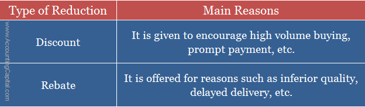

## Table of Contents

## What is a rebate?

A rebate is a type of discount or refund that you get after buying something. When you buy a product, you might be eligible for a rebate, which means you can get some money back. You usually need to fill out a form and send it to the company, along with proof that you bought the product, like a receipt. Once the company gets your form and checks everything, they will send you the rebate amount.

Rebates are often used by companies to encourage people to buy their products. For example, if a new phone is expensive, the company might offer a rebate to make it seem like a better deal. This can help them sell more phones. However, sometimes people forget to send in the rebate form or the process can be complicated, so they might not get the money back. It's important to follow the instructions carefully to make sure you get your rebate.

## What is a discount?

A discount is when you get to pay less for something. It's like a special price that's lower than the usual price. Stores and companies give discounts to make people want to buy their things. For example, if a shirt usually costs $20, a store might sell it for $15 if it's on discount. This makes it cheaper for you and can help the store sell more shirts.

Discounts can happen for many reasons. Sometimes, stores have sales where everything or certain things are cheaper. Other times, discounts are given to special groups of people, like students or seniors. You might also get a discount if you buy a lot of something or if you use a special code when you shop online. Discounts are a great way to save money, but it's important to know the rules, like when the discount ends or if it can be used with other discounts.

## How do rebates and discounts differ?

A rebate and a discount both help you save money, but they work in different ways. A discount is when you pay less for something right away. When you see a discount, the price is already lower than normal, so you save money as soon as you buy the item. For example, if a toy is usually $30 but is on sale for $20, you get a $10 discount. Discounts are easy because you see the savings right when you buy something.

A rebate, on the other hand, is like getting money back after you've already paid the full price. After you buy something, you need to fill out a form and send it to the company, along with your receipt. If everything is correct, the company will send you some money back. For example, if you buy a TV for $500 and there's a $50 rebate, you'll get $50 back later. Rebates can be a bit more work because you have to remember to send in the form and wait for the money to come back.

## What are the common types of discounts?

There are many types of discounts that stores and companies use to help people save money. One common type is a seasonal discount, which happens during certain times of the year like holidays or back-to-school time. Another type is a volume discount, where you get a lower price if you buy more of something. For example, if you buy one box of cereal, it might cost $4, but if you buy three boxes, you might get them for $10 total, which is cheaper per box.

Another common type of discount is a loyalty discount, which is given to customers who keep coming back to the same store or company. Stores might have a special card or app that tracks how much you spend, and then they give you discounts or rewards. There are also promotional discounts, which are used to get people excited about new products or to clear out old stock. These discounts can be advertised with special codes or coupons that you can use when you shop.

Lastly, there are group discounts, which are given to certain groups of people like students, seniors, or military members. These discounts help make things more affordable for these groups. Another type is a clearance discount, where stores lower the prices of items they want to sell quickly. This often happens at the end of a season or when a store is making room for new products.

## What are the common types of rebates?

There are a few common types of rebates that companies offer. One type is a mail-in rebate, where you buy a product, then mail a form and your receipt to the company. If everything is correct, they send you money back. Another type is an instant rebate, where you get the money off right away at the store. This is easier because you don't have to wait or send anything in.

Another common type is a loyalty rebate, where you get money back if you keep buying from the same company. This can be through a special card or program that tracks your purchases. There are also online rebates, where you buy something online and then submit a form through a website to get your money back. Each type of rebate has its own rules, so it's important to read the instructions carefully to make sure you get your money back.

## Can you provide examples of discounts in retail?

In retail, one common type of discount is a seasonal sale. For example, during the holiday season, stores like Target or Walmart might offer big discounts on toys and electronics to get people to buy more. They might have signs saying "30% off all toys" or "Buy one, get one free on video games." These discounts help people save money and make the store busier during the holidays.

Another example is a clearance discount. If a store like Macy's wants to get rid of old clothes to make room for new ones, they might put them on clearance. You might see a sign saying "50% off all winter coats" in the spring. This helps the store sell the old items quickly and makes it cheaper for people to buy things they need. 

Lastly, there are loyalty discounts. Stores like Sephora or Best Buy have special programs where you get points for every dollar you spend. Once you have enough points, you can get discounts on future purchases. For example, if you spend $100 at Sephora, you might get a $10 discount on your next purchase. This encourages people to keep shopping at the same store.

## Can you provide examples of rebates in the automotive industry?

In the automotive industry, one common type of rebate is a manufacturer's rebate. For example, if you buy a new car from Ford, they might offer a $2,000 rebate. This means you pay the full price for the car at the dealership, but then you send in a form with your receipt to Ford. If everything is correct, Ford will send you a check for $2,000. This makes the car cheaper for you, but you have to wait a bit to get the money back.

Another type of rebate in the automotive industry is a dealer rebate. For instance, a dealership might offer a $1,000 rebate on a specific model of car to boost sales. You buy the car at the listed price, and then the dealership gives you the rebate right away, so you don't have to wait or send anything in. This is called an instant rebate and makes it easier for you to save money on the spot. Both types of rebates help make buying a car more affordable, but they work in different ways.

## How do businesses benefit from offering discounts?

Businesses benefit from offering discounts because it helps them sell more things. When a store puts items on sale, people are more likely to buy them because they feel like they are getting a good deal. This can help the store get rid of old stock quickly and make room for new products. For example, if a clothing store has a lot of winter jackets left at the end of the season, they can offer a big discount to sell them all before summer starts. This way, the store doesn't have to keep the jackets in the store, and they can use the space for new clothes.

Discounts also help businesses attract new customers and keep the ones they already have. When people see that a store is offering discounts, they might decide to shop there instead of somewhere else. This can bring in new customers who might come back even when there are no discounts. Plus, if a store has a loyalty program with special discounts, it encourages people to keep coming back. This can make customers feel like they are part of a special group, which makes them want to stay loyal to the store.

## How do businesses benefit from offering rebates?

Businesses benefit from offering rebates because it can help them sell more products. When a company offers a rebate, it makes the product seem cheaper, even though the customer has to pay the full price first. This can make people more likely to buy the product because they feel like they are getting a good deal. For example, if a company offers a $50 rebate on a new laptop, people might be more willing to buy it, thinking they will get money back later. This can help the company sell more laptops and clear out their stock.

Rebates also help businesses keep their customers happy and coming back. When customers get money back after buying something, they feel good about their purchase. This can make them more likely to buy from the same company again. Plus, if a business has a loyalty program with rebates, it encourages people to keep buying from them to earn more rebates. This helps the business build a loyal customer base, which is good for their long-term success.

## What are the tax implications of discounts and rebates for businesses?

When businesses offer discounts, it can affect how much tax they have to pay. Discounts lower the price of the product, so the business gets less money from the sale. This means they have to pay less sales tax because the tax is based on the price the customer pays. For example, if a shirt is normally $20 but is sold for $15 with a discount, the business only has to pay sales tax on the $15. This can help the business save money on taxes, but they still need to report the discounts correctly to the tax authorities.

Rebates can also impact a business's taxes, but in a different way. When a business offers a rebate, they get the full price from the customer at first, but then they have to give some money back later. This means they have to pay sales tax on the full price when they make the sale. However, they can usually claim the rebate amount as a deduction on their taxes later. This can help them get some of the tax money back, but it can make their tax reporting more complicated because they have to keep track of the rebates they give out.

## How can consumers maximize their savings using discounts and rebates?

Consumers can maximize their savings by carefully planning when and where to shop for discounts. It's a good idea to look out for seasonal sales, like Black Friday or back-to-school time, when stores often offer big discounts. You can also sign up for loyalty programs at your favorite stores. These programs give you special discounts and rewards for shopping there often. Another way to save is by using coupons or special codes you find online. Always check if you can combine different types of discounts, like using a coupon on a sale item, to save even more money.

For rebates, consumers should pay close attention to the rules and deadlines. When you buy something with a rebate, make sure to fill out the form correctly and send it in with your receipt as soon as possible. Some rebates have a short time limit, so don't wait too long or you might miss out. It's also smart to keep track of all the rebates you've applied for, so you know when to expect the money back. By combining discounts and rebates, and by being organized and timely, you can save a lot of money on your purchases.

## What advanced strategies can businesses use to optimize their discount and rebate programs?

Businesses can optimize their discount and rebate programs by using data to understand what their customers like and when they are most likely to buy. By looking at this information, they can offer discounts and rebates at the right times, like during busy shopping seasons or when they need to sell more of a certain product. They can also use this data to make special offers for different groups of customers, like giving bigger discounts to people who shop a lot. This way, they can make their customers happy and sell more things without losing too much money.

Another strategy is to use technology to make it easier for customers to use discounts and rebates. Businesses can create apps or websites where people can easily find and use special codes or fill out rebate forms online. This makes it less work for the customer and more likely that they will take advantage of the offer. Also, businesses can work with other companies to offer combined discounts and rebates, which can attract more customers and help everyone sell more. By making their discount and rebate programs easy to use and well-timed, businesses can save money and keep their customers coming back.

## What are rebates in securities trading?

Rebates in securities trading are pivotal, particularly when it comes to short selling. In financial markets, short selling involves borrowing shares to sell on the market with the intent to repurchase them at a lower price. The mechanism of rebates becomes crucial here, as it refers to the interest earned by the short seller from the cash proceeds of the short sale deposited with the broker. This rebate often offsets the cost of borrowing the stock.

### Short Sale Rebate Fees and Their Calculations
When a trader engages in short selling, the proceeds from selling the borrowed stock are kept by the broker in a margin account. The broker typically offers a rebate, a type of interest, on these funds. The rebate rate is usually a few basis points below the prevailing risk-free rate, reflecting the broker's markup.

#### Calculating Short Sale Rebate
The calculation of a short sale rebate depends on the negotiated rebate rate and the funds held in the margin account. For instance, if the rebate rate is 0.5% and the cash proceeds are $100,000, the annual rebate would be:

$$
\text{Annual Rebate} = \text{Cash Proceeds} \times \frac{\text{Rebate Rate}}{100}
$$

$$
\text{Annual Rebate} = \$100,000 \times \frac{0.5}{100} = \$500
$$

Monthly or daily accruals can be derived from the annual figure to reflect more precise earnings over specific periods.

### Role of Margin Accounts
Margin accounts are integral in rebate calculations. They not only hold the proceeds from short sales but also act as collateral for potential buy-ins or margin calls. The leverage provided by these accounts enables traders to engage in transactions without full upfront cost. Moreover, the funds in these accounts can earn rebates, thus lowering the effective cost of borrowing stocks for short positions.

### Risks Associated with Rebates
The use of rebates carries inherent risks, largely stemming from fluctuations in interest rates and borrowing costs. Changes in market conditions or interest rates can alter rebate rates unpredictably, affecting profitability. Additionally, if a heavily shorted stock experiences a buy-in due to limited availability, the trader could be forced to repurchase the stock at a loss, negating any rebate benefits.

### Example of Rebate Application in Stock Trading
Consider a scenario where a trader shorts stock XYZ at $50 per share, selling 1,000 shares for total proceeds of $50,000. Assuming an annual rebate rate of 0.3%, the trader may expect a rebate of approximately $150 annually on the proceeds:

$$
\text{Annual Rebate} = \$50,000 \times \frac{0.3}{100} = \$150
$$

This rebate contributes to offsetting the costs associated with borrowing the stock. If the trader successfully buys back the shares at $45, the profit from the trade on 1,000 shares would be $5,000, with the rebate further enhancing net gains.

In conclusion, rebates in securities trading, while advantageous, are not without complexity and risk. Traders must carefully calculate rebates and consider [interest rate](/wiki/interest-rate-trading-strategies) [volatility](/wiki/volatility-trading-strategies) and stock availability when engaging in short selling strategies. Understanding these dynamics is essential for leveraging rebates effectively in securities trading.

## What is an example of a rebate?

A rebate in trading can be exemplified through a transaction that involves short selling, where the rebate acts as an incentive for liquidity provision or efficient capital use. 

To illustrate, consider a trader who is engaged in short selling a stock. In simple terms, short selling involves borrowing shares and selling them at the current market price, with the intention of buying them back later at a lower price. In this scenario, a rebate is offered by the brokerage to compensate the trader for the interest or the opportunity cost of borrowing the stocks.

### Step-by-Step Breakdown

1. **Initial Transaction Setup**: A trader decides to short sell 1,000 shares of a stock currently priced at $100 per share. The broker lends these shares to the trader, who then sells them in the market, receiving $100,000 in cash.

2. **Rebate Calculation**: The interest rate for borrowing the stock is critical. Suppose the annual stock borrow fee is 2%. The broker, however, offers a rebate, say at 0.5% per annum, to the trader. The rebate is essentially the brokerage’s way to offset some of the borrowing cost.
$$
    \text{Rebate Amount} = \text{Borrowed Amount} \times \frac{\text{Rebate Rate}}{\text{365 Days}} \times \text{Number of Days}

$$

    If the short position is maintained for 30 days, the rebate can be calculated as:
$$
    \text{Rebate Amount} = 100,000 \times \frac{0.5\%}{365} \times 30 \approx \$41.10

$$

3. **Execution and Repurchase**: After 30 days, the stock price falls to $95 per share, and the trader decides to buy back the shares to close the position. The cost of repurchase is $95,000.

4. **Net Gain Calculation**: Considering the selling, repurchase, and rebate, the trader's net gain is:
$$
    \text{Net Gain} = 100,000 - 95,000 + 41.10 = \$5,041.10

$$

### Financial and Procedural Implications

The inclusion of rebates in short selling impacts the trader’s cost structure and potential profitability. The rebate reduces the effective cost of borrowing, thus enhancing the profit margin. It is essential for traders to understand the detailed terms of rebate agreements, as these can significantly affect the overall trading strategy.

### Lessons Learned and Best Practices

- **Understanding Terms**: Clearly understand the rebate conditions offered by brokers, as these often vary and might be influenced by the stock’s liquidity or other market conditions.
- **Cost-Benefit Analysis**: Always perform a cost-benefit analysis to ensure the rebate adequately compensates for the borrowing costs and aligns with trading objectives.
- **Monitoring Market Conditions**: Market conditions influence both stock prices and rebate rates; staying informed can optimize trading strategies and rebate benefits.

### Potential Pitfalls and Avoidance

- **Variable Rates**: Rebate rates can be variable; ensure clarification on whether rates are fixed or subject to change.
- **Dependency on Market Movements**: Relying solely on rebates without a robust trading strategy can lead to unforeseen losses, especially if market conditions shift unexpectedly.
- **Brokerage Terms**: Different brokers can offer varying rebate terms; comparing multiple brokerage offers can lead to more favorable terms.

By understanding the intricate dynamics of rebate transactions, traders can leverage them to optimize their trading strategies, reduce costs, and enhance profitability.

## References & Further Reading

[1]: Harris, L. (2003). ["Trading and Exchanges: Market Microstructure for Practitioners"](https://www.amazon.com/Trading-Exchanges-Market-Microstructure-Practitioners/dp/0195144708). Oxford University Press.

[2]: Hendershott, T., Jones, C. M., & Menkveld, A. J. (2011). ["Does Algorithmic Trading Improve Liquidity?"](https://onlinelibrary.wiley.com/doi/full/10.1111/j.1540-6261.2010.01624.x) The Journal of Finance, 66(1), 1-47.

[3]: Kwan, A., Masulis, R. W., & McInish, T. (2015). ["Trading rules, competition for order flow and market fragmentation."](https://papers.ssrn.com/sol3/papers.cfm?abstract_id=2365603) Journal of Financial Economics, 115(1), 20-30.

[4]: Angel, J. J., Harris, L. E., & Spatt, C. S. (2011). ["Equity Trading in the 21st Century."](https://papers.ssrn.com/sol3/papers.cfm?abstract_id=1584026) The Review of Financial Studies, 24(8), 2424–2447.

[5]: Hasbrouck, J., & Saar, G. (2013). ["Low-latency trading."](https://papers.ssrn.com/sol3/papers.cfm?abstract_id=1695460) The Review of Financial Studies, 26(7), 1693–1726.