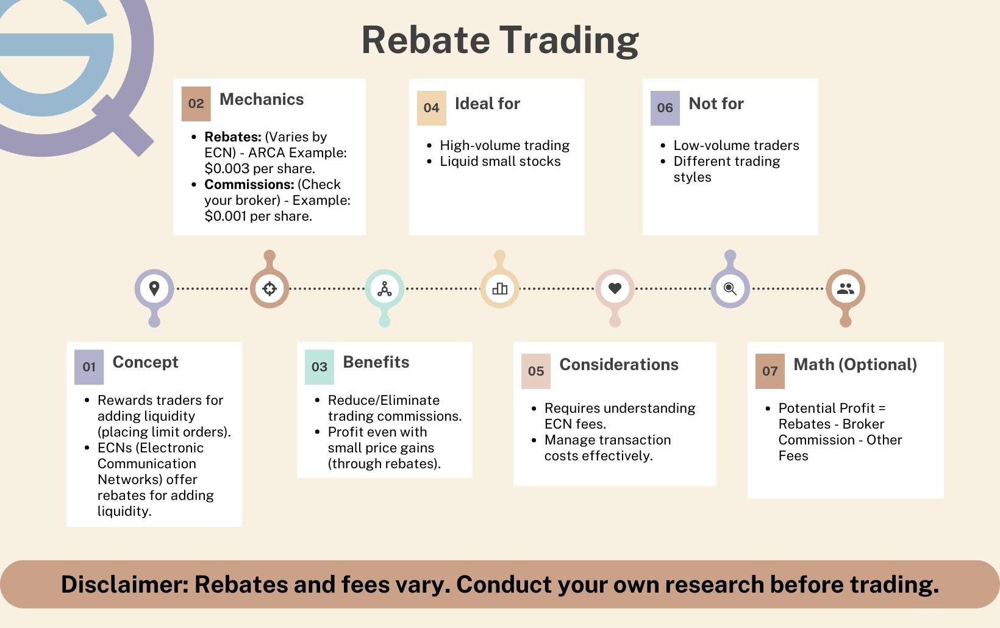

Rebate trading is a strategy utilized within algorithmic trading to capitalize on the financial incentives associated with providing liquidity in the market. This approach hinges on leveraging the payment structures created by Electronic Communication Networks (ECNs), which are digital platforms facilitating trading activity by connecting buyers and sellers of securities. ECNs offer rebates to traders who contribute liquidity to the markets by placing limit orders, which other traders can execute against.

The essence of rebate trading lies in understanding how these rebates work and strategically positioning trades to capture these incentives. In a market environment, liquidity providers use limit orders to sell or buy assets at specific prices, thereby enhancing market depth and stability. ECNs, motivated by the need to improve liquidity on their platforms, reward these traders with rebates for the limit orders that are executed. As a result, traders can earn a small fee, known as a rebate, for every share traded through providing liquidity.



The profit mechanism in rebate trading involves earning rebates while ensuring that trading costs, including spreads and other fees, do not offset these earnings. For example, if an ECN offers a rebate of $0.002 per share for providing liquidity, and a trader places a limit order for 1,000 shares that gets filled, the trader would earn a rebate of $2. This model creates a scenario where high-frequency, high-volume trades are critical, as such orders maximize the rebate opportunities despite typically narrow spreads.

Notably, traders must consider the balance between providing liquidity (earning rebates) versus removing liquidity (incurring fees). While liquidity provision comes with rebates, the removal of liquidity—typically executed through market orders—often incurs direct charges. Successful rebate traders are those who can optimize their strategies to earn rebates systematically, offset their trading costs, and manage the high-frequency demands of this strategy.

By comprehensively understanding the rebate structures of various ECNs and aligning trading strategies to capitalize on liquidity incentives, traders in high-frequency, algorithm-driven environments can find profitable opportunities in rebate trading. However, precision and the ability to execute a multitude of transactions in a highly efficient manner are fundamental to achieving sustained profitability in this strategy.

## Table of Contents

## Understanding Rebate Trading

Rebate trading is a nuanced strategy within algorithmic trading that leverages rebates offered by Electronic Communication Networks (ECNs) to generate profits. This section outlines the fundamental concepts and functionality of rebate trading, highlighting the mechanisms of liquidity provision and ECNs' role in facilitating these trades.

Rebate trading is primarily defined by its core mechanism—the provision of [liquidity](/wiki/liquidity-risk-premium). In financial markets, liquidity providers make it easier for others to buy or sell assets by being ready to take the other side of a transaction. ECNs, which are automated systems facilitating trading, incentivize this behavior by offering rebates to traders who add liquidity. When a trader places a limit order that is not immediately executed, they are providing liquidity to the market. Conversely, when a trader places an order that is matched immediately, they are removing liquidity and typically incur a fee.

The distinction between adding and removing liquidity is central to understanding rebates. When a trader provides liquidity by placing a non-marketable limit order, they earn a rebate. This is contrary to liquidity removal, where traders execute orders against existing quotes and often pay a fee. The rebate strategy capitalizes on the small incentives provided by ECNs, enhancing profitability for traders with high-[volume](/wiki/volume-trading-strategy) strategies. Let's consider a Python snippet to outline these concepts:

```python
def calculate_rebate(order_volume, rebate_rate, liquidity_type):
    """
    Calculate rebate based on liquidity type.

    :param order_volume: Total volume of the order.
    :param rebate_rate: Rate of rebate provided for adding liquidity.
    :param liquidity_type: 'add' for adding liquidity, 'remove' for removing liquidity.
    :return: Rebate earned or fee incurred.
    """
    if liquidity_type == 'add':
        return order_volume * rebate_rate
    elif liquidity_type == 'remove':
        return -order_volume * rebate_rate  # Assume fee equivalent to rebate rate for simplicity
    else:
        raise ValueError("Invalid liquidity type. Choose 'add' or 'remove'.")

# Example usage
order_volume = 1000  # Example volume
rebate_rate = 0.002  # Example rebate rate
print("Rebate for adding liquidity:", calculate_rebate(order_volume, rebate_rate, 'add'))
print("Fee for removing liquidity:", calculate_rebate(order_volume, rebate_rate, 'remove'))
```

ECNs enable rebate trading by serving as venues that facilitate the matching of buy and sell orders outside traditional exchanges. They use a maker-taker model where liquidity providers (makers) are rewarded with rebates, and liquidity takers incur a fee. This model encourages a competitive environment where liquidity is abundant, and spreads are narrow, benefiting both traders and the market.

By strategically placing limit orders, rebate traders can accumulate profits from the rebates while also seeking to profit from price movements. The effectiveness of rebate trading largely depends on a trader’s ability to efficiently manage transaction costs while navigating the structure of ECN fees and rebates. Understanding these dynamics is essential for traders wishing to engage in or optimize rebate trading strategies.

## How Rebate Trading Works

Rebate trading operates through a structured process designed to capitalize on rebates offered by Electronic Communication Networks (ECNs) for providing liquidity. The process of executing rebate trades involves placing limit orders that add liquidity to the market. When these limit orders are executed, the trader receives a rebate from the ECN for facilitating the trade. This strategy is typically implemented using sophisticated algorithms that can respond in real-time market conditions and manage the large volume of trades necessary to generate substantial profits from relatively small per-trade rebates.

### Example of Rebate Trading Including Financial Outcomes

To illustrate, consider a scenario where a trader places a buy limit order for 1,000 shares of Stock A at $10 per share. This order adds liquidity to the market, and upon execution, the trader receives a rebate of $0.002 per share from the ECN. Here is the breakdown of the financial outcome:

- **Shares Traded**: 1,000
- **Price per Share**: $10
- **Rebate per Share**: $0.002
- **Total Rebate**: 1,000 shares * $0.002/share = $2

In this example, the rebate of $2 is earned for providing liquidity.

### Considerations for Costs

While rebates can supplement a trader's income, it is crucial to consider associated costs that can impact the profitability of rebate trading. 

1. **Broker Fees**: Traders typically pay a commission to their brokers for executing trades. Depending on the broker and the account type, this fee can eat into the rebate earnings.

2. **SEC Charges**: As of this writing, the Securities and Exchange Commission (SEC) imposes a transaction fee on sell orders, currently set at a rate of $22.90 per million dollars traded. This fee can increase transaction costs, particularly in high-frequency trading environments where a large number of trades are executed daily.

3. **Clearing and Settlement Fees**: These are additional costs that can vary depending on the clearinghouse and the specifics of the transaction.

The profitability of rebate trading depends significantly on whether the income generated from rebates outweighs these various costs. A critical aspect for traders is to continuously monitor these factors and adapt their strategies accordingly.

To illustrate the impact of costs, consider the previous example with additional costs:

- **Broker Commission**: $5
- **SEC Fee**: ($10,000 * 0.0000229 = $0.229)

**Net Outcome**:  
Rebate earned: $2  
Broker commission: -$5  
SEC Fee: -$0.229  

Net Profit/Loss = $2 - $5 - $0.229 = -$3.229

In this scenario, despite the rebate earned from providing liquidity, the costs result in a loss. Therefore, successful rebate trading requires minimizing costs relative to rebates, often demanding high trade volumes and efficient cost management through effective algorithmic and operational strategies.

## Why Traders Choose Rebate Trading

Traders are drawn to rebate trading primarily due to the financial incentives associated with offering liquidity in electronic markets. Offering liquidity involves placing limit orders that are added to the [order book](/wiki/order-book-trading-strategies) awaiting execution. This activity is rewarded by Electronic Communication Networks (ECNs) through rebates, which are small financial incentives provided to traders for adding liquidity to the market. 

### Advantages of Offering Liquidity

One of the main advantages of offering liquidity is the potential for significantly reduced trading costs. By [earning](/wiki/earning-announcement) rebates, traders can offset other expenses, such as broker fees or exchange costs. This reduction in trading expenses can be especially beneficial for high-frequency traders who execute large volumes of trades. For example, if a trader executes 1 million shares in a month and earns a rebate of $0.002 per share, they can accumulate rebates worth $2,000, which can effectively lower their overall transaction costs.

Additionally, offering liquidity often results in better order fills. When a trader places a limit order to add liquidity, they have more control over the execution price compared to market orders, which take liquidity and can be subject to slippage. This control can result in more favorable prices and increase the overall profitability of trading strategies.

### Profitable Instances for Rebate Trading

Rebate trading is particularly profitable in situations where a trader can capitalize on minor price movements and high trade frequency. With tight bid-ask spreads, traders can repeatedly earn the arbiter between the buying and selling prices while also collecting rebates. Markets with high [volatility](/wiki/volatility-trading-strategies) can provide increased opportunities for these small but frequent price movements that rebate traders exploit.

Another instance where rebate trading becomes highly profitable is during periods of high volume or activity, such as market openings or announcements of economic data. During these times, liquidity is in high demand, and the opportunities to provide liquidity are substantial, allowing traders to maximize rebate earnings.

In conclusion, rebate trading offers the advantages of reduced costs and improved price fills, crucial factors for traders interested in high-frequency and algorithmic strategies. The effectiveness of this approach, however, hinges on high trade volumes and the ability to efficiently manage and capitalize on rebates offered by ECNs.

## Is Rebate Trading Suitable for All Traders?

Rebate trading's suitability varies among traders due to its specific requirements and characteristics. For successful rebate trading, high trade volumes and fee awareness are essential. Traders who can execute a large number of trades benefit more from rebates as these small per-share payments accumulate significantly with volume. Additionally, understanding the fee structures involved in rebate trading is crucial because costs like broker fees and regulatory charges can offset the benefits gained from rebates.

Rebate trading doesn’t fit all trader profiles. It is most suitable for traders who are comfortable with algorithmic strategies and can consistently provide liquidity to the market. These traders often use algorithms to place limit orders that add liquidity, subsequently earning rebates. The strategy might not be ideal for traders whose primary approach focuses on taking liquidity or executing market orders, due to the costs involved in removing liquidity, which often outweighs the rebates earned for providing it.

Additionally, managing transaction costs effectively is a critical skill for rebate traders. This involves calculating the net effect of rebates versus costs such as exchange fees, broker commissions, and charges from regulatory bodies like the SEC. Traders might use software to analyze potential trades and adjust strategies in real-time to maximize net gains. Here's a basic Python snippet to calculate potential rebate earnings:

```python
def calculate_rebate_earnings(trades, rebate_rate, cost_rate):
    total_rebates = trades * rebate_rate
    total_costs = trades * cost_rate
    net_earnings = total_rebates - total_costs
    return net_earnings

# Example usage:
trades = 10000  # number of trades
rebate_rate = 0.002  # rebate per trade
cost_rate = 0.0015  # cost per trade
net_earnings = calculate_rebate_earnings(trades, rebate_rate, cost_rate)
print(f"Net Earnings from Rebate Trading: ${net_earnings}")
```

Proficiency in estimating these transactions' net outcomes is pivotal. Skills in quantitative analysis, coding, and real-time data interpretation enable traders to refine their strategies and optimize profitability. Therefore, while rebate trading offers attractive potential for specific traders, it demands a significant understanding of market dynamics, technology, and cost management techniques.

## Conclusion

Rebate trading offers a unique blend of advantages and challenges, particularly within [algorithmic trading](/wiki/algorithmic-trading). One of the most significant benefits is the potential to earn rebates from Electronic Communication Networks (ECNs) by providing liquidity to the markets. This process not only can reduce the overall transaction costs but also has the potential to improve average execution prices. By executing trades that add liquidity to the market, traders can receive a small fee, which over a large volume of transactions can constitute a significant revenue stream. 

However, rebate trading is not without its challenges. One primary obstacle is the complex fee structures associated with different ECNs, which can vary significantly. Consequently, thorough research into these fees and structures is crucial before embarking on a rebate trading strategy. Additionally, traders must be aware of other associated costs, such as broker fees and regulatory charges, including those imposed by the Securities and Exchange Commission (SEC). Balancing these costs against the rebates earned is essential to ensure profitability.

Algorithmic strategies present an opportunity to enhance rebate trading's viability by enabling the rapid execution and management of large volumes of trades with precision. These strategies can be programmed to optimize the trade-off between earning rebates and minimizing costs. Python, or similar programming languages, can be utilized to develop these algorithms, analyzing real-time data to execute trades at optimal times. However, developing effective algorithms requires a deep understanding of both market dynamics and technical programming skills.

Overall, rebate trading can be a valuable component of a well-rounded trading strategy, particularly for traders capable of managing high volumes and transactions efficiently. Nonetheless, it demands careful planning and continuous optimization to navigate the complexities of ECN fees and to maintain cost-effectiveness. As algorithmic trading continues to evolve, the integration of rebate trading into such strategies remains a promising, yet complex venture.

## References & Further Reading

[1]: Cumming, D., Johan, S., & Li, D. (2013). ["Exchange Trading Rules, Liquidity, and Volatility."](https://papers.ssrn.com/sol3/papers.cfm?abstract_id=1328553) Journal of Financial Markets, 16(3), 419-437.

[2]: Hasbrouck, J., & Saar, G. (2013). ["Low-latency trading."](https://papers.ssrn.com/sol3/papers.cfm?abstract_id=1695460) The Review of Financial Studies, 26(9), 2374–2416.

[3]: Aldridge, I. (2013). ["High-Frequency Trading: A Practical Guide to Algorithmic Strategies and Trading Systems."](https://www.wiley.com/en-us/High+Frequency+Trading%3A+A+Practical+Guide+to+Algorithmic+Strategies+and+Trading+Systems%2C+2nd+Edition-p-9781118343500) John Wiley & Sons.

[4]: Laruelle, S., & Lehalle, C. A. (2013). ["Market Microstructure in Practice."](http://helper.ipam.ucla.edu/publications/fmws2/fmws2_12928.pdf) World Scientific.

[5]: Harris, L. (2003). ["Trading and Exchanges: Market Microstructure for Practitioners."](https://academic.oup.com/book/52292) Oxford University Press.

[6]: Gomber, P., Arndt, B., Lutat, M., & Uhle, T. (2011). ["High-Frequency Trading."](https://papers.ssrn.com/sol3/papers.cfm?abstract_id=1858626) Business & Information Systems Engineering, 3(2), 105-108.