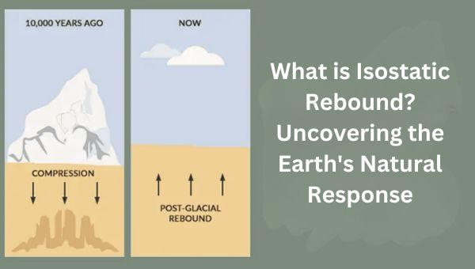

## Table of Contents

## What is a rebound in the context of economics?

A rebound in economics refers to a recovery or an increase in economic activity after a period of decline. It's like when something falls down and then bounces back up. In the economy, this can happen after a recession or a downturn, where businesses start to grow again, people get jobs, and spending increases.

For example, after the global financial crisis in 2008, many countries experienced a rebound in their economies. This meant that after a few years of struggling, businesses started making more money, unemployment rates went down, and people felt more confident about spending their money. A rebound is a sign that the economy is getting healthier and moving forward again.

## What are the common causes of economic rebounds?

Economic rebounds often happen because of actions taken by governments and central banks. When the economy is struggling, governments might spend more money on things like building roads or helping people find jobs. This is called fiscal policy. At the same time, central banks might lower interest rates, making it cheaper for businesses to borrow money and invest in new projects. This is called monetary policy. Both of these actions can help jumpstart the economy and lead to a rebound.

Another cause of economic rebounds can be improvements in the global economy. If other countries start doing better, they might buy more goods and services from the country that's trying to recover. This can create more jobs and increase economic activity at home. Also, sometimes new technologies or innovations can lead to a rebound. For example, if a new type of technology becomes popular, it can create new industries and jobs, helping the economy grow again.

Sometimes, rebounds can also be driven by consumer and business confidence. When people feel more optimistic about the future, they are more likely to spend money and invest in new ventures. This increased spending can create a positive cycle, where more spending leads to more jobs and more economic growth. Confidence can be influenced by many things, like good news about the economy or successful policies from the government.

## Can you provide a simple example of a rebound in a national economy?

Let's talk about the United States after the 2008 financial crisis. In 2008, the U.S. economy was in big trouble. Many people lost their jobs, and lots of businesses were struggling. The government and the central bank, called the Federal Reserve, decided to do something about it. The government spent a lot of money on projects like fixing roads and helping people find jobs. The Federal Reserve also made it cheaper for businesses to borrow money by lowering interest rates.

These actions helped the U.S. economy start to recover. By 2010, things were getting better. More people were finding jobs, and businesses were making more money. People started feeling more confident about spending their money again. This positive cycle helped the economy grow stronger over the next few years. By 2015, the U.S. economy had rebounded and was doing much better than it had been in 2008.

## How do rebounds affect everyday life for the average person?

When an economy rebounds, it can make life better for the average person. One big way it helps is by creating more jobs. When the economy is growing, businesses need more workers, so more people can find work. This means less worry about money and more stability for families. People also feel more confident about spending their money on things they need and want, like new clothes or going out to eat. This can make life feel more enjoyable and less stressful.

Another way rebounds affect everyday life is by making things like houses and cars more affordable. When the economy is doing well, interest rates might stay low or even go down. This makes it cheaper to borrow money for big purchases. So, people might find it easier to buy a home or a new car. Also, when more people are working and spending money, the government collects more taxes. This can lead to better public services, like nicer parks or better schools, which can improve the quality of life for everyone.

## What are the key indicators used to identify an economic rebound?

Key indicators of an economic rebound are things that show the economy is getting better. One big indicator is the unemployment rate. When the economy starts to rebound, more people find jobs, so the unemployment rate goes down. Another important indicator is the Gross Domestic Product (GDP), which measures all the goods and services a country makes. When GDP starts to grow again, it's a sign that the economy is rebounding. Businesses are making more money, and people are spending more.

Another indicator is consumer confidence. When people feel good about the economy, they are more likely to spend money on things they want and need. Surveys can measure how confident people feel, and if those numbers go up, it's a good sign of a rebound. Stock market performance is also an indicator. When the stock market goes up, it often means investors think the economy is getting better. All these indicators together help show that the economy is on the mend and moving forward again.

## How do government policies influence the occurrence of rebounds?

Government policies can really help make an economic rebound happen. When the economy is not doing well, the government can spend more money on things like building roads, fixing schools, or helping people find jobs. This is called fiscal policy. By spending this money, the government can create jobs and get more money moving around in the economy. It's like giving the economy a boost to help it start growing again. Governments might also change taxes to help businesses and people have more money to spend, which can speed up a rebound.

Central banks, which are part of the government, also have a big role in causing rebounds. They can use monetary policy, which means changing interest rates. When they make interest rates lower, it becomes cheaper for businesses to borrow money and invest in new projects. This can help create more jobs and get the economy moving again. Central banks can also do things like buying bonds to put more money into the economy, which can help people and businesses feel more confident and spend more. All these actions together can help the economy rebound faster and stronger.

## What role does consumer confidence play in driving economic rebounds?

Consumer confidence is really important for making an economic rebound happen. When people feel good about the economy, they are more likely to spend money on things they need and want. This spending helps businesses make more money, which can lead to more jobs and more growth. If lots of people are spending, it creates a positive cycle where the economy keeps getting better. So, when consumer confidence goes up, it can really help push the economy towards a rebound.

On the other hand, if people are worried about the economy, they might hold onto their money and spend less. This can make it harder for businesses to grow and create jobs, slowing down the rebound. Governments and businesses often try to boost consumer confidence by showing that the economy is getting better or by making it easier for people to spend. When people start feeling more confident, it can make a big difference in helping the economy bounce back.

## How can rebounds be predicted using economic models?

Economic models can help predict rebounds by looking at different parts of the economy and how they work together. These models use a lot of data, like how many people have jobs, how much money people are spending, and how fast the economy is growing. They can also look at things like interest rates and government spending. By putting all this information into the model, economists can guess what might happen next. If the model shows that more people will start working and spending more money, it might mean a rebound is coming.

Another way economic models predict rebounds is by looking at past rebounds and seeing what happened before them. For example, if the economy has gone through a tough time before and then got better, the model can look at what helped it get better. Things like lower interest rates or more government spending might have been important. By understanding these patterns, the model can tell if similar things are happening now. If they are, it could mean the economy is about to rebound. So, economic models use both current data and past patterns to make their predictions.

## What historical instances best illustrate significant economic rebounds?

One of the best examples of a big economic rebound happened in the United States after the Great Depression in the 1930s. The Great Depression was a very tough time when many people lost their jobs and businesses went bankrupt. The government, led by President Franklin D. Roosevelt, started something called the New Deal. This was a bunch of programs to help people find work and get the economy moving again. They built roads, dams, and other big projects. By the late 1930s, the economy started to get better, and by the time World War II started, the U.S. economy was on its way to a strong rebound.

Another good example is Japan after World War II. After the war, Japan's economy was in ruins. But with help from the United States and smart government policies, Japan started to rebuild. They focused on making things like cars and electronics and selling them to other countries. This helped create a lot of jobs and grow the economy. By the 1960s, Japan had one of the fastest-growing economies in the world. This was a huge rebound from the devastation of the war, and it showed how strong policies and hard work can help an economy bounce back.

## How do rebounds differ across various economic systems (e.g., capitalism vs. socialism)?

Economic rebounds can look different in different types of economic systems, like capitalism and socialism. In a capitalist system, where businesses are owned by private people and the market decides what gets made and sold, rebounds often happen because of private spending and investment. When the economy is down, the government might step in with policies like lowering interest rates or spending more money to help businesses and people feel confident enough to spend and invest again. This can lead to a quicker rebound because businesses can react fast to these changes and start growing again.

In a socialist system, where the government has more control over businesses and decides what gets made and sold, rebounds might happen differently. The government might directly control the spending and investment needed to get the economy going again. They could start big projects to create jobs and increase production. Because the government has more control, it might take longer to see changes, but the rebound can be more planned and steady. Both systems aim to get the economy growing again, but the way they do it and how fast it happens can be different because of who is in charge and how decisions are made.

## What are the long-term effects of frequent economic rebounds on a country's economic stability?

Frequent economic rebounds can make a country's economy feel like a roller coaster. When the economy goes up and down a lot, it can be hard for people and businesses to plan for the future. They might be scared to spend money or invest in new projects because they are not sure if the next rebound will last. This can slow down overall growth and make it harder for the country to become stable. Also, if the government has to keep spending money to help the economy rebound, it might end up with a lot of debt. This debt can make it harder for the government to help out the next time the economy needs a boost.

On the other hand, frequent rebounds can also help an economy get stronger over time. Each time the economy bounces back, businesses and people might learn new ways to deal with tough times. This can make the economy more flexible and better at handling future problems. Also, if the government and central bank get good at helping the economy rebound, people might start to trust that the economy will get better after a downturn. This trust can make the economy more stable in the long run. So, while frequent rebounds can be tough, they can also help build a stronger, more resilient economy if handled well.

## How do global economic factors contribute to or hinder rebounds in individual countries?

Global economic factors can really help or hurt a country's rebound. If other countries are doing well, they might buy more stuff from the country trying to recover. This can create more jobs and help the economy grow. Also, if the world economy is strong, it can make people and businesses feel more confident about spending money. This confidence can help push the economy towards a rebound. For example, if a big trading partner like the United States or China is doing well, it can help smaller countries bounce back faster.

On the other hand, if the global economy is struggling, it can make it harder for a country to rebound. If other countries are not buying as much, it can hurt businesses and lead to fewer jobs. Also, if there are big problems like a global financial crisis or a worldwide health issue, it can slow down or even stop a country's rebound. For instance, during the 2008 financial crisis, many countries found it hard to recover because the whole world was struggling. So, what's happening in the global economy can have a big impact on whether a country can have a successful rebound.

## References & Further Reading

[1]: ["Advances in Financial Machine Learning"](https://www.amazon.com/Advances-Financial-Machine-Learning-Marcos/dp/1119482089) by Marcos Lopez de Prado

[2]: ["Evidence-Based Technical Analysis: Applying the Scientific Method and Statistical Inference to Trading Signals"](https://www.amazon.com/Evidence-Based-Technical-Analysis-Scientific-Statistical/dp/0470008741) by David Aronson

[3]: ["Machine Learning for Algorithmic Trading"](https://github.com/stefan-jansen/machine-learning-for-trading) by Stefan Jansen

[4]: ["Quantitative Trading: How to Build Your Own Algorithmic Trading Business"](https://www.amazon.com/Quantitative-Trading-Build-Algorithmic-Business/dp/1119800064) by Ernest P. Chan

[5]: Bergstra, J., Bardenet, R., Bengio, Y., & Kégl, B. (2011). ["Algorithms for Hyper-Parameter Optimization."](https://dl.acm.org/doi/10.5555/2986459.2986743) Advances in Neural Information Processing Systems 24.