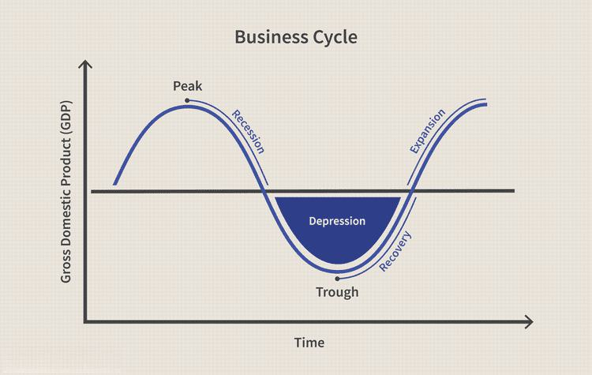

In the financial world, the concept of 'rebound' plays a crucial role as it signifies a recovery phase following a decline. Rebounds are essential for understanding how markets regain strength after a downturn, whether in stocks, commodities, or the overall economy. Such recoveries are vital not only because they signal a return to growth but also because they present opportunities for investors and traders to capitalize on potential market movements and manage risks effectively.

Rebounds can be observed in various contexts, such as stock prices recovering after a significant downturn, commodities regaining their value after a period of oversupply, or an economy bouncing back after a recession. These phenomena highlight the resilience and adaptive nature of financial systems. For investors and traders, recognizing when a rebound is underway can lead to strategic decisions that enhance portfolio returns or protect against future losses. 

The study of historical examples of rebounds provides valuable insights into market behavior. Understanding the causes behind these recoveries is imperative for predicting future market movements. Factors contributing to rebounds are diverse, ranging from market sentiment to economic policies and external events. 

Furthermore, as technology advances, algorithmic trading has become increasingly relevant in capitalizing on rebounds. Automated systems can rapidly identify and exploit emerging opportunities, emphasizing the importance of a technology-driven approach in modern markets. Consequently, understanding rebounds is not only about observing past patterns but also about leveraging contemporary tools to navigate the complexities of current and future market dynamics.

## Table of Contents

## What Is a Rebound in Finance?

A financial rebound refers to a recovery in economic activity or asset prices following a period of decline. This turnaround is most commonly observed in stock markets, where prices rise after a significant downturn. Economic rebounds are particularly notable after recessions, as Gross Domestic Product (GDP) growth shifts back to positive territory, signaling the end of an economic contraction. These rebounds are vital for restoring investor confidence and stimulating further economic growth.

Several factors can influence financial rebounds, including market sentiment, economic policies, and external events. Market sentiment plays a critical role, as shifts in investor confidence can lead to increased buying activity, driving asset prices higher. For example, if investors collectively perceive that a market has hit its bottom, a rebound could occur as they begin purchasing undervalued assets, thus driving prices up.

Economic policies, such as monetary and fiscal measures, can also facilitate rebounds. Central banks may cut interest rates or implement quantitative easing to stimulate economic activity, while governments might introduce fiscal stimuli to boost spending. These actions can create a favorable environment for a rebound by enhancing [liquidity](/wiki/liquidity-risk-premium) and encouraging investment.

External events, such as geopolitical developments or natural disasters, can alter market dynamics and trigger rebounds. For instance, a resolution to a trade dispute might restore confidence in a country's economic prospects, leading to a rebound in its stock market. Similarly, recovery efforts following a natural disaster may spur economic activity and aid in the rebound of affected sectors. 

Understanding these factors is essential for investors to anticipate potential rebounds and develop informed strategies. By analyzing market conditions and identifying the signs of an impending recovery, investors can position themselves to capitalize on rebounds and manage risks more effectively.

## Understanding Rebounds

Rebounds are a fundamental aspect of the economic cycle, comprising phases of expansion and contraction. A rebound occurs when negative market or economic conditions transition into positive ones, effectively signaling a restart of growth. These phases of recovery are crucial as they indicate a shift in [momentum](/wiki/momentum) within the financial markets, which can be influenced by a myriad of factors, including changes in economic indicators, policy decisions, or investor sentiment.

Market participants often rely on technical indicators or signals to identify potential rebounds. Technical analysis involves the study of past market data, primarily price and [volume](/wiki/volume-trading-strategy), to forecast future price movements. Common indicators include moving averages, Relative Strength Index (RSI), and Fibonacci retracement levels, which help traders discern whether a market has reached a potential bottom and is poised for recovery.

Rebounds manifest in two main forms: as part of broader market trends or as isolated events impacting specific sectors or securities. In a broader market context, rebounds typically occur after significant downturns, such as economic recessions or stock market crashes. For instance, the recovery in global equity markets after the financial crises of 2008 and the COVID-19 pandemic in 2020 demonstrated significant rebounds as markets adjusted to new economic realities and investor confidence returned.

Isolated rebounds, on the other hand, might occur in specific sectors or individual securities due to sector-specific developments or company-level news. These can include technological advancements, regulatory changes, or unexpected earnings reports that catch the market by surprise and lead to quick readjustments in price levels.

Accurately identifying and interpreting rebounds is vital for market participants seeking to capitalize on these shifts. Utilizing advanced tools and methodologies, such as [machine learning](/wiki/machine-learning) algorithms and real-time data analytics, can enhance the accuracy of rebound predictions. This technological approach aids in distinguishing temporary recoveries, known as "dead cat bounces," from genuine reversals, thereby optimizing investment decision-making. As financial markets continue to evolve, understanding the mechanics behind rebounds remains an indispensable skill for traders and investors alike.

## Historical Examples of Rebounds

Historical examples of market rebounds illustrate the resilience and cyclical nature of financial markets. Notably, two significant rebound events stand out: the recovery from the 2008 Financial Crisis and the rebound following the initial COVID-19 pandemic selloff in 2020.

The 2008 Financial Crisis, often dubbed the "Great Recession," led to one of the most severe economic downturns since the Great Depression. Stock markets globally saw dramatic declines, with the S&P 500 Index in the United States falling by over 50% from its peak in October 2007 to its trough in March 2009. The rebound began as coordinated efforts by governments and central banks worldwide, such as the U.S. Federal Reserve's aggressive [interest rate](/wiki/interest-rate-trading-strategies) cuts and quantitative easing measures, restored investor confidence. By March 2013, the S&P 500 had regained its pre-crisis peak, marking a significant recovery period that set the stage for the longest bull market on record, lasting until early 2020.

Similarly, the stock market faced another steep decline during the onset of the COVID-19 pandemic in March 2020. The rapid spread of the virus led to widespread economic shutdowns and unprecedented uncertainty, causing the S&P 500 to plummet by approximately 34% from its high in February 2020. However, swift fiscal and monetary responses, including significant stimulus packages and emergency lending facilities, helped stabilize the markets. The subsequent rebound was historically rapid, with the S&P 500 recovering its losses by August 2020 and continuing to reach new highs later that year.

These historical market rebounds underscore the potential for financial markets to not only recover but exceed previous highs following substantial declines. Such recoveries often pave the way for new bull markets, presenting lucrative opportunities for long-term investors. Recognizing patterns in historical rebounds can aid in understanding future market dynamics and crafting strategic responses to downturns.

## Dead Cat Bounce vs. Trend Reversal

A dead cat bounce is a temporary recovery in the price of a declining asset, often causing traders to be misled about the continuation of a downtrend. This phenomenon is based on the metaphor that even a dead cat will bounce if it falls from a great height, implying that some upward movements are not signs of substantial recovery but rather brief increases in price. The dead cat bounce is typically characterized by a rapid upward movement followed by a resumption of the downtrend, suggesting that the fundamental trend remains unchanged.

In contrast, a trend reversal marks a permanent change from a downward to an upward trajectory. Unlike the transient nature of a dead cat bounce, a trend reversal indicates a significant shift in market sentiment, often driven by changes in economic indicators, corporate earnings, or investor sentiment. Identifying a true trend reversal is critical for traders aiming to optimize their decision-making and harness real market opportunities.

To effectively distinguish between a dead cat bounce and a trend reversal, traders rely on technical analysis tools and market indicators. Key indicators include moving averages, relative strength index (RSI), and Fibonacci retracements. For instance, a crossover of short-term moving averages over long-term averages can signal a potential trend reversal. Similarly, an RSI value crossing the 30 or 70 thresholds can suggest bullish or bearish reversals, respectively. Employing these techniques allows traders to discern the sustainability of price movements and adapt their trading strategies accordingly.

Technical analysis can also involve pattern recognition, where traders analyze candlestick formations or chart patterns such as head and shoulders or double bottom. These patterns can provide insights into the probability of a trend reversal. Additionally, volume analysis plays a crucial role in confirming the strength of a reversal, as increased trading volume often accompanies genuine changes in trend.

Given the complexities of market dynamics, enhancing the precision of technical analysis through [algorithmic trading](/wiki/algorithmic-trading) can help process large datasets to identify and react to potential reversals effectively. Nonetheless, traders must remain cautious, as algorithms can sometimes misinterpret transient price fluctuations as genuine trends. Understanding the nuances between dead cat bounces and trend reversals is essential for traders seeking to mitigate risks and capitalize on genuine market recoveries.

## Causes of Rebounds

Rebounds can result from various factors that alter investor perceptions and market dynamics. A primary cause is oversold conditions, where market participants have excessively sold assets, driving prices below intrinsic values. This often happens due to panic selling or adverse economic news, creating conditions ripe for a rebound when valuations are perceived as too low by investors.

Positive economic indicators, such as improved GDP growth, employment rates, or strong corporate earnings, can also catalyze market reversals. When data reflects economic strength or corporate health, it can renew investor confidence, prompting buying activity that pushes asset prices upward. Policy changes, particularly those involving monetary or fiscal measures, can further drive rebounds. For instance, interest rate cuts or increased government spending can stimulate economic growth, encouraging investors to re-enter the market.

Investor sentiment heavily influences rebounds. Markets are often driven by the collective emotions of optimism and pessimism. During periods of pessimism, markets may experience steep declines; however, a subsequent shift toward optimism can spark a rebound as investor confidence returns. This psychological [factor](/wiki/factor-investing) can lead to surges in buying activity, bolstering market prices.

External factors, including geopolitical events and natural disasters, impact market dynamics and can trigger rebounds. For example, resolution of a geopolitical conflict or effective management of a natural calamity may ease investor concerns, contributing to positive market movements. Conversely, such events can lead to initial market declines, creating oversold conditions that later set the stage for a recovery.

Understanding these causes is crucial for investors seeking to anticipate or benefit from rebounds. By recognizing the interplay of market conditions, economic data, investor psychology, and external events, investors can make informed decisions that align with potential market movements.

## Algorithmic Trading and Rebounds

Algorithmic trading refers to the use of automated systems that execute trades based on predefined sets of rules or criteria. These systems can rapidly process market data, spot patterns, and execute trades at speeds unattainable by human traders. One area where algorithmic trading has significant impact is during financial market rebounds, where asset prices recover following a decline.

Algorithms play a crucial role in amplifying market movements during rebounds. By rapidly analyzing large volumes of data, they can identify emerging opportunities that arise as markets begin to recover. For instance, if a stock or an asset class shows signs of a rebound, algorithms can quickly detect these signals and execute trades to capitalize on potential upward movements.

High-frequency trading ([HFT](/wiki/high-frequency-trading-strategies)), a subset of algorithmic trading, is particularly well-suited to exploit short-term trends and price discrepancies during rebounds. HFT firms use sophisticated algorithms to make trades within milliseconds, often holding positions for very brief periods. This enables them to capture minuscule price changes that occur as markets adjust during a rebound phase. While this can lead to substantial profits, it also means that HFT firms may contribute to increased short-term liquidity and, paradoxically, heightened [volatility](/wiki/volatility-trading-strategies). The rapid execution and high turnover of trades can create sharp price movements, affecting overall market stability.

The impact of algorithmic trading on market efficiency holds significant implications during rebounds. On the one hand, the efficiency brought about by algos can lead to more accurate asset pricing, faster dissemination of information, and enhanced liquidity. On the other hand, the very speed and volume at which trades are executed can exacerbate price swings, particularly if multiple algorithms respond similarly to market signals. This could lead to "flash crashes" or rapid price corrections as seen in past market events.

Overall, while algorithmic trading provides advantages in executing trades efficiently and capturing opportunities during rebounds, it also requires careful oversight to manage the potential for increased market volatility. With advancements in machine learning and [artificial intelligence](/wiki/ai-artificial-intelligence), the future of algorithmic trading may see even more sophisticated strategies for predicting and responding to financial rebounds.

## Conclusion

Rebounds are essential elements within financial markets, providing both risks and opportunities for investors. They occur when asset prices or economies recover following a period of decline, offering potential for substantial gains. However, the volatile nature of rebounds can also pose significant risks if misinterpreted. Therefore, recognizing the factors that drive rebounds and their implications is crucial for formulating successful investment strategies.

Several elements can influence rebounds, including market sentiment, economic policies, and external events. Understanding these drivers aids investors in anticipating market movements and making informed decisions. For instance, positive economic data or policy shifts can catalyze market reversals, while changes in investor sentiment can lead to increased buying activity following bearish phases. By analyzing these factors, investors can better position themselves to capitalize on emerging market trends.

Algorithmic trading plays a critical role in modern financial markets, particularly during rebounds. These automated systems execute trades based on predefined rules, enabling rapid reactions to market changes. High-frequency trading algorithms, in particular, exploit short-term trends and price discrepancies, enhancing market efficiency. However, their involvement can also contribute to increased volatility during rebounds. This underscores the importance of adopting technology-driven approaches and understanding the impact of algorithmic activities on market dynamics.

As markets evolve, grasping the nuances of rebounds will be essential for traders and investors. Future challenges will likely arise as technological advancements and global economic conditions continue to shape financial landscapes. By mastering the complexities of rebounds, market participants can effectively navigate these challenges and optimize their investment outcomes. Recognizing the symbiotic relationship between rebounds and algorithmic trading will further empower investors to adapt to the ever-changing terrain of financial markets.

## References & Further Reading

[1]: ["Advances in Financial Machine Learning"](https://www.amazon.com/Advances-Financial-Machine-Learning-Marcos/dp/1119482089) by Marcos Lopez de Prado

[2]: ["Evidence-Based Technical Analysis: Applying the Scientific Method and Statistical Inference to Trading Signals"](https://www.amazon.com/Evidence-Based-Technical-Analysis-Scientific-Statistical/dp/0470008741) by David Aronson

[3]: ["Machine Learning for Algorithmic Trading"](https://github.com/stefan-jansen/machine-learning-for-trading) by Stefan Jansen

[4]: ["Quantitative Trading: How to Build Your Own Algorithmic Trading Business"](https://www.amazon.com/Quantitative-Trading-Build-Algorithmic-Business/dp/1119800064) by Ernest P. Chan

[5]: Bergstra, J., Bardenet, R., Bengio, Y., & Kégl, B. (2011). ["Algorithms for Hyper-Parameter Optimization."](https://dl.acm.org/doi/10.5555/2986459.2986743) Advances in Neural Information Processing Systems 24.