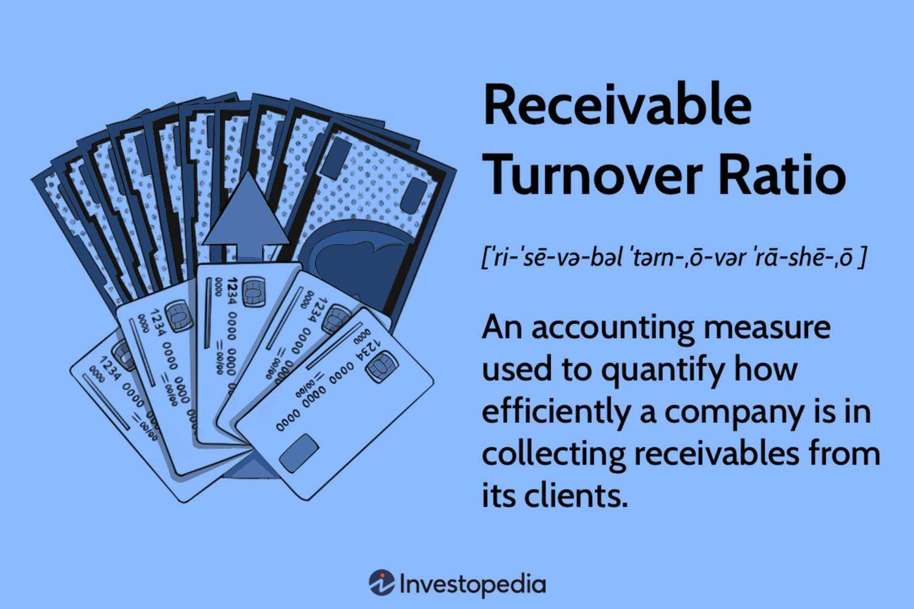

The world of finance is both vast and intricate, employing numerous tools and metrics to evaluate a company's performance comprehensively. Among these analytical instruments, financial ratios play an indispensable role. One of the most critical ratios in this context is the accounts receivables turnover ratio. This particular ratio serves as a measure of a company's efficiency in collecting debts owed by customers. As companies compete in diverse markets, the ability to swiftly convert receivables into cash becomes a valuable asset. 

In recent years, algorithmic trading has transformed the landscape of financial markets, making the integration of such ratios even more significant. The speed and data processing capabilities inherent in algorithmic trading systems allow traders to quickly assess financial health by incorporating these ratios. The accounts receivables turnover ratio, in particular, becomes an essential component in evaluating how effectively a company manages its credit and collection activities. 



This article sets out to explore the accounts receivables turnover ratio, highlighting its importance in financial analysis and its practical application within algorithmic trading.

## Table of Contents

## Understanding Financial Ratios

Financial ratios are essential metrics that offer a window into assessing a company's operational, financial, and market status. They serve as quantitative tools that analyze a company's performance, reflecting its strengths and weaknesses in specific areas.

By employing these ratios, stakeholders can gain insights into various aspects of a business's health. Key areas of evaluation include profitability, which measures a company's ability to generate earnings relative to its revenue, assets, and equity. Liquidity ratios assess the capacity of a company to meet its short-term obligations, indicating financial robustness and operational efficiency. Solvency ratios, on the other hand, provide an understanding of the company's long-term financial stability by evaluating its ability to meet long-term liabilities.

One of the major advantages of financial ratios is their role in facilitating comparative analysis. They allow businesses to benchmark their financial performance over different periods, identifying trends and patterns that may signify improvement or areas requiring attention. Additionally, these ratios enable comparisons with other companies within the same industry, offering a relative performance measure that can highlight competitive advantages or areas needing strategic changes.

In conclusion, financial ratios are indispensable tools for evaluating a company's overall financial health. By offering a comprehensive analysis of areas such as profitability, [liquidity](/wiki/liquidity-risk-premium), and solvency, they assist stakeholders in making informed decisions and strategic planning.

## What is the Accounts Receivables Turnover Ratio?

The accounts receivables turnover ratio is a financial metric that quantifies a company's effectiveness in managing and collecting its short-term credit accounts. This ratio is pivotal as it indicates how many times, on average, a company converts its receivables into cash over a specific time frame, predominantly a fiscal year. A higher accounts receivables turnover ratio is generally interpreted as a sign of efficient credit management and a robust collection process. It suggests that the company has effective policies for extending credit and is successful in receiving payments from customers promptly, thereby optimizing its working capital.

Conversely, a lower turnover ratio may signify potential challenges, such as lenient credit policies, inefficiencies in the collection processes, or the possibility of customers defaulting on payments. These issues can lead to cash flow problems, affecting a company's liquidity and financial stability.

To illustrate, if a company has net credit sales of $1,000,000 and an average accounts receivable of $100,000 for a financial year, the accounts receivables turnover ratio would be calculated as follows:

$$
\text{Accounts Receivables Turnover Ratio} = \frac{\text{Net Credit Sales}}{\text{Average Accounts Receivable}} = \frac{1,000,000}{100,000} = 10
$$

This means that, on average, the company collects its outstanding receivables ten times a year. Such information is critical for stakeholders, including investors and financial analysts, to evaluate a company's operational efficiency and its effectiveness in managing cash flows. Understanding this ratio aids in diagnosing the financial health of an enterprise and making informed business decisions.

## Calculating the Accounts Receivables Turnover Ratio

The accounts receivable turnover ratio is an essential financial metric used to evaluate how effectively a company manages the collection of its credit sales. This ratio is calculated using the following formula:

$$
\text{Accounts Receivable Turnover Ratio} = \frac{\text{Net Credit Sales}}{\text{Average Accounts Receivable}}
$$

### Net Credit Sales

Net credit sales represent the total sales made on credit, from which returns and allowances have been subtracted. This adjustment is crucial as it provides a clear picture of actual sales that need to be collected, excluding any sales that have been returned or discounts that were granted.

### Average Accounts Receivable

Average accounts receivable is calculated by taking the mean of the opening and closing balances of accounts receivable for a specific period. This approach smooths out fluctuations in receivables that might occur within the period, offering a more accurate representation of the receivables situation.

$$
\text{Average Accounts Receivable} = \frac{\text{Opening Accounts Receivable} + \text{Closing Accounts Receivable}}{2}
$$

These calculations together aid in understanding how many times, on average, the receivables are converted into cash over a specific timeframe, thereby providing insights into the efficiency of a company’s collection process. When deploying financial ratios in analysis, it is vital to ensure the data reflects the accurate, net amounts to derive meaningful insights.

## Interpreting the Turnover Ratio

A high accounts receivables turnover ratio is generally considered a positive indicator for a company's financial health and operational efficiency. This metric suggests that a company is effective in its credit management and collection processes, ensuring that debts owed by customers are collected promptly. Effective debt collection contributes to consistent cash flow, which is crucial for maintaining liquidity and meeting operational expenses without the need to incur additional debt.

On the contrary, a lower accounts receivables turnover ratio can signal issues that may require management's attention. It might indicate that the company is facing challenges in collecting outstanding debts, potentially leading to cash flow problems and increased reliance on external financing. Inefficient collection processes or overly lenient credit policies could be underlying causes. Companies with lower ratios should reassess their credit policies, tighten credit terms, or improve their collection strategies to ensure debts are collected more efficiently.

It is important to compare the accounts receivables turnover ratio against industry standards to gain meaningful insights. Different industries may have varying norms for what constitutes an efficient turnover ratio due to differences in typical credit terms and customer payment behaviors. For example, companies in sectors with quick payment cycles, such as retail, might naturally exhibit higher turnover ratios compared to those in industries with longer credit terms, such as construction.

For a more nuanced analysis, businesses can compare their turnover ratios not only with industry standards but also track them over time. Identifying trends within the company's historical data can help detect shifts in financial health or the effectiveness of implemented credit policies. While a single turnover ratio offers a snapshot, continuous monitoring provides a more comprehensive picture of the company's efficiency in managing accounts receivables.

## Role of Receivables Turnover in Algorithmic Trading

In [algorithmic trading](/wiki/algorithmic-trading), the speed and accuracy of data-driven decisions are of paramount importance. The accounts receivables turnover ratio is a critical financial metric that can be integrated into trading algorithms to evaluate a company's financial performance efficiently. By utilizing this ratio, traders can quickly assess how effectively a company is managing its debt collection processes, which is a key indicator of its financial health.

Financial ratios, such as the accounts receivables turnover, enable algorithms to process both historical and real-time data, allowing traders to make informed decisions. The integration of these financial metrics allows algorithms to perform tasks such as identifying trends, spotting anomalies, and predicting potential changes in a company’s financial status.

For instance, a consistently high accounts receivables turnover ratio may suggest robust cash flow management and an efficient credit policy, which could indicate a potentially stable investment. Conversely, a declining ratio might hint at collection issues, alerting traders to reassess their positions or expectations for that company's stock.

The application of financial ratios in algorithmic models generally involves setting specific thresholds for these ratios, which trigger predefined trading actions. These models continuously monitor the incoming data feeds, and any changes in the accounts receivables turnover ratio that breach the set thresholds can initiate buying or selling decisions.

A typical Python code snippet to incorporate the accounts receivables turnover ratio into an algorithmic trading strategy may include:

```python
def analyze_receivables_turnover(net_credit_sales, average_receivables):
    turnover_ratio = net_credit_sales / average_receivables
    return turnover_ratio

def trading_decision(ratio):
    if ratio > high_threshold:
        return "Buy"
    elif ratio < low_threshold:
        return "Sell"
    else:
        return "Hold"

# sample data
net_credit_sales = 1000000  # example value
average_receivables = 200000  # example value

# define thresholds
high_threshold = 6.0
low_threshold = 4.0

turnover_ratio = analyze_receivables_turnover(net_credit_sales, average_receivables)
decision = trading_decision(turnover_ratio)

print(f"Accounts Receivables Turnover Ratio: {turnover_ratio}, Trading Decision: {decision}")
```

The code demonstrates a simple model to compute the turnover ratio and make subsequent trading decisions based on predefined thresholds. Such implementations streamline the decision-making process, allowing traders to respond rapidly to market conditions. As algorithmic trading continues to evolve, the incorporation of financial ratios like the accounts receivables turnover will remain integral to enhancing trading strategies and maintaining a competitive edge in the financial markets.

## Limitations of the Receivables Turnover Ratio

The accounts receivables turnover ratio, while a useful indicator of a company's efficiency in collecting outstanding credit, has certain limitations that should be considered when interpreting the results. One notable limitation is its inability to account for seasonal variations in sales or receivables. Companies can experience significant fluctuations in sales throughout the year, such as retailers during holiday seasons. These fluctuations can distort the ratio, making it appear lower during peak sales months when receivables temporarily increase, or artificially high during slower periods.

Another limitation lies in the calculation method. The ratio is typically determined using net credit sales, which excludes returns and allowances. However, if calculated using total sales instead of net sales, the ratio may not provide an accurate measure of collection efficiency. This discrepancy can lead to misinterpretations of a company’s financial health if not appropriately adjusted for in the analysis.

Furthermore, understanding the context in which the accounts receivables turnover ratio is applied is crucial for avoiding misinterpretation. Different industries have varying accounts receivable norms, and what is considered efficient for one sector might not be applicable for another. Additionally, the ratio may not reflect non-financial factors such as changes in credit policies or economic conditions that could impact a company's cash flow. This is why analysts often compare the ratio against industry benchmarks or analyze it alongside other financial metrics for a more comprehensive view.

## Conclusion

The accounts receivables turnover ratio is an instrumental metric in financial analysis, particularly in assessing a company's efficiency in collecting receivables. By quantifying how often a company converts its accounts receivables into cash over a specific period, this ratio directly sheds light on the effectiveness of its credit and collection policies. High turnover ratios typically signal prompt collection practices and, consequently, contribute positively to a company’s liquidity. Conversely, low ratios might indicate potential issues with credit policies or inefficiencies in collecting customer debts.

In the dynamic field of algorithmic trading, the utility of the accounts receivables turnover ratio is increasingly significant. Algorithmic trading, characterized by rapid decision-making and reliance on vast data sets, can benefit from incorporating this financial ratio into algorithms that evaluate companies' financial health. By integrating historical and real-time data, trading strategies can more quickly and accurately assess a firm’s stability and cash flow efficiency. This integration provides traders with competitive advantages, enabling more informed and faster trading decisions amidst market fluctuations.

As the landscape of algorithmic trading continues to evolve, the role of financial ratios, including the accounts receivables turnover ratio, will likely expand. These metrics not only enhance the precision of trading algorithms but also contribute to a more comprehensive understanding of market dynamics. Thus, leveraging such financial ratios will remain a cornerstone in optimizing trading strategies in the future, ultimately supporting more robust and efficient financial markets.

## References & Further Reading

[1]: ["Financial Ratios: Key Financial Ratios for Industry Analysis"](https://investinganswers.com/articles/financial-ratios-every-investor-should-use) by Corporate Finance Institute

[2]: Palepu, K. G., Healy, P. M., & Peek, E. (2013). ["Business Analysis and Valuation: Using Financial Statements"](http://students.aiu.edu/submissions/profiles/resources/onlineBook/f4N3P2_Business%20Analysis%20and%20Valuation%20UFS.pdf) Cengage Learning.

[3]: McKinney, W. (2017). ["Python for Data Analysis"](https://wesmckinney.com/book/) O'Reilly Media, Inc.

[4]: ["Financial Ratios: What They Are and Common Types"](https://corporatefinanceinstitute.com/resources/accounting/financial-ratios/) by Investopedia

[5]: Wang, C. & Lee, C. F. (2008). ["Advances in Quantitative Analysis of Finance and Accounting"](https://worldscientific.com/series/aqafa) World Scientific.

[6]: ["Algorithmic Trading and DMA: An introduction to direct access trading strategies"](https://archive.org/details/algorithmictradi0000john) by Barry Johnson

[7]: Fabozzi, F. J., Focardi, S. M., & Kolm, P. N. (2010). ["Quantitative Equity Investing: Techniques and Strategies"](https://www.semanticscholar.org/paper/Quantitative-Equity-Investing%3A-Techniques-and-Fabozzi-Focardi/1c49a2a53919f7e65cb96f16691b8ff726fd3cd7) John Wiley & Sons.

[8]: ["Ratio Analysis of Financial Statements (Formula, Types, Excel)"](https://www.investopedia.com/terms/r/ratioanalysis.asp) by WallStreetMojo