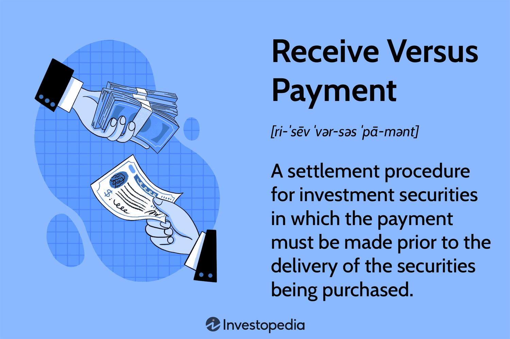

The financial markets are replete with various mechanisms aimed at reducing risk and ensuring seamless transactions. These mechanisms are essential for maintaining stability and trust in the complex world of financial exchanges. Among them, the Receive Versus Payment (RVP) process holds a significant position. RVP is crucial for safeguarding both buyers and sellers involved in securities transactions by ensuring that the exchange of payment and securities occurs simultaneously. This reciprocal arrangement mitigates the risk of either party failing to fulfill their part of the agreement.

Receive Versus Payment is a cornerstone strategy in securities settlement. It is structured to protect parties in a transaction, especially institutional investors, by confirming that the payment for securities is made prior to or at the same time as the receipt of the securities themselves. This mechanism is akin to "cash on delivery" in retail environments, securing the interests of both buyers and sellers in the financial markets.



Furthermore, as financial markets become increasingly automated, RVP's role in algorithmic trading expands. Algorithmic trading incorporates the RVP process to not only streamline transactions but also enhance their security and efficiency. This automation ensures that trades are completed correctly, allowing for real-time validation and reducing the potential for errors associated with human intervention.

In this article, the RVP process will be explored in depth, highlighting its significance in securities settlement and its vital role in supporting algorithmic trading practices.

## Table of Contents

## What is Receive Versus Payment (RVP)?

Receive Versus Payment (RVP) is a financial transaction settlement process in which the payment for securities must be made before their delivery. This system serves as a crucial mechanism aimed at minimizing settlement risk, particularly for institutional investors. By ensuring that securities are only transferred upon the confirmation of payment, RVP mitigates the risk of default by either party involved in the transaction.

The RVP settlement process is analogous to the concept of cash on delivery commonly used in the retail sector, where the delivery of goods triggers the payment. However, within financial securities trading, it is the act of payment by the buyer that initiates the delivery of securities. This process provides a structured and reliable method of transaction, bridging the interests of both buyers and sellers while maintaining trust in the financial markets.

In practice, RVP functions by integrating with electronic systems that oversee wire transfers and securities delivery. The procedure involves a sequence of checks and verifications to confirm the receipt of funds before authorizing the release of securities to the buyer's account. By adopting this synchronized approach, RVP safeguards against potential financial losses that could arise from non-payment or non-delivery scenarios.

RVP's design aligns with the financial industry's aim to enhance the security and efficiency of settlements. As financial markets continue to evolve and the complexity of transactions grows, mechanisms like RVP gain prominence in upholding the robustness of market operations.

## Understanding the RVP Process

The Receive Versus Payment (RVP) process is predominantly executed through electronic means, which allows for the integration of wire transfer systems with securities delivery networks. This technological synchronization ensures robust efficiency and security within financial transactions. At its core, RVP facilitates a concurrent exchange wherein the delivery of securities happens simultaneously with the confirmation of payment. This is essential to maintain transactional integrity and mitigate the risks associated with non-payment or delivery failures, which could potentially compromise the transaction.

In practice, the electronic execution of the RVP process operates through a series of coordinated steps. Initially, the buyer ensures that the funds required for the purchase are available in their account. Once this payment readiness is established, the RVP system activates, triggering a sequence where the securities are transferred from the seller to the buyer. The rapid synchronization between payment systems and securities networks is crucial, as it prevents any occurrence of mismatched settlements where one party fulfills their end of the deal without reciprocation.

From the seller's viewpoint, the RVP process enhances security, primarily because the delivery of securities is only completed once there is a faultless payment confirmation. This reduces scenarios where sellers might deliver securities without any assurance of receiving payment. The acknowledgment of payment acts as a verification point, signaling the seller to proceed with the securities handover. This verification is crucial for upholding trust and integrity within the transaction environment, particularly for institutional investors who handle large volumes of securities.

Moreover, the electronic nature of the RVP process significantly reduces the need for manual intervention, thus alleviating human error and ensuring that the transaction occurs within predefined time frames. The automation aspect ensures that even high-frequency trades, where time is a critical [factor](/wiki/factor-investing), can be settled without delays or inconsistencies.

Overall, the RVP process is a key component in the securities settlement landscape, providing a safety net against transactional discrepancies and reinforcing confidence among market participants. The seamless integration of payment and delivery systems serves as a cornerstone for effective risk management, particularly in volatile or high-stakes trading environments.

## RVP vs. DVP: Key Differences

Receive Versus Payment (RVP) and Delivery Versus Payment (DVP) are integral procedures in securities settlement, designed to minimize the risk associated with the exchange of securities and funds. The distinction between these two lies primarily in the perspective of the transaction parties involved.

RVP is oriented towards the seller's interests. It ensures that the payment for securities is received prior to or simultaneously with the transfer of securities. This mechanism offers sellers the assurance that they will not part with their securities unless payment is either in hand or verifiably on its way. This process is particularly crucial in avoiding the risk of delivering securities to a buyer who may default on payment.

Conversely, DVP serves the buyer's perspective, requiring that the delivery of securities occur only when the payment is made. From the buyer's standpoint, DVP guarantees that their funds are withheld until the securities are securely transferred, thereby mitigating the risk of paying for securities that are not subsequently delivered. This equally safeguards buyers from potential default by the sellers.

Both RVP and DVP share the common aim of risk mitigation by ensuring that payment and securities delivery occur simultaneously, thereby protecting the respective interests of sellers and buyers. These settlement processes typically leverage electronic platforms to synchronize transactions, reducing settlement failures and promoting market efficiency. Despite the differences in perspectives, the underlying goal of both systems is to enforce a conditional exchange that protects all parties from losses due to non-compliance or counterparty risk.

## Role of RVP in Algorithmic Trading

Algorithmic trading systems increasingly depend on Receive Versus Payment (RVP) mechanisms to ensure secure and efficient trade settlement. These systems automate the RVP process, which is fundamental in reducing counterparty risk—where one party may default before the final settlement. The automation primarily integrates complex data streams that allow real-time transaction validation and tracking, ensuring the securities are only delivered when full payment is confirmed.

The role of RVP in [algorithmic trading](/wiki/algorithmic-trading) extends to enhancing the throughput and reliability of financial transactions. By automatically executing trades and settling them using pre-programmed algorithms, traders can achieve high-speed transactions while ensuring the security and confirmation of payments. The structure of an algorithmic trading system utilizing RVP might involve several components such as data collection and analytics, order execution engines, and post-trade processing modules.

For instance, the following Python pseudocode illustrates a basic concept where an algorithmic trading system employs a simplified RVP check:

```python
def execute_trade(order):
    """Simulate trade execution with RVP check."""
    if verify_funds(order):
        match_order(order)
        confirm_payment(order)
        deliver_securities(order)
    else:
        print("Funds verification failed. Trade execution halted.")

def verify_funds(order):
    """Placeholder function to verify buyer has enough funds."""
    # Implement actual funds verification logic
    return order['funds'] >= order['price']

def match_order(order):
    """Simulate matching the order."""
    # Implement order matching logic here
    pass

def confirm_payment(order):
    """Simulate payment confirmation."""
    # Implement payment confirmation logic here
    pass

def deliver_securities(order):
    """Simulate delivery of securities."""
    # Implement securities delivery logic here
    print("Securities successfully delivered after confirming payment.")

# Example of trade order
trade_order = {'funds': 10000, 'price': 9500}
execute_trade(trade_order)
```

In practical systems, this involves sophisticated algorithms that can efficiently parse through market data, assess risk levels, and make informed trade decisions—effectively using RVP as a backend settlement feature to foster trust and efficiency. Moreover, by integrating RVP, algorithmic trading can handle high-frequency transactions, mitigating risks associated with market [volatility](/wiki/volatility-trading-strategies) and executing orders at optimal prices, thereby enhancing overall market stability and robustness.

## Benefits of Using RVP

Receive Versus Payment (RVP) plays a crucial role in minimizing settlement risks by ensuring a synchronized exchange of securities and payments. This alignment is vital in securing transactions, thus enhancing the trust factor among institutional investors. During periods of market volatility, this trust becomes even more significant. By minimizing the risk of non-delivery after payment or vice versa, RVP helps mitigate potential financial losses that could arise from failed settlements.

The synchronization inherent in RVP mechanisms allows financial institutions to manage risks more effectively. This process ensures that the transfer of securities occurs only after the corresponding cash payment is confirmed, thereby eliminating counterparty risk. For instance, in an RVP transaction, institutional investors are reassured that their payment will only result in receiving the purchased securities. This system of assurance helps maintain investor confidence and facilitates smoother market operations even when market conditions are unstable.

Additionally, the RVP process supports efficient resource allocation within financial institutions. By reducing the likelihood of settlement fails, institutions can avoid the costs associated with such failures, including penalties and administrative burdens. The streamlined nature of RVP also allows institutions to allocate resources more effectively towards active portfolio management rather than dealing with the repercussions of delayed or failed transactions.

Furthermore, RVP's ability to align payment and delivery promotes transparency in trading operations, contributing to a more robust financial market. This transparency is crucial for maintaining market integrity and ensuring that all participants have confidence in the system. As markets continue to evolve, especially with the increasing reliance on automated and high-frequency trading, mechanisms like RVP that provide risk mitigation and operational efficiency become increasingly indispensable.

## Challenges and Considerations

Implementing the Receive Versus Payment (RVP) process presents various challenges and considerations that require attention to ensure seamless operations. One of the primary challenges is the necessity for robust technical systems and precise transaction management. The RVP mechanism relies on the synchronization of multiple systems, including electronic communication networks and wire transfer systems. This synchronization must be precise to ensure that the securities are only delivered once payment has been confirmed. Implementing such a system involves considerable technical requirements and infrastructure investments to handle the complexity of the transactions and to protect against risks, such as non-payment or delivery failures.

Another significant consideration is the potential for delays in the transaction process. Since RVP requires that the receipt of payment and delivery of securities occur simultaneously, any lag in confirmation can lead to delays in completing trades. This is particularly critical in time-sensitive transactions where even minor delays can affect market positions and financial strategies. Therefore, financial institutions must develop or deploy highly efficient and reliable systems that minimize latency and ensure prompt processing to avoid market impact.

Participants must also ensure their systems are capable of accommodating the specific requirements of RVP. This includes the integration of real-time capabilities to allow both for the secure transfer of sensitive financial data and the rapid processing of confirmations, which can be resource-intensive. Additionally, these systems should be flexible enough to adapt to market changes and regulatory updates, which require ongoing software and hardware upgrades. Without such infrastructure, participants risk the inability to fully benefit from RVP's security features, potentially exposing themselves to financial and counterparty risks.

Ultimately, while the implementation of RVP comes with its share of challenges, these can be effectively managed through the deployment of advanced technology solutions and by maintaining vigilant operational oversight. This ensures that the advantages of RVP, such as risk reduction and enhanced transactional integrity, continue to bolster confidence in financial markets.

## Conclusion

Receive Versus Payment (RVP) continues to be a cornerstone in secure securities settlements, playing a critical role in mitigating risks and enhancing the efficiency of financial market operations. By requiring payment before the delivery of securities, RVP establishes a trustworthy framework that protects both buyers and sellers against potential transaction failures, such as non-payment or delivery defaults. This simultaneous exchange mechanism minimizes counterparty risk and ensures that both parties fulfill their obligations in a trade.

As the prevalence of algorithmic trading expands, the importance of RVP in ensuring transaction reliability becomes increasingly evident. Algorithmic trading relies on the quick and efficient execution of trades, which is facilitated by the automated RVP process. Real-time data integration and instant validation provided by RVP support robust algorithmic trading operations by securing transactions against market volatility and systemic risks. This reliability allows trading algorithms to focus on optimizing trades without the complication of unsettled transactions influencing risk parameters.

Moreover, by reducing settlement risk, RVP contributes to the stability and integrity of the financial markets. In periods of market turbulence, the assurance provided by RVP becomes particularly beneficial to institutional investors and financial institutions. It fosters confidence in the market's ability to handle large volumes of transactions securely, thereby maintaining orderly market behavior and [liquidity](/wiki/liquidity-risk-premium).

Overall, RVP is indispensable in modern financial markets. As trading infrastructures continue to evolve, the synchronized settlement mechanism that RVP offers will remain vital for supporting efficient and secure trading environments. This essential function not only protects individual investors and financial entities but also underpins the broader economic system by ensuring the seamless transfer of securities and payments.

## Further Reading and Resources

For a more comprehensive understanding of Receive Versus Payment (RVP) and related concepts within securities settlement and algorithmic trading, a variety of resources are available. These resources provide detailed insights and technical overviews into the mechanisms and strategies employed in modern financial markets.

1. **Securities Settlement Resources**:
   - **"Securities Operations: A Guide to Trade and Position Management" by Michael Simmons**: This book provides a thorough explanation of trade life cycles, including settlement processes like RVP and DVP.
   - **"Settlement & Custody" by David Loader**: This text is a valuable resource for understanding the intricacies of settlement systems and the technology underlying these processes.

2. **Algorithmic Trading**:
   - **"Algorithmic Trading: Winning Strategies and Their Rationale" by Ernie Chan**: A practical guide on the strategies behind algorithmic trading, offering context on how RVP can enhance trading reliability.
   - **"Automated Trading with R: Quantitative Research and Platform Development" by Chris Conlan**: This book discusses building trading models and systems, emphasizing how automated processes interact with settlement procedures.

3. **Online Financial Encyclopedias**:
   - **Investopedia**: Contains numerous articles detailing financial terms, including securities settlement processes and algorithmic trading strategies.
   - **Wikipedia**: Offers overviews and links to detailed entries on related topics, such as payment systems and trading algorithms.

4. **Trade Journals and Publications**:
   - **The Journal of Financial Markets**: Features research articles on market structures and trading systems.
   - **Algorithmic Traders Association Members Updates**: These updates offer insights into the latest trends and challenges in algorithmic trading and settlement processes.

These resources can provide valuable insights into how RVP functions within broader financial systems, helping practitioners and researchers stay informed of advancements in technology and methodologies.

## References & Further Reading

[1]: Simmons, M. (2003). ["Securities Operations: A Guide to Trade and Position Management."](https://www.wiley.com/en-us/Securities+Operations%3A+A+Guide+to+Trade+and+Position+Management-p-9780471497585) Wiley.

[2]: Loader, D. (2002). ["Settlement and Custody."](https://archive.org/details/clearingsettleme0000load) Butterworth-Heinemann.

[3]: Chan, E. (2009). ["Algorithmic Trading: Winning Strategies and Their Rationale."](https://github.com/ftvision/quant_trading_echan_book) Wiley.

[4]: Conlan, C. (2009). ["Automated Trading with R: Quantitative Research and Platform Development."](https://link.springer.com/book/10.1007/978-1-4842-2178-5) Packt Publishing.

[5]: Investopedia. ["Securities Settlement."](https://www.investopedia.com/terms/s/settlement_period.asp)

[6]: Wikipedia. ["Algorithmic Trading."](https://en.wikipedia.org/wiki/Algorithmic_trading)

[7]: Journal of Financial Markets. ["Research Articles."](https://www.sciencedirect.com/journal/journal-of-financial-markets)

[8]: Algorithmic Traders Association. ["Members Updates."](https://www.atassn.com/default.aspx)