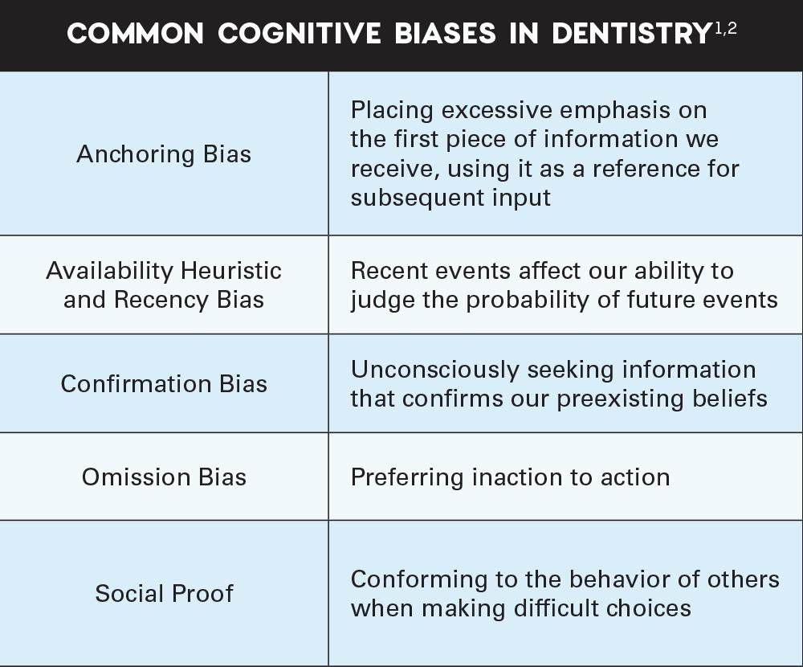

Algorithmic trading refers to the use of computer algorithms to automate trading decisions, execute trades, and manage market strategies. These computer-driven strategies follow a pre-set of rules or use mathematical models to decide when, how, and why a trade should be executed. This trading approach has become increasingly significant in modern financial markets due to its ability to process vast amounts of data at speed far beyond human capability, leading to enhanced efficiency and liquidity. Algorithmic trading now constitutes a major part of global financial markets, allowing institutional investors and hedge funds to manage large transactions with minimal market impact.

Despite its benefits, algorithmic trading is not immune to errors and may be affected by cognitive biases. Cognitive biases are systematic patterns of deviation from norm or rationality in judgment, which often lead to illogical conclusions or affect decision-making processes. Such biases can permeate algorithmic trading systems because these systems are initially designed, tested, and maintained by human beings who may unconsciously embed their biases within the algorithms. 



Three significant cognitive biases that commonly impact trading outcomes are recency bias, cognitive bias, and availability bias. Recency bias occurs when traders give disproportionate importance to recent events over historical data, potentially leading to traders and automated systems overreacting to recent market developments. Cognitive bias, a broader term encompassing various irrational behavior patterns, may cause suboptimal decision-making due to errors in algorithm logic or design. Availability bias describes the tendency to base predictions on immediate instances that come to mind, possibly leading automated systems to favor easily recallable or recent information, even if it is unrepresentative of the overall market context.

In summary, while algorithmic trading provides precision and speed, its outcomes can still be influenced by the traditional biases present in human-led decision making. Understanding and managing these biases are crucial for improving the efficiency and effectiveness of algorithmic strategies in financial markets.

## Table of Contents

## Understanding Cognitive Biases in Algorithmic Trading

Cognitive biases are systematic patterns of deviation from norm or rationality in judgment, where individuals create their own subjective social reality from their perception of the input. These biases often arise from heuristics, which are mental shortcuts used to solve problems efficiently. In the context of trading, cognitive biases can significantly affect decision-making processes. They can lead to errors in judgment, miscalculations, and potentially suboptimal trading strategies.

Cognitive biases impact decision-making by skewing perceptions and assessments of information, which may result in flawed judgment. For instance, an investor might overestimate the likelihood of an event happening again because it occurred recently and was memorable (availability bias). Such biases can lead to overconfidence, panic selling, or other irrational behaviors that don't align with statistical probabilities or historical data.

Despite the automation involved in [algorithmic trading](/wiki/algorithmic-trading), these biases can still influence the development and function of trading algorithms. Since algorithms are crafted by human designers, they may inadvertently encode human biases into their decision-making frameworks. The developers' assumptions, past experiences, and choice of data inputs can all introduce bias into an algorithm's behavior.

An example is the selection and weighting of training data during the development of [machine learning](/wiki/machine-learning) models for trading. If developers disproportionately consider recent or memorable market events when training a model, the algorithm might mirror the recency or availability biases, making decisions based on skewed perceptions of market conditions. To illustrate, consider a situation where a trading algorithm is tuned to prioritize recent [volatility](/wiki/volatility-trading-strategies). This might cause it to react impulsively to current market fluctuations, without considering wider historical trends, potentially leading to frequent and unnecessary trades.

The influence of cognitive biases in algorithmic trading highlights the necessity of critical oversight and rigorous development processes. Developers must be aware of these biases and implement strategies to mitigate them, such as using comprehensive, diverse datasets and emphasizing systematic, rules-based methods. Additionally, incorporating feedback mechanisms and peer reviews can help identify and correct bias-driven anomalies in trading systems, thus enhancing their robustness and reliability.

## Recency Bias: A Deeper Look

Recency bias is a cognitive bias that causes individuals to prioritize recent events or information over historical data when making decisions. In trading, this bias can lead traders to allocate more importance to the latest market movements, potentially ignoring long-term trends or established patterns. This bias stems from the human tendency to believe that what is happening now is more relevant or indicative of future outcomes.

In the context of algorithmic trading, recency bias can inadvertently become embedded into trading algorithms, as these programs are ultimately designed and modified by humans susceptible to such biases. When recent data points are heavily weighted, algorithms may react disproportionately to short-term market changes, thereby making suboptimal trading decisions. This can manifest in various ways, such as overreacting to a sharp decline or surge in market prices due to recent news, rather than considering the broader and more stable historical trendlines.

For example, consider a scenario where a trading algorithm has been designed to sell off stocks when a particular threshold of market decline is detected. If the algorithm places undue emphasis on recent price drops following negative market news, it may trigger panic selling. This not only leads to poor portfolio performance but may also contribute to market volatility, exacerbating the downturn. Traders might experience significant losses if they act on these hasty decisions, influenced by recency bias.

In mathematical terms, this bias might be reflected in a model where recent data points have disproportionately high weights in a moving average calculation, compared to older data:

$$
\text{Weighted Moving Average} = \frac{\sum_{i=1}^{n} w_i \cdot x_i}{\sum_{i=1}^{n} w_i}
$$

where $w_i$ represents the weight given to each data point $x_i$, and $n$ is the number of data points considered. In a system affected by recency bias, recent data points $w_i$ might be significantly larger than older ones.

Mitigating recency bias involves ensuring that trading algorithms are programmed with a balanced approach, such as using longer averaging periods or incorporating historical data analysis to complement recent data trends. This helps to create a more holistic view of market conditions and reduces the tendency to overreact to immediate data.

## Availability Bias in Trading Algorithms

Availability bias is a cognitive shortcut that influences decision-making by leading individuals to rely heavily on immediate examples that readily come to mind. In the context of trading, this bias can significantly affect the performance of algorithms, which are inherently designed by humans. The availability bias causes traders and algorithms alike to give undue weight to information that is most easily retrievable, often at the expense of equally or more critical data that requires more effort to recall or analyze.

In trading algorithms, availability bias manifests when the algorithms prioritize recent or sensational market events when processing data, sometimes leading to conclusions that are not statistically grounded. This bias can interfere with optimal decision-making, as it may misguide the algorithm to react severely to recent market changes without considering the broader historical data set. This can lead to suboptimal trading decisions where the algorithm might infer trends based on sporadic data events rather than stable long-term patterns.

For instance, an algorithm might prioritize a recent market anomaly, such as a sudden spike in stock prices due to a viral news event, and make trading decisions based on this data point. If the algorithm is overly influenced by such events due to availability bias, it might allocate resources or make trades assuming the event represents a lasting trend, which is often not the case.

Consider a simple example in Python that could illustrate this concept. An algorithm might be designed to include a weighted average of recent stock price movements when making trading decisions. If the weights are disproportionately skewed towards the most recent prices, the algorithm exhibits availability bias:

```python
def weighted_average(prices, recent_weight=0.7):
    if not prices:
        return 0
    total_weight = sum((recent_weight**i for i in range(len(prices))))
    weighted_sum = sum((price * (recent_weight**i) for i, price in enumerate(prices)))
    return weighted_sum / total_weight

# Recent prices might be: [100, 105, 110]
# With a high recent weight, the most recent price overly influences the average
recent_prices = [100, 105, 110]
average = weighted_average(recent_prices)
print(f"The availability-biased weighted average is {average:.2f}")
```

The code snippet above calculates a weighted average of stock prices. If `recent_weight` is set close to 1, the most recent prices heavily influence the result, potentially introducing availability bias.

Therefore, to manage availability bias in trading algorithms, developers could broaden the data set the algorithms analyze or adjust their weighting schemes. This ensures that decisions are more reflective of long-term market dynamics rather than transient anomalies. Trading strategies should incorporate diverse data inputs and apply rigorous [backtesting](/wiki/backtesting) protocols to verify that the algorithm’s decisions are robust across a wide range of scenarios, not just those easily brought to mind. Such strategies mitigate the effects of availability bias, refining the accuracy and efficiency of trading algorithms.

## Techniques for Managing Cognitive Biases

In algorithmic trading, cognitive biases can inadvertently seep into the design and performance of trading algorithms due to human influence. To manage these biases effectively, several strategies can be employed.

One effective method is incorporating rules-based trading. This approach involves the creation of explicit, objective rules for making trades, which can help eliminate subjective judgment that may be affected by biases. Rules-based trading systems are typically driven by quantifiable factors such as stock price movements, [volume](/wiki/volume-trading-strategy), or different technical indicators, ensuring consistent decision-making. For instance, a simple rules-based strategy might involve buying a stock when its 50-day moving average crosses above its 200-day moving average, and selling when the reverse occurs. This systematic approach helps in removing emotional interference, thereby reducing the effect of cognitive biases.

Another crucial strategy is using diverse data inputs. Relying on a wide array of data sources reduces the risk of biases introduced by over-reliance on specific types of information. Diverse data can include historical prices, macroeconomic indicators, sentiment analysis, and even [alternative data](/wiki/best-alternative-data) like news articles or social media trends. By integrating varied data, algorithms gain a more holistic view of the market, potentially offsetting the impact of skewed data or recent events that might disproportionately influence immediate trading actions.

Rigorous backtesting serves as a vital tool for evaluating how a trading algorithm would have performed using historical data. Backtesting helps in identifying any biases that may have arisen during the development stages. A thorough backtest assesses the algorithm's performance over a wide range of market conditions, highlighting whether any unfounded assumptions may have been built into the model. Additionally, forward testing, also known as paper trading, can be utilized to trial the algorithm in live markets without actual capital at risk.

Peer reviews and feedback loops are integral in refining trading algorithms. By engaging multiple experts to review the strategy and its outcomes, potential blind spots and biases can be identified and addressed. Feedback loops involve continuously monitoring the performance of the algorithm and making iterative adjustments based on observed outcomes. This process not only improves the algorithm’s accuracy but also diminishes the influence of previous biases as newer, empirical data shapes ongoing modifications.

Utilizing these strategies appropriately can significantly mitigate the impact of cognitive biases in algorithmic trading. Implementing rules-based trading, diversifying data inputs, conducting rigorous backtesting, and adopting peer review systems are integral in optimizing algorithm performance and reducing unintended bias-induced errors.

## Case Study: The 'Hot Hand' Fallacy in Trading

The 'hot hand' fallacy is a well-documented cognitive bias that suggests a person or a stock exhibiting a streak of success is likely to continue experiencing success. Originally identified in the context of basketball, where players or observers believe that if a player scores several times consecutively, they are "hot" and more likely to score again, this phenomenon extends beyond sports into financial markets. Traders, influenced by the recency effect, might fall prey to this bias, believing that a stock or fund manager who has performed well recently will persist in this upward trajectory.

In trading scenarios, the 'hot hand' fallacy may manifest when investors allocate more capital to stocks or funds perceived to be "winners" based on their recent performance. This perception disregards the statistical independence of returns, leading to potential overinvestment in particular assets and increased risk exposure. Such misjudgment can lead to significant financial implications, particularly if the recent performance fails to sustain.

A notable research study conducted by psychologists Tom Gilovich, Robert Vallone, and Amos Tversky in 1985 debunked the belief in the hot hand across several domains, establishing that patterns perceived in sequential events are often random rather than skill-based.[^1] Applied to market behaviors, this suggests that relying on the recent success streak of a stock or manager is risky without substantive evidence supporting continued performance.

Empirical data from financial markets illustrate the impact of this bias. For instance, during a bull market, stocks that have been performing well attract more investments primarily due to their recent success, hence inflating their valuation beyond intrinsic worth. This overvaluation, driven by the hot hand fallacy, can lead to market bubbles. As historical data shows, when the bubble bursts, investors incur substantial losses — a stark reminder of the perils of cognitive biases in trading decisions.

Furthermore, quantitative analysis also reveals the pitfalls of this bias. Employing historical market data, one can observe that while some stocks do maintain performance due to underlying factors, many stocks suffer volatility that can quickly reverse a perceived hot streak. Investors who follow the hot hand trend without analyzing broader market indicators and [fundamental analysis](/wiki/fundamental-analysis) may experience unexpected losses.

Software and algorithmic trading platforms can incorporate statistical methods to mitigate this bias. For example, systematic trading strategies that emphasize mean reversion or value investing can be designed to counteract the hot hand fallacy by focusing on long-term performance metrics rather than short-term winning streaks.

In conclusion, understanding and recognizing the hot hand fallacy's presence in market decisions is crucial for traders and analysts. By applying more rigorous statistical scrutiny and adopting diversified investment strategies, the potential negative impact of this cognitive bias can be reduced, fostering more rational and informed decision-making in trading environments.

[^1]: Gilovich, T., Vallone, R., & Tversky, A. (1985). The hot hand in basketball: On the misperception of random sequences. Cognitive Psychology, 17(3), 295-314.

## Conclusion

In reviewing the influence of cognitive biases on algorithmic trading, key insights emerge regarding recency and availability biases. Recency bias leads traders and algorithms to overly prioritize recent data, potentially misguiding trading strategies and triggering impulsive decisions like panic selling during market downturns. Such actions often occur in response to recent negative news, undermining a comprehensive analysis of long-term data.

Availability bias, on the other hand, causes reliance on easily recalled or recent information, skewing decision-making processes in trading algorithms. This bias can cause algorithms to overemphasize recent market anomalies, disregarding their statistical insignificance and ignoring broader historical trends.

Awareness of these biases and their impact is crucial. Incorporating structured approaches, such as rules-based trading, using diverse data inputs, and conducting thorough backtesting, are effective strategies to mitigate these cognitive biases. By integrating peer reviews and feedback loops, the accuracy and objectivity of trading algorithms can be enhanced, reducing bias-induced errors.

Continuous learning and the adaptation of trading strategies are imperative in enhancing market performance. As markets evolve, traders and developers must remain vigilant, updating models and strategies to address new biases and data patterns. This proactive stance ensures that trading decisions are robust, informed, and less susceptible to bias. By maintaining an open mindset and refining methodologies, traders are better equipped to navigate the complexities of financial markets effectively.

## Further Reading and Resources

1. **Books on Cognitive Biases and Trading**:
   - *Thinking, Fast and Slow* by Daniel Kahneman. This book provides comprehensive insights into how cognitive biases affect decision-making, including in the financial sector.
   - *Predictably Irrational: The Hidden Forces That Shape Our Decisions* by Dan Ariely. This book explores various cognitive biases and irrational decision-making processes, which are applicable to trading strategies.
   - *The Behavioral Investor* by Daniel Crosby. This book examines behavioral finance principles and how traders can overcome biases for better trading decisions.

2. **Academic Research and Articles**:
   - Barberis, N., & Thaler, R. (2003). "A Survey of Behavioral Finance". This paper provides an overview of behavioral finance, covering several cognitive biases affecting market behavior. [Available here](https://academic.oup.com/jle/article/15/1/1/894902).
   - Tversky, A., & Kahneman, D. (1974). "Judgment under Uncertainty: Heuristics and Biases". This seminal paper discusses the heuristics and biases that influence human judgment. [Available here](https://science.sciencemag.org/content/185/4157/1124).

3. **Financial Newsletters and Commentary**:
   - *MarketWatch Behavioral Finance* section. This resource provides regular updates and commentary on how cognitive biases affect market movements. [Visit MarketWatch](https://www.marketwatch.com/topics/subjects/behavioral-finance).
   - *The Motley Fool Behavioral Investing*. Offers articles and insights focusing on psychological factors influencing trading decisions. [Visit The Motley Fool](https://www.fool.com/investing-stock-market/behavioral-investing/).

4. **Online Courses and Lectures**:
   - Coursera offers courses like "Introduction to Behavioral Finance: Behavioral Biases in Decision-Making" that explore cognitive biases. [Explore courses on Coursera](https://www.coursera.org).
   - Khan Academy's section on behavioral economics covers biases that apply to trading strategies. [Access Khan Academy](https://www.khanacademy.org/economics-finance-domain/core-finance/behavioral-finance).

5. **Expert Commentaries and Blogs**:
   - *CFA Institute's Enterprising Investor* blog features posts on behavioral finance and its implications for investment strategies. [Visit CFA Institute Blog](https://blogs.cfainstitute.org/investor/).
   - *HumbleDollar* by Jonathon Clements offers reflections on personal finance decisions shaped by behavioral insights. [Visit HumbleDollar](https://humbledollar.com/).

These resources provide a comprehensive guide for anyone interested in understanding and mitigating cognitive biases in trading.

## References & Further Reading

[1]: Gilovich, T., Vallone, R., & Tversky, A. (1985). ["The hot hand in basketball: On the misperception of random sequences"](https://www.sciencedirect.com/science/article/pii/0010028585900106)90010-6). Cognitive Psychology, 17(3), 295-314.

[2]: Barberis, N., & Thaler, R. (2003). ["A Survey of Behavioral Finance"](https://www.nber.org/papers/w9222). 

[3]: Tversky, A., & Kahneman, D. (1974). ["Judgment under Uncertainty: Heuristics and Biases"](https://www2.psych.ubc.ca/~schaller/Psyc590Readings/TverskyKahneman1974.pdf). Science, 185(4157), 1124-1131.

[4]: Kahneman, D. (2011). ["Thinking, Fast and Slow"](https://link.springer.com/article/10.1007/s00362-013-0533-y). Farrar, Straus and Giroux.

[5]: Ariely, D. (2008). ["Predictably Irrational: The Hidden Forces That Shape Our Decisions"](https://psycnet.apa.org/record/2008-04432-000). HarperCollins.

[6]: Crosby, D. (2018). ["The Behavioral Investor"](https://books.google.com/books/about/The_Behavioral_Investor.html?id=GDxvDwAAQBAJ). Harriman House.

[7]: MarketWatch Behavioral Finance. [Visit MarketWatch](https://www.marketwatch.com/story/behavioral-finance-or-how-not-to-be-your-own-worst-enemy-when-it-comes-to-money-11624285349).

[8]: The Motley Fool Behavioral Investing. [Visit The Motley Fool](https://www.fool.com/terms/b/behavioral-finance/).

[9]: Coursera's "Introduction to Behavioral Finance: Behavioral Biases in Decision-Making". [Explore courses on Coursera](https://www.coursera.org/). 

[10]: Khan Academy on behavioral economics. [Access Khan Academy](https://www.khanacademy.org/economics-finance-domain).