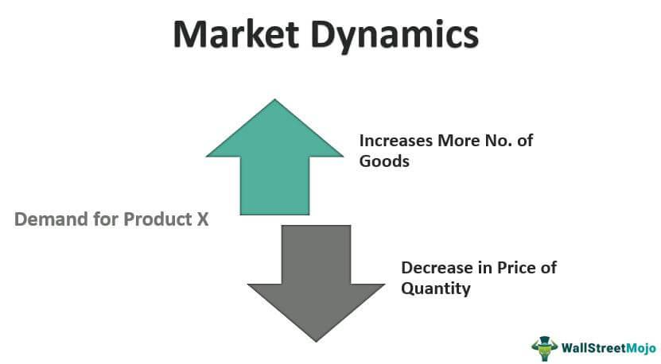

In a world where economic uncertainties loom large, preparing for recessions is crucial. Financial markets are inherently volatile, and economic downturns can exacerbate this volatility, leading to significant losses for unprepared investors. This article examines how understanding recession-proof economies, financial resilience, and algorithmic trading can help investors maintain stable portfolios in times of financial adversity.

Recession-proof economies achieve relative stability during economic downturns. Key sectors, including healthcare, utilities, and consumer staples, exhibit less sensitivity to economic cycles due to their essential nature, thus offering a buffer against broad market declines. Investing in these sectors during challenging economic periods can help preserve capital and ensure steady returns.



Financial resilience in investing focuses on strategic asset allocation and diversification. Both are fundamental in creating a portfolio that can withstand market fluctuations. This approach involves incorporating sectors that are less affected by economic downturns to maintain stability. Exchange-Traded Funds (ETFs) present a practical means of gaining exposure to such sectors, providing cost-effective diversification while reducing risk.

Algorithmic trading brings another dimension to modern investment strategies. By using computer algorithms to execute trades based on pre-defined criteria, investors can enhance their portfolio management. This method optimizes trade execution and effectively manages risks, adapting quickly to changing market conditions and maintaining desired risk exposure. Algorithms can be programmed to account for various factors, including economic indicators and sector performance, to dynamically adjust investment strategies during a recession.

Ultimately, by understanding and applying these concepts, investors can navigate financial downturns more effectively. Employing a mix of sector-specific investments, diversified ETFs, and algorithmic trading strategies will help build resilient portfolios capable of enduring economic challenges.

## Table of Contents

## Understanding Recession-Proof Economies

Recession-proof economies are characterized by their ability to endure economic downturns with minimal negative impact, primarily due to the stability of certain essential sectors. These sectors, including healthcare, utilities, and consumer staples, tend to maintain steady demand regardless of broader economic conditions due to the indispensable nature of the goods and services they provide.

Healthcare, as a critical sector, tends to be recession-proof because healthcare needs are largely non-discretionary. People require medical care and pharmaceuticals regardless of the economic climate, ensuring consistent demand even during economic contractions. As a result, healthcare expenditures typically exhibit lower [volatility](/wiki/volatility-trading-strategies) compared to other sectors.

Utilities, encompassing services such as electricity, water, and gas, remain essential for households and businesses. These services are typically necessities, and their consumption is less sensitive to economic cycles. Consequently, utility companies can often maintain stable revenues during recessions, contributing to the overall resilience of the economy.

Consumer staples, which include everyday goods such as food, beverages, and personal care products, also play a significant role in recession-proof economies. These products are necessities for consumers, so their demand remains relatively constant despite economic downturns. The consistent demand for consumer staples helps stabilize economic activity during periods of recession.

In summary, recession-proof economies leverage the robustness of sectors like healthcare, utilities, and consumer staples to buffer against the negative effects of economic fluctuations. By focusing on these essential industries, such economies can maintain stability and continue to function effectively even amidst financial challenges.

## Financial Resilience in Investing

Building financial resilience in investing requires a thoughtful approach to strategic asset allocation and diversification. Asset allocation is the process of distributing investments among different categories, such as stocks, bonds, and cash, to optimize potential returns based on an individual's risk tolerance, goals, and investment horizon. Diversification, on the other hand, involves spreading investments across various financial instruments, industries, and other categories to reduce exposure to risk.

One fundamental strategy for achieving financial resilience is incorporating recession-resistant sectors into a portfolio. Sectors such as healthcare, consumer staples, and utilities typically maintain stable demand regardless of economic conditions. For instance, healthcare is less susceptible to economic cycles because people require medical care in both prosperous and poor times. Similarly, consumer staples like basic food and household products continue to be necessary goods, while utilities provide essential services such as electricity and water.

Exchange-Traded Funds (ETFs) are a cost-effective means to gain exposure to these diverse, recession-proof industries. ETFs are investment funds that trade on stock exchanges, similar to stocks, and hold assets such as stocks, commodities, or bonds. They typically aim to track the performance of a specific index. The advantage of using ETFs lies in their ability to offer diversification at a lower cost than individual stocks or mutual funds. With a single [ETF](/wiki/etf-trading-strategies) investment, an investor can gain broad exposure to multiple companies within an industry, sector, or geographical region.

For instance, an investor seeking to bolster their portfolio against recessionary pressures might consider ETFs focused on consumer staples or healthcare sectors. The SPDR S&P Health Care Sector ETF (XLV) and the Consumer Staples Select Sector SPDR Fund (XLP) are examples. These ETFs include shares of major companies within their respective sectors and provide investors with access to stable revenue streams and dividend yields typical of these industries.

By carefully selecting a mix of ETFs that target recession-proof sectors, investors can create a diversified portfolio that stands a better chance of weathering adverse economic conditions. The key is to balance sector exposure and ensure alignment with one's overall investment goals and risk profile.

In summary, financial resilience in investing is bolstered by strategic asset allocation and diversification across recession-resistant sectors using vehicles like ETFs. This approach not only enhances portfolio stability but also positions investors to preserve wealth in turbulent economic environments.

## The Role of Algorithmic Trading

Algorithmic trading, widely adopted in financial markets, leverages computer algorithms to execute trades based on pre-defined parameters such as timing, price, and [volume](/wiki/volume-trading-strategy). This approach significantly enhances portfolio management by optimizing trade execution and efficiently managing risks.

One key advantage of [algorithmic trading](/wiki/algorithmic-trading) is its ability to execute trades at speed and frequency that a human trader cannot match. Algorithms can identify trends and execute orders immediately, taking advantage of even the smallest market movements. This capability is accomplished by leveraging historical data and mathematical models to predict price movements and establish response strategies.

Risk management is another area where algorithmic trading excels. Through the incorporation of algorithms, traders can adhere to strict risk parameters that minimize exposure to volatility. For example, the implementation of a stop-loss algorithm ensures that a position is automatically closed when it moves against the market beyond a predetermined threshold. This systematic approach reduces the potential for unexpected losses.

Furthermore, algorithmic strategies are designed to adapt swiftly to market changes, maintaining desired risk exposure. Advanced algorithms employ [machine learning](/wiki/machine-learning) techniques to continuously analyze market data, thus refining their strategies according to shifting conditions. By employing predictive modeling, these algorithms adjust their parameters to reflect updated market information, resulting in a dynamic and responsive trading strategy.

Here's a simple Python example that demonstrates a basic moving average crossover strategy, a common technique in algorithmic trading:

```python
import pandas as pd
import numpy as np

# Sample price data
price_data = pd.Series([1, 2, 3, 4, 5, 4, 3, 4, 5, 6, 7, 8])

# Calculate moving averages
short_window = 3
long_window = 5
signals = pd.DataFrame(index=price_data.index)
signals['price'] = price_data
signals['short_mavg'] = signals['price'].rolling(window=short_window, min_periods=1).mean()
signals['long_mavg'] = signals['price'].rolling(window=long_window, min_periods=1).mean()

# Generate buy/sell signals
signals['signal'] = 0
signals['signal'][short_window:] = np.where(signals['short_mavg'][short_window:] > signals['long_mavg'][short_window:], 1, 0)
signals['positions'] = signals['signal'].diff()

print(signals)
```

In this code, the algorithm calculates the short-term and long-term moving averages of stock prices. The trading signal is generated when the short-term moving average crosses above or below the long-term moving average, indicating a buy or sell action.

Algorithmic trading not only improves execution efficiency but also provides the advantage of removing human emotions from the trading process, which can often lead to impulsive decisions. The consistency and objectivity offered by algorithmic trading make it a valuable tool for enhancing investment strategies, particularly in volatile market conditions.

## Recession-Proof Sectors and ETFs

Exchange-Traded Funds (ETFs) that focus on sectors such as healthcare, consumer staples, and utilities have demonstrated a notable capacity to remain stable during economic downturns. These areas of the economy tend to exhibit resilience due to sustained demand, irrespective of broader economic conditions.

**Healthcare Sector ETFs** are designed to include companies that provide essential medical and health-related services. Even during recessions, the need for healthcare does not significantly diminish as illnesses and medical conditions require consistent attention. This steady demand ensures that healthcare sector ETFs maintain their value better than those in more variable sectors. Examples of healthcare ETFs include the Health Care Select Sector SPDR Fund (XLV) and the iShares U.S. Healthcare ETF (IYH).

**Consumer Staples ETFs** comprise businesses that produce essential goods such as food, beverages, and household products. These products are required by consumers regardless of the state of the economy, resulting in a stable revenue flow for the companies within this sector. Consumer staples ETFs like the Consumer Staples Select Sector SPDR Fund (XLP) and the Vanguard Consumer Staples ETF (VDC) are popular choices for investors looking for stability.

**Utilities Sector ETFs** hold companies that provide fundamental services such as water, electricity, and natural gas. The demand for these utilities remains consistent as they are necessities for both residential and commercial users. Due to their essential nature, utility companies generally have predictable income, which translates into consistent returns for investors. Some well-regarded utilities ETFs include the Utilities Select Sector SPDR Fund (XLU) and the iShares U.S. Utilities ETF (IDU).

Investors seeking to withstand market volatility can benefit from selecting the appropriate ETFs aligned with these sectors. Such diversification provides a buffer against economic downturns, leveraging the inherent stability of essential service providers. By incorporating a mix of these sector-focused ETFs, portfolios can be strategically protected against cyclical market swings, aiding in the pursuit of financial resilience during challenging economic periods.

## Algorithmic Trading in ETF Management

Algorithmic trading has revolutionized ETF management by leveraging automated, data-driven methodologies that enhance operational efficiency and resiliency. Through sophisticated algorithms, trading strategies are modified dynamically in response to prevailing market conditions, offering a level of adaptability that traditional trading methods struggle to achieve.

At its core, algorithmic trading in ETFs utilizes complex algorithms to process vast amounts of market data to execute trades with precision. These algorithms consider numerous factors, such as price quotes, trading volume, and market volatility, to determine optimal trading points. By doing so, they ensure that trades are not only swift but also strategically sound, minimizing the impact of market fluctuations on the ETF's overall performance.

Machine learning plays a pivotal role in algorithmic trading by offering predictive analytics and pattern recognition capabilities. These tools allow algorithms to discern trends and make forecasts based on historical data and emerging market patterns. For instance, a machine learning model can be trained to predict price movements by analyzing features like moving averages, trade volumes, and [momentum](/wiki/momentum) indicators. A simple illustration in Python could involve using libraries like scikit-learn to implement a regression model:

```python
from sklearn.linear_model import LinearRegression
import numpy as np

# Example data: features (moving average, volume, volatility), target (price movement)
X = np.array([[1.2, 300000, 0.02], [1.1, 320000, 0.025], [1.15, 310000, 0.022]])
y = np.array([1.3, 1.25, 1.28])  # Target prices

# Fit the model
model = LinearRegression().fit(X, y)

# Predict future price movement
new_data = np.array([[1.18, 340000, 0.024]])
predicted_price = model.predict(new_data)

print(f"Predicted Price: {predicted_price[0]}")
```

In the context of ETF management, these insights allow traders to adjust the ETF's asset allocation more accurately and timely, ensuring the portfolio remains aligned with its investment objectives despite changing market dynamics.

The use of machine learning in algorithmic trading extends beyond predictive analytics. It also encompasses [reinforcement learning](/wiki/reinforcement-learning), where algorithms learn and adapt based on trading outcomes without explicit programming. This form of learning enables continuous improvement in trading strategies as the system becomes more proficient in decision-making over time.

The integration of algorithmic trading in ETF management signifies a transformative shift towards more agile and less error-prone operations, enabling asset managers to respond faster to market upheavals, thereby enhancing portfolio resilience. As machine learning and [artificial intelligence](/wiki/ai-artificial-intelligence) technologies continue to evolve, their application in ETF management is expected to become increasingly sophisticated, providing even deeper insights and more robust trading strategies. This evolution underscores the vital role of algorithmic trading in navigating market complexities and achieving long-term investment success.

## Future Prospects for ETFs and Algo Trading

The future prospects for Exchange-Traded Funds (ETFs) and algorithmic trading are intricately linked to advancements in artificial intelligence (AI) and machine learning (ML). These technologies are poised to significantly enhance predictive capabilities in trading strategies, allowing investors to make more informed decisions based on comprehensive data analyses. AI and ML algorithms can process vast amounts of financial data at incredible speeds, identifying patterns and trends that might otherwise go unnoticed by human analysts. This capability is crucial in a rapidly changing economic landscape, where timely and accurate predictions can offer a competitive edge.

ETFs, known for their diversified portfolio offerings and cost-effectiveness, stand to benefit greatly from the integration of AI and ML. These technologies can be employed to optimize the selection and weighting of assets within an ETF, ensuring that the fund is aligned with market conditions and investor goals. For example, an AI-powered ETF could dynamically adjust its asset composition based on predictive analytics, continuously optimizing risk and return profiles.

Algorithmic trading, already synonymous with speed and efficiency, is set to reach new heights as AI and ML are further integrated into trading systems. These advanced algorithms can make split-second decisions, adapt to market changes in real time, and execute trades with minimal human intervention. Machine learning models can be trained to recognize subtle market indicators and predict price movements with higher accuracy.

Additionally, the incorporation of natural language processing (NLP) in algorithmic trading allows for the analysis of unstructured data, such as news articles, social media posts, and financial reports. This capability enhances the understanding of market sentiment and external factors that may influence asset prices. As a result, trading strategies become more holistic, taking into account both quantitative data and qualitative insights.

Technological advancements also promise to make these tools more accessible to a broader range of investors. User-friendly interfaces and platforms that integrate AI-driven analytics with traditional trading systems are becoming increasingly prevalent. This democratization of technology enables individual investors and smaller firms to leverage the same sophisticated tools that were once the exclusive domain of large financial institutions.

The ongoing evolution of ETFs and algorithmic trading strategies, propelled by AI and ML, indicates a transformative shift in how investment portfolios are managed. As these tools become more sophisticated and widely adopted, they will play an increasingly vital role in constructing robust and resilient investment portfolios. In an era marked by economic volatility and uncertainty, the ability to harness cutting-edge technology for predictive insights and strategic asset management is indispensable for achieving long-term financial stability and growth.

## Conclusion

Navigating recessionary times requires strategic planning and informed decision-making to protect and grow investments. One effective strategy is leveraging the strengths of Exchange-Traded Funds (ETFs) and algorithmic trading, which together enhance portfolio resilience. ETFs provide diversification across multiple recession-resistant sectors such as healthcare, utilities, and consumer staples, offering stability during economic downturns. By incorporating these ETFs, investors can mitigate risks associated with volatility, as they are less likely to experience drastic fluctuations compared to individual stocks.

Algorithmic trading further strengthens portfolios by optimizing trade execution and risk management. Algorithms can quickly adjust strategies in response to market dynamics, maintaining the desired risk exposure and improving the efficiency of transactions. Advanced algorithmic techniques, such as machine learning, provide enhanced insights and predictive capabilities, allowing for more informed decision-making.

To achieve long-term financial stability, it is crucial for investors to remain proactive and informed. This involves continuously monitoring economic indicators, understanding market trends, and being adaptable to new information and technologies. As the financial landscape continues to evolve, incorporating the right tools and strategies will be instrumental in navigating recessions and achieving investment goals. Investors who stay ahead of the curve by integrating ETFs and algorithmic trading into their investment approach will be better positioned to withstand economic challenges and capitalize on emerging opportunities.

## References & Further Reading

[1]: Bergstra, J., Bardenet, R., Bengio, Y., & Kégl, B. (2011). ["Algorithms for Hyper-Parameter Optimization."](https://papers.nips.cc/paper/4443-algorithms-for-hyper-parameter-optimization) Advances in Neural Information Processing Systems 24.

[2]: ["Advances in Financial Machine Learning"](https://www.amazon.com/Advances-Financial-Machine-Learning-Marcos/dp/1119482089) by Marcos Lopez de Prado

[3]: ["Evidence-Based Technical Analysis: Applying the Scientific Method and Statistical Inference to Trading Signals"](https://www.amazon.com/Evidence-Based-Technical-Analysis-Scientific-Statistical/dp/0470008741) by David Aronson

[4]: ["Machine Learning for Algorithmic Trading"](https://github.com/stefan-jansen/machine-learning-for-trading) by Stefan Jansen

[5]: ["Quantitative Trading: How to Build Your Own Algorithmic Trading Business"](https://www.amazon.com/Quantitative-Trading-Build-Algorithmic-Business/dp/1119800064) by Ernest P. Chan