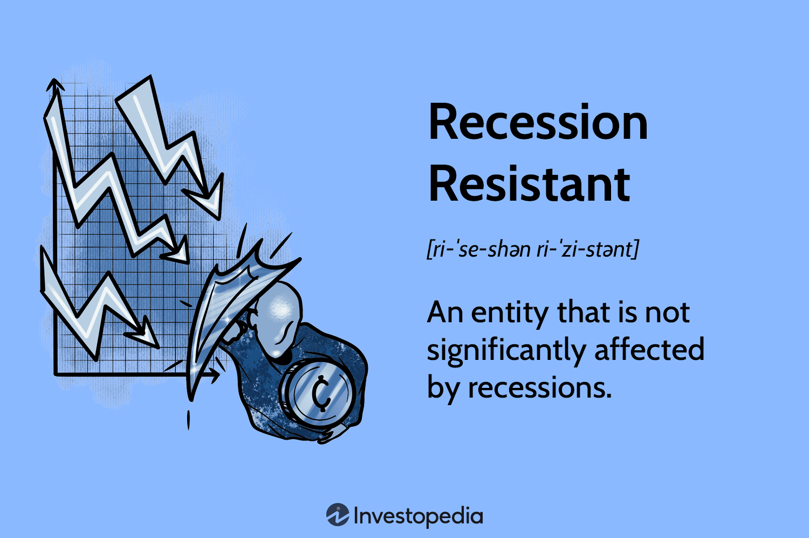

## Table of Contents

## What is a recession and how does it impact businesses?

A recession is when the economy of a country slows down for a while. During a recession, people often lose their jobs, businesses make less money, and it can be hard to find work. It's like when it rains and everyone has to stay inside; the economy isn't growing and things are a bit gloomy.

When a recession hits, businesses feel the impact in many ways. They might sell fewer products because people have less money to spend. This can lead to lower profits, and sometimes businesses have to lay off workers or even close down. It's tough for everyone, but businesses need to be smart and find ways to keep going until the economy starts to recover.

## What are the key indicators that a recession might be approaching?

One key sign that a recession might be coming is when the economy stops growing. This can be seen when the Gross Domestic Product (GDP), which is like a report card for the economy, starts to shrink instead of grow. Another sign is when unemployment starts to go up. When more people are out of work, they have less money to spend, which can slow down the economy even more.

Another indicator is when businesses and people start to feel less confident about the future. If businesses think things will get worse, they might cut back on spending and hiring. If people feel the same way, they might save more money instead of spending it, which can hurt businesses. Also, if it gets harder for people and businesses to borrow money, like when interest rates go up, that can be a warning sign too.

Lastly, watching the stock market can give clues about a recession. If stock prices start to fall a lot, it might mean that investors are worried about the economy. Also, if there's a big difference between short-term and long-term interest rates, called an inverted yield curve, it's often seen as a strong signal that a recession could be on the way.

## What does it mean for a business to be 'recession-proof'?

When a business is called 'recession-proof,' it means that it can keep doing well even when the economy is in a recession. These businesses usually sell things that people need no matter what, like food, medicine, or utilities. Because people can't stop buying these things, the business keeps making money even when times are tough.

Being recession-proof doesn't mean a business won't feel any effects of a recession at all. It might still see some slowdown, but it won't be as bad as other businesses. For example, a grocery store might sell fewer luxury items during a recession, but people will still need to buy basic food. So, while it might not be completely untouched, a recession-proof business is much more stable and can weather the economic storm better than most.

## What are some common strategies businesses use to prepare for a recession?

When businesses see a recession coming, they often start by saving more money. They might cut back on big projects or new hires to keep more cash on hand. This way, they can keep going even if they make less money for a while. They also look at their costs and try to spend less. This could mean finding cheaper ways to do things or negotiating better deals with suppliers.

Another thing businesses do is focus on their most important products or services. They might stop selling things that aren't making much money and put more effort into what people really need. This helps them stay strong during tough times. They also try to keep their customers happy, because keeping old customers is often easier than finding new ones during a recession.

Some businesses might also look for new ways to make money. They could start selling online if they haven't already, or find new markets where people are still spending money. Being flexible and ready to change is key to getting through a recession. By planning ahead and being smart with their money, businesses can come out the other side in good shape.

## How can diversification help a business during economic downturns?

Diversification means a business doesn't just rely on one thing to make money. It's like not putting all your eggs in one basket. When a business has different products, services, or even markets to sell to, it can be safer during tough economic times. If one part of the business starts to struggle because people are spending less money, the other parts might still do okay. This can help keep the whole business going strong, even when the economy is in a downturn.

For example, a company that makes both luxury items and everyday products can still make money from the everyday products even if people stop buying the luxury ones. By having different kinds of products or services, a business can balance out the risks. It's like having a safety net. If one part of the business falls, the other parts can help catch it, making it easier to survive and recover from an economic downturn.

## What role does cost management play in surviving a recession?

Cost management is super important for a business trying to make it through a recession. When the economy slows down, businesses often make less money. So, they need to be careful about how they spend their money. By looking at all their costs and figuring out where they can save, businesses can keep more cash on hand. This extra money can help them keep going even when times are tough. They might cut back on things like big projects or new hires, or find cheaper ways to do things, like negotiating better deals with suppliers.

Being smart with costs also means a business can keep its doors open and keep paying its workers. This is really important because it helps the business stay stable during a recession. If a business can manage its costs well, it won't have to make big changes like laying off a lot of people or closing down parts of the business. Instead, it can focus on getting through the tough times and be ready to grow again when the economy starts to recover.

## Can you provide examples of industries that are typically more resistant to recessions?

Some industries do better during recessions because they sell things people always need, no matter what the economy is doing. For example, the healthcare industry is usually pretty safe. People still get sick and need medicine or to see a doctor, so businesses in healthcare keep making money even when times are tough. Another industry that does well is utilities, like electricity and water. People can't stop using these services, so the companies that provide them stay stable during a recession.

Another industry that often does okay during a recession is the food industry, especially grocery stores. People still need to eat, so they keep buying food. While they might buy less fancy stuff, they'll still go to the store for basic things. Discount stores also tend to do well because people look for cheaper options when they have less money. These industries are not completely safe, but they are more likely to keep going strong even when the economy is struggling.

## How have specific companies successfully navigated past recessions?

During the 2008 recession, Walmart did really well. They sell a lot of things people need every day, like food and clothes, but at low prices. When people had less money, they went to Walmart to save. Walmart also kept their prices low by working closely with their suppliers. This helped them keep making money and even grow during the tough times.

Another company that did well during the 2008 recession was Netflix. They offered a service that was both cheap and something people could enjoy at home. As people were cutting back on going out, they stayed in and watched more movies and shows. Netflix made it easy for them to do that without spending a lot of money. By focusing on what people wanted during the recession, Netflix was able to keep growing and come out stronger on the other side.

## What are the advanced financial strategies that companies might employ during a recession?

During a recession, companies might use advanced financial strategies like hedging to protect themselves. Hedging is like buying insurance for their business. For example, if a company relies on a certain material that might get more expensive, they can use financial tools to lock in the price now. This way, if prices go up during the recession, the company won't have to pay more. Another strategy is adjusting their debt structure. Companies might try to get loans with lower interest rates or change when they have to pay back their loans. This helps them save money and have more cash on hand during tough times.

Another advanced strategy is to use scenario planning. This means the company thinks about different ways the economy could go and makes plans for each one. They might make plans for if the recession gets worse, stays the same, or gets better. By being ready for different situations, the company can react quickly and smartly. They might also look at their cash flow very closely, making sure they have enough money coming in to cover what they need to pay out. This can involve speeding up how quickly they get paid by customers or delaying payments to suppliers. By using these strategies, companies can better survive and even thrive during a recession.

## How can technology and innovation be leveraged to maintain competitiveness in a recession?

During a recession, businesses can use technology and innovation to stay ahead of the competition. One way is by using new technology to make their work more efficient. For example, they might use software to automate tasks that used to take a lot of time. This can help them save money and do more with fewer people. Another way is by finding new ways to reach customers, like selling things online. If people are staying home more during a recession, having a strong online presence can help a business keep making sales.

Innovation can also help a business stand out. When times are tough, people are looking for good deals and new solutions. A business that comes up with new products or services that meet these needs can attract more customers. For example, a company might create a cheaper version of a popular product or find a way to make a service more affordable. By being innovative, a business can not only survive a recession but also come out stronger and more competitive when the economy recovers.

## What are the long-term impacts of recession-proof strategies on a business's growth and sustainability?

When a business uses strategies to be recession-proof, it can help them stay strong during tough times, but it can also affect how they grow and last in the long run. By focusing on what people need every day, like food or medicine, a business can keep making money even when the economy is bad. This can make the business more stable and help them save money. But, if they only focus on these safe products, they might miss out on chances to grow in new areas. They might not try new things or take risks that could lead to bigger growth later on.

In the long run, being too careful with money and not spending on new projects can slow down a business's growth. While it's good to save money during a recession, always playing it safe can make a business miss out on new opportunities. For example, if they don't invest in new technology or try new markets, they might fall behind other businesses that are willing to take more risks. So, while recession-proof strategies can help a business survive tough times, they need to balance these with plans for growth and innovation to stay competitive and sustainable in the long run.

## How can businesses balance short-term survival tactics with long-term strategic planning during a recession?

During a recession, businesses need to focus on short-term survival tactics to keep going. This means they should save money, cut costs, and make sure they have enough cash to keep the business running. They might have to stop big projects, hire fewer people, or find cheaper ways to do things. By doing this, they can stay afloat even when times are tough. It's important for them to keep their most important customers happy and focus on selling things people really need. This helps them make enough money to get through the recession.

At the same time, businesses can't forget about the future. They need to keep planning for the long term, even during a recession. This means they should keep looking for new opportunities and ways to grow. They might want to invest in new technology or try to reach new customers. By balancing these long-term plans with short-term survival, businesses can come out of a recession stronger. It's like walking a tightrope; they need to be careful and smart about the present, but also keep an eye on the future to stay competitive and grow.

## References & Further Reading

[1]: Bergstra, J., Bardenet, R., Bengio, Y., & Kégl, B. (2011). ["Algorithms for Hyper-Parameter Optimization."](https://papers.nips.cc/paper/4443-algorithms-for-hyper-parameter-optimization) Advances in Neural Information Processing Systems 24.

[2]: ["Advances in Financial Machine Learning"](https://www.amazon.com/Advances-Financial-Machine-Learning-Marcos/dp/1119482089) by Marcos Lopez de Prado

[3]: ["Evidence-Based Technical Analysis: Applying the Scientific Method and Statistical Inference to Trading Signals"](https://www.amazon.com/Evidence-Based-Technical-Analysis-Scientific-Statistical/dp/0470008741) by David Aronson

[4]: ["Machine Learning for Algorithmic Trading"](https://github.com/stefan-jansen/machine-learning-for-trading) by Stefan Jansen

[5]: ["Quantitative Trading: How to Build Your Own Algorithmic Trading Business"](https://www.amazon.com/Quantitative-Trading-Build-Algorithmic-Business/dp/1119800064) by Ernest P. Chan