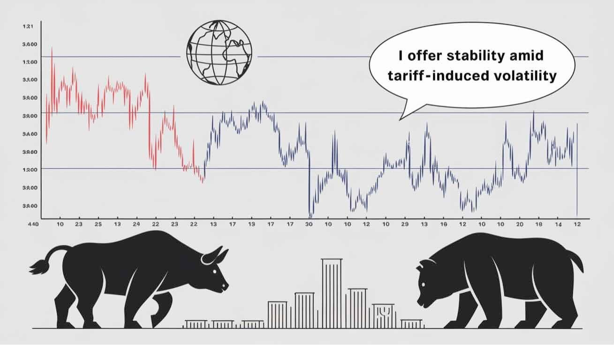

Exchange-Traded Funds (ETFs) have become increasingly popular as investment vehicles over the past decade, providing investors with diversification, liquidity, and cost-effectiveness. These investment funds, traded on stock exchanges, have transformed how investors approach the financial markets by enabling them to acquire broad exposure to various asset classes, including stocks, bonds, commodities, and other investment types.

ETFs are particularly significant in contributing to economic resilience, functioning as potential recession-proof investments during market downturns. This resilience is partly due to their inherent structure and flexibility, allowing investors to target specific sectors that tend to withstand economic contractions better than others. For instance, sectors such as healthcare, utilities, and consumer staples often perform relatively well during recessions, offering stability when other market segments falter.



In addition to the sector-specific advantages, the role of algorithmic trading has become increasingly instrumental in managing ETF portfolios. Algorithmic trading involves using computer algorithms to conduct trading operations based on predefined criteria, optimizing trade execution while minimizing errors and biases. Both retail and institutional investors benefit from this technological advancement, as it provides enhanced decision-making capabilities and improves the overall management of ETF investments.

In periods of economic uncertainty, understanding the interplay between ETFs and algorithmic trading can provide investors with a strategic advantage. Harnessing these tools allows for better risk management and the potential for more significant returns. As financial markets become more volatile and interconnected, the ability to navigate these environments through well-managed ETF portfolios and sophisticated algorithmic strategies becomes essential. Understanding and utilizing these tools can significantly enhance an investor's approach to achieving financial resilience in today's complex financial landscape.

## Table of Contents

## Understanding ETFs and Their Economic Resilience

Exchange-Traded Funds (ETFs) are investment vehicles designed to function similarly to individual stocks while offering diversified exposure to a variety of asset classes, including equities, bonds, and commodities. Structured to replicate the performance of specific indices or sectors, ETFs are traded on major stock exchanges and provide investors with the opportunity to invest in a broad spectrum of markets through a single transaction.

ETFs operate through an [arbitrage](/wiki/arbitrage) mechanism that ensures their market price remains close to the net asset value (NAV) of the underlying assets they hold. This mechanism involves the creation and redemption of ETF shares by authorized participants. When the market price of an ETF deviates from its NAV, authorized participants buy or sell the underlying securities and exchange them for ETF shares to realign the value. While this process typically maintains price stability, minor deviations may occasionally occur, often driven by market fluctuations or [liquidity](/wiki/liquidity-risk-premium) conditions.

A key feature of ETFs is their versatility, enabling investors to gain broad exposure across various market sectors. This diversification is crucial for economic resilience, particularly during periods of financial instability. During economic downturns, certain sectors have historically demonstrated resilience, thereby offering stability. Notable among these sectors are healthcare, utilities, and consumer staples. These sectors are often deemed essential, maintaining relatively steady demand regardless of broader economic challenges.

Healthcare ETFs, such as the iShares U.S. Healthcare Providers [ETF](/wiki/etf-trading-strategies) (IHF), often attract investors during recessions. This is due to the persistent demand for healthcare services and products, which remains largely unaffected by economic cycles. Similarly, utilities, encompassing electricity, water, and gas providers, are integral to daily life. ETFs like the Utilities Select Sector SPDR ETF (XLU) are structured to capitalize on the consistent performance of such companies.

Consumer staples, which include products such as food, beverages, and personal care items, are another sector often viewed as recession-resistant. The Consumer Staples Select Sector SPDR ETF (XLP) serves as an example of an ETF that provides exposure to this defensive sector. These funds typically hold shares in companies with strong balance sheets and the ability to maintain profitability in challenging times.

Overall, understanding the structure and composition of ETFs, along with their historical performance in various economic conditions, can offer crucial insights into their role in enhancing portfolio resilience. By selecting ETFs that focus on stable or defensive sectors, investors can better position their portfolios to withstand economic downturns, ensuring a more stable return profile during volatile periods.

## Recession-Proof Sectors and ETFs

Recession-proof sectors are those that have historically demonstrated the ability to maintain stable performance levels amid economic contractions. These sectors often benefit from consistent consumer demand, irrespective of broader economic challenges. Among such sectors, healthcare, consumer staples, utilities, and information technology stand out due to their essential nature and ongoing demand.

Healthcare is a vital sector, as it provides indispensable services and products that remain in demand regardless of economic conditions. The sector's resilience is reflected in ETFs like the iShares U.S. Healthcare Providers ETF (IHF), which offers exposure to companies involved in healthcare services, insurance, and facilities. Such funds typically show lower [volatility](/wiki/volatility-trading-strategies) during economic downturns due to the non-discretionary nature of healthcare expenditures.

Consumer staples represent another recession-proof sector. This includes companies that produce or distribute essential products such as food, beverages, and household goods. The Vanguard Consumer Staples ETF (VDC) exemplifies an ETF that benefits from the sector's stability, providing investors with exposure to leading consumer goods companies. Despite economic slumps, demand for these basic necessities remains steadfast, cushioning this sector from severe impacts.

Utilities are traditionally known for their ability to provide steady returns in various market conditions. This sector includes companies that offer critical services like electricity, water, and natural gas. The Utilities Select Sector SPDR ETF (XLU) is designed to leverage this stability, focusing on utility companies with predictable cash flows and less susceptibility to economic fluctuations.

Information technology, while often associated with growth and volatility, includes segments that consistently demonstrate resilience, especially those providing indispensable tech infrastructure or services. During recessions, businesses and consumers may reduce spending, but critical technology services tend to remain in demand. The Vanguard Information Technology ETF (VGT) is a fund that exemplifies investment in established technology companies known for their essential services.

These ETFs provide downside protection through strategic asset allocation and sector-specific focus. Historical performance during previous economic recessions has shown that these funds can offer relative stability and risk-adjusted returns. For instance, during financial downturns, companies within these sectors often exhibit stable earnings, allowing ETFs that track these industries to better weather financial storms.

The structure and holdings of ETFs like VIG and XLU are crucial for understanding their ability to provide economic cushioning. VIG, for instance, selects companies with a strong track record of dividend growth, which is often a sign of financial health and resilience. Similarly, XLU focuses on established utility companies that uphold consistent dividend payouts due to their essential role in daily operations.

In sum, by incorporating ETFs representing recession-proof sectors into their portfolios, investors can complement their investment strategies with a measure of security and potential stability, positioning themselves to withstand the volatilities of economic recessions.

## Algorithmic Trading: Enhancing ETF Portfolio Management

Algorithmic trading employs sophisticated computer algorithms to automate the process of executing trades, based on pre-set criteria such as price, timing, or [volume](/wiki/volume-trading-strategy). This method is integral to the efficient management of Exchange-Traded Fund (ETF) portfolios, offering significant advantages over traditional trading strategies.

Primarily, [algorithmic trading](/wiki/algorithmic-trading) enhances trade execution by optimizing the timing and pricing of trades, thereby minimizing transaction costs and slippage. Slippage, the difference between the expected price of a trade and the actual price, can have substantial impacts on returns. Algorithms execute trades at high speed and with precision, significantly reducing the potential for human error and emotional decision-making.

Moreover, algorithmic trading provides robust real-time data analysis, allowing for immediate adjustments to portfolio positions in response to market conditions. This adaptability ensures that ETF portfolios maintain the desired risk exposure and are aligned with the strategic investment goals. For instance, if market volatility increases, algorithms can recalibrate the portfolio to shift towards less volatile securities or sectors, maintaining stability.

Platforms like alphaAI leverage algorithmic strategies to manage ETF investments effectively. They utilize various operational modes tailored to navigate different market conditions. The Defense Mode, for example, focuses on minimizing losses during downturns by reallocating assets to more secure investments or sectors, similar to defensive sector allocation in ETFs. The Cautious Mode maintains a conservative posture, balancing risk and reward to uphold steady portfolio growth with controlled exposure. 

Steady Mode aims for a consistent and balanced investment approach, capitalizing on regular market conditions without excessive risk-taking. In contrast, the Surge Mode is designed for capturing opportunities in bullish markets, aggressively reallocating assets to maximize gains during upward trends.

These modes exemplify how algorithmic systems dynamically respond to volatility, assessing market indicators, historical data, and predictive analytics to inform decision-making. This dynamic adaptability is realized through advanced programming techniques and [machine learning](/wiki/machine-learning) algorithms that continuously process and learn from vast datasets.

In conclusion, as ETFs continue to gain traction among investors for their flexibility and cost-efficiency, algorithmic trading stands out as a pivotal tool, enhancing ETF portfolio management with its precision, speed, and data-driven approach. This synergy allows investors to maintain robust and responsive portfolios in a rapidly changing financial landscape.

## The Future of ETFs and Algo Trading

The landscape of Exchange-Traded Funds (ETFs) and algorithmic trading is rapidly evolving due to technological advancements, particularly in [artificial intelligence](/wiki/ai-artificial-intelligence) (AI) and machine learning (ML). These technologies are increasingly being integrated into investment strategies to enhance risk management and predictive analysis, making ETF investments more resilient and adaptive to market changes.

AI and ML offer powerful tools for predicting market trends and optimizing portfolios. They enable the processing of vast amounts of data to identify patterns and correlations that are not readily apparent to human analysts. For example, machine learning algorithms can analyze historical price movements, trading volumes, and other relevant indicators to forecast future market conditions, thereby facilitating more informed investment decisions. These capabilities empower both retail and institutional investors to adapt swiftly to market fluctuations, optimizing their returns and managing risks more effectively.

The adoption of ETFs is projected to continue its upward trajectory due to the inherent benefits of diversification and cost efficiency. Investors are increasingly seeking diversified investment solutions that offer exposure to a wide range of assets and sectors without the need to manage each asset individually. ETFs provide this by bundling multiple securities into a single investment vehicle, often with lower fees than mutual funds. This trend is likely to accelerate as investors become more aware of the advantages of ETFs in building a resilient portfolio.

Algorithmic trading, which involves the use of computer algorithms to execute trades based on predefined criteria, is set to expand in sophistication. Future innovations in this domain will likely lead to more personalized investment strategies tailored to the unique needs and risk profiles of different investors. Advanced algorithms can adjust trading strategies in real-time, automatically reallocating assets as market conditions change. This capability is crucial in volatile markets, as it allows portfolios to be dynamically managed to maximize gains and minimize losses.

In Python, algorithms designed for such purposes can utilize libraries like NumPy and pandas for numerical and financial data processing, and scikit-learn or TensorFlow for implementing machine learning models. A basic example of a machine learning model predicting ETF price movements could look like this:

```python
import pandas as pd
from sklearn.model_selection import train_test_split
from sklearn.ensemble import RandomForestRegressor

# Load historical ETF data
data = pd.read_csv('etf_data.csv')
features = data[['Open', 'High', 'Low', 'Volume']]
target = data['Close']

# Split the data into training and test sets
X_train, X_test, y_train, y_test = train_test_split(features, target, test_size=0.2, random_state=42)

# Initialize and train the Random Forest model
model = RandomForestRegressor(n_estimators=100, random_state=42)
model.fit(X_train, y_train)

# Make predictions
predictions = model.predict(X_test)
```

This simplistic model uses a Random Forest Regressor to predict closing prices based on historical data, highlighting how algorithmic strategies can be implemented using machine learning methods.

In the coming years, the convergence of ETFs and algorithmic trading with AI and ML innovations will likely result in more efficient and accessible investment opportunities. These advances will not only drive the growth and adoption of ETFs but also reshape investment management by providing investors with robust tools to navigate complex financial markets effectively. As these technologies advance, they will play a pivotal role in developing innovative financial products and enhancing the agility of investment strategies.

## Conclusion

Exchange-Traded Funds (ETFs) stand as a versatile and resilient investment option, particularly advantageous during economic uncertainties. Their inherent structure allows investors to leverage sector-based resilience, providing exposure to sectors that are less impacted by economic downturns, such as healthcare and consumer staples. This strategic exposure aids in maintaining portfolio stability when broader market conditions are unfavorable.

Furthermore, the integration of algorithmic trading with ETFs provides a substantial enhancement to portfolio management. Through algorithmic strategies, investors can achieve better diversification and risk-adjusted returns by optimally adjusting asset allocations in response to real-time market data. This adaptability enables portfolios to be managed more dynamically and effectively, offering a forward-thinking approach to investment management that is crucial in recession-prone markets.

As the financial landscape continues to evolve, staying informed and strategic with ETF investments and algorithmic tools is vital for achieving success. Investors who leverage these sophisticated tools can significantly strengthen their portfolios, ensuring robust performance even amidst economic volatility. It is imperative for investors to explore and integrate these options to safeguard their financial interests against future economic challenges.

## References & Further Reading

[1]: Bergstra, J., Bardenet, R., Bengio, Y., & Kégl, B. (2011). ["Algorithms for Hyper-Parameter Optimization."](https://papers.nips.cc/paper/4443-algorithms-for-hyper-parameter-optimization) Advances in Neural Information Processing Systems 24.

[2]: ["Advances in Financial Machine Learning"](https://www.amazon.com/Advances-Financial-Machine-Learning-Marcos/dp/1119482089) by Marcos Lopez de Prado

[3]: ["Evidence-Based Technical Analysis: Applying the Scientific Method and Statistical Inference to Trading Signals"](https://www.amazon.com/Evidence-Based-Technical-Analysis-Scientific-Statistical/dp/0470008741) by David Aronson

[4]: ["Machine Learning for Algorithmic Trading"](https://github.com/stefan-jansen/machine-learning-for-trading) by Stefan Jansen

[5]: ["Quantitative Trading: How to Build Your Own Algorithmic Trading Business"](https://www.amazon.com/Quantitative-Trading-Build-Algorithmic-Business/dp/1119800064) by Ernest P. Chan