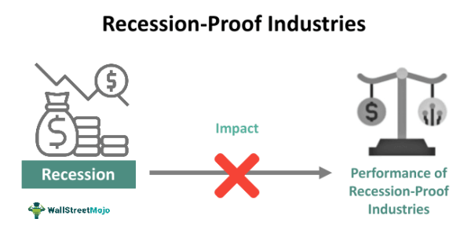

## Table of Contents

## What is a recession and how does it impact industries?

A recession is a time when the economy of a country slows down for a while. It happens when people buy less stuff, businesses make less money, and more people lose their jobs. It's like a big pause in the economy that can last for months or even years.

When a recession hits, it affects industries in different ways. Some businesses, like those selling luxury items or non-essential goods, might see a big drop in sales because people are trying to save money. Other industries, like discount stores or repair services, might do better because people are looking for cheaper options or trying to fix things instead of buying new ones. Overall, a recession can make it tough for many businesses to survive, leading to layoffs and closures, which makes the economy even slower.

## Which industries are typically considered recession-resistant and why?

Some industries are thought to be recession-resistant because they provide things people need no matter what's happening with the economy. For example, healthcare is one of these industries. People still get sick and need doctors and medicine during a recession. Also, utilities like electricity and water are essential, so companies that provide these services usually keep doing well even when the economy is bad.

Another industry that often does okay during a recession is education. People might go back to school to learn new skills if they lose their jobs, or parents might want their kids to keep learning even if times are tough. Grocery stores also tend to be more stable because everyone needs to eat. These industries might not grow a lot during a recession, but they usually don't shrink as much as others because they meet basic needs that don't go away.

## How do consumer behaviors change during a recession and what does this mean for businesses?

During a recession, people start to be more careful with their money. They might stop buying things they don't really need, like new clothes or fancy gadgets. Instead, they focus on what they have to buy, like food and medicine. People also look for cheaper options, so they might shop at discount stores or buy store-brand products instead of name brands. This change in behavior means businesses that sell luxury or non-essential items might see their sales drop a lot. On the other hand, businesses that offer basic needs or cheaper products might not be hit as hard.

For businesses, this shift in consumer behavior can be tough. Companies that sell expensive or non-essential goods need to find ways to keep their customers, maybe by offering sales or discounts. They might also need to cut costs, which could mean laying off workers or closing some stores. Meanwhile, businesses in industries like healthcare or groceries might not see as big a drop in sales, but they still have to be careful. They might need to keep prices low to help customers who are struggling, and they could face more competition as more people turn to these essential services. Overall, businesses have to adapt to how people are spending their money during a recession to survive.

## What are some common strategies businesses use to survive a recession?

During a recession, businesses often focus on cutting costs to stay afloat. They might lay off workers, close some stores, or reduce spending on things like advertising. This helps them save money and keep going even when people are buying less. Some businesses also try to find new ways to make money, like offering new products or services that are cheaper or more essential.

Another strategy is to keep customers happy by offering deals or discounts. This can help bring in more sales when money is tight. Businesses might also try to keep their prices low to attract people who are looking for bargains. By doing these things, businesses can keep their customers and maybe even grow a little, even during tough economic times.

## Can you explain the concept of counter-cyclical industries and give examples?

Counter-cyclical industries are businesses that do better when the economy is doing worse. They go against the normal ups and downs of the economy. When most businesses are struggling because people are buying less, these industries can actually see more customers. This happens because they offer things people need no matter what's happening with the economy.

Some examples of counter-cyclical industries are healthcare and utilities. People still need doctors and medicine even when times are tough, so healthcare businesses often stay busy. The same goes for utilities like electricity and water; everyone needs these services, so these companies keep doing well even during a recession. Another example is discount stores. When people are trying to save money, they might shop at places that offer lower prices, so these stores can actually see more business during a recession.

## How do government policies and economic stimulus affect recession-resistant industries?

Government policies and economic stimulus can help recession-resistant industries in big ways. When the government gives money to people or businesses, it's called economic stimulus. This can mean people have more money to spend on things like healthcare or utilities, which are recession-resistant industries. The government might also make rules that help these industries, like making sure everyone can get healthcare or keeping utility prices fair. This can help these businesses keep going strong even when the economy is bad.

Sometimes, the government might focus on other industries that are struggling more during a recession. They might give money or help to businesses that are having a hard time, like car makers or restaurants. This can take some attention away from recession-resistant industries, but it can also help the whole economy get better. When other industries start doing better, people might have more money to spend on things like healthcare or utilities, which can help these recession-resistant industries grow even more.

## What role does innovation play in helping businesses navigate through economic downturns?

Innovation can help businesses get through tough economic times by finding new ways to do things. When money is tight, businesses might come up with new products or services that people need or want, even during a recession. For example, a company might start making cheaper versions of their products or find a way to make things cost less to produce. This can help them keep selling and making money when other businesses are struggling.

Innovation can also mean finding new ways to reach customers. During a recession, people might shop online more to save money and time. A business could start selling its products on the internet or use social media to talk to customers. By doing this, they can keep their business going and maybe even grow, even when the economy is down. In the end, being creative and trying new things can help a business survive and do well during tough economic times.

## How can diversification be used as a strategy to mitigate the risks of a recession?

Diversification means spreading out a business's activities so it's not just focused on one thing. If a business only sells one type of product and that product isn't selling well during a recession, the whole business could be in trouble. But if the business has different products or services, it might be able to keep going even if one part isn't doing well. For example, a company that makes both luxury cars and budget cars might see fewer sales of the luxury cars during a recession, but more people might buy the cheaper cars. This can help the company keep making money even when times are tough.

Another way diversification helps is by reaching different kinds of customers. If a business only sells to rich people, it might have a hard time during a recession because those customers might not be buying as much. But if the business also sells things that regular people need, like groceries or basic clothes, it can keep selling to those customers even when the economy is bad. By having a mix of products and customers, a business can protect itself better from the ups and downs of the economy.

## What are the financial strategies companies can employ to prepare for and endure a recession?

To prepare for and get through a recession, companies can use different money strategies. One big one is saving up cash. Having money saved means a company can keep going even if it's not making as much during a recession. They can use this money to pay bills, keep workers, or even buy things cheaper from other businesses that are struggling. Another strategy is to borrow money when times are good. This way, they have extra money to use during tough times without having to pay high interest rates.

Companies can also look at their costs and see where they can save money. They might decide to spend less on things like new office furniture or fancy ads. Instead, they can focus on keeping the business running smoothly. They might also try to make deals with suppliers to get things cheaper or find new ways to make their products that cost less. By doing these things, a company can stay strong and keep going even when the economy is bad.

Another important strategy is to keep an eye on the money coming in and going out. Companies can do this by making sure they get paid quickly by customers and by paying their own bills slowly if they can. They might also offer deals or discounts to keep customers coming back, even if it means making less money for a while. By being smart with their money, companies can make it through a recession and come out the other side ready to grow again.

## How do global economic conditions influence the performance of recession-resistant industries?

Global economic conditions can have a big impact on how well recession-resistant industries do. Even though these industries are usually strong during tough economic times, if many countries around the world are struggling, it can still affect them. For example, if people in other countries are buying less because of a global recession, businesses that sell things like medicine or utilities might see a drop in sales, too. This is because the global economy is all connected, and what happens in one place can affect businesses everywhere.

On the other hand, global economic conditions can also help recession-resistant industries. If governments around the world are spending money to help their economies, like giving people money to spend or helping businesses, this can mean more people are able to buy things they need. This can be good for industries like healthcare and utilities because more people will be able to afford their services. So, while global economic conditions can make things harder for these industries, they can also create opportunities for them to do well.

## What advanced metrics and indicators should businesses monitor to anticipate and react to economic cycles?

Businesses should keep an eye on some important numbers and signs to know when the economy might be changing. One key thing to watch is the Gross Domestic Product (GDP), which tells how much a country is making overall. If GDP is going down, it might mean a recession is coming. Another thing to look at is unemployment rates. When more people are out of work, it's a sign that the economy is slowing down. Businesses can also check the Consumer Confidence Index, which shows how people feel about the economy. If people are feeling bad about it, they might spend less, which can hurt businesses.

Another important metric is the Purchasing Managers' Index (PMI). This number shows how much new stuff businesses are buying to make their products. If PMI is going down, it could mean businesses are expecting less demand and a slowdown in the economy. Businesses should also look at inflation rates. If prices are going up too fast, it can make people spend less and cause economic problems. By watching these numbers and signs, businesses can get ready for tough times and make smart choices to stay strong during economic ups and downs.

## How can companies leverage data analytics and AI to optimize their strategies during a recession?

Companies can use data analytics and AI to better understand what's happening during a recession and make smart choices. By looking at lots of data, like how much people are buying, what they're buying, and how the economy is doing, companies can see patterns and predict what might happen next. For example, if data shows that people are buying less of one product but more of another, a company can focus on selling the product that's doing better. AI can help by quickly going through all this data and finding important information that people might miss. This can help companies decide where to spend their money and how to change their plans to keep making money even when times are tough.

Using AI and data analytics can also help companies save money and work more efficiently. During a recession, it's important for businesses to cut costs wherever they can. AI can look at how the company is spending money and find places where it can save. For example, it might show that the company can spend less on advertising or find cheaper suppliers. AI can also help companies work better by automating tasks that people used to do, like managing inventory or answering customer questions. This means the company can do more with less, which is really important during a recession when every bit of money counts.

## References & Further Reading

[1]: Bergstra, J., Bardenet, R., Bengio, Y., & Kégl, B. (2011). ["Algorithms for Hyper-Parameter Optimization."](https://papers.nips.cc/paper/4443-algorithms-for-hyper-parameter-optimization) Advances in Neural Information Processing Systems 24.

[2]: ["Advances in Financial Machine Learning"](https://www.amazon.com/Advances-Financial-Machine-Learning-Marcos/dp/1119482089) by Marcos Lopez de Prado

[3]: ["Evidence-Based Technical Analysis: Applying the Scientific Method and Statistical Inference to Trading Signals"](https://books.google.com/books/about/Evidence_Based_Technical_Analysis.html?id=MeoJAQAAMAAJ) by David Aronson

[4]: ["Machine Learning for Algorithmic Trading"](https://github.com/stefan-jansen/machine-learning-for-trading) by Stefan Jansen

[5]: ["Quantitative Trading: How to Build Your Own Algorithmic Trading Business"](https://www.amazon.com/Quantitative-Trading-Build-Algorithmic-Business/dp/1119800064) by Ernest P. Chan