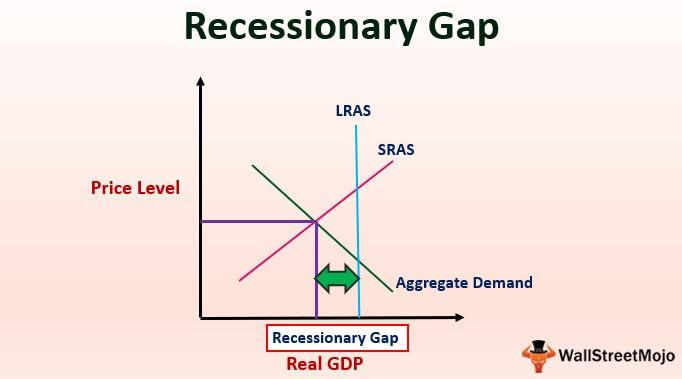

Understanding the interconnectedness of macroeconomic phenomena is crucial, especially in times of economic uncertainty. Economic systems are complex and multifaceted, with various factors influencing growth, stability, and overall health. During periods of downturn, these factors become more pronounced, requiring deeper analysis and strategic adjustments.

This article explores the concepts of economic downturn, recessionary gaps, and their implications in macroeconomics. An economic downturn, characterized by a sustained period of declining economic performance, not only poses risks to financial stability but also compels policymakers and economists to examine the underlying causes and potential solutions. Recessionary gaps, which occur when real GDP is lower than potential GDP at full employment, underscore the reality of unused resources, particularly labor, which further exacerbates unemployment challenges.



Algorithmic trading offers a unique lens through which to analyze and navigate these recessionary trends. As markets become more volatile, the precision and speed of algorithmic trading provide an advantage in responding to rapid changes, helping investors identify and capitalize on market opportunities amidst the chaos of economic shifts. By automating trading decisions based on a vast array of market signals and macroeconomic indicators, algorithmic trading can play a vital role in mitigating the impacts of downturns and optimizing investment strategies.

As the global economy becomes increasingly interconnected and complex, understanding these concepts helps in making informed economic and financial decisions. By integrating knowledge of macroeconomic phenomena with modern technological tools like algorithmic trading, stakeholders can better anticipate market reactions and implement effective strategies to combat the challenges posed by economic downturns. This synthesis of traditional economic analysis with cutting-edge trading technologies represents a pivotal advancement in harnessing economic insights for resilient financial operations.

## Table of Contents

## Economic Downturns and Recessionary Gaps Explained

An economic downturn represents a sustained period of declining economic performance, often characterized by several key indicators. One of the primary indicators is a reduction in Gross Domestic Product (GDP), which signifies a decrease in the total value of goods and services produced within a country. Alongside reduced GDP, increased unemployment typically occurs as businesses cut back on labor costs in response to declining demand for products and services. Consumer spending also tends to decline, as individuals react to economic uncertainty by saving more and spending less.

A recessionary gap presents itself when the real GDP is lower than the potential GDP at full employment. Full employment is defined as the level of employment where all available labor resources are being used efficiently, without creating upward pressure on inflation. Therefore, a recessionary gap indicates that the economy is not operating at its full potential, highlighting a misallocation or underutilization of resources.

Mathematically, the recessionary gap can be expressed as:

$$
\text{Recessionary Gap} = \text{Potential GDP} - \text{Real GDP}
$$

This gap is significant because it underscores unused resources, especially labor, leading to elevated unemployment rates. When an economy is underperforming relative to its potential, it means fewer jobs are available, and more people are left without work. This situation can result in a range of economic and social issues, including decreased consumer confidence and spending, further exacerbating the downturn.

Recognizing these patterns is essential for identifying and addressing the underlying issues during economic downturns. Governments and policymakers often take steps to stimulate the economy through various fiscal and monetary policies aimed at increasing spending, boosting demand, and ultimately closing the recessionary gap to restore economic stability.

## Macroeconomic Implications of Recessionary Gaps

Recessionary gaps, defined as the divergence between actual output and potential output within an economy, manifest significant implications on macroeconomic dimensions. These gaps tend to exert downward pressure on inflationary metrics, as aggregate demand lags behind potential supply. The reduced spending power curtails demand-pull inflation, aligning with the Phillips Curve framework which suggests a trade-off between inflation and unemployment.

However, the presence of a recessionary gap is typically marked by a rise in unemployment levels, which adversely affects economic well-being. The gap signifies an underutilization of resources, especially labor, leading to an increase in cyclical unemployment. The relationship between unemployment and the recessionary gap can be understood through Okun's Law, which posits that for every 1% increase in the unemployment rate, a country's GDP will roughly be an additional 2% lower than its potential GDP.

A further consequence of recessionary gaps is their impact on exchange rates and international trade competitiveness. These gaps can lead to unfavorable exchange rate fluctuations as persistent low demand might deter foreign investment and diminish currency value. A weaker domestic currency could initially boost export competitiveness; however, it may simultaneously lead to increased costs for imported goods, impacting terms of trade.

To mitigate the adverse effects of recessionary gaps, governments typically resort to stabilization policies. Fiscal policy, involving government spending and tax measures, can be deployed to stimulate economic activity. An increase in public spending or a reduction in taxes can boost aggregate demand, thus narrowing the recessionary gap. On the monetary policy front, central banks might reduce interest rates or engage in quantitative easing to encourage borrowing and investment, thereby invigorating economic growth.

Predicting possible government actions during economic downturns requires an understanding of the interplay between these policy measures and macroeconomic indicators. Economic [agents](/wiki/agents) anticipate policy stimuli during recessionary periods as an effort to restore equilibrium by closing the output gap. This anticipation could manifest in financial markets, affecting investment decisions and market confidence.

In conclusion, recognizing the macroeconomic implications of recessionary gaps is vital for economic strategizing. By comprehending the effects on inflation, unemployment, and exchange rates, along with the probable government interventions through monetary and fiscal tools, stakeholders can make informed decisions to navigate and alleviate the impacts of economic slumps.

## Algorithmic Trading in Recessionary Times

Algorithmic trading involves the use of computer algorithms to execute trades at high speeds and volumes, reacting to market conditions often more rapidly than human traders. During recessionary times, when markets are volatile and unpredictable, [algorithmic trading](/wiki/algorithmic-trading) systems can be particularly advantageous. These systems are designed to analyze vast amounts of market data in real-time, enabling them to identify potential trading opportunities that might otherwise go unnoticed.

The primary advantage of algorithmic trading during a recession is its ability to minimize human biases and emotions that typically exacerbate market downturns. Investors may react emotionally to negative news, potentially leading to panic selling or irrational buying. Algorithms, however, are preprogrammed to adhere strictly to predefined rules and learn from patterns, thus maintaining efficiency and objectivity amid market chaos.

For example, consider a simple algorithm that assesses macroeconomic indicators such as interest rates, unemployment levels, and GDP growth rates. When these indicators signal economic contraction, the algorithm might adjust its trading strategy accordingly. Below is a basic pseudocode that demonstrates how such an algorithm might function:

```python
def trading_strategy(market_data):
    if market_data['unemployment'] > 7 and market_data['GDP_growth'] < 0:
        # Economic indicators suggest a recession
        return "sell"
    elif market_data['unemployment'] < 5 and market_data['GDP_growth'] > 2:
        # Economic indicators suggest economic expansion
        return "buy"
    else:
        # Adjust strategy based on market conditions
        return "hold"

market_data = {
    'unemployment': 8,
    'GDP_growth': -1,
    'interest_rates': 0.5
}

decision = trading_strategy(market_data)
print(f"Trading decision: {decision}")
```

Furthermore, algorithmic trading can be leveraged to exploit market inefficiencies that are more prevalent during downturns. As markets respond to macroeconomic signals like fiscal policy changes or geopolitical events, algorithms can execute trades with precision and speed, capitalizing on transient opportunities to secure gains or mitigate losses.

Overall, algorithmic trading serves as a robust mechanism for managing the complexities of recession-prone environments. By harnessing the power of technology and data analytics, traders can maintain a competitive edge, executing trades that are informed, strategic, and timely.

## Case Study: Algorithmic Trading During a Recessionary Gap

Examining real-world examples sheds light on the practicality of algorithmic trading during recessions. During recent economic downturns, algorithmic strategies have capitalized on market inefficiencies by rapidly analyzing large datasets to uncover patterns and opportunities that may not be readily apparent to human traders. These algorithms forgo emotional responses and are capable of processing information at speeds unattainable by humans, allowing them to act on changing market conditions with precision.

For instance, during periods of heightened [volatility](/wiki/volatility-trading-strategies) caused by unexpected central bank announcements or shifting unemployment figures, algorithms can adjust trading strategies within milliseconds. This adaptability ensures that portfolios are better aligned with current market conditions. The ability of algorithms to integrate and analyze numerous variables in real time allows them to forecast potential market movements based on economic indicators, providing a strategic advantage.

Algorithmic trading systems often incorporate [fundamental analysis](/wiki/fundamental-analysis), including metrics such as employment data, GDP growth rates, and inflation figures. For example, an automated trading system might be programmed to increase buy orders in equities markets when unemployment figures are lower than expected, signaling economic strength and potential market growth. Conversely, if unemployment rates surge, the same system could initiate sell orders to mitigate risk.

To implement such strategies, algorithms employ statistical and [machine learning](/wiki/machine-learning) techniques, such as regression analysis or neural networks, to refine predictive models. A simple regression model in Python might resemble the following code:

```python
import numpy as np
from sklearn.linear_model import LinearRegression

# Example data: historical unemployment and market index levels
unemployment_data = np.array([0.05, 0.06, 0.07, 0.04]).reshape(-1, 1)
market_index_data = np.array([2500, 2400, 2300, 2600])

# Linear regression model
model = LinearRegression()
model.fit(unemployment_data, market_index_data)

# Predicting market index based on new unemployment data
new_unemployment_rate = np.array([[0.05]])
predicted_index = model.predict(new_unemployment_rate)

print("Predicted Market Index:", predicted_index)
```

This level of analysis and adaptability has proven crucial during recessionary gaps, as algorithms can effectively navigate the uncertainty these economic periods impose. By leveraging data-driven approaches, investors can maintain more stable portfolios, responding dynamically to rapid market shifts induced by macroeconomic changes.

## Challenges and Opportunities

Algorithmic trading presents a unique blend of challenges and opportunities, particularly during periods characterized by recessionary gaps. One of the primary challenges is the risk of algorithmic errors. These errors, which can arise from flaws in the algorithm's design or coding, can lead to unintended trading behavior. This risk is exacerbated by the speed and [volume](/wiki/volume-trading-strategy) at which algorithmic trades are executed, potentially resulting in significant financial losses within short time frames. Therefore, robust testing and continuous monitoring of algorithms are essential to mitigate the risk of errors.

Regulatory concerns also contribute significantly to the list of challenges, specifically regarding market manipulation and the occurrence of flash crashes. Algorithmic trading can lead to market manipulation, where algorithms might inadvertently or deliberately influence market prices. Flash crashes—the rapid, deep, and volatile falls in security prices—have been attributed to algorithmic trading, raising concerns among regulators. Regulatory bodies emphasize the need for greater transparency and control mechanisms to prevent such occurrences. Regulations often require algorithms to include safeguards and to be audited regularly to ensure compliance with market standards.

Despite these challenges, algorithmic trading offers considerable opportunities, notably in increasing market [liquidity](/wiki/liquidity-risk-premium) and reducing transaction costs. Algorithms can make split-second decisions that human traders cannot, thereby providing liquidity by facilitating trades even in volatile or less liquid markets. Additionally, the automation of trading processes reduces the need for human intervention, significantly lowering transaction costs. These efficiencies enable traders to capture opportunities that might otherwise be missed, and at a reduced cost structure, which is particularly advantageous during economic downturns.

Balancing these factors—mitigating risks while capitalizing on opportunities—is essential for optimizing trading strategies during recessionary periods. Continuous advancements in technology and computation allow for the development of sophisticated algorithms capable of navigating complex market landscapes. Traders can enhance their strategic decision-making by incorporating predictive analytics, machine learning, and other innovative tools to better anticipate market movements and adjust their algorithms accordingly.

Ultimately, achieving this balance involves a nuanced understanding of both the capabilities and limitations of algorithmic trading. This understanding is crucial for traders and regulatory authorities alike as they seek to harness the benefits of automation while safeguarding market integrity and stability.

## Conclusion

Recessionary gaps, characterized by the difference between the real GDP and potential GDP at full employment, have profound implications for macroeconomic strategies and market operations. They cause disturbances in economic stability, marked by slack in resource utilization, increased unemployment, and subdued inflationary pressures. In response, governments often resort to using fiscal and monetary policy tools to stimulate demand and close these gaps, thereby restoring economic equilibrium and boosting employment levels.

Algorithmic trading, with its capacity to process vast amounts of data and execute trades swiftly, proves to be a formidable tool in the backdrop of recessionary periods. By identifying patterns and exploiting market inefficiencies, algorithms efficiently navigate the volatility and unpredictability inherent to recessions. The speed and precision of algorithmic trading offer a significant advantage, reducing the influence of human emotion and error that typically accompany market downturns.

As the global economy undergoes continuous evolution, merging macroeconomic insights with algorithmic trading represents a forward-thinking approach to enhance strategic financial decision-making. This integration allows investors and policymakers to respond quicker and more effectively to economic signals, potentially cushioning the impacts of downturns and fostering stability in financial markets.

A proactive stance is thus crucial. By maintaining an informed and adaptable approach, stakeholders can leverage the power of algorithmic trading and macroeconomic understanding, mitigating adverse effects of recessionary environments. As such, enhancing capabilities in these areas is not merely advantageous—it is essential for surviving and thriving in the face of economic uncertainties.

## References & Further Reading

[1]: Bergstra, J., Bardenet, R., Bengio, Y., & Kégl, B. (2011). ["Algorithms for Hyper-Parameter Optimization."](https://papers.nips.cc/paper/4443-algorithms-for-hyper-parameter-optimization) Advances in Neural Information Processing Systems 24.

[2]: ["Advances in Financial Machine Learning"](https://www.amazon.com/Advances-Financial-Machine-Learning-Marcos/dp/1119482089) by Marcos Lopez de Prado

[3]: ["Evidence-Based Technical Analysis: Applying the Scientific Method and Statistical Inference to Trading Signals"](https://www.amazon.com/Evidence-Based-Technical-Analysis-Scientific-Statistical/dp/0470008741) by David Aronson

[4]: ["Machine Learning for Algorithmic Trading"](https://github.com/PacktPublishing/Machine-Learning-for-Algorithmic-Trading-Second-Edition) by Stefan Jansen

[5]: ["Quantitative Trading: How to Build Your Own Algorithmic Trading Business"](https://books.google.com/books/about/Quantitative_Trading.html?id=j70yEAAAQBAJ) by Ernest P. Chan