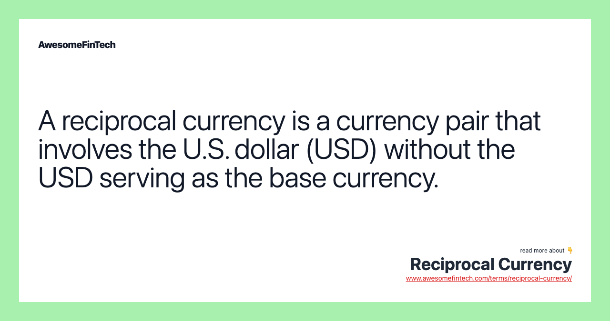

## Table of Contents

## What is a reciprocal currency?

A reciprocal currency is a type of money that people in a community use to trade goods and services with each other. Instead of using regular money like dollars or euros, they use this special currency to help everyone in the community. It's a way to keep money circulating within the community, which can help local businesses and people who might not have a lot of regular money.

For example, if someone in the community has a skill, like fixing bikes, they can earn reciprocal currency by helping others. Then, they can use that currency to buy things they need, like vegetables from a local farmer. This system encourages people to work together and support each other, making the community stronger and more connected.

## How does a reciprocal currency differ from traditional currency?

A reciprocal currency is different from traditional currency because it is used only within a specific community or group of people. Traditional currency, like dollars or euros, is used everywhere and accepted by almost everyone. Reciprocal currency helps keep money and resources within the community, encouraging people to help each other and support local businesses. It's not meant to replace traditional money but to work alongside it, making it easier for people in the community to trade goods and services.

Another difference is that reciprocal currency often doesn't have a fixed value like traditional money does. The value of a reciprocal currency can change based on what people in the community need and what they are willing to trade. Traditional currency has a set value that is controlled by banks and governments. Reciprocal currency is more about building relationships and trust within the community, while traditional currency is used for buying things in a wider market.

## What are the basic principles behind the use of reciprocal currencies?

Reciprocal currencies are based on the idea of helping people in a community work together and support each other. They are not like regular money that you can use everywhere. Instead, reciprocal currencies are used only within a specific group of people. This helps keep money and resources inside the community, making it easier for people to trade things they need and want. By using this special money, people can help each other more easily, which can make the community stronger and more connected.

Another important principle is that reciprocal currencies encourage people to share their skills and resources. For example, someone who is good at fixing things can earn this special money by helping others, and then use it to buy food from a local farmer. This system is all about building trust and relationships within the community. Unlike regular money, the value of a reciprocal currency can change based on what people in the community need and are willing to trade. This flexibility helps everyone in the community work together and support each other better.

## Can you provide examples of communities or organizations using reciprocal currencies?

One example of a community using a reciprocal currency is the Brixton Pound in London, England. People in Brixton use this special money to buy things from local shops and support each other. The Brixton Pound helps keep money in the community and makes it easier for people to trade goods and services with each other.

Another example is the Ithaca HOURS in Ithaca, New York. In this system, one HOUR is equal to one hour of work. People in Ithaca use HOURS to pay for things like haircuts, vegetables, and even medical services. This helps everyone in the community work together and share their skills and resources.

The WIR Bank in Switzerland is also a good example. It's a cooperative bank that uses a special currency called WIR Francs. Businesses in Switzerland use WIR Francs to trade with each other, which helps them support local economies and keep money circulating within their community.

## How is the value of a reciprocal currency determined?

The value of a reciprocal currency is not fixed like regular money. Instead, it changes based on what people in the community need and are willing to trade. For example, if a lot of people want vegetables and not many people have them, the value of the currency might go up when buying vegetables. This means you might need more of the reciprocal currency to buy the same amount of vegetables compared to before.

This system is different from regular money because it's all about what people in the community value and need at that time. It's not controlled by banks or governments. The value can go up or down depending on what people are trading. This flexibility helps everyone in the community work together better and makes sure that everyone can get what they need.

## What are the benefits of using reciprocal currencies for local economies?

Using reciprocal currencies can help local economies a lot. They keep money inside the community, which means more money stays with local businesses and people. When people use this special money to buy things from each other, it helps everyone in the community. Local shops and services get more customers, and people who might not have a lot of regular money can still trade and get what they need. This makes the local economy stronger because more money is being used and shared within the community.

Reciprocal currencies also encourage people to work together and share their skills. For example, someone who is good at fixing things can earn this special money by helping others, and then use it to buy food from a local farmer. This helps build a sense of community and trust. When people trade with each other using reciprocal currencies, they are more likely to help each other out and support local businesses. This can make the community more connected and resilient, which is good for the local economy.

## What are the potential challenges or limitations of implementing a reciprocal currency system?

One challenge of using a reciprocal currency is that it can be hard to get people to start using it. People are used to regular money, so they might not want to try something new. It takes time and effort to explain how the special money works and why it's good for the community. If not enough people use it, the system might not work well because there won't be enough things to buy with the special money.

Another limitation is that reciprocal currencies can only be used within a specific community. This means you can't use them to buy things from outside the community, which can be a problem if you need something that's not available locally. Also, because the value of the special money can change, it might be hard to know how much it's worth at any given time. This can make it tricky to plan and trade with confidence.

## How do reciprocal currencies promote sustainability and community resilience?

Reciprocal currencies help make communities more sustainable by keeping money and resources inside the community. When people use this special money to trade with each other, they are more likely to buy things from local shops and services. This means less money is spent on things that come from far away, which can help reduce the community's impact on the environment. For example, if people use the special money to buy food from local farmers, it means less food has to be shipped from other places, which uses less energy and creates fewer emissions.

Reciprocal currencies also help make communities more resilient by building stronger connections between people. When people trade with each other using this special money, they get to know each other better and are more likely to help each other out. This can be really important during tough times, like when there's a natural disaster or an economic crisis. Because people in the community are used to working together and supporting each other, they can handle these challenges better. This makes the community stronger and more able to bounce back from problems.

## What role do technology and digital platforms play in managing reciprocal currencies?

Technology and digital platforms make it a lot easier to manage reciprocal currencies. They can help keep track of how much special money people have and make it simple to trade with each other. For example, there can be an app or a website where people can see their balance, send the special money to others, and see what things they can buy. This makes it easier for more people to use the special money because they can do everything from their phone or computer.

Digital platforms also help spread the word about reciprocal currencies. They can be used to explain how the special money works and why it's good for the community. This can help get more people interested and involved. Plus, technology can make the system safer and more trustworthy. For example, it can keep records of all the trades so people can see where their special money is going and make sure everything is fair.

## How can businesses and individuals participate in a reciprocal currency system?

Businesses and individuals can join a reciprocal currency system by signing up with the community or organization that runs it. They need to learn how the special money works and what they can buy with it. Businesses can start accepting the special money for their goods or services. For example, a local bakery might take the special money for bread and cakes. Individuals can earn the special money by offering their skills or time, like helping someone fix their bike or teaching a class. Once they have the special money, they can use it to buy things they need from other people in the community.

Participating in a reciprocal currency system helps keep money in the community and supports local businesses. It's a way for everyone to work together and help each other out. Businesses can attract more customers who use the special money, and individuals can get things they need without always using regular money. This can be especially helpful for people who might not have a lot of regular money. By using the special money, businesses and individuals can make their community stronger and more connected.

## What are some case studies that demonstrate the success or failure of reciprocal currency systems?

The Brixton Pound in London, England, is a good example of a successful reciprocal currency. Started in 2009, it helps keep money in the Brixton community by encouraging people to buy from local shops and services. People can use the Brixton Pound to buy things like food, drinks, and even pay for local events. It has helped build a stronger sense of community and support for local businesses. The success of the Brixton Pound shows how reciprocal currencies can help keep money circulating within a community, making it more resilient and connected.

On the other hand, the Wörgl Experiment in Austria during the 1930s is an example of a reciprocal currency system that faced challenges. The town of Wörgl created a special currency called the Wörgl Schilling to help during the Great Depression. At first, it seemed to work well, with more people trading and the local economy improving. However, the government and banks did not like the idea of a local currency and stopped it after just one year. The Wörgl Experiment shows that even if a reciprocal currency system can be successful, it might face opposition from outside forces like governments and banks.

These two case studies show that reciprocal currencies can be successful in helping communities work together and support each other, but they can also face challenges from outside forces. It's important for communities to understand these factors when thinking about starting a reciprocal currency system.

## What future developments or innovations can we expect in the field of reciprocal currencies?

In the future, we might see more reciprocal currencies using technology to make them easier to use. Apps and websites could help people keep track of their special money and make trades with others. These digital platforms could also make it simpler to explain how the special money works and get more people interested. With technology, it could be easier to make sure the system is fair and safe for everyone. This could help more communities start using reciprocal currencies and make them more popular.

Another thing we might see is new ways to use reciprocal currencies to help with big problems like climate change. For example, communities could use the special money to encourage people to use less energy or to buy things that are good for the environment. This could help make the community more sustainable and resilient. As people learn more about how reciprocal currencies can help with these big issues, we might see more communities trying them out and finding new ways to make them work even better.

## References & Further Reading

[1]: Bergstra, J., Bardenet, R., Bengio, Y., & Kégl, B. (2011). ["Algorithms for Hyper-Parameter Optimization."](https://papers.nips.cc/paper/4443-algorithms-for-hyper-parameter-optimization) Advances in Neural Information Processing Systems 24.

[2]: ["Advances in Financial Machine Learning"](https://www.amazon.com/Advances-Financial-Machine-Learning-Marcos/dp/1119482089) by Marcos Lopez de Prado

[3]: ["Evidence-Based Technical Analysis: Applying the Scientific Method and Statistical Inference to Trading Signals"](https://www.amazon.com/Evidence-Based-Technical-Analysis-Scientific-Statistical/dp/0470008741) by David Aronson

[4]: ["Machine Learning for Algorithmic Trading"](https://github.com/stefan-jansen/machine-learning-for-trading) by Stefan Jansen

[5]: ["Quantitative Trading: How to Build Your Own Algorithmic Trading Business"](https://www.amazon.com/Quantitative-Trading-Build-Algorithmic-Business/dp/1119800064) by Ernest P. Chan