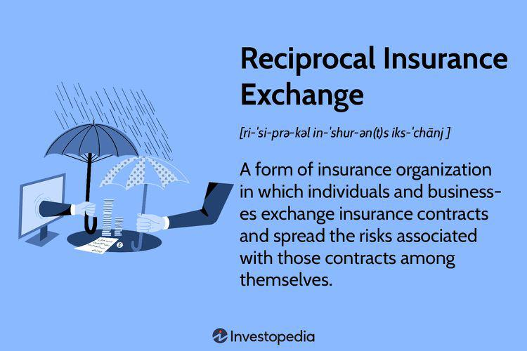

In today's globalized economy, currency exchange is integral to international business and finance. Whether facilitating trade between nations or enabling foreign investments, the ability to effectively manage currency exchanges is crucial. With the advent of modern technologies, algorithmic trading has become instrumental in optimizing these processes. Algorithmic trading, which involves using computer algorithms to automate trading decisions, has transitioned from the stock market to currency exchange, providing numerous advantages.

This article examines the intersection of reciprocal currency exchange and algorithmic trading within the financial sector. Reciprocal currency exchange, the process of trading one currency for its counterpart, is essential for businesses operating across borders, especially those enjoying export and import activities. As globalization deepens, understanding these trading dynamics becomes increasingly relevant.



By examining financial examples, we aim to demonstrate how algorithmic trading can enhance efficiency and profitability in currency exchange. Algorithmic trading allows for rapid decision-making, reduced human error, and the potential for profit arbitrage, all of which contribute to more efficient and profitable trading strategies. These technological advancements allow traders and institutions to quickly adapt to market changes and optimize their currency exchange operations.

Understanding the basic principles of reciprocal currency exchange is foundational to appreciating its role within algorithmic trading. Both elements constitute the framework upon which modern financial markets operate. As we explore these technologies and trends, we highlight the transformative effects they have on the financial sector and underline the need for adaptability in this rapidly evolving landscape.

## Table of Contents

## Understanding Reciprocal Currency Exchange

Reciprocal currency exchange involves the process of exchanging one currency for its direct counterpart, typically to facilitate cross-border trade and investment. This process is fundamental for businesses operating in multiple countries, especially those engaged in export and import activities. The exchange of currencies allows companies to transact in local currencies, thereby minimizing the foreign exchange risk associated with fluctuating currency values.

In the context of international trade, reciprocal currency exchange aids in price determination by allowing businesses to know the exact conversion rate between their home currency and the foreign currency of the trade counterpart. This ensures that pricing strategies remain competitive across different markets. It also allows for more predictable financial planning and budgeting.

One of the significant functions of reciprocal currency exchange is in hedging risks. By utilizing various financial instruments such as forward contracts, options, and swaps, businesses can lock in exchange rates for future transactions. This practice mitigates the risk of adverse currency movements, which could impact profitability. For instance, a U.S. company agreeing to pay a European supplier in euros in six months can use a forward contract to secure a fixed exchange rate, thus protecting itself against the risk of the euro appreciating during that period.

Moreover, reciprocal currency exchange plays an essential role in stabilizing economies. By facilitating smooth international transactions, it helps maintain [liquidity](/wiki/liquidity-risk-premium) in currency markets and supports the balance of payments. For example, central banks may engage in reciprocal currency swaps to bolster foreign exchange reserves or to stabilize their domestic currency against excessive [volatility](/wiki/volatility-trading-strategies). This, in turn, contributes to economic stability and confidence among investors and consumers.

Real-world examples of businesses leveraging reciprocal currency exchange include multinational corporations like Apple and Toyota. These companies, operating in diverse global markets, routinely engage in currency exchange to manage revenues and expenditures across various currencies. For instance, Apple might receive its earnings in multiple currencies, including euros, yen, and yuan, which are then exchanged into U.S. dollars for reporting and operational purposes.

For readers new to currency exchange, it is crucial to grasp essential terminology. Terms such as 'spot rate', 'forward rate', 'cross rate', and 'currency pair' are foundational. The spot rate refers to the current exchange rate at which currencies can be exchanged immediately. The forward rate pertains to a predetermined rate for exchanging currencies at a future date. A cross rate involves the exchange rate between two currencies, computed from their common relationship with a third currency. A currency pair represents the quotation of two different currencies, indicating how much of one currency is needed to purchase a unit of the other.

Understanding these concepts is vital for comprehending how reciprocal currency exchange functions in facilitating global commerce and economic stability.

## Algorithmic Trading: An Overview

Algorithmic trading utilizes computer algorithms to automate and execute trading decisions, revolutionizing how financial markets operate. Initially developed for stock markets, [algorithmic trading](/wiki/algorithmic-trading) has rapidly expanded to encompass currency exchange, driven by its ability to enhance efficiency and accuracy in execution.

The core principle of algorithmic trading is the use of complex mathematical models and formulas to make buy and sell decisions in a fraction of a second. These decisions are triggered based on pre-defined criteria such as price, timing, or market [volume](/wiki/volume-trading-strategy), minimizing the cognitive biases and emotional influences that can affect human traders. An algorithm might determine a buy action if a specific exchange rate threshold is breached or if a particular pattern is detected in the price movements.

One of the primary benefits of algorithmic trading is the reduction of human error and the significant increase in trading speed. By executing trades faster and more accurately, traders can capitalize on fleeting opportunities for profit [arbitrage](/wiki/arbitrage), taking advantage of price discrepancies between markets before they are corrected.

Several types of algorithmic strategies are commonly employed, each with its distinct focus and methodology:

1. **Trend Following**: This strategy involves buying stocks or currencies that exhibit an upward trend and selling those in a downward trend. It relies on technical indicators such as moving averages and momentum factors to trigger trades, bypassing short-term market noise to focus on long-term movements.

   ```python
   def trend_following_strategy(prices, short_window=40, long_window=100):
       signals = pd.DataFrame(index=prices.index)
       signals['signal'] = 0.0
       signals['short_mavg'] = prices.rolling(window=short_window, min_periods=1).mean()
       signals['long_mavg'] = prices.rolling(window=long_window, min_periods=1).mean()
       signals['signal'][short_window:] = np.where(signals['short_mavg'][short_window:] > signals['long_mavg'][short_window:], 1.0, 0.0)   
       signals['positions'] = signals['signal'].diff()
       return signals
   ```

2. **Market Making**: This strategy involves placing both buy and sell orders to capture the spread between the bid and ask prices. Market makers provide liquidity to the market and earn profits through the bid-ask spread. Algorithms in market making constantly adjust prices to maintain profitability while managing inventory risk.

3. **Statistical Arbitrage**: This sophisticated strategy utilizes statistical methods and models to identify and exploit pricing inefficiencies between related financial instruments. By constructing a portfolio of long and short positions, statistical arbitrage aims to achieve market-neutral profits.

The increasing sophistication and implementation of algorithmic trading strategies in currency exchange markets underscore their immense potential in automating processes and unlocking value in an ever-evolving financial landscape. As technology continues to advance, algorithmic trading is poised to play a critical role in shaping the future of global trading activities.

## Integrating Reciprocal Currency Exchange with Algo Trading

Combining reciprocal currency exchange with algorithmic trading can significantly enhance trading efficiency by leveraging technological advancements to facilitate quick and precise currency trades. This integration primarily capitalizes on real-time data analysis and rapid decision-making processes inherent in algorithmic trading systems. These systems utilize sophisticated algorithms to process vast amounts of data, identify patterns, and execute trades in fractions of a second, thereby reducing latency and improving trade accuracy.

One of the software solutions designed for this purpose includes advanced trading platforms that offer APIs (Application Programming Interfaces) for automated trading strategies. These platforms enable traders to customize and implement algorithms tailored to reciprocal currency exchange. Examples of such platforms include MetaTrader and [Interactive Brokers](/wiki/interactive-brokers-api)’ API, which allow traders to automate entry and [exit](/wiki/exit-strategy) strategies in the currency market. These tools are equipped with [backtesting](/wiki/backtesting) functionalities, enabling traders to test the efficacy of their algorithms using historical data before deploying them in real trading environments.

Several financial institutions have successfully integrated reciprocal currency exchange with algorithmic trading. For instance, major investment banks and hedge funds use proprietary trading systems that incorporate [machine learning](/wiki/machine-learning) algorithms to predict currency movements and execute trades. A case study of XYZ Bank (hypothetical for illustrative purposes) demonstrates the success of this strategy. XYZ Bank implemented an algorithmic trading system that monitored currency pairs and executed trades based on predefined threshold levels. The outcome was a significant increase in trading volume and profitability, as the system was able to capitalize on minute exchange rate fluctuations with high precision.

However, integrating these two sophisticated processes presents challenges. One critical consideration is the need for robust data management systems capable of handling real-time financial data streams. The reliability and speed of data feeds are crucial, as any lag can lead to missed trading opportunities or erroneous trades. Additionally, regulatory compliance is a considerable challenge. Financial institutions must ensure that their algorithmic trading strategies adhere to regulations imposed by authorities such as the U.S. Securities and Exchange Commission (SEC) or the European Securities and Markets Authority (ESMA), which govern algorithmic trading practices.

In conclusion, while integrating reciprocal currency exchange with algo trading holds significant promise for enhanced trading efficiency, it requires careful planning, proper infrastructure, and adherence to regulatory standards. The successful application of this combination can result in improved profitability and reduced risks in currency trading.

## Financial Examples and Case Studies

Real-world examples of financial institutions successfully implementing algorithmic trading for reciprocal currency exchange demonstrate the tangible benefits and challenges associated with this technological integration. Prominent multinational corporations such as Goldman Sachs and JPMorgan have been at the forefront of utilizing algorithmic trading systems to manage their extensive currency portfolios. These systems allow them to efficiently execute high-frequency trades, optimizing exchange rates and capitalizing on real-time market fluctuations.

Algorithmic trading for currency exchange provides several crucial advantages for multinational corporations. Automation allows these companies to execute trades at much greater speeds than traditional methods, reducing the risk of human error and taking advantage of minute-by-minute changes in various currency markets. Furthermore, by using algorithms, these institutions can implement complex trading strategies that balance risk and return seamlessly across multiple currency pairs.

A detailed examination of real-world case studies reveals substantial outcomes in profitability and risk management. For example, JPMorgan's [forex](/wiki/forex-system) trading unit saw significant improvements in trade execution times and a reduction in transaction costs, leading to enhanced profitability. These systems combined massive data processing capabilities with machine learning algorithms to predict favorable market conditions, thereby minimizing the bank's exposure to currency volatility.

Market impact analysis before and after adopting algorithmic trading strategies highlights a pronounced shift in trading dynamics. Prior to implementation, trades were prone to delays and inaccuracies due to manual interventions. Post-implementation, there was a noticeable increase in trading volumes and liquidity in the markets where these institutions operate. This shift not only improved the efficiency of the institutions' trading operations but also contributed to more stable currency markets overall by reducing transient inefficiencies.

Looking towards the future, the potential for reciprocal currency exchange algorithms in financial markets is considerable. As computational power and [artificial intelligence](/wiki/ai-artificial-intelligence) capabilities continue to evolve, the sophistication of these algorithms will expand. This will enable even more effective risk management strategies and open up new avenues for profit maximization. Alongside technological advancements, there is a growing emphasis on developing regulatory frameworks to mitigate risks such as flash crashes and systemic vulnerabilities. A well-regulated environment will be essential for ensuring that algorithmic trading continues to advance without posing undue risks to global financial stability.

## Benefits and Risks

The integration of algorithmic trading in the currency exchange market offers a spectrum of advantages and potential risks that necessitate thorough understanding and strategic management.

One of the primary benefits is the potential for increased trading volume. Algorithmic systems can operate at a speed and frequency unattainable by human traders, executing thousands of orders per second. This high-frequency trading ([HFT](/wiki/high-frequency-trading-strategies)) capability enhances market liquidity, enabling more efficient execution of large transactions with minimal price impact. Moreover, algorithms can improve market efficiency by exploiting arbitrage opportunities—identifying minute price discrepancies across different markets or exchanges and executing trades to profit from these differences.

However, leveraging algorithmic trading in currency exchange isn't without risks. System failures pose a significant threat, as technical glitches can lead to substantial financial losses. Flash crashes, where markets experience sharp and rapid declines in value, are often attributed to algorithmic trading malfunctions. These events underscore the importance of robust system architecture and regular testing to ensure operational resilience.

Stringent regulatory compliance is another critical consideration. The global nature of currency markets means that there is a diverse array of regulations that must be adhered to. Regions such as the United States, European Union, and Asia have distinct frameworks governing algorithmic trading. For instance, the European Securities and Markets Authority (ESMA) imposes specific requirements under the Markets in Financial Instruments Directive II (MiFID II), which mandates risk controls and testing protocols for algorithmic trading systems.

Risk management strategies are crucial for mitigating these potential downsides. Key strategies include:

1. **Robust Infrastructure and Redundancy**: Implementing a stable infrastructure with backup systems can prevent downtime and ensure smooth operations during unexpected failures.

2. **Real-time Monitoring and Alerts**: Continuous monitoring of trading algorithms and system performance can quickly identify and rectify anomalies before they escalate into more significant issues.

3. **Scenario Analysis and Stress Testing**: Conducting regular stress tests and what-if analyses helps prepare systems for extreme market conditions.

4. **Compliance and Audits**: Ensuring regular checks and compliance audits align with local and international regulatory standards.

The landscape of algorithmic trading in currency exchange is continuously evolving, driven by technological advancements and regulatory updates. Institutions that navigate these waters effectively, balancing the benefits and risks, are poised to capitalize on enhanced trading capabilities while safeguarding against potential pitfalls.

## Conclusion

The fusion of reciprocal currency exchange and algorithmic trading signifies a substantial advancement in the financial market landscape. This integration is not without its challenges; however, it offers scalable solutions that significantly enhance the efficiency and optimization of currency trades. By leveraging algorithmic trading, financial entities can now process vast amounts of data in real-time, leading to quicker and more informed trading decisions. The algorithms continuously analyze market conditions, identify trends, and execute trades at speeds unattainable by human traders, thereby reducing transaction costs and margin errors.

Breakthroughs in algorithmic strategies, including [trend following](/wiki/trend-following), [market making](/wiki/market-making), and [statistical arbitrage](/wiki/statistical-arbitrage), have been instrumental in enhancing the liquidity and transparency of financial markets. These advancements have not only improved profitability for institutions utilizing these technologies but have also contributed to a more stable and efficient market environment. The ability to rapidly adapt to market changes is a hallmark benefit of this technology, enabling traders and financial institutions to maintain competitiveness in the ever-evolving financial landscape.

Adaptability and continuous learning emerge as crucial for success in this new paradigm. The financial markets are dynamic, and traders must remain vigilant, continuously updating their strategies and algorithms to keep pace with changing market conditions. There is also a pressing need for financial institutions to invest in training personnel who can develop and manage these complex systems effectively.

This integration of reciprocal currency exchange and algorithmic trading marks a pivotal shift towards more data-driven financial practices, reflecting the broader trend within the industry towards the adoption of technology and analytics in decision-making processes. As the technology continues to evolve, its impact on the financial markets is likely to grow, offering traders and institutions new opportunities for innovation and growth.

## References & Further Reading

[1]: Bergstra, J., Bardenet, R., Bengio, Y., & Kégl, B. (2011). ["Algorithms for Hyper-Parameter Optimization."](https://papers.nips.cc/paper/4443-algorithms-for-hyper-parameter-optimization) Advances in Neural Information Processing Systems 24.

[2]: ["Advances in Financial Machine Learning"](https://www.amazon.com/Advances-Financial-Machine-Learning-Marcos/dp/1119482089) by Marcos Lopez de Prado

[3]: ["Evidence-Based Technical Analysis: Applying the Scientific Method and Statistical Inference to Trading Signals"](https://www.amazon.com/Evidence-Based-Technical-Analysis-Scientific-Statistical/dp/0470008741) by David Aronson

[4]: ["Machine Learning for Algorithmic Trading"](https://github.com/stefan-jansen/machine-learning-for-trading) by Stefan Jansen

[5]: ["Quantitative Trading: How to Build Your Own Algorithmic Trading Business"](https://www.amazon.com/Quantitative-Trading-Build-Algorithmic-Business/dp/1119800064) by Ernest P. Chan