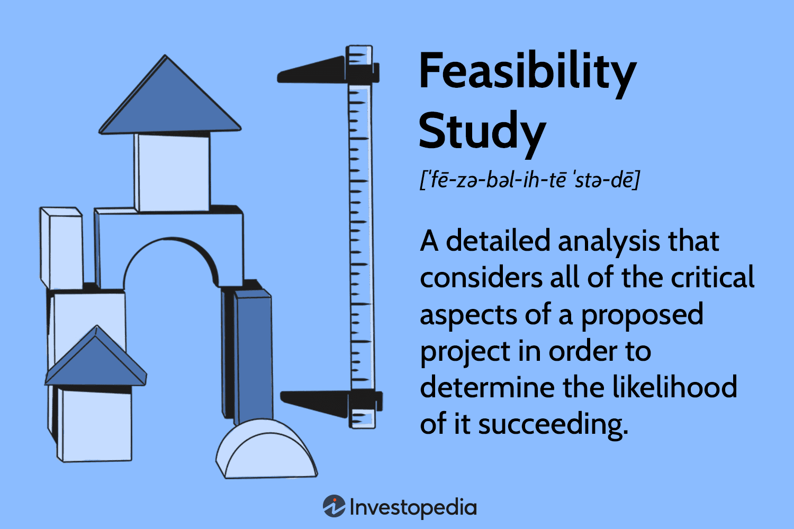

Algorithmic trading, commonly abbreviated as algo trading, is a prominent method in financial markets where computer programs execute trades at rapid speeds and significant volumes. By leveraging advanced algorithms, this trading strategy facilitates enhanced market efficiency, increased liquidity, and reduced transaction costs, contributing vastly to the modernization of global financial systems. However, these advantages are accompanied by a series of challenges primarily centered around regulatory compliance, risk management, and maintaining market integrity.

The complexity of algo trading largely lies in navigating these challenges. A crucial aspect of this is the implementation of reclassification mechanisms. These tools are essential for ensuring that algorithmic trading operations remain within the bounds of current regulatory standards while preserving the integrity of the markets. With financial authorities continuously updating their regulations to keep pace with technological advancements, the ability to reclassify and adjust trading strategies accordingly is fundamental to sustaining competitive and compliant trading operations.



This article will explore the concept of reclassification in detail, emphasizing its relevance and utility in algorithmic trading. It will outline the various mechanisms employed to ensure that trading activities comply with market regulations, thereby contributing to overall market stability. The discussion will provide insights into how traders can optimally utilize reclassification to align with regulatory demands and evolving market conditions.

## Table of Contents

## Understanding Reclassification

Reclassification generally pertains to altering the category or class of securities, frequently undertaken by mutual funds to fine-tune fee structures or investment requirements. In the context of algorithmic trading, reclassification is crucial for enhancing operational flexibility and management. It allows trading operations to remain agile and responsive in an ever-changing financial environment, while ensuring adherence to regulatory frameworks.

Algorithmic trading involves executing orders using pre-programmed trading instructions that account for variables such as timing, price, and volume. Reclassification in this space focuses on two primary objectives: aligning with regulatory changes and optimizing trading models to improve efficiency and compliance.

1. Aligning with Regulatory Changes:

Algorithmic trading is subject to various regulatory bodies such as the Securities and Exchange Commission (SEC) and Commodity Futures Trading Commission (CFTC). These organizations impose specific guidelines to maintain market integrity. Reclassification allows traders to modify algorithms in response to these evolving regulations, ensuring that trading activities comply with legal requirements. For instance, a change in market access rules might require traders to adjust their algorithms to ensure that risk controls are appropriately implemented before execution.

2. Optimizing Trading Models:

By updating and reclassifying algorithms or models, traders can effectively respond to shifting market dynamics, which include technological advancements and changes in market [liquidity](/wiki/liquidity-risk-premium). Reclassification enables traders to implement more efficient algorithms that can anticipate and react to fluctuations more swiftly. This optimization involves a strategic analysis of current market conditions and trading practices, allowing traders to identify areas of improvement, such as faster execution speeds or more accurate predictive analytics.

In [algorithmic trading](/wiki/algorithmic-trading), reclassification is not a mere administrative task; it is a pivotal mechanism for fostering adaptability and compliance in a rapidly evolving financial landscape. Keeping trading algorithms agile amidst regulatory shifts and technological changes is essential for maintaining a competitive edge and adhering to industry standards.

## Regulatory Framework: Key Agencies and Rules

The regulatory framework governing algorithmic trading is critical for maintaining market stability and integrity. Key regulatory agencies such as the Securities and Exchange Commission (SEC) and the Commodity Futures Trading Commission (CFTC) play a significant role in shaping these frameworks, each enforcing specific rules designed to mitigate risks associated with high-frequency and automated trading activities.

The SEC is primarily responsible for overseeing securities markets. Among its many rules, the Market Access Rule (Rule 15c3-5) stands out as pivotal in controlling risk and ensuring compliance. This rule mandates that broker-dealers implement stringent risk management controls to oversee the trading activity they facilitate, effectively reducing the likelihood of erroneous or destabilizing trades. The rule covers areas such as financial exposure limits, automated input controls for orders, and thorough supervisory procedures to prevent unauthorized trades.

In parallel, the CFTC, which regulates futures and derivatives markets, has established guidelines like Regulation Automated Trading (Reg AT). Although Reg AT was proposed to enhance oversight of automated trading, it highlights the CFTC's focus on reducing systemic risks in futures trading. This regulation envisions mandatory registration of automatic trading systems, pre-trade risk controls, and ongoing monitoring to ensure fair and orderly markets. Although not finalized, these rules indicate the direction of regulatory intentions toward improving transparency and accountability in algorithmic trading.

Understanding these regulatory frameworks is vital for developing effective reclassification mechanisms in algorithmic trading. Reclassification involves adjusting trading strategies and systems to adhere to these regulatory standards, enabling traders to respond to evolving market conditions while maintaining compliance. Such processes not only safeguard market stability but also enhance the credibility and trustworthiness of financial markets by preventing potential malpractices and errors that could lead to systemic disruptions.

## The Process of Reclassification in Algo Trading

Reclassification in algorithmic trading involves systematically adjusting trading algorithms or systems to ensure they align with evolving regulatory requirements or adapt to new market conditions. This adaptive process is crucial for maintaining compliance and competitive edge. Reclassification may be initiated by regulatory changes, such as updates from financial authorities, or internal decisions aimed at strategic realignment.

For example, investment advisory firms must often recalibrate their algorithms to adhere to new rules introduced by the Securities and Exchange Commission (SEC) related to market access or pre-trade risk controls. These kinds of adjustments are essential to prevent violations that could incur penalties or disrupt trading operations. Such recalibrations in algorithmic parameters allow firms to maintain adherence to regulatory standards while optimizing their trading performance.

The process of successful reclassification hinges on rigorous data analysis. Understanding trading models and market conditions through data is vital, enabling traders to isolate the elements of algorithms that need adjustment. Comprehensive data analysis involves assessing variability in financial markets and its implications on algorithm performance. The goal is to implement modifications with precision, minimizing the potential for disruption to ongoing trading activities.

A robust understanding of trading models is indispensable in this context. These models form the basis of algorithmic trading strategies and dictate how orders are executed, so any changes in regulations or market dynamics necessitate corresponding adaptations in these models. This requires traders to have an in-depth knowledge of both the theoretical underpinnings and practical implementations of their trading strategies.

To implement reclassification with minimal disruption, traders employ a strategic approach. This often entails a step-by-step methodology, testing algorithm changes in simulated environments before full deployment in live markets, allowing for the identification and rectification of potential issues. Through such meticulous processes, traders ensure that algorithm adjustments reinforce trading efficiency and compliance without significantly impacting performance.

Overall, reclassification in algorithmic trading is an ongoing necessity, driven by both external pressures from evolving regulatory landscapes and internal imperatives for market optimization. Successfully navigating this process demands a combination of rigorous data analysis, comprehensive understanding of trading models, and a strategic approach to implementation, ensuring that the trading systems not only comply with regulations but also perform optimally in dynamic market conditions.

## Risk Management and Compliance

Risk management is a fundamental component of algorithmic trading, acting as a safeguard to uphold market integrity amidst the rapid execution and substantial volumes characteristic of this trading approach. Reclassification mechanisms are integral in mitigating risks linked with high-frequency and algorithmic trading activities, ensuring stability and compliance with ever-evolving regulations.

Pre-trade and post-trade risk controls are essential compliance strategies in algo trading. Pre-trade risk controls are designed to assess and limit potential risks before trades are executed. This includes setting limits on order size, monitoring market impact, and ensuring compliance with market access and trading rules. Post-trade risk controls, on the other hand, focus on identifying and managing risks after trades have occurred, which includes scrutinizing trade reports and reconciling discrepancies.

Reclassification can significantly enhance these risk controls by continually adapting them to align with changes in risk management frameworks. For example, the introduction of new regulatory guidelines may necessitate changes in algorithmic models to ensure compliance. Reclassification provides the flexibility needed to adjust these algorithms, thus minimizing systemic risks and maintaining regulatory compliance.

Adapting to new risk management frameworks often involves sophisticated data analysis and modeling techniques. Machine learning and [artificial intelligence](/wiki/ai-artificial-intelligence) play pivotal roles in this context. These technologies enable traders to identify patterns and predict risks more accurately, allowing for real-time adjustment of trading strategies and risk controls. Here is a simple Python code snippet that demonstrates how [machine learning](/wiki/machine-learning) could be utilized to predict trade risks:

```python
from sklearn.ensemble import RandomForestClassifier
from sklearn.model_selection import train_test_split
from sklearn.metrics import accuracy_score

# Example dataset with features relevant to trade risk
data = load_trade_data()
features = data[['market_volatility', 'order_size', 'execution_time']]
labels = data['risk_class']

# Splitting data into training and test sets
X_train, X_test, y_train, y_test = train_test_split(features, labels, test_size=0.2, random_state=42)

# Training a Random Forest Classifier
model = RandomForestClassifier(n_estimators=100, random_state=42)
model.fit(X_train, y_train)

# Predicting and evaluating results
predictions = model.predict(X_test)
accuracy = accuracy_score(y_test, predictions)
print(f"Risk Prediction Model Accuracy: {accuracy:.2f}")
```

This approach allows participants in algo trading to not only comply with regulations but also strategically manage their trading operations to minimize potential risk exposures.

Ultimately, incorporating reclassification mechanisms into risk management practices ensures that algorithmic trading remains both compliant with regulatory standards and efficient in managing the inherent risks of high-frequency trading. By doing so, market participants can contribute to a more stable and secure financial market environment while achieving optimal performance in algorithmic trading operations.

## Impact of Reclassification on Market Participants

Reclassification in algorithmic trading requires traders and brokers to adjust their strategies and operations, ensuring both competitiveness and compliance with ever-evolving regulatory standards. This process is not uniform and can have differing effects on market participants, contributing to both improved efficiency and short-term disruptions.

For some traders, reclassification enhances operational efficiency by streamlining processes and optimizing the use of trading models. When reclassification aligns trading algorithms with current regulations and market conditions, firms can reduce transaction costs, increase speed, and improve the execution of trades. This realignment often involves revising or replacing older models with more advanced algorithms that can adapt to fluctuating market dynamics and new regulatory requirements.

Additionally, the need for reclassification can be triggered by regulatory updates that impose new compliance standards. Markets have witnessed several instances where regulations, such as the SEC's Market Access Rule (Rule 15c3-5), necessitated algorithmic adjustments. For traders, this means altering algorithms to incorporate pre-trade risk controls or adjust parameters to avoid regulatory penalties. In such cases, firms might face short-term disruptions as their systems are updated to meet new rules, potentially causing temporary inefficiencies or lapses in trading activity.

Despite these challenges, successful reclassification allows firms to meet regulatory requirements while also leveraging new market opportunities. By aligning more closely with market demands, firms can enhance their market positioning and growth prospects. For example, compliance with new data reporting standards can provide firms with richer data analytics, improving decision-making and forecasting abilities.

Ultimately, the dynamic nature of both market conditions and regulatory landscapes necessitates adaptive reclassification strategies. As market participants refine their approaches, they can capitalize on opportunities for growth while maintaining strict adherence to compliance standards. This adaptive capacity not only mitigates risks associated with non-compliance but also supports sustainable competitive advantages in the evolving world of algorithmic trading.

## Future Trends in Reclassification and Algo Trading

As regulatory environments evolve and technology advances, the necessity for agile reclassification mechanisms in algorithmic trading is anticipated to grow significantly. This growth will be largely driven by emerging technologies such as artificial intelligence (AI) and machine learning (ML). These technologies enhance the adaptability and sophistication of reclassification strategies, enabling traders and financial institutions to respond more precisely and efficiently to market dynamics and regulatory shifts.

**Artificial Intelligence and Machine Learning in Reclassification**

AI and ML are expected to revolutionize reclassification processes by offering predictive analytics and real-time data processing capabilities. Algorithms can be trained using historical trading data to identify patterns and anticipate regulatory changes, thereby facilitating proactive adjustments in trading models. For instance, machine learning algorithms can be used for clustering and classification tasks, enabling more nuanced categorization of trading activities based on evolving market conditions and compliance requirements.

Here's a simple example of how ML algorithms such as decision trees or support vector machines (SVM) could be applied:

```python
from sklearn import datasets
from sklearn.model_selection import train_test_split
from sklearn.tree import DecisionTreeClassifier
from sklearn.metrics import classification_report

# Load a sample financial dataset
data = datasets.load_iris()
X, y = data.data, data.target

# Split the dataset into train and test sets
X_train, X_test, y_train, y_test = train_test_split(X, y, test_size=0.3, random_state=42)

# Train a Decision Tree Classifier
clf = DecisionTreeClassifier()
clf.fit(X_train, y_train)

# Predict and evaluate the model
predictions = clf.predict(X_test)
print(classification_report(y_test, predictions))
```

In this simplified context, a Decision Tree Classifier model is constructed to categorize financial data, which could parallel the categorization in reclassification tasks prompted by AI insights.

**Staying Informed on Regulatory Changes**

For market participants to continue leveraging reclassification effectively, they must remain vigilant and informed about regulatory changes and technological advancements. Regulatory bodies are continuously updating guidelines to keep pace with technological progress, and staying ahead of these changes is crucial. Tools like natural language processing (NLP) can assist in monitoring regulatory texts, identifying relevant changes, and automating compliance checks, thus enhancing the agility of trading operations.

Collaboration between technologists and regulatory specialists will become increasingly important. Developing cross-disciplinary teams that can integrate regulatory knowledge with technological capabilities will be crucial for implementing reclassification strategies that are both innovative and compliant.

**Conclusion**

The intersection between regulatory evolution and technological innovation will be a critical area for algorithmic trading. The growing role of AI and ML in deriving adaptive reclassification strategies will necessitate that traders and financial firms invest in cutting-edge technologies and analytics while maintaining a robust understanding of the regulatory landscape. Adapting to these future trends is essential for sustaining competitive advantage and ensuring regulatory compliance in a rapidly changing market environment.

## Conclusion

Reclassification serves as a cornerstone in algorithmic trading by ensuring that trading strategies remain in line with evolving regulatory standards and effectively manage associated risks. As the landscape of financial markets becomes more complex, the ability to efficiently reclassify trading models in response to regulatory shifts and market dynamics gains significance. This adaptability not only safeguards compliance but also enhances operational efficiency, crucial for maintaining a competitive edge.

Technological advancements and changing regulations demand a proactive approach from market participants. With the rise of artificial intelligence and machine learning, traders must utilize these tools to develop dynamic reclassification mechanisms that can swiftly adjust to new conditions. Such adaptability mitigates risks and ensures that algorithmic trading continues to operate within legal and ethical bounds, preserving market integrity.

Continuous innovation in reclassification processes will be vital as regulations and technologies continue to evolve. By anticipating and responding to these changes, financial institutions can optimize their trading performance, improve market positioning, and ensure long-term stability in an increasingly competitive arena. The ongoing development of reclassification strategies is, therefore, essential for sustaining both market competitiveness and integrity in the fast-paced world of algorithmic trading.

## References & Further Reading

[1]: Barnham, K., & Markus, D. (2016). ["Algorithmic Trading and Market Dynamics."](https://www.jstor.org/stable/43303831) International Review of Financial Analysis, 45.

[2]: Securities and Exchange Commission. ["Market Access Rule (Rule 15c3-5)."](https://www.sec.gov/files/rules/final/2010/34-63241.pdf) Securities and Exchange Commission.

[3]: Commodity Futures Trading Commission. ["Regulation Automated Trading (Reg AT)."](https://www.cftc.gov/PressRoom/PressReleases/7283-15) Commodity Futures Trading Commission.

[4]: Narang, R. (2009). ["Inside the Black Box: A Simple Guide to Quantitative and High-Frequency Trading."](https://onlinelibrary.wiley.com/doi/book/10.1002/9781118267738) Wiley.

[5]: Durbin, M. (2010). ["All About High-Frequency Trading."](https://www.amazon.com/All-About-High-Frequency-Trading/dp/0071743448) McGraw-Hill.