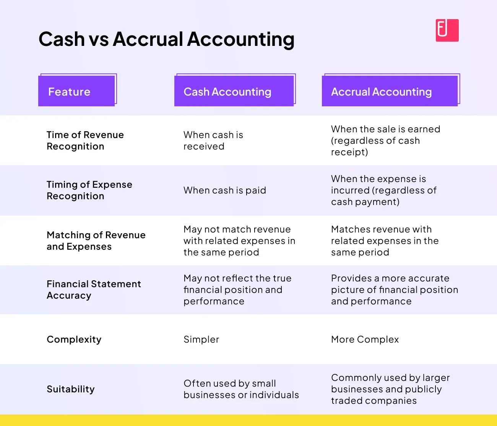

## Table of Contents

## What is accrual accounting?

Accrual accounting is a method of recording financial transactions when they happen, rather than when money changes hands. This means that if you sell something to a customer, you record the sale right away, even if they don't pay you until later. Similarly, if you get a bill from a supplier, you record the expense immediately, even if you don't pay it right away. This approach gives a more accurate picture of a company's financial health because it shows income and expenses in the period they occur, not just when cash moves.

Using accrual accounting can be more complex than cash accounting, but it's required by generally accepted accounting principles (GAAP) for many businesses. It helps businesses match their revenues with the expenses related to earning those revenues, which is important for understanding profitability over time. For example, if a company pays for inventory in one month but sells it in the next, accrual accounting shows the expense and the revenue in the same period, giving a clearer view of the company's performance.

## How does accrual accounting differ from cash accounting?

Accrual accounting and cash accounting are two different ways to keep track of a business's money. Accrual accounting records income and expenses when they happen, not when the money is actually received or paid. So, if you sell something in January but get paid in February, you would record the sale in January with accrual accounting. On the other hand, cash accounting only records the money when it actually changes hands. Using the same example, with cash accounting, you would record the sale in February when you get the money.

The main difference between the two methods is when you record transactions. Accrual accounting gives a more complete picture of a business's financial health because it shows all the money coming in and going out during a specific time, even if it hasn't been paid yet. This can be helpful for understanding how well a business is doing over time. Cash accounting is simpler and easier to use, but it might not show the full story of a business's finances, especially if there are delays between when a sale is made and when payment is received.

## What is the basic principle behind recognizing expenses in accrual accounting?

The basic principle behind recognizing expenses in accrual accounting is to match expenses with the revenues they help generate. This means that if a business uses resources or incurs costs to make a sale, those expenses should be recorded in the same period as the sale, even if the payment for those expenses happens later.

For example, if a company buys materials in January to make a product that it sells in February, the cost of those materials should be recorded as an expense in February, when the sale happens. This helps give a clearer picture of the company's profitability for that month, showing that the expense was necessary to earn the revenue from the sale.

## What is the basic principle behind recognizing revenues in accrual accounting?

The basic principle behind recognizing revenues in accrual accounting is to record them when they are earned, not when the money is received. This means if a company does the work or delivers a product, it should record the revenue right away, even if the customer pays later.

For example, if a business finishes a job in March but doesn't get paid until April, it should still record the revenue in March. This helps show a true picture of the company's performance during that time, matching the revenue with the efforts that earned it.

## Can you explain the matching principle in the context of expense recognition?

The matching principle is a key idea in accrual accounting. It says that businesses should record expenses in the same time period as the revenues they help to earn. This means if a company spends money to make a product or provide a service, it should count that expense when it makes the sale, not when it pays the bill.

Think of it like this: if a company buys materials in January to build a product it sells in February, the cost of those materials should be an expense in February. This way, the expense matches up with the revenue from the sale, giving a clear picture of how much it really cost to make that money. It helps businesses see their true profit for each period.

## How are revenues recognized under the revenue recognition principle?

The revenue recognition principle in accounting says that a business should record its revenue when it earns it, not when it gets paid. This means if a company does the work or sells a product, it should count that money as revenue right away, even if the customer pays later. For example, if a company finishes a job in May but doesn't get paid until June, it should record the revenue in May.

This principle helps businesses show a true picture of how they're doing. By recording revenue when it's earned, companies can match up their income with the costs they had to make that money. This way, everyone can see how much profit the business made in a certain time, like a month or a year.

## What are some common examples of accrued expenses?

Accrued expenses are costs that a business has to pay for later, but it records them right away because it already used the service or got the goods. A common example is employee salaries. If a company's pay period ends on the last day of the month, but it pays its workers on the 5th of the next month, the company records the salaries as an expense in the month the work was done, not when it pays the employees.

Another example is utilities. If a business uses electricity all month but doesn't get the bill until the next month, it still records the cost of the electricity in the month it was used. This way, the expense matches up with the time the business used the electricity. Other examples include interest on loans that a company owes but hasn't paid yet, and rent if it's due at the beginning of the next month but the company is using the space now.

## What are some common examples of accrued revenues?

Accrued revenues are money a business has earned but hasn't gotten yet. A common example is when a company does work for a client but doesn't get paid until later. For instance, if a business finishes a project in December but the client pays in January, the company records the money as revenue in December, when the work was done.

Another example is interest income. If a company has money in a bank account that earns interest, it records that interest as revenue in the period it's earned, even if the bank doesn't pay it out until the next month. This way, the company shows the money it earned right away, not just when it gets paid.

## How does the timing of expense recognition affect financial statements?

The timing of expense recognition in accrual accounting can change how a company's financial statements look. If a business uses accrual accounting, it records expenses when they happen, not when it pays for them. This means if a company gets a bill in January but pays it in February, it records the expense in January. This can make the company's profits look lower in January because it shows more expenses, even though the money hasn't left the bank yet. It gives a clearer picture of how much it cost to make money in that month, but it might make the financial statements look different than if the company used cash accounting.

This way of recording expenses helps match them up with the money earned in the same time period. For example, if a company buys materials in March to make a product it sells in April, it records the cost of those materials as an expense in April. This shows the true cost of making that sale, which helps people understand the company's profit better. But it can also make the financial statements harder to understand because the expenses don't always line up with when the company pays its bills.

## How does the timing of revenue recognition affect financial statements?

The timing of revenue recognition in accrual accounting can change how a company's financial statements look. If a business uses accrual accounting, it records revenue when it earns it, not when it gets paid. So, if a company finishes a job in November but gets paid in December, it records the revenue in November. This can make the company's profits look higher in November because it shows more money coming in, even though the cash hasn't arrived yet. It gives a clearer picture of how much money the company made in that month, but it might make the financial statements look different than if the company used cash accounting.

This way of recording revenue helps match it up with the costs of making that money in the same time period. For example, if a company does work in June but doesn't get paid until July, it records the revenue in June. This shows the true income from that work, which helps people understand the company's profit better. But it can also make the financial statements harder to understand because the revenue doesn't always line up with when the company gets the money.

## What are the challenges and complexities involved in applying accrual accounting in practice?

Applying accrual accounting can be tricky because it's more complicated than cash accounting. With accrual accounting, you have to keep track of when you earn money and when you owe money, even if you don't get paid or pay right away. This means you need good records and often need to make estimates about how much money you'll get or owe in the future. For example, if you do a job in December but don't get paid until January, you have to guess how much you'll get and record it in December. This can be hard because if your guesses are wrong, your financial statements might not be accurate.

Another challenge is that accrual accounting requires more work to set up and maintain. You need to use special accounting systems and maybe even hire accountants to help you keep everything straight. It can also be confusing for people who are used to just looking at the money coming in and going out. Accrual accounting shows a more complete picture of your business's health, but it takes time and effort to get it right. This is why smaller businesses might stick with cash accounting, even though accrual accounting can give a better view of their profits and losses over time.

## How do adjusting entries play a role in the accurate recognition of expenses and revenues?

Adjusting entries are really important in accrual accounting because they help make sure that expenses and revenues are recorded in the right time period. When you do work or get a bill, you might not pay or get paid right away. Adjusting entries let you record these things when they happen, not when the money changes hands. For example, if you use electricity all month but don't get the bill until the next month, an adjusting entry helps you count that cost in the month you used the electricity. This way, your financial statements show the true cost of doing business that month.

These entries also help with revenues. If you finish a job in one month but don't get paid until the next, an adjusting entry lets you record that money as revenue when you did the work. This helps match up the money you earned with the costs you had to make that money, giving a clear picture of your profit. Without adjusting entries, your financial statements might look wrong because they wouldn't show all the money you earned or spent in the right time period.

## What are Revenue Recognition and Expense Recognition?

Revenue recognition is a critical component of financial accounting, ensuring that income is recognized consistently and transparently. This process requires adherence to standards such as the Accounting Standards Codification (ASC) 606 and International Financial Reporting Standards (IFRS) 15, which outline a five-step model for recognizing revenue:

1. **Identify the Contract**: A contract is defined as an agreement between two or more parties that creates enforceable rights and obligations. This step involves determining whether the contracts entered meet the criteria for revenue recognition.

2. **Identify Performance Obligations**: Within the contract, the specific performance obligations must be identified. Each obligation is a promise to transfer a distinct good or service to the customer.

3. **Determine Transaction Price**: The transaction price is the amount of consideration a company expects to receive in exchange for fulfilling its performance obligations. This amount can vary due to discounts, rebates, incentives, and penalties.

4. **Allocate Transaction Price**: The transaction price must be allocated to each performance obligation based on the stand-alone selling prices of each good or service.

5. **Recognize Revenue**: Revenue is recognized as the performance obligations are satisfied, either over time or at a point in time, depending on the terms set in the contract and the nature of the goods or services provided.

Conversely, expense recognition hinges on the matching principle, which requires that expenses are recorded in the same period as the revenues they help generate. This principle ensures that an organization’s financial statements provide a coherent depiction of economic activity. For example, if a company incurs costs directly associated with revenue generation, such as cost of goods sold, those costs are matched to the revenue they facilitate, offering an accurate picture of profitability.

The formula often used in expense recognition is:

$$
\text{Net Income} = \text{Revenues} - \text{Expenses}
$$

This ensures that only the expenses associated with realized revenue affect income statements, maintaining a precise record of financial performance. By adhering to these standards, organizations accurately reflect their financial realities, thereby providing stakeholders with clear insights into operational health and market standing.

## References & Further Reading

For deeper insights into revenue recognition and [algorithmic trading](/wiki/algorithmic-trading), consider consulting the following essential resources:

- **Revenue Recognition**: A comprehensive understanding of revenue recognition underlies many financial practices. 'Revenue from Contracts with Customers' by Deloitte provides a detailed examination of the accounting standard ASC 606. Additionally, 'IFRS 15', available through IAS Plus, expands on international financial reporting standards and their application. These resources elucidate how revenue is recognized and the implications for financial reporting.

- **Algorithmic Trading**: For those interested in the strategic and technical aspects of algorithmic trading, 'Algorithmic Trading: Winning Strategies' by Ernie Chan is a valuable resource. It discusses the creation and implementation of algorithm-based trading strategies. Furthermore, 'Advances in Financial Machine Learning' by Marcos Lopez de Prado offers insights into the intersection of machine learning and finance, illustrating sophisticated techniques for enhancing trading strategies through data analysis.

- **Financial Markets and Derivatives**: Textbooks and scholarly articles on financial markets and derivatives provide foundational knowledge that supports both accounting and trading disciplines. These readings explore market dynamics, instruments, and the theoretical frameworks necessary for informed financial decision-making.

These resources collectively provide a robust framework for understanding and integrating the principles of revenue recognition with the efficiencies and strategies of algorithmic trading, equipping professionals to navigate and succeed in the financial landscape.

